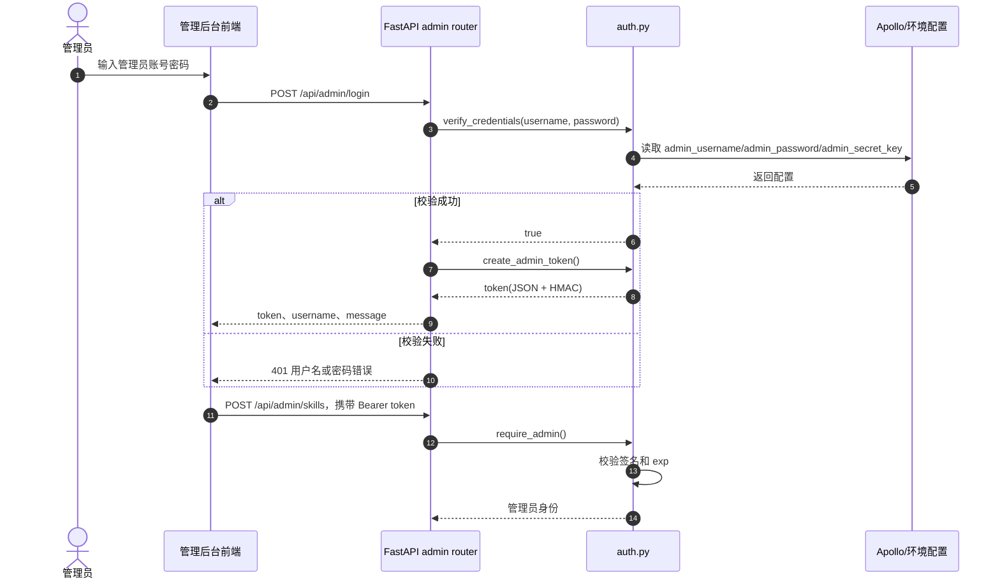
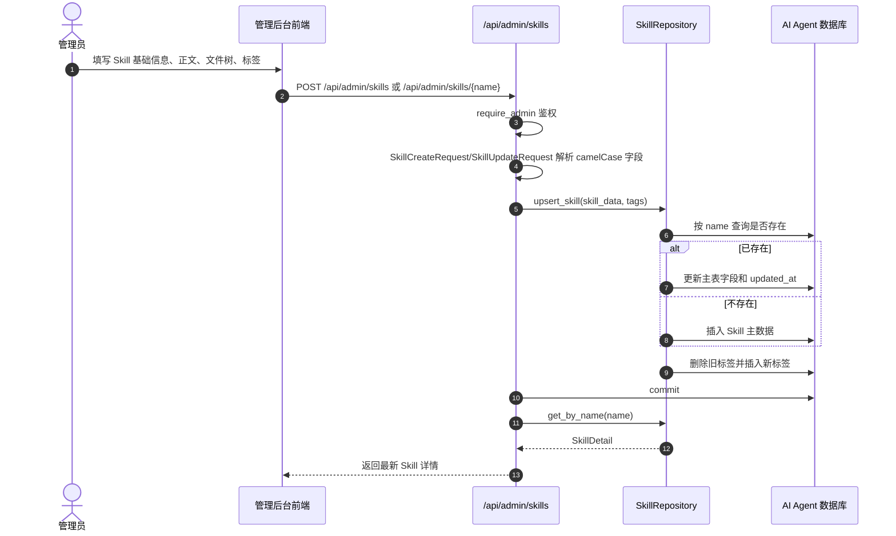
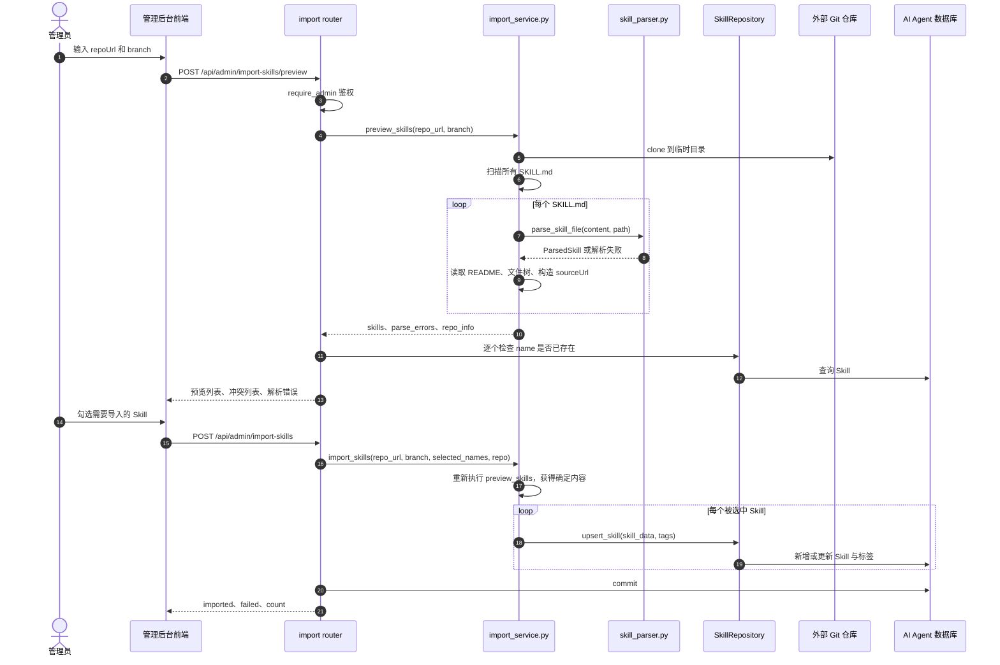
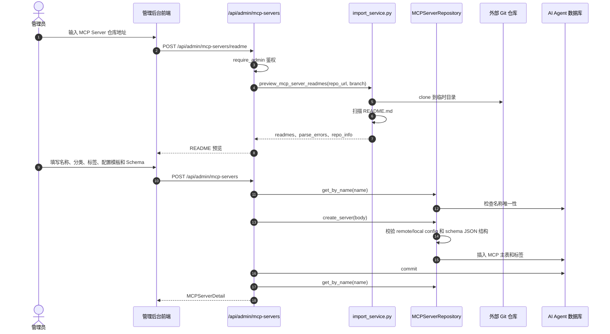

# 后台管理与录入流程系统设计

## 1. 系统定位

后台管理与录入流程是 AI 工具管理中 Skill 市场和 MCP 市场的数据生产入口。它面向管理员提供登录鉴权、Skill 管理、项目管理、MCP Server 管理，以及从外部 Git 仓库预览并导入内容的能力。公开市场负责消费数据，后台管理负责维护数据质量和生命周期。

当前后端实现集中在：

- 管理端统一路由：`app/routers/admin.py`
- Skill 导入路由：`app/routers/import_.py`
- 管理鉴权：`app/auth.py`
- 导入服务：`app/services/import_service.py`
- Git 与平台 URL 工具：`app/utils/platform.py`
- Skill 解析器：`app/utils/skill_parser.py`
- 数据访问层：`SkillRepository`、`ProjectRepository`、`MCPServerRepository`

## 2. 管理端能力边界

后台管理负责以下业务：

- 管理员登录与 token 校验。
- Skill 的创建、更新、删除。
- 项目的创建、更新、删除，以及项目和 Skill 的关联维护。
- MCP Server 的创建、更新、删除。
- 从 Git 仓库预览 Skill 列表，再选择性导入。
- 从 Git 仓库预览 README，辅助 MCP Server 录入。

后台管理不负责以下业务：

- 不负责前端页面级权限菜单控制。
- 不负责执行 Skill 或启动 MCP Server。
- 不负责外部仓库的长期巡检；当前导入流程是一次性、管理员触发的录入动作。

## 3. 管理鉴权模型

本节只说明后台管理流程中的鉴权入口关系。完整的 token 签发、验签、配置加载和安全边界见 [鉴权体系系统设计.md](鉴权体系系统设计.md)。

管理端接口挂载在 `/api/admin` 前缀下，除登录接口外，当前源码大多通过 `dependencies=[Depends(require_admin)]` 要求 Bearer token。

认证流程如下：

1. 管理员调用 `POST /api/admin/login`，提交用户名和密码。
2. `verify_credentials()` 使用常量时间比较校验用户名和密码。
3. 登录成功后 `create_admin_token()` 生成 JSON 字符串 token，包含 `sub`、`exp` 和 HMAC 签名。
4. 管理端后续请求通过 `Authorization: Bearer <token>` 携带 token。
5. `require_admin()` 调用 `verify_admin_token()` 校验签名和过期时间。

管理员账号、密码、签名密钥和过期时间来自 `app/config.py`。源码中优先从 Apollo 读取并解密，失败时回退为空配置或环境配置。

## 4. Skill 手工录入与更新流程

Skill 手工录入用于管理员直接维护单个 Skill 条目。它适合小规模修正、补录和人工运营。

删除 Skill 时，`POST /api/admin/skills/{name}/delete` 调用 `delete_skill()`，先删除标签，再删除 Skill 主记录。数据库外键和级联关系保证关联标签不会残留。

## 5. Skill 批量导入流程

批量导入用于从外部 Git 仓库收集 `SKILL.md`。它采用“预览再确认”的两阶段设计，避免解析错误或重复覆盖直接进入市场。

该流程的关键点：

- 预览和确认导入都会 clone 仓库，确认阶段不信任前端回传的 Skill 内容，只信任仓库当前内容。
- 解析失败不会中断整个预览，会进入 `parse_errors` 供管理员处理。
- 冲突通过 `name` 检测，管理员可选择是否覆盖。
- README 会与 `SKILL.md` 合并保存，详情页读取时再拆分。

## 6. MCP Server 录入流程

MCP Server 当前以手工录入为主，README 预览为辅助。管理员可以先从仓库读取 README，再把 README 和配置模板一起保存到 MCP Server 主表。

更新 MCP Server 时，`update_server()` 会先校验传入 JSON 字段，再更新主表并重建标签。删除 MCP Server 时，`delete_server()` 同时删除标签和用户配置，避免市场详情已删除后仍残留用户配置。

## 7. 项目管理流程

项目管理用于维护 OpenLibing 项目和 Skill 的关联关系，服务于 Skill 市场中的 `projectCount` 和项目维度展示。

- `GET /api/admin/projects`：管理员查看全部项目，包括不可见项目。
- `POST /api/admin/projects`：创建项目并绑定 Skill。
- `POST /api/admin/projects/{name}`：更新项目字段和 Skill 关联。
- `POST /api/admin/projects/{name}/delete`：删除项目。

`ProjectRepository` 在创建或更新关联前会调用 `_validate_skills()`，确保传入的 Skill 名称都存在，避免项目关联指向无效 Skill。

## 8. 关键设计取舍

- 采用统一 `/api/admin` 前缀管理后台能力，便于前端和网关按路径治理。
- 管理端请求模型支持 camelCase alias，降低前端字段转换成本。
- Skill 导入采用预览加确认两阶段，牺牲一次重复 clone 的成本，换取录入安全性和可审查性。
- Skill 和 MCP Server 的标签都采用删除后重建，简化差异计算，保证一次提交后的标签集合与管理员输入一致。
- MCP Server 配置创建和更新时做 Pydantic 结构校验，防止明显错误配置进入市场。

## 9. 风险与演进点

- 当前 admin token 是 JSON 字符串加 HMAC，不是标准 JWT；如需跨系统统一认证，可接入公司统一身份体系。
- Skill 导入确认阶段重新 clone 仓库，若预览和确认之间仓库变化，最终导入内容可能不同；必要时可引入 commit SHA 锁定。
- MCP Server README 预览只扫描 README，不自动解析 MCP 配置；后续可定义标准元数据文件以减少手工录入。
- 管理端删除接口使用 POST 动作路径，后续如做开放 API，可评估 RESTful DELETE 兼容层。
