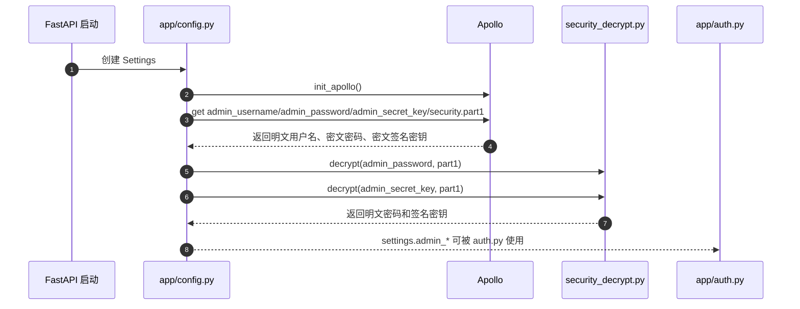
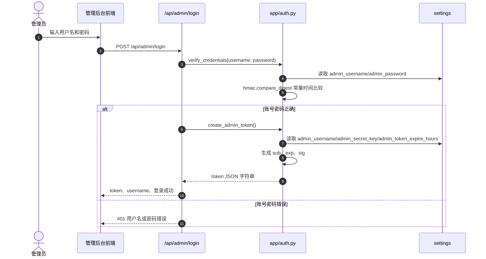
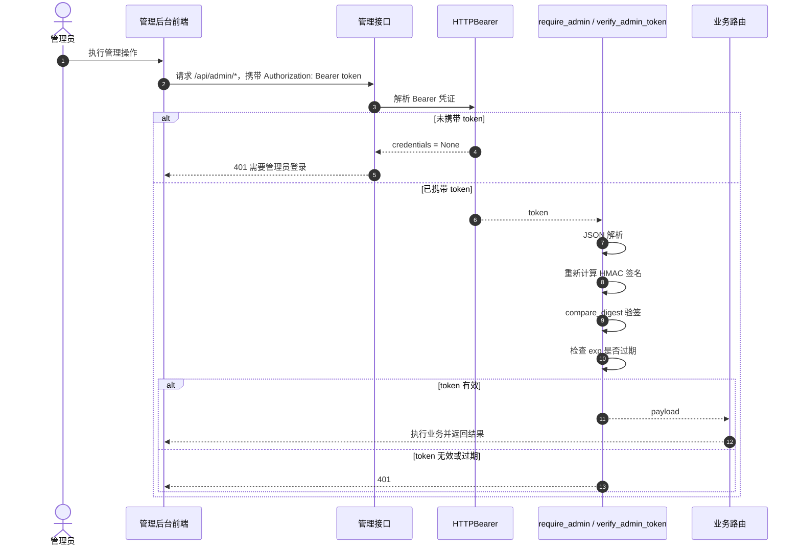

# 鉴权体系系统设计

## 1. 系统定位

`openlibing-ai-agent` 的鉴权体系当前服务于 AI 工具管理后台，保护 Skill、项目、MCP Server 及导入类管理接口。公开市场接口面向普通用户开放读取，管理接口统一挂载在 `/api/admin` 前缀下，通过管理员登录获取 Bearer token，再由 FastAPI 依赖项 `require_admin()` 完成接口访问控制。

当前鉴权实现不是标准 JWT，也不依赖外部登录态或用户中心，而是一个轻量级的“管理员账号密码 + HMAC 签名 token”方案。核心代码位于：

- `app/auth.py`：token 生成、签名、校验、管理员依赖项。
- `app/config.py`：管理员账号、密码、签名密钥、token 过期时间配置。
- `app/apollo_connect.py`：Apollo 配置读取。
- `app/utils/security/security_decrypt.py`：Apollo 密文配置解密入口。
- `app/routers/admin.py`、`app/routers/import_.py`：管理接口接入鉴权依赖。

## 2. 鉴权边界

需要管理员鉴权的接口包括：

- `/api/admin/me`
- `/api/admin/skills` 及 Skill 更新、删除接口
- `/api/admin/projects` 及项目更新、删除接口
- `/api/admin/mcp-servers` 及 MCP Server 更新、删除、README 预览接口
- `/api/admin/import-skills/preview`
- `/api/admin/import-skills`

不走管理员鉴权的接口包括：

- `/health`
- Skill 公开市场接口：`/api/skills`、`/api/skills/{name}`、`/api/stats`、`/api/categories`、`/api/teams`、`/api/tags` 等
- MCP 公开市场接口：`/api/mcp-servers`、`/api/mcp-servers/{name}`、分类、标签、统计、点赞、用户配置生成等

这意味着当前后端鉴权主要保护“后台数据维护入口”，不是全站用户身份体系。普通市场访问和 MCP 用户配置生成接口当前不验证登录用户身份，`userId` 由调用方传入。

## 3. 配置与密钥来源

鉴权配置由 `Settings` 统一承载：

| 配置项 | 用途 |
| --- | --- |
| `admin_username` | 管理员登录用户名，也是 token payload 中的 `sub`。 |
| `admin_password` | 管理员登录密码，用于 `verify_credentials()` 校验。 |
| `admin_secret_key` | HMAC-SHA256 签名密钥，用于 token 签发和验签。 |
| `admin_token_expire_hours` | token 有效期，默认 24 小时。 |

启动时配置加载流程如下：

1. `Settings.__init__()` 调用 `init_apollo()` 初始化 Apollo 客户端。
2. 从 Apollo 命名空间 `openlibing-ai-agent` 读取 `admin_username`、`admin_password`、`admin_secret_key` 和 `security.part1`。
3. `admin_password`、`admin_secret_key` 按密文存储，通过 `decrypt(ciphertext, part1)` 解密。
4. 解密成功后写入 `settings` 实例，供 `auth.py` 使用。
5. 如果 Apollo 初始化或配置读取失败，当前代码记录日志并降级运行；此时配置可能为空，需要部署环境确保配置完整。



## 4. 登录与签发流程

管理员登录入口为 `POST /api/admin/login`。路由层接收 `AdminLoginRequest`，调用 `verify_credentials()` 校验账号密码，成功后调用 `create_admin_token()` 签发 token。

token 的内部结构是 JSON 字符串：

```json
{
  "sub": "admin_username",
  "exp": 1770000000,
  "sig": "hmac_sha256_signature"
}
```

签名逻辑：

1. 构造 payload：`{"sub": settings.admin_username, "exp": expire}`。
2. 对 payload 按 key 排序后 JSON 序列化。
3. 使用 `settings.admin_secret_key` 作为 HMAC key，算法为 SHA-256。
4. 将签名写入 `sig` 字段。
5. 返回整个 token JSON 字符串。



## 5. 接口验权流程

管理接口通过 FastAPI 路由声明接入鉴权：

```python
dependencies=[Depends(require_admin)]
```

`require_admin()` 使用 `HTTPBearer(auto_error=False)` 读取 `Authorization` 请求头：

- 如果请求未携带 Bearer token，返回 `401`，错误信息为“需要管理员登录”，并带 `WWW-Authenticate: Bearer`。
- 如果携带 token，则调用 `verify_admin_token()` 验签。
- 验签通过后返回 payload，路由继续执行。

`verify_admin_token()` 的校验顺序：

1. 将 token 字符串解析为 JSON。
2. 取出并移除 `sig` 字段。
3. 对剩余 payload 重新计算 HMAC-SHA256 签名。
4. 使用 `hmac.compare_digest()` 比较传入签名和期望签名。
5. 检查 `exp` 是否小于当前时间。
6. 任一步失败都返回 `401`。



## 6. 安全设计取舍

当前方案的优点：

- 实现简单，依赖少，不需要引入认证服务、Redis 会话或 JWT 库。
- token 自包含 `sub` 和 `exp`，后端无需存储会话状态。
- 使用 HMAC-SHA256 防止 token payload 被篡改。
- 使用 `hmac.compare_digest()` 降低计时攻击风险。
- 管理接口通过 FastAPI dependency 统一接入，业务代码不需要重复写鉴权逻辑。

当前方案的限制：

- token 不是标准 JWT，无法直接接入通用 JWT 网关或三方库解析。
- token 无服务端吊销机制，签发后只能等待过期或更换 `admin_secret_key`。
- 管理员身份是单账号模型，没有角色、权限点和操作审计。
- 如果 `admin_secret_key` 为空或弱配置，签名安全性会明显下降。
- 登录失败没有限流或锁定机制，需依赖网关或后续增强防暴力破解。

## 7. 与业务模块的关系

鉴权体系只决定“能否进入管理接口”，不参与业务字段校验。管理接口进入后，仍由各模块 Repository 完成领域约束：

- Skill 管理由 `SkillRepository` 负责 upsert、删除和标签重建。
- 项目管理由 `ProjectRepository` 校验关联 Skill 是否存在。
- MCP Server 管理由 `MCPServerRepository` 校验配置 JSON 是否符合 Schema。
- Skill 导入由 `import_service.py` clone 仓库、解析 `SKILL.md` 并返回冲突和解析错误。

这种分层让鉴权逻辑保持横切关注点，业务一致性仍留在各业务模块内部。

## 8. 测试覆盖

当前测试主要位于 `tests/test_admin.py` 和 `tests/conftest.py`：

- `test_admin_login_success` 覆盖登录成功时返回 token。
- `test_admin_login_invalid_credentials` 覆盖账号密码错误返回 `401`。
- `test_admin_me_with_valid_token` 覆盖合法 token 可访问 `/api/admin/me`。
- `test_admin_me_without_token` 覆盖缺失 token 返回 `401`。
- `test_admin_me_with_invalid_token` 覆盖非法 token 返回 `401`。
- `test_admin_list_projects_unauthorized` 覆盖管理接口无 token 被拦截。

测试环境通过环境变量设置管理员配置，并用 `create_admin_token()` 生成合法 Bearer token。

## 9. 后续演进建议

- 接入公司统一身份认证后，将 `/api/admin/login` 替换为统一 SSO 或网关透传身份。
- 将单管理员模型升级为用户、角色、权限点模型，至少区分只读管理、内容编辑、删除权限。
- 增加登录失败限流、审计日志和敏感操作记录。
- 为 MCP 用户配置接口补充真实用户身份校验，避免仅依赖前端传入 `userId`。
- 支持 token 吊销或短期 access token + refresh token，降低泄露后的有效窗口。
