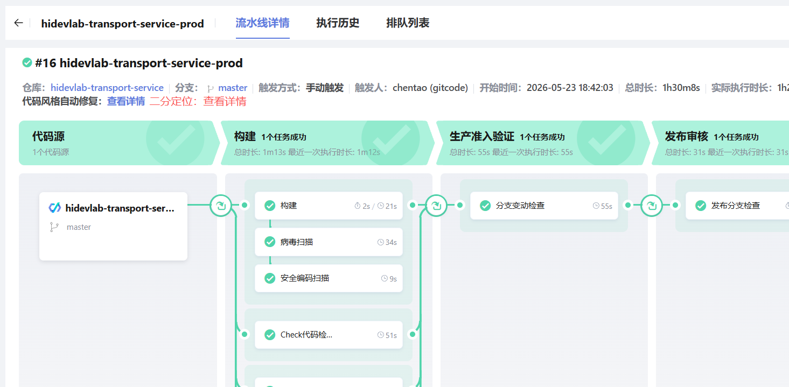

# Nightly 流水线失败 PR 自动二分定位

## 需求背景

PTA 的全量社区用例在蓝区的 Nightly 流水线，当流水线运行失败时，需要支持自动二分来快速定位出是哪个 PR 引入了错误，方便业务快速回退问题 PR，保证版本可用性。

当前痛点：

- Nightly 流水线失败后，人工排查引入问题的 PR 耗时长、效率低
- 全量用例运行时间长，逐个 PR 验证不现实
- 缺乏自动化工具辅助快速定位问题引入点

## 功能描述

### 核心功能：二分定位失败 PR

通过多次运行流水线，采用二分法定位引入问题的 PR：

1. **触发条件**：
   - 前提：流水线中开启"二分定位"开关配置
   - 开关开启后，失败的流水线自动触发二分分析
2. **查找基准**：调用 `/pipeline-run/list` 接口查找最近一次全量运行成功的记录
3. **获取 PR 列表**：调用 GitCode API 查找成功记录与当前失败记录之间合入的 PR 列表
4. **二分验证**：取 PR 列表的中间合入点作为 commit\_id，运行流水线验证
5. **迭代收敛**：根据验证结果缩小范围，重复二分直到找到最先引入问题的 PR

### 新增接口参数

运行流水线接口 `/run` 新增参数支持指定运行部分任务：

| 参数名             | 类型            | 说明                                                              |
| --------------- | ------------- | --------------------------------------------------------------- |
| `choose_stages` | List\<String> | 选择运行的流水线阶段，数据来自 `/detail` 接口的 `stages[*].identifier`            |
| `choose_jobs`   | List\<String> | 选择运行的流水线任务，数据来自 `/detail` 接口的 `jobs[*].identifier`              |
| `build_type`    | String        | 构建类型，新增 `"commitId"` 类型                                         |
| `commit_id`     | String        | 指定执行的 commit ID，数据来自 `sources[0].params.build_params.commit_id` |

### `/run` 接口请求体示例

```json
{
    "sources": [
        {
            "type": "code",
            "params": {
                "git_type": "gitcode",
                "codehub_id": "4162918",
                "default_branch": "master",
                "git_url": "https://gitcode.com/openlibing/openlibing-codecheck.git",
                "alias": "",
                "endpoint_id": "2c50711b250844d8bdf8e34a506dca71",
                "build_params": {
                    "build_type": "commitId",        // 【新增】构建类型，支持 "commitId"
                    "event_type": "Manual",
                    "target_branch": null,
                    "tag": null,
                    "commit_id": "测试id"            // 【新增】指定执行的 commit ID
                }
            }
        }
    ],
    "description": "",
    "variables": [],
    "choose_jobs": [                              // 【新增】选择运行的流水线任务
        "JOB_prGQa"
    ],
    "choose_stages": [                            // 【新增】选择运行的流水线阶段
        "176812be2-4f74-461b-bf5f-775960"
    ]
}
```

**新增参数说明**（已用 `// 【新增】` 标注）：

| 参数路径                                        | 类型            | 说明                                                                 |
| ------------------------------------------- | ------------- | ------------------------------------------------------------------ |
| `sources[*].params.build_params.build_type` | String        | 构建类型，新增 `"commitId"` 类型，表示按指定 commit 运行                            |
| `sources[*].params.build_params.commit_id`  | String        | 指定执行的 commit ID，二分定位时传入目标 PR 的 commit                              |
| `choose_jobs`                               | List\<String> | 选择运行的流水线任务 identifier 列表，数据来自 `/detail` 接口的 `jobs[*].identifier`   |
| `choose_stages`                             | List\<String> | 选择运行的流水线阶段 identifier 列表，数据来自 `/detail` 接口的 `stages[*].identifier` |

### 参数来源说明

所有参数信息均来自 `/detail` 流水线详情接口：

```
/detail 响应结构：
{
  "stages": [
    { "identifier": "stage-1", ... },
    { "identifier": "stage-2", ... }
  ],
  "jobs": [
    { "identifier": "job-1", ... },
    { "identifier": "job-2", ... }
  ],
  "sources": [
    {
      "params": {
        "build_params": {
          "commit_id": "abc123..."
        }
      }
    }
  ]
}
```

### 二分定位流程

```
┌─────────────────────────────────────────────────────────────┐
│                    失败流水线触发二分分析                      │
└─────────────────────────────────────────────────────────────┘
                              │
                              ▼
┌─────────────────────────────────────────────────────────────┐
│  1. 查询 /pipeline-run/list 找最近一次全量运行成功的记录        │
└─────────────────────────────────────────────────────────────┘
                              │
                              ▼
┌─────────────────────────────────────────────────────────────┐
│  2. 调用 GitCode API 获取成功→失败期间合入的 PR 列表            │
│     PR_list = [PR1, PR2, PR3, PR4, PR5, PR6, PR7]            │
└─────────────────────────────────────────────────────────────┘
                              │
                              ▼
┌─────────────────────────────────────────────────────────────┐
│  3. 取中间 PR (PR4) 的 commit_id，运行流水线（只运行失败任务）   │
│     /run {                                                   │
│       build_type: "commitId",                                │
│       commit_id: "PR4_commit",                               │
│       choose_jobs: ["failed_job_1", "failed_job_2"]          │
│     }                                                        │
└─────────────────────────────────────────────────────────────┘
                              │
                    ┌─────────┴─────────┐
                    │                   │
              运行成功              运行失败
                    │                   │
                    ▼                   ▼
        ┌───────────────────┐  ┌───────────────────┐
        │ 问题在 PR5~PR7    │  │ 问题在 PR1~PR4    │
        │ 继续二分右半区间   │  │ 继续二分左半区间   │
        └───────────────────┘  └───────────────────┘
                    │                   │
                    └─────────┬─────────┘
                              │
                              ▼
┌─────────────────────────────────────────────────────────────┐
│  4. 重复二分直到找到最先引入问题的 PR                           │
└─────────────────────────────────────────────────────────────┘
```

### 重跑优化

二分验证时只运行失败的流水线任务，减少验证时间：

- 通过 `/detail` 接口获取失败任务的 `identifier`
- 调用 `/run` 时传入 `choose_jobs` 参数指定只运行失败任务

### 日志界面



### 二分定位日志样例

```
[2026-05-28 10:00:00] [INFO] ========== 二分定位分析开始 ==========
[2026-05-28 10:00:00] [INFO] 流水线ID: pipeline-12345
[2026-05-28 10:00:00] [INFO] 失败运行记录: run-67890
[2026-05-28 10:00:00] [INFO] 失败任务: [JOB_test_case_1, JOB_test_case_2]

[2026-05-28 10:00:01] [INFO] ---------- Step 1: 查找最近成功记录 ----------
[2026-05-28 10:00:01] [INFO] 调用 /pipeline-run/list 接口...
[2026-05-28 10:00:02] [INFO] 找到最近成功记录: run-67880, commit: a1b2c3d4
[2026-05-28 10:00:02] [INFO] 成功记录时间: 2026-05-27 18:00:00

[2026-05-28 10:00:03] [INFO] ---------- Step 2: 获取 PR 列表 ----------
[2026-05-28 10:00:03] [INFO] 调用 GitCode API 获取 a1b2c3d4..e5f6g7h8 之间的 PR...
[2026-05-28 10:00:04] [INFO] 找到 7 个合入的 PR:
[2026-05-28 10:00:04] [INFO]   [1] PR#101 - fix: 修复用例1 (commit: b2c3d4e5)
[2026-05-28 10:00:04] [INFO]   [2] PR#102 - feat: 新增功能2 (commit: c3d4e5f6)
[2026-05-28 10:00:04] [INFO]   [3] PR#103 - fix: 修复用例3 (commit: d4e5f6g7)
[2026-05-28 10:00:04] [INFO]   [4] PR#104 - refactor: 重构模块 (commit: e5f6g7h8)
[2026-05-28 10:00:04] [INFO]   [5] PR#105 - fix: 修复用例5 (commit: f6g7h8i9)
[2026-05-28 10:00:04] [INFO]   [6] PR#106 - feat: 新增功能6 (commit: g7h8i9j0)
[2026-05-28 10:00:04] [INFO]   [7] PR#107 - fix: 修复用例7 (commit: h8i9j0k1)

[2026-05-28 10:00:05] [INFO] ---------- Step 3: 二分验证 (第1轮) ----------
[2026-05-28 10:00:05] [INFO] PR区间: [1-7], 中间点: PR#104 (index=4)
[2026-05-28 10:00:05] [INFO] 运行流水线, commit_id: e5f6g7h8, jobs: [JOB_test_case_1, JOB_test_case_2]
[2026-05-28 10:15:30] [INFO] 流水线运行完成, 结果: FAILED
[2026-05-28 10:15:30] [INFO] 问题在 PR#101~PR#104 区间, 继续二分左半区间

[2026-05-28 10:15:31] [INFO] ---------- Step 3: 二分验证 (第2轮) ----------
[2026-05-28 10:15:31] [INFO] PR区间: [1-4], 中间点: PR#102 (index=2)
[2026-05-28 10:15:31] [INFO] 运行流水线, commit_id: c3d4e5f6, jobs: [JOB_test_case_1, JOB_test_case_2]
[2026-05-28 10:28:45] [INFO] 流水线运行完成, 结果: SUCCESS
[2026-05-28 10:28:45] [INFO] 问题在 PR#103~PR#104 区间, 继续二分右半区间

[2026-05-28 10:28:46] [INFO] ---------- Step 3: 二分验证 (第3轮) ----------
[2026-05-28 10:28:46] [INFO] PR区间: [3-4], 中间点: PR#103 (index=3)
[2026-05-28 10:28:46] [INFO] 运行流水线, commit_id: d4e5f6g7, jobs: [JOB_test_case_1, JOB_test_case_2]
[2026-05-28 10:42:10] [INFO] 流水线运行完成, 结果: SUCCESS
[2026-05-28 10:42:10] [INFO] 问题在 PR#104 区间, 定位完成

[2026-05-28 10:42:11] [INFO] ========== 二分定位分析完成 ==========
[2026-05-28 10:42:11] [INFO] 最先引入问题的 PR: PR#104
[2026-05-28 10:42:11] [INFO] PR标题: refactor: 重构模块
[2026-05-28 10:42:11] [INFO] PR链接: https://gitcode.com/openlibing/openlibing-cicd/merge_requests/104
[2026-05-28 10:42:11] [INFO] Commit: e5f6g7h8
[2026-05-28 10:42:11] [INFO] 总耗时: 42分11秒
[2026-05-28 10:42:11] [INFO] 验证次数: 3次
```

### PR commitId 获取方式

通过 GitCode API 获取 PR 的 commit 信息：

**接口**：`GET /repos/{owner}/{repo}/pulls/{number}`

**响应字段**：

| 字段         | 说明                                        |
| ---------- | ----------------------------------------- |
| `base.sha` | PR 合并后产生的 merge commit SHA，**一定在目标分支历史中** |
| `head.sha` | PR 源分支最后一个 commit SHA，代表 PR 的变更内容         |

**选择策略**：

使用 `base.sha` 作为 `commit_id`，原因：

1. `base.sha` **一定在目标分支的历史中**，不存在 checkout 问题
2. 二分区间清晰：成功 commit → PR1 merge → PR2 merge → ... → 失败 commit
3. 流水线运行更稳定，不会因为 commit 不在主线而失败

## 不做

- 不支持 PR 流水线的二分分析（仅支持 Nightly 流水线）
- 不支持非 commitId 触发的流水线二分
- 不修改流水线执行引擎核心逻辑
- 不新增数据库表结构

## 验收标准

- [ ] `/run` 接口支持 `choose_stages`、`choose_jobs` 参数指定运行部分任务
- [ ] `/run` 接口支持 `build_type: "commitId"` 和 `commit_id` 参数
- [ ] 失败流水线详情页新增"二分定位"按钮
- [ ] 点击按钮后自动执行二分分析流程
- [ ] 二分分析过程中展示进度和当前验证的 PR 信息
- [ ] 分析完成后展示最先引入问题的 PR 及相关信息
- [ ] 现有测试全部通过

## 影响范围

- 后端：`openlibing-cicd` 仓
  - `/run` 接口新增参数支持
  - 新增二分定位服务逻辑
  - GitCode API 集成（获取 PR 列表）
- 前端：流水线详情页
  - 新增"二分定位"按钮
  - 二分分析进度展示
  - 分析结果展示

