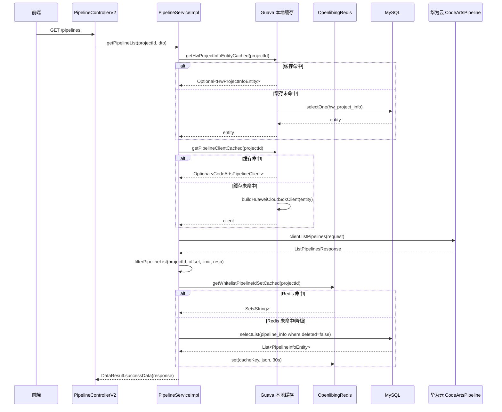
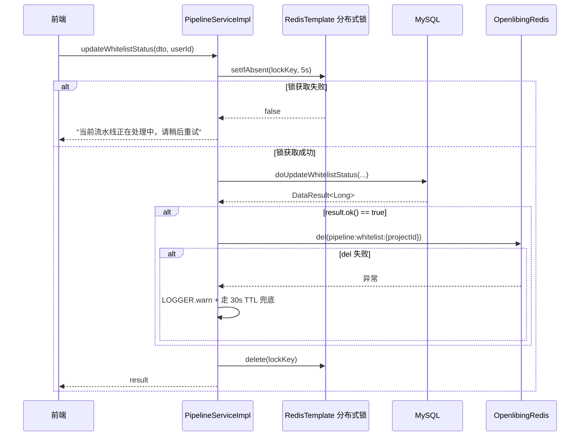

# 流水线列表/详情接口缓存优化与异常处理修复 - 技术设计

> 关联 PR：openlibing/openlibing-cicd#538
> 关联迭代分支：`release_20260813_iter1`

# 1.方案设计

## 业务场景

用户在前端流水线列表页面查看所属项目下的流水线，每次访问会触发后端 `getPipelineList` 接口。该接口需要：

1. 查询 `hw_project_info` 表获取项目与华为云 CodeArtsPipeline 的映射关系；
2. 调用华为云 SDK `buildHuaweiCloudSdkClient` 构建 `CodeArtsPipelineClient`（涉及 AK/SK 解密与 SSL 客户端初始化）；
3. 调用华为云 `listPipelines` 拉取流水线列表；
4. 根据 `pipeline_info` 表的白名单字段过滤出当前项目展示的流水线。

## 当前系统能力限制

- 每次请求重复执行 AK/SK 解密与 SDK 客户端构建，单次解密涉及非对称运算，CPU 开销不可忽略；
- 每次请求重复查询 `hw_project_info` 与 `pipeline_info` 表；
- 白名单过滤逻辑直接耦合在 `filterPipelineList` 中，未分层；
- 异常处理存在 P0 缺陷：`getPipelineList` 的 `catch (Exception e)` 直接返回 `DataResult.success()`，导致上游调用方无法识别失败，前端拿到空数据无法提示用户。

## 本次改造目标

1. **性能**：通过本地缓存 + Redis 缓存减少重复的 DB 查询与 SDK 客户端构建；
2. **正确性**：修复异常处理 P0 缺陷，按华为云 SDK 异常类型精细化返回错误提示；
3. **一致性**：白名单变更后主动失效缓存，TTL 兜底保证最终一致；
4. **可降级**：缓存层异常时降级直接回源，避免缓存故障导致接口全量失败。

## 涉及模块

| 模块                      | 改动范围                                                                                                          |
| ------------------------- | ----------------------------------------------------------------------------------------------------------------- |
| `PipelineServiceImpl`     | 新增本地缓存字段、Redis 依赖、3 个私有方法；改造 `getPipelineList`、`updateWhitelistStatus`、`filterPipelineList` |
| `PipelineServiceImplTest` | 修正 `testGetPipelineList_Exception` 断言以匹配 P0 修复                                                           |

## 整体处理方式

- **本地缓存**（Guava `CacheBuilder`）：缓存 `CodeArtsPipelineClient` 与 `HwProjectInfoEntity`，按 `projectId` 隔离，TTL 30 分钟，参考 `AuthInterceptor` 既有模式；
- **Redis 缓存**（`OpenlibingRedis`）：缓存白名单流水线 ID 集合，按 `projectId` 隔离，TTL 30 秒兜底；
- **主动失效**：白名单变更成功后主动 `del` Redis 缓存，实现全局零延迟生效；
- **异常分层**：按华为云 SDK 的 `ConnectionException` / `RequestTimeoutException` / `ServiceResponseException` 精细化捕获并返回中文提示，`Exception` 兜底返回通用失败提示。

# 2.实现逻辑设计

## 调用关系

## 白名单变更失效逻辑

## 异常分层处理

`getPipelineList` 调用华为云 SDK 可能抛出的异常及对应处理：

| 异常类型                   | 含义                                                                       | 返回提示                                       |
| -------------------------- | -------------------------------------------------------------------------- | ---------------------------------------------- |
| `ConnectionException`      | 网络连接失败                                                               | "网络连接超时"                                 |
| `RequestTimeoutException`  | 请求超时                                                                   | "响应超时，请稍后重试"                         |
| `ServiceResponseException` | 华为云返回业务错误（含 HttpStatusCode / RequestId / ErrorCode / ErrorMsg） | "获取流水线列表失败，请稍后重试"               |
| `Exception`（兜底）        | 未预期异常                                                                 | "获取流水线列表异常，请稍后重试或联系管理员！" |

所有异常分支均打印 ERROR 日志（含 projectId、请求体、华为云错误详情），便于问题定位。

## 缓存降级策略

| 故障场景                                         | 降级行为                                       |
| ------------------------------------------------ | ---------------------------------------------- |
| Guava `Cache.get` loader 抛 `ExecutionException` | 捕获后直接查库 / 直接构建 client，记 WARN 日志 |
| Redis 读失败（`openlibingRedis.get`）            | 降级回源 DB，记 WARN 日志                      |
| Redis 写失败（`openlibingRedis.set`）            | 跳过缓存写入，仅记 WARN 日志，下次 miss 再写   |
| Redis 主动删失败（`openlibingRedis.del`）        | 主流程已成功，走 30s TTL 兜底最终一致          |

# 3.类设计

## PipelineServiceImpl

### 新增字段

| 字段                   | 类型                                              | 职责                                                                                                         |
| ---------------------- | ------------------------------------------------- | ------------------------------------------------------------------------------------------------------------ |
| `pipelineClientCache`  | `Cache<String, Optional<CodeArtsPipelineClient>>` | 华为云 SDK 客户端本地缓存，按 `projectId` 隔离，TTL 30 分钟。`Optional` 包装支持缓存"查不到"的 key，避免穿透 |
| `hwProjectEntityCache` | `Cache<String, Optional<HwProjectInfoEntity>>`    | 华为云项目映射本地缓存，按 `projectId` 隔离，TTL 30 分钟                                                     |
| `openlibingRedis`      | `OpenlibingRedis`                                 | Spring 注入，提供 Redis 读写删能力                                                                           |

### 新增常量

| 常量                          | 值                      | 说明                                                                      |
| ----------------------------- | ----------------------- | ------------------------------------------------------------------------- |
| `WHITELIST_CACHE_PREFIX`      | `"pipeline:whitelist:"` | 白名单 Redis key 前缀，按 projectId 隔离                                  |
| `WHITELIST_CACHE_TTL_SECONDS` | `30L`                   | 白名单 Redis 缓存 TTL，作为主动失效的兜底                                 |
| `LOCAL_CACHE_TTL_MINUTES`     | `30L`                   | 本地缓存 TTL，限制 AK/SK 轮转后旧凭据的有效期，避免永久缓存的安全审计隐患 |

### 新增方法

#### `getHwProjectInfoEntityCached(String projectId)`

- **职责**：查询华为云项目映射，命中本地缓存优先返回；
- **降级**：Guava `ExecutionException` 时直接查库；
- **返回**：实体或 `null`。

#### `getPipelineClientCached(String projectId)`

- **职责**：获取 `CodeArtsPipelineClient`，命中本地缓存优先返回；
- **依赖**：内部调用 `getHwProjectInfoEntityCached`，避免重复查库；
- **降级**：Guava `ExecutionException` 时直接构建；
- **返回**：client 或 `null`。

#### `getWhitelistPipelineIdSetCached(String projectId)`

- **职责**：查询白名单流水线 ID 集合，命中 Redis 优先返回；
- **缓存空集合**：避免缓存穿透；
- **降级**：Redis 读写异常时回源 DB；
- **返回**：`Set<String>`，无白名单返回空集合。

### 修改方法

#### `getPipelineList`

- 替换 `hwProjectInfoMapper.selectOne` 为 `getHwProjectInfoEntityCached`；
- 替换 `hwCloudClient.buildHuaweiCloudSdkClient` 为 `getPipelineClientCached`；
- 异常处理重写：删除原 `catch (Exception e) { return DataResult.success(); }`，改为按 SDK 异常类型分层捕获并返回 `DataResult.failureMessage(...)`。

#### `updateWhitelistStatus`

- 在 `doUpdateWhitelistStatus` 返回 `result.ok()` 后，主动 `openlibingRedis.del(WHITELIST_CACHE_PREFIX + projectId)`；
- `del` 失败不影响主流程，仅记 WARN 日志，依赖 30s TTL 兜底。

#### `filterPipelineList`

- 拆分原方法：DB 查询逻辑上移至 `getWhitelistPipelineIdSetCached`，`filterPipelineList` 仅负责过滤与分页；
- 入口由 `getWhitelistPipelineIdSetCached` 提供数据源，支持缓存命中与降级两种路径。

## PipelineServiceImplTest

### 修改方法

#### `testGetPipelineList_Exception`

- 原 `assertTrue(result.ok())` 与 P0 修复后的语义冲突；
- 改为 `assertFalse(result.ok())` 与 `assertNull(result.getData())`，断言异常场景下不再伪装成功。

# 4.数据模型设计

不涉及。

本次改造仅引入缓存层，未变更任何数据库表结构、Entity 字段、DTO/VO 定义。`hw_project_info` 与 `pipeline_info` 表保持原样。

# 5.性能设计

## 接口默认性能目标

满足 3 秒性能要求。

## 缓存设计

| 缓存对象                 | 缓存层         | TTL     | 隔离维度    | 失效方式                                 |
| ------------------------ | -------------- | ------- | ----------- | ---------------------------------------- |
| `CodeArtsPipelineClient` | Guava 本地缓存 | 30 分钟 | `projectId` | TTL 兜底，AK/SK 轮转后 30 分钟内自动重建 |
| `HwProjectInfoEntity`    | Guava 本地缓存 | 30 分钟 | `projectId` | TTL 兜底                                 |
| 白名单流水线 ID 集合     | Redis          | 30 秒   | `projectId` | 主动 `del` + TTL 兜底                    |

## 选型理由

- **本地缓存选 Guava `CacheBuilder`**：
  - `Cache.get(key, loader)` 提供同 key 同步互斥，避免缓存击穿；
  - `expireAfterWrite` 统一 TTL；
  - 项目内 `AuthInterceptor` 已有相同模式，保持一致；
  - 不引入 Caffeine 等新依赖。
- **白名单选 Redis**：
  - 白名单变更需要在多实例间立即生效，本地缓存无法跨实例同步；
  - 30 秒 TTL 兼顾"全局一致性"与"Redis 故障下的最终一致"。

## 缓存穿透防护

- `Optional<T>` 包装支持缓存"查不到"的 key（`Optional.empty()`）；
- 白名单空集合也写入 Redis，避免反复回源 DB。

## 缓存击穿防护

- Guava `Cache.get(key, loader)` 同 key 同步互斥，单实例下并发回源只触发一次 loader；
- Redis 故障降级为 DB 直查，不阻塞主流程。

## 性能边界

- 本地缓存重建频率：30 分钟一次 client 重建，单次仅一次 AK/SK 解密，抖动可忽略；
- Redis 缓存命中率：白名单变更频率低，30 秒 TTL 内多数请求命中 Redis；
- 不引入额外的同步开销，所有缓存读写均为单次 KV 操作。

# 6.API接口设计

不涉及。

本次改造未变更任何对外接口签名。`getPipelineList` 与 `updateWhitelistStatus` 的 URL、Method、请求参数、返回参数完全保持向后兼容。

唯一对外可见的变化是异常场景下的返回结构：

| 场景                         | 改造前                                        | 改造后                                             |
| ---------------------------- | --------------------------------------------- | -------------------------------------------------- |
| `getPipelineList` 抛任意异常 | `DataResult.success()`（无 data，无错误信息） | `DataResult.failureMessage(...)`（含中文错误提示） |

该变化属于 **Bug 修复**，不属于接口契约变化。原行为违反接口语义（异常不应伪装成功），上游调用方按失败语义处理即可，无需适配。

# 7.安全设计

## 鉴权

继承已有鉴权逻辑。

- `getPipelineList` 与 `updateWhitelistStatus` 的鉴权链路未变更；
- `updateWhitelistStatus` 仍保留项目权限校验（`validateProjectPermission`）与分布式锁（`redisTemplate.opsForValue().setIfAbsent`）；
- 缓存层不引入新的鉴权维度，缓存 key 仅按 `projectId` 隔离，不跨项目共享。

## 敏感信息

- 日志不打印 AK/SK：`getPipelineClientCached` 的 loader 中调用 `buildHuaweiCloudSdkClient`，日志仅记录 `projectId`，不记录凭据；
- 异常日志仅打印华为云返回的 `RequestId` / `ErrorCode` / `ErrorMsg`，不打印 `Authorization` 头或 token；
- 缓存中不存储明文凭据：`pipelineClientCache` 缓存的是已构建的 client 对象，AK/SK 仅在 loader 内部短暂使用后由 SDK 内部持有，缓存层不可见。

## 硬编码

- 无 appkey / token / cookie / secret / 密钥硬编码；
- 缓存 key 前缀 `pipeline:whitelist:` 与 TTL 常量集中在 `PipelineServiceImpl` 类常量区，便于统一维护；
- AK/SK 仍由 `HwProjectInfoEntity` 从 DB 读取后传入 SDK，凭据来源链路未变。

## 审计日志

- `updateWhitelistStatus` 已通过 `@LogApi(tableName = PIPELINE_LOG, operationModule = OPERATION_PIPELINE_WHITELIST)` 注解记录审计日志，本次改造不破坏既有审计能力；
- `getPipelineList` 异常路径新增 ERROR 日志，包含 `projectId`、请求体、华为云错误详情，便于问题定位与事后审计；
- 白名单缓存主动失效失败时记 WARN 日志（含 `projectId`），不影响审计完整性（DB 已改，30s TTL 兜底最终一致）。

# 附录

## 关联代码定位

- 业务代码：PipelineServiceImpl.java
- 测试代码：PipelineServiceImplTest.java
- 缓存工具类：OpenlibingRedis.java
- 参考实现：AuthInterceptor.java（Guava Cache 同 key 同步互斥模式）

## 名词解释

| 名词                     | 含义                                                                                      |
| ------------------------ | ----------------------------------------------------------------------------------------- |
| `CodeArtsPipelineClient` | 华为云 CodeArts Pipeline SDK 客户端，封装对流水线服务的 API 调用                          |
| `HwProjectInfoEntity`    | openlibing 项目与华为云项目的映射实体，存储 `hwProjectId` 与 AK/SK 加密凭据               |
| `PipelineInfoEntity`     | openlibing 流水线信息实体，`deleted=false` 即表示该流水线在白名单中                       |
| `Optional<T>` 包装缓存   | 使用 `Optional.empty()` 表示"已查过但不存在"，避免 null 不能进 Guava Cache 且避免缓存穿透 |
