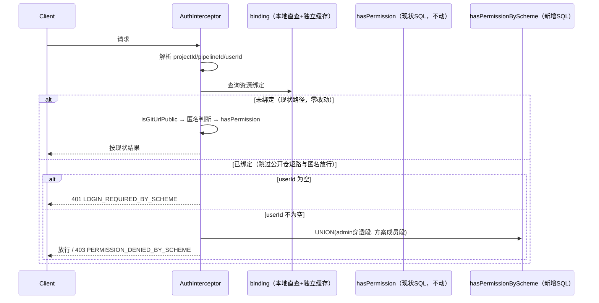

# CICD 资源级权限方案设计文档

> 关联 Issue：https://gitcode.com/openlibing/openlibing-cicd/issues/223
> 流程模式：Full（跨仓：openlibing-framework + openlibing-cicd + 前端，涉及鉴权与数据模型）

## 30 秒速览

**一句话**：资源绑定"权限方案"后，鉴权的角色数据源从项目成员（`user_role_info`）切换为方案成员（`perm_scheme_member`）；未绑定资源全链路无感知。

| 概念 | 是什么 | 存在哪 |
|------|--------|--------|
| 默认方案 | 现状项目成员角色数据，不落新表 | `user_role_info`（现状，不动） |
| 自定义方案 | 独立的成员-角色映射，支持复制创建 | `perm_scheme` + `perm_scheme_member`（新增） |
| 资源绑定 | 某条资源指定用哪个方案鉴权 | `perm_scheme_resource_binding`（新增） |

**效果示例**：流水线 P1（未绑定）→ 全员按项目角色鉴权，与今天完全一致；流水线 P2（绑定方案2）→ 仅方案2成员与 admin 可操作，其余人（含项目管理员）被拒。

**核心不变式**：方案只改变"角色数据来源"，不改变"角色能做什么"（后者永远由现有角色-菜单-URL 矩阵决定）。

## 1. 方案设计

| # | 要点 | 说明 |
|---|------|------|
| 1 | 默认方案不落库 | 对应现状成员数据，逻辑完全不变 |
| 2 | 自定义方案可复制创建 | 支持基于默认方案或其他方案复制，复制后互不联动 |
| 3 | 绑定即整体切换 | 绑定后该资源**全部** `@CheckPermission` 接口按方案成员鉴权（含查看类，已定案）；解绑自动回退 |
| 4 | 不新增权限维度 | 不在绑定层面定义操作粒度；未来更细管控走 framework 新增角色，不绕过矩阵 |
| 5 | 资源标识与业务解耦 | `resource_type`（可扩展枚举）+ `resource_id`（业务方约定格式字符串），framework 不感知业务含义；后续 CodeCheck/CodeRepo 接入零 framework 改造 |
| 6 | 管理端复用成员管理页 | "项目管理-成员管理"（`user_role_info`）加页签：默认方案固定展示，自定义方案页签管理；流水线列表加方案配置入口 |

**业务模块接入成本模型**（后续模块复用预期）：

| 层 | 每模块接入 | 一次性（本设计完成） |
|----|-----------|---------------------|
| 鉴权拦截 | 零改造（AuthInterceptor 统一） | ✅ |
| 方案管理/绑定 CRUD | 零改造（framework 接口） | ✅ |
| 资源列表/详情查询接口 | 行级加 `schemeId` / `schemeName` / `schemeOperations` | — |
| 前端页面 | 加 `schemeId` 分支 | — |

**控制范围边界**：仅覆盖能解析出资源标识（`pipelineId`）的接口；不带标识的列表类接口（`/list` 等）不按单条管控，返回内容中补充方案标识供前端展示。

## 2. 实现逻辑设计

### 2.1 鉴权调用链路

绑定查询必须插在"解析上下文"之后、**公开仓短路之前**——否则绑定的公开仓资源会被 `isGitUrlPublic` 短路和匿名放行绕过（`checkAnonymousAccess`），方案失效。



### 2.2 镜像 SQL（`hasPermissionByScheme`，新增，与现状 `hasPermission` 并存）

现状 `hasPermission` 是单条 CASE WHEN EXISTS SQL，**保持原样不动**（16 个存量单测零风险）。新增方法 `hasPermissionByScheme(userId, schemeId, projectId, url)`，用 UNION ALL 两段实现：

```sql
SELECT CASE WHEN EXISTS (
    -- 段1：admin 穿透，固定查 user_role_info，不受方案影响。
    -- 不带 project_id（任意项目的 admin 均穿透），但需落在 URL 角色白名单内
    -- （与现状 hasPermission 穿透语义等价，非无条件放行）
    SELECT 1 FROM user_role_info uri
    WHERE uri.user_id = #{userId}
      AND uri.role = 'admin'
      AND uri.role IN (/* URL 角色白名单子查询，同段2 */)

    UNION ALL

    -- 段2：方案成员校验 + 仍是有效项目成员（EXISTS 兜底）
    SELECT 1 FROM perm_scheme_member psm
    WHERE psm.scheme_id = #{schemeId}
      AND psm.user_id = #{userId}
      AND psm.role_code IN (
          SELECT rti.role FROM role_type_info rti
          JOIN role_permission_manager rpm ON rti.id = rpm.role_id
          JOIN menu_url_info mui ON rpm.menu_id = mui.menu_id
          WHERE mui.menu_url = #{url}
      )
      AND EXISTS (  -- 成员一致性兜底：不依赖应用层清理完整性（详见 7.数据一致性）
          SELECT 1 FROM user_role_info uri2
          WHERE uri2.user_id = psm.user_id
            AND uri2.project_id = #{projectId}
      )
) THEN 1 ELSE 0 END
```

> 段1 的白名单子查询与段2 相同（join 字段已核实：`rpm.role_id` / `mui.menu_id` / `mui.menu_url`）。
> EXISTS 口径（已定案）：`project_id` 匹配即视为有效成员，与成员管理页面查询口径一致；如需排除仅仓库级角色，追加 `uri2.repo_id IS NULL`（`repo_id` 已核实为区分记录层级字段：NULL=系统/产业/项目级，非 NULL=仓库级）。

**绑定查询与鉴权 SQL 分两步调用**（先查绑定拿 schemeId，再传入该 SQL），不合并联查——绑定结果可独立缓存，命中缓存时鉴权链路只需一次 SQL。

### 2.3 方案管理链路

- 写路径统一走 framework 接口（创建/复制/成员维护/绑定/解绑），业务模块不直写方案表
- cicd 鉴权读路径与 framework 同库同 Schema，本地直查，不引入跨服务 RPC

## 3. 类设计

### framework 层新增

| 类名 | 职责 |
|---|---|
| `PermSchemeController` | 方案管理接口：创建/复制、成员编辑、删除（绑定占用校验）、绑定/解绑/查询 |
| `PermSchemeService` | 方案核心逻辑：复制深拷贝、删除前绑定占用校验 |
| `PermSchemeResourceBindingService` | 绑定关系维护：绑定/解绑/按资源查询 |
| 3 组 Mapper（接口+XML） | 对应三张表持久层 |

### CICD 层改造

| 类名 | 改造内容 |
|---|---|
| `AuthInterceptor` | `extractPermissionContext` 之后、`isGitUrlPublic` 之前插入绑定查询；命中绑定跳过公开仓短路与匿名分支；未命中零改动 |
| `UserRoleMapper` | 新增 `hasPermissionByScheme` 方法（2.2 镜像 SQL），现状 `hasPermission` 不动 |
| `PermSchemeResourceBindingLocalMapper`（新增） | 本地只读查询绑定关系，独立 Guava 缓存（不与匿名访问结果缓存共用） |
| `PipelineControllerV2` 关联 Service | `/list`、`/detailInfo` 返回结构补三字段；方案配置入口调 framework 接口。注：全仓 `@CheckPermission` 共 30 个方法均集中于此控制器 |

## 4. 数据模型设计

新增三张表（Liquibase 管理，字段类型对齐现状表：`project_id` 对齐 `project_info.project_id` 用 int，`user_id` 对齐 `user_role_info.user_id` 用 varchar(32)，`role_code` 对齐 `role_type_info.role` 用 varchar(100)）。

### perm_scheme（权限方案表，仅存自定义方案）

| 字段 | 类型 | 说明 |
|---|---|---|
| id | bigint | 主键 |
| project_id | int | 所属项目 |
| scheme_name | varchar(128) | 方案名称（应用层做同项目重名校验） |
| scheme_description | varchar(256)，可空 | 方案用途说明 |
| source_scheme_id | bigint，可空 | 复制来源方案 id，仅展示不做强关联 |
| creator | varchar | 创建人 |
| create_time / update_time | datetime | |

默认方案不落本表，管理端作为固定页签展示。

### perm_scheme_member（方案成员角色表）

| 字段 | 类型 | 说明 |
|---|---|---|
| id | bigint | 主键 |
| scheme_id | bigint | 关联 perm_scheme.id（索引） |
| user_id | varchar(32) | 成员，需为项目现有成员子集 |
| role_code | varchar(100) | 角色编码，复用现有角色体系 |
| create_time | datetime | |

### perm_scheme_resource_binding（资源绑定表）

| 字段 | 类型 | 说明 |
|---|---|---|
| id | bigint | 主键 |
| project_id | int | 所属项目 |
| resource_type | varchar(32) | 资源类型枚举（PIPELINE，可扩展 CODECHECK、CODEREPO） |
| resource_id | varchar(128) | 资源标识，业务方约定格式，仅精确匹配不解析 |
| resource_display_info | varchar(256)，可空 | 人工查看用，不参与鉴权 |
| scheme_id | bigint | 关联 perm_scheme.id |
| operator | varchar | 最近操作人 |
| create_time / update_time | datetime | |

唯一索引 `(project_id, resource_type, resource_id)`（幂等）。解绑 = 删除记录，资源自动回退默认方案。

## 5. 性能设计

| # | 设计点 | 结论 |
|---|--------|------|
| 1 | 绑定查询方式 | 本地直查（同库同 Schema 已核实），不引入 RPC 可用性依赖 |
| 2 | 绑定查询效率 | 唯一索引 `(project_id, resource_type, resource_id)`，与现状四表联查同量级 |
| 3 | 两步调用 | 绑定结果独立缓存（命中时仅一次 SQL），不合并联查 |
| 4 | 缓存隔离 | 独立 Guava 实例（maximumSize=1000，1min TTL），不与匿名访问结果缓存共用 |
| 5 | EXISTS 子查询 | `user_role_info` 仅主键索引已核实，现状 `hasPermission` 本身即全表扫描，未恶化；建议 Liquibase 幂等 changeSet 补 `(user_id, project_id, role)` 组合索引（需 framework 团队评估写入开销，跨团队协作项） |
| 6 | 未绑定资源 | 零新增查询与性能损耗 |

## 6. API 接口设计

### framework 层新增

| 接口 | Method | 说明 |
|---|---|---|
| `/framework/perm-scheme/schemes` | POST | 创建方案（支持传来源方案 id 复制创建） |
| `/framework/perm-scheme/schemes` | GET | 按项目查询方案列表 |
| `/framework/perm-scheme/schemes/{schemeId}/members` | PUT | 编辑方案成员角色 |
| `/framework/perm-scheme/schemes/{schemeId}` | DELETE | 删除方案（存在绑定时拒绝） |
| `/framework/perm-scheme/bindings` | POST / DELETE | 建立 / 解除资源绑定 |
| `/framework/perm-scheme/bindings` | GET | 按资源查询当前绑定方案 |

### CICD 层（接口契约权威来源）

| 接口 | Method | 改造内容 |
|---|---|---|
| `/project/pipeline/list` | POST | 行级新增 `schemeId`、`schemeName`、`schemeOperations`（仅绑定行计算；为空=默认方案）。新增字段不影响现有调用方 |
| `/project/pipeline/detailInfo` | GET | 新增同样三字段（详情页有重试/停止/编辑/执行 4 个操作按钮） |
| `/project/pipeline/pipeline-run/list` | POST | 暂不改造（运行历史页实测无操作码按钮）；后续加操作按钮再扩展 |

**`schemeOperations`**：按操作码的权限 map，如 `{"pipeline_run": true, "pipeline_stop": false}`。key **复用现有权限码**（`menu_info.identification`，即前端 `hasOperationPermission` 已在用的 auth 参数），不新造编码。

**错误响应体扩展**：新增 `schemeName` 字段（方案版气泡文案用）；新增两个错误码——`LOGIN_REQUIRED_BY_SCHEME`（匿名访问绑定资源，401 语义）、`PERMISSION_DENIED_BY_SCHEME`（登录后非方案成员，403），区别于现状 `PERMISSION_DENIED`。

### 前端兼容设计

**无感知原则**：未绑定资源，交互/提示/错误码/性能与现状完全一致——回归测试验收基线。

现状前端按钮与无权限气泡（`NoPermissionPopover` 三段式）基于角色-菜单矩阵，不感知方案绑定，三处失真及对策：

| 失真 | 对策 |
|------|------|
| 气泡指引误导（引导申请角色，但加角色无用） | 气泡双模式：绑定资源被拒展示方案版（"请联系项目管理员在方案「xxx」中为你配置具备该操作权限的角色"，建议角色复用现有 `rolesByLevel` 渲染，不新做） |
| 按钮状态失真（纯角色判断表达不了资源级差异） | 绑定行以 `schemeOperations[操作码]` 控制按钮，未绑定行维持现状；**前端不做方案级权限计算**（join 由后端完成，避免前后端漂移） |
| 公开仓用户静默被拒 | 匿名两步分离：匿名 → 401 + "该资源为关键管控资源，请先登录"；登录后非成员 → 403 + 方案版气泡。未绑定资源维持公开仓匿名可看；列表接口匿名可访问且仍返回 `schemeId`（`schemeOperations` 对匿名恒为 false） |

**绑定/解绑权限模型（防死锁）**：绑定/解绑/方案管理接口作为普通权限点纳入 framework 管理中心配置（建议授 `project_manager`，上代码前配置好）；悬浮置灰走现有角色版气泡。**关键约束：管控配置操作本身不随方案走**——否则"管理员绑定方案后在新方案内无配置权、无人能解绑"死锁；方案只管控业务操作（`@CheckPermission` 接口），配置操作永远走全局角色矩阵。

**`menu_url_info.triggerPermissionType` 豁免**：方案类 403 不触发权限申请弹框（申请角色解决不了方案成员问题），按错误码豁免。

## 7. 安全设计

| # | 项 | 设计 |
|---|---|------|
| 1 | 鉴权 | 继承现有角色-菜单-URL 矩阵判断，仅改变角色数据来源，不新增权限维度 |
| 2 | admin 穿透 | SQL UNION 段固定保留（查 `user_role_info`，不限项目但需在 URL 角色白名单内），方案锁不住管理员 |
| 3 | 公开仓/匿名收紧 | 绑定资源不再享受公开仓短路与匿名放行——预期设计，上线前需周知相关方 |
| 4 | 行为变化确认（均已定案） | 见附录"业务决策定案" |
| 5 | 审计日志 | 方案增删改、成员编辑、绑定/解绑均记录操作人/时间/变更前后内容 |
| 6 | 数据一致性 | 见下 |

**数据一致性**：方案成员需为项目现有成员子集（新增时校验）。安全防线 = 鉴权 SQL 的 `EXISTS` 校验（不依赖应用层清理完整性，覆盖手工移除/三方同步/项目级联全部删除路径）；应用层在 `deleteProjectUser` 主路径同步清理方案成员记录仅作数据卫生。

### 已知遗留风险（披露，不在本次范围）

`extractPermissionContext` 的 `userId` 取自请求参数而非登录态，客户端可伪造（现状既有缺陷，方案未使其恶化，同样可伪造方案成员身份）。本次不修，建议独立事项跟进。

## 附录

### 名词说明

| 名词 | 定义 |
|------|------|
| 默认方案 | 现状项目成员角色数据，不落新表 |
| 自定义方案 | 管理员创建的独立成员-角色映射，存于 `perm_scheme` / `perm_scheme_member` |
| 资源绑定 | 资源与方案的关联，存于 `perm_scheme_resource_binding`，存在与否决定鉴权路径 |

### 业务决策定案（5 项，已与需求方确认）

| # | 决策项 | 结论 |
|---|--------|------|
| 1 | 查看类接口是否一并收紧 | **收紧**；只读用户 = 加入方案配 `project_member`（能看不能跑） |
| 2 | project_manager 是否穿透 | **不穿透**（与现状语义一致，admin 是唯一 SQL 穿透角色）；管理员需显式加入方案 |
| 3 | EXISTS 成员口径 | **宽松**：project_id 匹配即有效，与成员管理页面口径一致 |
| 4 | userId 可伪造缺陷 | **本次不修**，披露 + 独立事项跟进 |
| 5 | 绑定/解绑权限 | **走现有角色矩阵**（管理中心权限点，建议授 project_manager）；配置操作不随方案走（防死锁） |

### 已核实事项（代码/数据库证据）

| # | 事实 |
|---|------|
| 1 | cicd 与 framework 同库同 Schema，本地直查可行 |
| 2 | `AuthInterceptor` 现状缓存三层：Guava（匿名访问结果，1000 条/1min）+ Redis（`isGitUrlPublic`，key 为 projectId+pipelineId，异步刷新）；新增绑定缓存须独立实例 |
| 3 | admin 穿透在 SQL 内部（`role='admin'`），非 Java 层方法；cicd 不认 super_admin/platform_operater 穿透 |
| 4 | 全仓 `@CheckPermission` 集中于 `PipelineControllerV2`（约 30 个方法）；无 `pipelineId` 的列表接口不受影响 |
| 5 | `user_role_info` 区分层级字段为 `repo_id`（NULL=系统/产业/项目级，非 NULL=仓库级）；仅主键索引，`user_id` 无二级索引（现状已全表扫描） |
| 6 | 镜像 SQL join 字段：`rpm.role_id`（无 `role_type_id` 字段）、`mui.menu_id` / `mui.menu_url`（非 `id`/`url`）——照抄 2.2 SQL，勿回退错误字段名 |
| 7 | 执行类接口（run/retry/stop）矩阵仅 4 角色（系统管理员/项目管理员/流水线工程师/流水线执行者）；查看类多达 11 角色——方案内配 `project_member` 天然"能看不能跑" |

### 跨团队协作项

- `user_role_info` 补 `(user_id, project_id, role)` 组合索引：Liquibase 幂等 changeSet（建前检查存在则跳过），需 framework 团队评估三方同步写入频繁下的索引维护开销
