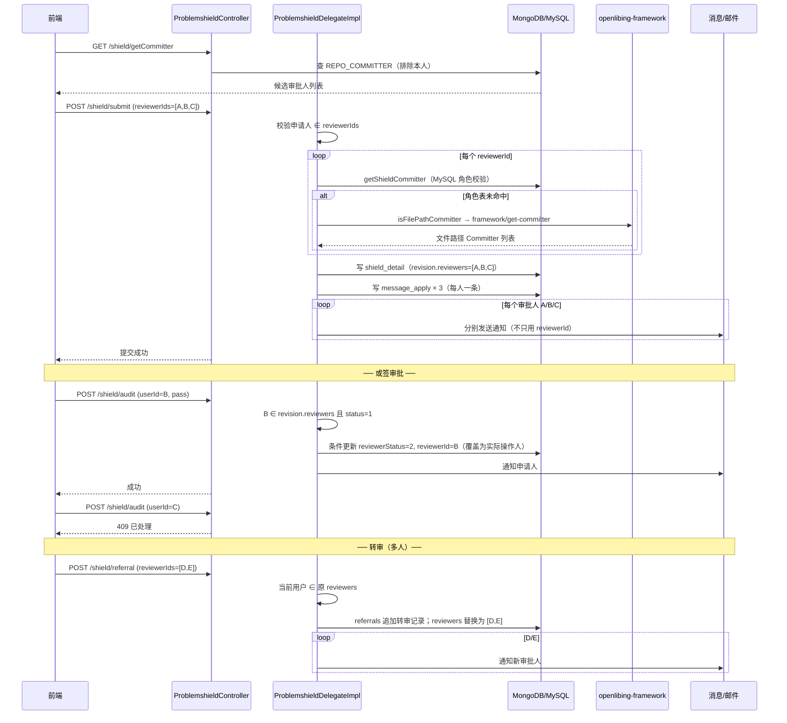

# 门禁屏蔽多选审核人设计文档

---

# 1、方案设计

## 1.1 背景与目标

### 业务背景

代码检查屏蔽申请（门禁 `type=inc`、每日检查 `type=full`）场景下，开发者在问题详情页对未通过规则发起**屏蔽申请**，需指定仓库 Committer 作为审批人。审批通过后问题状态变为「已屏蔽」。

**现状问题：** 提交屏蔽申请、转审时，仅支持**单选 1 名审批人**；后端 `ShieldModel.userId`、`Revision.reviewerId`、`MessageApply.reviewerId` 均为单值字段。

**需求目标：** 支持**多选审批人**（inc 与 full 同步），覆盖：选人 → 提交 → 转审 → 待办/列表 → 审核 → 通知。

### 范围界定

| 维度         | 说明                                                                                                                     |
| ------------ | ------------------------------------------------------------------------------------------------------------------------ |
| **本期范围** | `type=inc`（门禁）与 `type=full`（每日检查）**同步支持**多选审批人；提交、转审、审核、待办、通知全链路改造               |
| **共用改造** | `ProblemshieldController` / `ProblemshieldDelegateImpl` 同时服务 inc 和 full，**同一套接口、同一套逻辑**，不做分支差异化 |
| **不在范围** | StaticAlarm 批量屏蔽（管理员直操、无审批流）；FossScan 模块独立审批流                                                    |
| **外部依赖** | `openlibing-framework/select/get-committer` 用于**文件路径级 Committer 校验**（见 2.1.1 说明），接口本身不变             |

### 审批规则

| 规则项     | 方案                     | 说明                                                                        |
| ---------- | ------------------------ | --------------------------------------------------------------------------- |
| 审批模式   | **或签（OR）**           | 多名审批人中**任意一人**操作（通过/不通过）即终结本次申请                   |
| 生效优先级 | **先成功者生效**         | 第一位成功提交审核结果的审批人决定最终结论；后续审批人操作返回 409          |
| 不通过     | **任一审批人驳回即驳回** | 与通过对称；申请关闭，申请人可重新发起                                      |
| 人数上限   | **无**                   | 配置项 `shield.max.reviewers`，提交和转审共用                               |
| 人数下限   | **≥ 1 人**               | 至少 1 名审批人；请求未带 `reviewerIds` 时，用现有字段 `userId` 按 1 人处理 |

### 接口契约

本期不删任何现有字段。前端按「多出来的字段」适配即可。

**1. 提交 / 转审入参**

| 字段                      | 是否新增   | 怎么用                                                         |
| ------------------------- | ---------- | -------------------------------------------------------------- |
| `reviewerIds`             | **新增**   | 多选审批人，去重。多选时传这个                                 |
| `userId`（及名称 `user`） | 已有，保留 | 未传 `reviewerIds` 时，后端按这 1 人处理（和现在单人提交相同） |

建议多选时：`reviewerIds` 传全员，`userId` 同时带名单第一人（与库里 `revision.reviewerId` 一致，见下）。

**2. 查询出参（问题详情、申请/待审列表里的 `revision`）**

| 字段                          | 是否新增           | 后端保证                                                                                                                     |
| ----------------------------- | ------------------ | ---------------------------------------------------------------------------------------------------------------------------- |
| `reviewerId` / `reviewerName` | 已有，**继续返回** | 待审：单人 = 该审批人，多人 = `reviewers` 第一人。**审完后覆盖为实际点通过/驳回的人**（前端继续读这两个字段即可）            |
| `reviewers`                   | **新增**           | 本期 **submit / referral 写入的申请** 会带上全员列表。上线前库里已有的申请 **没有这个字段**（`null` 或不出现），不是接口报错 |

前端展示：`reviewers` 有值且非空 → 展示审批人全员；否则用 `reviewerId` / `reviewerName`。已审时 **仍读 `reviewerName`**，即为实际操作人，不新增字段、前端不用按版本切换。

**3. 审核入参**

`POST /shield/audit`、批量审核路径和 Body **不变**，仍传当前登录人 `userId`。后端改为：该用户在审批人名单里即可审（多人任意一人）。审完后其他人再审返回 **409**；不在名单里返回 **403**。

**4. 选人接口**

`GET /shield/getCommitter`、`POST /shield/getReferralCommitter` 入参出参不变。多选是前端 UI 行为，把选中的 ID 放到提交/转审的 `reviewerIds` 即可。

---

# 2、实现逻辑设计

## 2.1 端到端流程

### 2.1.1 完整时序图



## 2.2 reviewerId 与 reviewers 的职责划分

### 现有代码中 reviewerId 的实际用途

| 用途               | 代码位置（改造前）                                       | 改造后                                                                                                                                                                     |
| ------------------ | -------------------------------------------------------- | -------------------------------------------------------------------------------------------------------------------------------------------------------------------------- |
| 审核权限           | `shieldAudit`: `userId.equals(revision.getReviewerId())` | 改为 `isReviewer(revision, userId)` 查 reviewers，如果revision中没有reviewers则继续走 `userId.equals(revision.getReviewerId())`                                            |
| 待我审批查询       | `ProblemShieldOperation`: `revision.reviewerId = me`     | 改为 `reviewers.userId = me` OR 旧 reviewerId（如果revision中没有reviewers）                                                                                               |
| 待办计数           | `applyAuditNumber`                                       | 同上                                                                                                                                                                       |
| 写入 message_apply | `insertMessageApply(revision, ...)` 取 reviewerId        | **每人一条**；名单来自 `resolveReviewers()`（无 reviewers 则回退 reviewerId）                                                                                              |
| 发送通知           | `getNotifyResponse(..., shieldModel.getUserId(), ...)`   | 循环 `resolveReviewers()`：有 `reviewers` 则每人一封，没有则只通知 `reviewerId`                                                                                            |
| 查询出参           | 问题详情 / 申请列表只返回 `revision.reviewerId`          | `reviewerId` 继续返回。待审时多人等于名单第一人；**审完后覆盖为实际操作人**。本期新写入的申请额外带 `revision.reviewers`。前端有 `reviewers` 展示全员，否则用 `reviewerId` |

### 通知改造要点（避免「只通知第一个人」）

**禁止**直接 `revision.getReviewers()` 循环：上线前的申请没有该字段，会得到 `null`/空列表。统一走 `resolveReviewers()`（只在内存里拼名单，不写库、不改出参）：

```java
/** 有 reviewers 用全员；没有则用 reviewerId 这 1 人 */
List<ReviewerInfo> resolveReviewers(Revision revision) {
    if (revision.getReviewers() != null && !revision.getReviewers().isEmpty()) {
        return revision.getReviewers();
    }
    if (StringUtils.isNotBlank(revision.getReviewerId())) {
        return List.of(new ReviewerInfo(revision.getReviewerId(), revision.getReviewerName()));
    }
    return List.of();
}

// 现状：只通知 shieldModel.getUserId() 一个人
getNotifyResponse(notifyType, shieldModel.getUserId(), ..., messageApply, ...);

// 改造后：按 resolveReviewers() 循环（多人全员；仅有 reviewerId 时仍 1 人）
for (ReviewerInfo reviewer : resolveReviewers(revision)) {
    MessageApply apply = buildMessageApply(revision, reviewer);
    getNotifyResponse(notifyType, reviewer.getUserId(), ..., apply, ...);
}
```

## 2.3 核心改造点

### 2.3.1 提交屏蔽（shieldSubmit）— inc & full 共用

**文件：** `ProblemshieldDelegateImpl.shieldSubmit`

> 只描述 **这次 submit 请求** 怎么处理。不会批量改库里已有申请。

| 步骤           | 现状                               | 改造                                                                                               |
| -------------- | ---------------------------------- | -------------------------------------------------------------------------------------------------- |
| 解析入参       | 只读 `userId`，1 人                | 有 `reviewerIds` 用列表；没有则用 `userId` 当成 1 人                                               |
| 同人校验       | 申请人 ≠ 审批人                    | 申请人不能出现在入参名单里                                                                         |
| Committer 校验 | 校验 1 人                          | 入参名单逐个校验（MySQL → framework fallback）                                                     |
| 落库 Revision  | 只写 `reviewerId` / `reviewerName` | 写 `reviewers` = 入参全员；同时写 `reviewerId`/`reviewerName` = 名单第一人（现有出参字段保持有值） |
| message_apply  | 1 条                               | 名单每人 1 条（只传了 `userId` 时仍是 1 条）                                                       |
| 通知           | 通知 1 人                          | 按本次入参名单循环通知                                                                             |
| full/inc 分支  | 各自更新 summary                   | 逻辑不变                                                                                           |

### 2.3.2 审核（shieldAudit / shieldAllAudit）— inc & full 共用

| 步骤     | 改造                                                                                               |
| -------- | -------------------------------------------------------------------------------------------------- |
| 权限     | 当前登录人在审批人名单中：有 `reviewers` 看列表，没有看 `reviewerId`                               |
| 防重     | reviewerStatus != "1" → 409                                                                        |
| 并发     | MongoDB 条件更新 reviewerStatus=1                                                                  |
| 记录     | `reviewerId` / `reviewerName` = 当前操作者；`reviewers` 名单不变                                   |
| 回滚     | 通过失败时把 `reviewerId` / `reviewerName` 还原为名单第一人（无 `reviewers` 的旧单人数据不必还原） |
| inc 缓存 | 通过后 refreshCache（仅 inc）                                                                      |

### 2.3.3 转审（shieldReferral）— 支持多人

**现状：** `IdArray.userId` 单个新审批人；权限 `userId.equals(revision.getReviewerId())`。

**改造：**

| 步骤          | 改造                                                                                          |
| ------------- | --------------------------------------------------------------------------------------------- |
| 入参          | Body 新增 `reviewerIds`；未传则用现有 `userId`，按 1 人转审                                   |
| 权限          | 当前登录人须在该申请的审批人名单中：响应/库里有 `reviewers` 则看列表，没有则看 `reviewerId`   |
| 转审前记录    | 把转审前的审批人写入 `referrals`（有 `reviewers` 记全员，否则只记 `reviewerId` 这一人）       |
| 落库替换      | 这次转审写入：`reviewers` = 新选的人；`reviewerId` = 新名单第一人。之后查询会带上 `reviewers` |
| 校验          | 新 reviewerIds 逐个走 Committer 两级校验；不含申请人                                          |
| message_apply | 删除/标记旧待办；为每个新审批人新建一条                                                       |
| 通知          | **循环通知新 reviewers 全员**                                                                 |

```java
// IdArray 扩展
public class IdArray {
  private String userId;              // 已有：未传 reviewerIds 时按这 1 人转审
  private List<String> reviewerIds;   // 新增：转审目标多人
}
```

**转审流程示意：**

```
原 reviewers = [A, B, C]（待审）
  操作者 B 发起转审 → reviewerIds = [D, E]
  referrals 追加记录：{ A, B, C, 转审时间 }
  reviewers 替换为 [D, E]
  通知 D、E
  A/B/C 的待办消失（message_apply 更新 / reviewerStatus 仍=1 但 reviewers 已变，旧待办按 applyId 清理）
```

### 2.3.4 转审选人（getReferralCommitter）

| 现状                                | 改造                                                   |
| ----------------------------------- | ------------------------------------------------------ |
| 返回列表                            | 返回列表不变；排除申请人 + 历史转审人 + 当前 reviewers |
| 调 framework 获取文件路径 Committer | 不变                                                   |

### 2.3.5 待办与列表查询

所有「待我审批」从只匹配 `revision.reviewerId` 改为 OR（覆盖只有 `reviewerId` 的申请，以及 `reviewers` 里的其他人）：

```java
Criteria reviewerMatch = new Criteria().orOperator(
    Criteria.where("revision.reviewerId").is(userId),
    Criteria.where("revision.reviewers.userId").is(userId)
);
```

涉及：`getCriteria`、`getSelfShieldCriteria`、`getSelfProAndRepoCriteria`、`CommonOperation`。

### 2.3.6 查询出参（问题详情 / 申请列表）

涉及接口（`revision` 嵌在问题或申请记录里返回）：

- POST `/ci-portal/v1/event/codecheck/task`（门禁问题详情 `getIncResultDetail`）
- POST `/ci-portal/v1/codecheck/inc/task/result/details`（问题详情 `getTaskResultDetails`）
- POST `/ci-portal/shield/getSelfShieldData`（我的申请 / 待我审批列表）

**出参（库里有什么就返回什么，不补造 `reviewers`）：**

| 这条申请怎么来的       | 响应里的 `revision`                                                                                          |
| ---------------------- | ------------------------------------------------------------------------------------------------------------ |
| 本期上线前已存在       | 只有 `reviewerId` / `reviewerName` / `reviewerUrl`，没有 `reviewers`。单人审批，审完后这两个字段仍是该审批人 |
| 本期 submit / 转审写入 | 有 `reviewers`（全员，每人可带 userUrl）。待审时 `reviewerId` = 名单第一人；**审完后覆盖为实际操作人**       |

`CheckboardDelegateImpl.enrichDefectRevisionsWithUserUrls`：继续给 `reviewerId` 补 `reviewerUrl`（审完后即实际操作人的链接）；若有 `reviewers`，再给列表里每个人补 userUrl。

`resolveReviewers()` 只用于后端内部（通知、待办、权限），**不会出现在 HTTP 出参字段名里**。

## 2.4 状态机（或签模式）

```
              ┌─────────────┐
              │  待审批 (1)  │  reviewers = [A,B,C,...]
              └──────┬──────┘
     ┌───────────────┼───────────────┬──────────────┐
     ▼               ▼               ▼              ▼
 任一审批通过    任一审批驳回      申请人撤销      转审（reviewers 替换）
     │               │               │              │
     ▼               ▼               ▼              ▼
 reviewerId 覆盖为实际操作人   回退原状态      状态 3         新 reviewers 待审
 status=2        status=2                       referrals（转审人信息） 记录旧审批人
```

# 3、影响范围与风险

## 3.1 功能影响

| 功能     | inc                     | full | 影响                      |
| -------- | ----------------------- | ---- | ------------------------- |
| 发起屏蔽 | ✅                      | ✅   | submit 扩展 reviewerIds   |
| 转审     | ✅                      | ✅   | referral 扩展 reviewerIds |
| 待我审批 | ✅                      | ✅   | 多人均可见                |
| 批量审核 | ✅（shield-all-result） | —    | 权限改为 reviewers 成员   |
| 通知     | ✅                      | ✅   | 提交/转审各发 N 封        |
| 历史数据 | ✅                      | ✅   | 运行时兼容，无需迁移      |

## 3.2 风险与应对

| 风险                                                               | 应对                                                                             |
| ------------------------------------------------------------------ | -------------------------------------------------------------------------------- |
| 多人申请漏写 `reviewers`、只写了 `reviewerId` → 其他人无通知无待办 | 本次写入必须同时写两个字段；读的时候：有 `reviewers` 用列表，没有用 `reviewerId` |
| 两人同时审核                                                       | MongoDB 条件更新 + 409                                                           |
| 审核失败回滚后 `reviewerId` 仍指向操作人                           | 回滚时从 `reviewers[0]` 还原；旧单人数据无 `reviewers`，操作人即原审批人         |
| 转审后旧审批人仍看到待办                                           | 转审时清理旧 message_apply 或按 applyAssociatedIds 批量更新                      |
| framework 不可用                                                   | 文件路径 Committer 校验失败时该审批人判定非法；仓库级 Committer 不受影响         |

## 3.3 测试要点

- inc/full 各测：多选 3 人提交 → 3 人待办 + 3 封通知
- 只传 `userId`、不传 `reviewerIds` → 与现在单人提交行为一致
- A 审批通过后 B/C 返回 409；出参 `reviewerName` 为 A，`reviewers` 仍为全员
- 转审：B 将 [A,B,C] 转给 [D,E] → D/E 收到通知，A/B/C 待办消失
- 非 reviewers 成员审核 → 403
- framework fallback：选文件级 Committer 可正常提交

---

# 4、数据模型设计

## 4.1 ShieldModel（提交入参）

```java
public class ShieldModel {
  private String user;                  // 已有：审批人名称；多人时建议传第一人名称
  private String userId;                // 已有：未传 reviewerIds 时按这 1 人提交
  private List<String> reviewerIds;     // 新增：多选审批人 ID
  private List<String> reviewerNames;   // 可选：与 reviewerIds 对齐的名称
  private String type;                  // inc / full
  // ... 其余不变
}
```

## 4.2 IdArray（转审入参）

```java
public class IdArray {
  private String userId;                // 已有：未传 reviewerIds 时按这 1 人转审
  private List<String> reviewerIds;     // 新增：转审目标多人
  private String type;                  // inc / full
  // ... 其余不变
}
```

## 4.3 Revision（MongoDB 内嵌文档）

```java
public class Revision {
  // 已有出参，本期不删。
  // 待审：单人申请 = 该审批人；多人申请 = reviewers 的第一人。
  // 审完：覆盖为实际点通过/驳回的人。前端一直读这两个字段，无需按版本切换。
  private String reviewerId;
  private String reviewerName;

  // 新增出参。本期 submit/转审写入的申请才有；上线前的申请没有此字段，查询也不补。
  private List<ReviewerInfo> reviewers;

  // ── 现有字段不变 ──
  private String reviewerStatus;   // 1待审 2已审 3未审前撤销 4审后撤销
  private List<Referral> referrals; // 转审历史
  // userId, userName, reason, applyDate, auditResult ...
}
```

## 4.4 MessageApply

**方案：一条申请 × N 个审批人 = N 条 message_apply 记录**

| 场景     | 操作                                                                           |
| -------- | ------------------------------------------------------------------------------ |
| 提交     | 为 reviewers 中每人 insert 一条，reviewer_id 各不同，apply_associated_ids 相同 |
| 转审     | 标记/删除旧 reviewer 的 message_apply；为新 reviewers 各 insert 一条           |
| 审核完成 | 按 applyAssociatedIds 批量更新状态                                             |

## 4.5 数据示例

**上线前已存在的申请（不迁移）：** 查询只有 `reviewerId`，没有 `reviewers`。前端继续用 `reviewerId` 展示即可。

```json
{
  "revision": {
    "reviewerId": "reviewer-A",
    "reviewerName": "李四",
    "reviewerStatus": "1"
  }
}
```

**本期多人提交后：** 查询同时有 `reviewers`（展示全员）和 `reviewerId`（待审时等于第一人）。**审完后 `reviewerId` / `reviewerName` 覆盖为实际操作人**，`reviewers` 不变。前端已审继续读 `reviewerName`，不用新字段。

**多人提交后：**

```json
{
  "revision": {
    "reviewerId": "reviewer-A",
    "reviewerName": "李四",
    "reviewers": [
      { "userId": "reviewer-A", "userName": "李四" },
      { "userId": "reviewer-B", "userName": "王五" },
      { "userId": "reviewer-C", "userName": "赵六" }
    ],
    "reviewerStatus": "1"
  }
}
```

**转审后：**

```json
{
  "revision": {
    "reviewerId": "reviewer-D",
    "reviewerName": "周七",
    "reviewers": [
      { "userId": "reviewer-D", "userName": "周七" },
      { "userId": "reviewer-E", "userName": "吴八" }
    ],
    "referrals": [
      { "userId": "reviewer-A", "userName": "李四", "dateTime": "..." },
      { "userId": "reviewer-B", "userName": "王五", "dateTime": "..." },
      { "userId": "reviewer-C", "userName": "赵六", "dateTime": "..." }
    ],
    "reviewerStatus": "1"
  }
}
```

**或签审完后（B 点通过）：** `reviewerId` / `reviewerName` 已覆盖为 B；`reviewers` 仍是申请时的全员。前端继续读 `reviewerName` 即可。

```json
{
  "revision": {
    "reviewerId": "reviewer-B",
    "reviewerName": "王五",
    "reviewers": [
      { "userId": "reviewer-A", "userName": "李四" },
      { "userId": "reviewer-B", "userName": "王五" },
      { "userId": "reviewer-C", "userName": "赵六" }
    ],
    "reviewerStatus": "2",
    "auditResult": "pass"
  }
}
```

---

# 5、性能设计

## 5.1 性能评估

| 环节               | 影响       | 措施                                                                    |
| ------------------ | ---------- | ----------------------------------------------------------------------- |
| Committer 校验 × N | 轻微       | 一次取全量 REPO_COMMITTER 内存比对；framework 仅 fallback               |
| 通知 × N           | 不阻塞     | 异步发送                                                                |
| message_apply × N  | 写入量增加 | 忽略                                                                    |
| 待办查询 OR 条件   | 需加索引   | { "revision.reviewerId": "当前用户ID", "revision.reviewerStatus": "1" } |

# 6、API接口设计

## 6.1 接口总览

> 「入参变？/出参变？」指 HTTP 字段。入参未变的接口，前端调用方式可不变，但权限或计数语义可能已按多人生效。

| 接口          | 路径                                                      | 入参变？ | 出参变？ | 调用方需要知道的                                                                           |
| ------------- | --------------------------------------------------------- | -------- | -------- | ------------------------------------------------------------------------------------------ |
| 查询审批人    | GET `/ci-portal/shield/getCommitter`                      | 否       | 否       | 列表仍是候选人；多选在页面完成，提交时带 `reviewerIds`                                     |
| 提交屏蔽      | POST `/ci-portal/shield/submit`                           | **是**   | 否       | Body 新增 `reviewerIds`；不传则仍用 `userId`                                               |
| 单条审核      | POST `/ci-portal/shield/audit`                            | 否       | 否*      | 审批人名单中任意一人可审；新增 403/409                                                     |
| 批量审核      | POST `/ci-portal/v1/codecheck/inc/task/shield-all-result` | 否       | 否*      | 同上（仅 inc）                                                                             |
| 转审          | POST `/ci-portal/shield/referral`                         | **是**   | 否       | Body 新增 `reviewerIds`；不传则仍用 `userId`                                               |
| 转审选人      | POST `/ci-portal/shield/getReferralCommitter`             | 否       | 否       | 同 getCommitter，页面多选即可                                                              |
| 待办计数      | GET `/ci-portal/shield/applyAuditNumber`                  | 否       | 否       | 请求不变；多人时名单里每个人的 `auditNumber` 都会算到                                      |
| 申请/审批列表 | POST `/ci-portal/shield/getSelfShieldData`                | 否       | **是**   | `revision` 可能多 `reviewers`；没有则只用 `reviewerId`。已审后 `reviewerName` 为实际操作人 |
| 问题详情      | POST `/ci-portal/v1/event/codecheck/task`                 | 否       | **是**   | `defect.revision` 同上                                                                     |

\* 仅新增错误码 403/409，成功响应结构不变。

## 6.2 POST /shield/submit

```
POST /ci-portal/shield/submit?userId={申请人ID}
```

| 字段        | 说明                                         |
| ----------- | -------------------------------------------- |
| type        | `inc` 或 `full`（共用逻辑）                  |
| reviewerIds | 多选审批人，去重                             |
| userId      | 已有字段；未传 `reviewerIds` 时按这 1 人提交 |

## 6.3 POST /shield/referral（新增多人支持）

```
POST /ci-portal/shield/referral?userId={转审发起人ID}
```

**Body 变更：**

| 字段        | 说明                                         |
| ----------- | -------------------------------------------- |
| reviewerIds | **新增**：转审目标多人                       |
| userId      | 已有字段；未传 `reviewerIds` 时按这 1 人转审 |
| detailsId   | 待转审问题 ID 列表                           |
| type        | inc / full                                   |

**请求示例：**

```json
{
  "type": "inc",
  "detailsId": ["detail-1"],
  "reviewerIds": ["reviewer-D", "reviewer-E"],
  "notifyType": "EMAIL"
}
```

## 6.4 GET /shield/applyAuditNumber（待办计数）

**用途：** 门禁/每日检查详情页右上角 badge——「我的申请数」「待我审核数」。

**改动点（仅后端查询条件）：**

改造位置：`ProblemShieldOperation.getCriteria` → `applyAuditNumber` 调用。

| 计数项                  | 改造前查询条件                                            | 改造后查询条件                                                                                      |
| ----------------------- | --------------------------------------------------------- | --------------------------------------------------------------------------------------------------- |
| applyNumber（我的申请） | `revision.userId = 当前用户`                              | **不变**（申请人数不受多人影响）                                                                    |
| auditNumber（待我审核） | `revision.reviewerId = 当前用户` AND `reviewerStatus = 1` | `(revision.reviewerId = 当前用户 OR revision.reviewers.userId = 当前用户)` AND `reviewerStatus = 1` |

**改造后效果：** A、B、C 三人打开同一 MR 详情页，`auditNumber` 均 > 0（都能看到待审数量）。

> 若走 `applyId` 分支（传了 applyId 参数），逻辑不变，直接读 message_apply 关联 ID 数量。

---

# 7、安全设计

| 控制点          | 规则                                                                             |
| --------------- | -------------------------------------------------------------------------------- |
| 审批人合法性    | 每个 reviewerId 走 MySQL REPO_COMMITTER 或 framework 文件路径 Committer 两级校验 |
| 申请人 ≠ 审批人 | applicant ∉ reviewerIds                                                          |
| 审核            | 有 `reviewers` 则仅列表成员可审；没有则仅 `reviewerId` 本人可审                  |
| 转审            | 同上；转审目标按入参名单做 Committer 校验                                        |
| 并发            | 条件更新 reviewerStatus=1                                                        |
| 通知            | 有 `reviewers` 则每人一封；没有则只通知 `reviewerId`                             |

---
