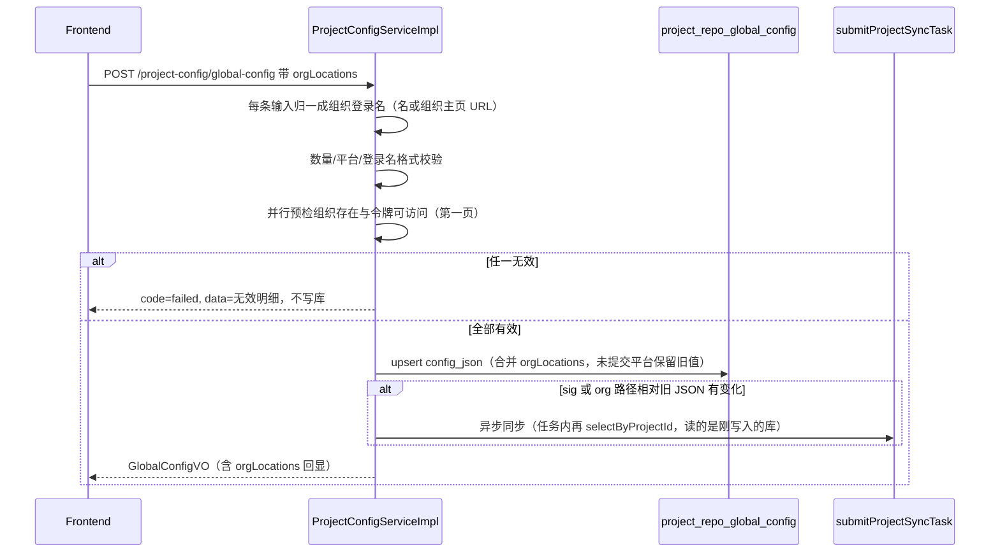
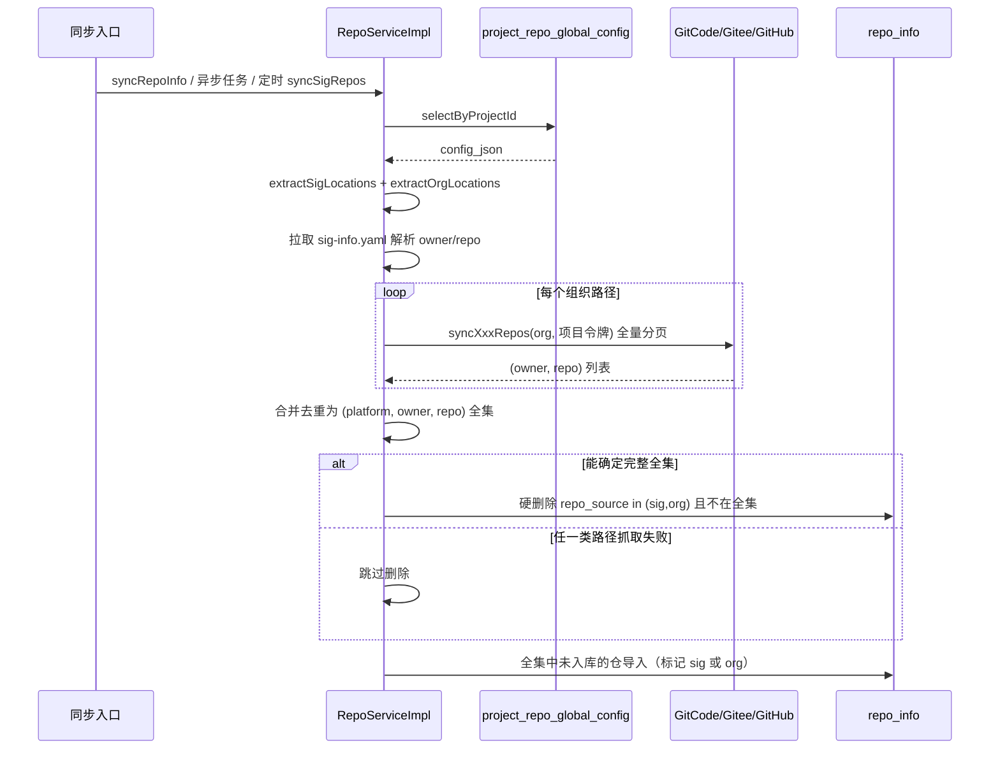

# 同步路径支持组织路径类型

## 背景

代码仓同步有两件不同的事：

1. **刷新已入库仓库**：`POST /sync-repo` 第一步读 `repo_info`，去平台更新已有仓的元数据与分支。不依赖全局配置。
2. **按规则发现该进/该出的仓库**：同一条同步链路的第二步读 `project_repo_global_config.config_json`，得到本项目的发现规则，再导入或硬删除。

当前 `config_json` 只有 `sigInfoLocations`。`syncSigRepos` 只解析该字段，组织枚举 API（`GitCode.syncGitcodeRepos` 等）已存在但未接到这条读配置的链路上。

---

# 1.方案设计

## 1.1 方案目标

在 `config_json` 增加与 SIG 并列的组织路径 `orgLocations`。
**写入**发生在全局配置保存。
**读取与执行**发生在所有「按配置发现仓库」的同步入口：每次执行都 `selectByProjectId`，同时解析 `sigInfoLocations` 与 `orgLocations`，枚举组织仓、与 SIG 结果合并为全集后导入/删除。

一次配置组织路径后，用户点同步、保存配置触发的异步同步、以及定时任务，都能按最新库内配置拉全量组织仓。页面与需求称「组织路径」；`config_json` 与平台 API 使用组织登录名。

## 1.2 涉及模块

- **写配置**：`ProjectConfigController` / `ProjectConfigServiceImpl` / `GlobalConfigUpdateDTO` / `GlobalConfigVO`
- **读配置并执行同步**：`RepoController.syncRepoInfo` / `RepoServiceImpl.runProjectSyncSteps` / `syncSigRepos`（扩展为同时读两类路径）/ `XxlJobHandler.syncRepoInfoHandler`
- **平台枚举（已有，只被同步读链路调用）**：`GitCode.syncGitcodeRepos` / `Gitee.syncGiteeRepos` / `Github.syncGithubRepos`

## 1.3 整体处理方式

```
全局配置  写：POST /project-config/global-config  → 路径归一成登录名 → 校验后写入 config_json.orgLocations
同步仓库  读：所有配置发现同步                    → selectByProjectId → 解析两类路径 → 枚举/解析 → 导入+删除
```

1. **写与读分离**：同步请求体不增加 `orgLocations`。`SyncRepoInfoDTO` 仍只有 `projectId`（及可选 `syncUser`）。
2. **读入口收敛到同一实现**：用户同步、配置变更后的异步任务、定时任务，最终都进入「读 `config_json` → 处理 SIG + 组织」；不在 Controller 里另写一套组织同步。
3. **两类路径平行存储**：`orgLocations` 与 `sigInfoLocations` 独立字段，不引入 type、不做历史 SIG 迁移。旧 JSON 无 `orgLocations` 视为空列表。
4. **入库只存组织登录名**：请求可填组织名或组织主页 URL（需求中的「组织路径」），保存时归一成登录名再写 `config_json`。同步只读登录名去调 `/orgs/{name}/repos`。
5. **仓库增加同步来源方式`repo_source=org`**，与 `sig` 区分，范围为「来源是 sig 或 org、手动录入」。

## 1.4 为什么采用该方案

- 与现有 SIG 模型一致：规则在表里，执行在同步里。组织路径只是第二种规则。
- 不改同步 API 契约，旧前端点同步即可吃到新配置。
- 定时任务无请求体，只能读表；若不把读表做成主路径，组织路径对夜间同步无效。

---

# 2.实现逻辑设计

## 2.1 具体操作

时间顺序：**先写全局配置，再同步读表执行。**

| 入口         | 代码                                                                                 | 对 config_json                                                                 | 本次改动                                                                       |
| ------------ | ------------------------------------------------------------------------------------ | ------------------------------------------------------------------------------ | ------------------------------------------------------------------------------ |
| 保存全局配置 | `POST /project-config/global-config` → `updateGlobalConfig`                          | **写** `orgLocations`；规则有变则异步同步（任务内再读已落库 JSON，不读请求体） | 校验/预检/合并写入；变更检测增加 `orgLocations`                                |
| 用户点同步   | `POST /sync-repo` → `syncRepoInfo` → `submitProjectSyncTask` → `runProjectSyncSteps` | **读**（步骤 2 中 `syncSigRepos`）                                             | 扩展读取 `orgLocations`；同步前无效组织回报与 SIG 对齐                         |
| 定时任务     | `XxlJobHandler` 直接调 `syncSigRepos`                                                | **读**                                                                         | 方法扩展后定时任务自动读组织路径，Job 类可不改调用点，注释改为「配置发现同步」 |

## 2.2 配置写入（先把组织名存进表）



保存接口**只写规则**，不是全量拉仓的执行器。预检只为避免把无效组织写入表。真正枚举与导入发生在 2.3（用户点同步、保存触发的异步任务、定时任务，都读库不读本次请求体）。

旧客户端不传 `orgLocations`：视为未修改该字段，保留库中旧值（与 SIG 未提交平台一致）。

### 组织路径输入归一（写入口）

需求配置项叫「组织路径」，平台枚举只要登录名。保存时把输入收成登录名再入库，**不存原始 URL**。GET 回显也是登录名。

| 输入（同一平台 key 下）                                                                       | 归一结果     | 处理                                                     |
| --------------------------------------------------------------------------------------------- | ------------ | -------------------------------------------------------- |
| `openlibing`                                                                                  | `openlibing` | 已是登录名                                               |
| `https://gitcode.com/openlibing`                                                              | `openlibing` | 组织主页                                                 |
| `https://gitcode.com/org/openlibing`、`.../org/openlibing/repos`                              | `openlibing` | GitCode 组织页                                           |
| `https://gitee.com/openEuler`                                                                 | `openEuler`  | Gitee 组织主页                                           |
| `https://github.com/apache`、`https://github.com/orgs/apache`、`.../orgs/apache/repositories` | `apache`     | GitHub 组织页                                            |
| `https://gitcode.com/openlibing/community` 或含 `blob`/`tree`/`raw`                           | —            | 拒绝：仓库/SIG 路径，避免误把 `{owner}` 当成要枚举的组织 |
| 域名与 map key 不一致（如 gitcode 键里贴 github URL）                                         | —            | 拒绝                                                     |
| 空串、含 `..`、归一后仍含 `/`                                                                 | —            | 拒绝                                                     |

规则：trim、去尾斜杠；URL 仅允许对应平台域名；GitCode 的 `org/{name}`、GitHub 的 `orgs/{name}` 视为包装段，取出 `{name}`；其余多于一段的路径一律拒绝。归一后登录名再走预检与现有字符约束。

解析放在后端写入口（`normalizeOrgLocation`），不依赖前端。同步读库只拿已归一的登录名；`extractOrgLocations` 对存量脏数据可再归一一次，解析失败计入无效路径。

## 2.3 同步读配置并执行



触发方不传组织名。`extractOrgLocations` 与现有 `extractSigLocations` 对称：从表实体解析，缺字段返回空列表。

### 用户点同步时的无效路径回报

`syncRepoInfo` 现有 `collectInvalidSigPaths`：读表校验 SIG URL，无效项放入返回 data，**不阻断**后续异步同步。

组织路径同样处理：新增 `collectInvalidOrgPaths`，读表后对每个组织拉枚举接口第一页（`per_page=1`）。无效项（组织不存在、令牌不可访问）与 SIG 无效项一并返回。异步任务仍执行，单条失败在执行期计入「抓取失败」以保护删除。

## 2.4 关键处理步骤（同步执行期内）

1. `selectByProjectId`，解析 `sigInfoLocations`、`orgLocations`（无键当空）。
2. SIG：保持现有 yaml 扫描与解析；失败计入 `failedLocations`。
3. 组织：对每个 `(platform, org)` 调 `enumerateOrgRepos`（分派 `syncGitcodeRepos` / `syncGiteeRepos` / `syncGithubRepos`），令牌用 `commonService` 项目级平台令牌。接口失败或返回不可信计入 `failedLocations`。成功则把 `(owner, repo)` 加入全集，并记 `resolvedLocations++`（**组织成功枚举必须计入**，否则仅配组织路径时现有「resolvedLocations==0 跳过导入」会把组织仓全部丢掉）。
4. 去重：同一 `(platform, owner, repo)` 只保留一次。同时出现在 SIG 与组织清单：导入时 `repo_source=sig`（SIG 更细）；删除以**合并全集**为准，不按来源各删各的。
5. `shouldDelete`：`(SIG 路径空且组织路径空) 或 failedLocations==0`。为真时，硬删除 `repo_source ∈ {sig, org}` 且 URL 不在全集的仓。为假则不删。
6. 导入：全集中 `repo_info` 尚无该 URL 的仓，按来源调用现有 `buildDefaultSigRepoDTO` + `addRepoInfo` / `importSigRepoByJob`。已存在则跳过并对账来源：SIG 清单中的 org→sig；`isMigrateToSig` 开启时还处理 manual→sig（在 SIG 清单）或 manual→org（仅在组织清单）。不把已是 sig 的仓改成 org。

手动录入（`repo_source=manual`）不在本次硬删除范围内。

---

# 3.类设计

## 3.1 配置写链路

| 类                         | 改动                                                                                                                                                                                                                                          |
| -------------------------- | --------------------------------------------------------------------------------------------------------------------------------------------------------------------------------------------------------------------------------------------- |
| `GlobalConfigUpdateDTO`    | 新增 `orgLocations: Map<String, List<String>>`（元素可为登录名或组织主页 URL）                                                                                                                                                                |
| `GlobalConfigVO`           | 新增 `orgLocations: Map<String, List<OrgLocationItem>>`，内部类含 `platform`、`org`（回显已归一登录名）                                                                                                                                       |
| `ProjectConfigServiceImpl` | `CONFIG_KEY_ORG_LOCATIONS`；`normalizeOrgLocation` 将名或组织主页 URL 收成登录名；保存校验与 `validateOrgPathsForSync` / `checkOrgPath`；`buildConfigJson` 只写入登录名；`getGlobalConfig` 回显登录名；`hasOrgConfigChanged` 按归一后的名比较 |
| `ProjectConfigController`  | 无改动，现有 GET/POST 透传新字段                                                                                                                                                                                                              |

## 3.2 同步读链路

| 类                                       | 改动                                                                                                                                                                                                                                                                                                   |
| ---------------------------------------- | ------------------------------------------------------------------------------------------------------------------------------------------------------------------------------------------------------------------------------------------------------------------------------------------------------ |
| `RepoServiceImpl`                        | 新增 `extractOrgLocations`；`syncSigRepos` 在现有 SIG 循环之外增加组织循环；新增 `enumerateOrgRepos`；`shouldDelete` / `resolvedLocations` 计入组织路径；删除条件改为 `repo_source in (sig, org)`；导入时写入 `repo_source`。方法名暂不改，避免牵动 Job 与测试，职责变为「按全局配置发现并对齐仓库」。 |
| `RepoServiceImpl.syncRepoInfo`           | `collectInvalidSigPaths` 之外增加 `collectInvalidOrgPaths`，均从 `selectByProjectId` 读表。                                                                                                                                                                                                            |
| `RepoServiceImpl.collectInvalidOrgPaths` | 新增。读 `orgLocations`，每条组织预检第一页。                                                                                                                                                                                                                                                          |
| `XxlJobHandler`                          | 调用点不变。注释由「SIG仓同步」改为「按全局配置发现同步（SIG + 组织）」。                                                                                                                                                                                                                              |

`RepoController` 无接口签名变更。`SyncRepoInfoDTO` 不增加组织字段。

## 3.3 不修改

- `GitCode` / `Gitee` / `Github`：复用现有组织枚举，同步侧调用即可。
- 表结构：无 DDL。

---

# 4.数据模型设计

## 4.1 数据库表

无表结构变更。只扩展 `config_json` 键。

## 4.2 config_json

```json
{
  "sigInfoLocations": {
    "gitcode": ["https://gitcode.com/{owner}/{repo}/blob/{branch}/{path}"],
    "gitee": [],
    "github": []
  },
  "orgLocations": {
    "gitcode": ["openlibing-org"],
    "gitee": [],
    "github": []
  },
  "roleMapping": {}
}
```

| 字段               | 说明                                                                  |
| ------------------ | --------------------------------------------------------------------- |
| `sigInfoLocations` | 现有 SIG URL，同步读                                                  |
| `orgLocations`     | 组织登录名（同步读）。请求可传组织主页 URL，保存时归一后入库；缺省=空 |
| `roleMapping`      | 现有角色映射，本次不改                                                |

## 4.3 Entity / DTO / VO

- `ProjectRepoGlobalConfigEntity`：无新列。
- `RepoInfoEntity.repoSource`：新增取值 `org`。
- 入参/回显仅全局配置 DTO/VO 增加 `orgLocations`。同步 DTO 不变。

---

# 5.性能设计

- 保存接口：只预检第一页（`per_page=1`），3 秒内返回。全量分页只在异步/定时同步里跑。
- 同步执行：组织枚举与 SIG 一样串行，避免打爆平台 API。单组织仓量可能达数百～数千，分页 `per_page=100`。
- 无新缓存、无新 SQL。删除复用 `hardDeleteSigReposInNewTransaction`。

---

# 6.API接口设计

## 6.1 更新全局配置（写配置）

- **URL**：`POST /project-config/global-config`
- **请求体**：现有字段 + `orgLocations`（每项可以是登录名或组织主页 URL）
- **校验**：先归一为登录名；各平台合计 ≤ 20；域名须与平台 key 一致；拒绝仓库/SIG URL；归一后非空、不含 `..` `/`；平台仅 gitcode/gitee/github；远端预检失败则不写库。
- **写库**：只存登录名。仅当 SIG 或组织路径相对旧 JSON（归一后）变化时触发 6.3 同一套异步同步（任务内读库，不读本次请求体副本）。
- **兼容性**：不传 `orgLocations` 保留旧值。

请求体示例（名与 URL 均可；入库皆为登录名）：

```json
{
  "projectId": 123,
  "sigInfoLocations": {
    "gitee": [],
    "github": [],
    "gitcode": [
      "https://gitcode.com/openlibing/community/tree/master/openLiBing/sigs/openLiBing",
      "https://gitcode.com/openlibing/community-private/blob/master/openLiBing-private/sigs/openLiBing-private"
    ]
  },
  "orgLocations": {
    "gitcode": ["https://gitcode.com/openlibing", "openlibing-org"],
    "gitee": [],
    "github": ["https://github.com/orgs/apache"]
  },
  "roleMapping": {},
  "commonAccounts": {}
}
```

上例写入后 `config_json.orgLocations.gitcode` 为 `["openlibing","openlibing-org"]`，`github` 为 `["apache"]`。

## 6.2 查询全局配置

- **URL**：`GET /project-config/global-config`
- **返回**：`GlobalConfigVO` 增加 `orgLocations`（按平台，每项 `platform` + `org`，`org` 为已归一的登录名）。

## 6.3 同步仓库（读配置）

- **URL**：`POST /sync-repo`
- **请求体**：`SyncRepoInfoDTO`（`projectId` 必填）。**不传** `orgLocations` / `sigInfoLocations`。
- **行为**：鉴权后读 `project_repo_global_config`，校验 SIG 与组织路径有效性（无效不阻断），再 `submitProjectSyncTask`。异步步骤 2 再次读表，按最新 `orgLocations` + `sigInfoLocations` 发现仓库。
- **返回**：成功文案「开始同步仓库信息」；若有无效 SIG/组织路径，`code=failed` 且 data 带明细（与现有 SIG 契约一致）。
- **兼容性**：旧调用方不改请求即可同步到新配的组织仓。

---

# 7.安全设计

- 鉴权：同步走现有 `/sync-repo` 项目权限；保存走现有全局配置权限。组织枚举用项目公共账号令牌，无新通道。
- 敏感信息：令牌日志掩码；VO 只回显组织名；失败日志只记组织名与状态码。
- 组织路径：写入口先归一再校验；拒绝空串、`..`、仓库/SIG URL、跨平台域名；归一后的登录名不含 `/`，防止拼进平台 URL 时路径穿越。
- 硬编码：平台 API 基址继续 `@Value`。
- 审计：保存记 `orgLocations` 变更；同步导入/硬删除记 `repoId` / `repoUrl` / `repo_source`。

---

# 附录

## A.1 名词解释

- **发现规则**：`config_json` 里告诉同步「还要进哪些仓」的配置，目前为 SIG URL + 组织名。
- **刷新已有仓**：同步步骤 1，只处理 `repo_info` 已有记录，不读发现规则。
- **配置发现同步**：同步步骤 2 / 定时 `syncSigRepos`，读发现规则后导入/删除。
- **组织路径**：需求配置项类型。输入可以是组织登录名或组织主页 URL；入库与同步使用登录名，调 `/orgs/{name}/repos`。
- **repo_source=org**：由组织路径导入的仓。

## A.2 关联代码定位

- 写表：`ProjectConfigServiceImpl.updateGlobalConfig`、`normalizeOrgLocation`、`buildConfigJson`
- 同步读表：`RepoServiceImpl.syncRepoInfo`、`runProjectSyncSteps`、`syncSigRepos`、`extractSigLocations`、`collectInvalidSigPaths`
- 定时读表：`XxlJobHandler.syncRepoInfoHandler` 第八步
- 平台枚举：`GitCode.syncGitcodeRepos`、`Gitee.syncGiteeRepos`、`Github.syncGithubRepos`

## A.3 YAGNI

- 新表：无。
- 新同步接口：无。
- 同步 DTO 新字段：无。
- 平台客户端新 API：无。
- 新缓存 / MQ：无。
- 方法强制重命名 `syncSigRepos`：不做，只扩展行为。
