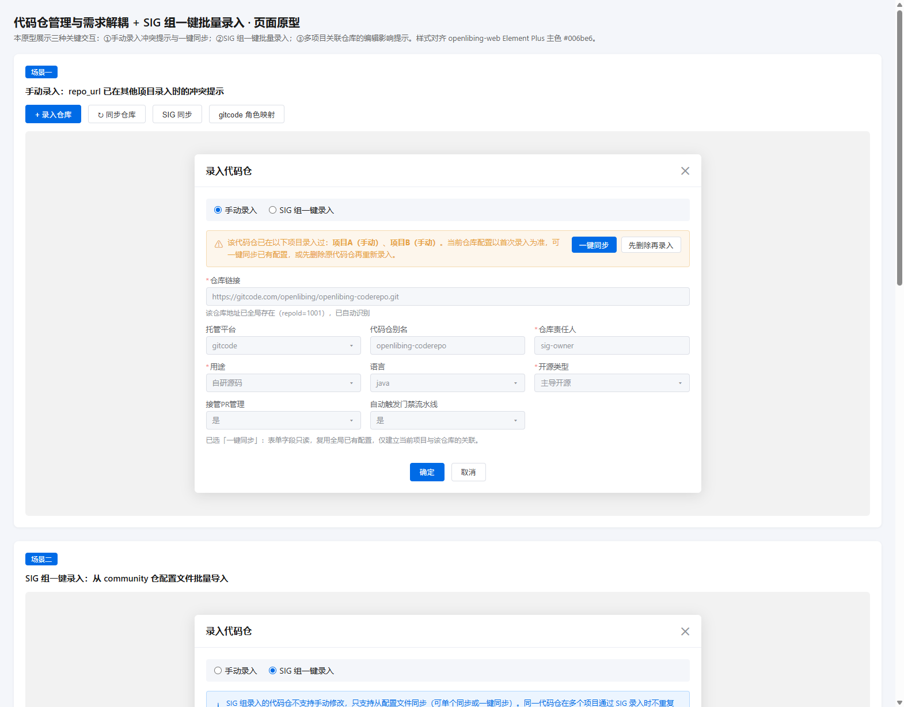

# 代码仓管理优化 + SIG 仓一键同步（特性规格设计）

> 配套文档：[requirement-design.md](./requirement-design.md)（需求设计文档：**方案唯一基线** / 实现逻辑 / 类 / 数据模型 / 性能 / API / 安全）。
>
> 本文为特性规格设计，覆盖业务背景、版本变化点、涉及页面、页面原型、业务逻辑与权限设计。各流程的实现细节（伪代码 / 事务 / 接口契约）以 requirement-design.md 为准，本文不重复展开。页面原型见 [demo.html](./demo.html)，截图见 [demo-screenshot.png](./demo-screenshot.png)。

## 1. 业务背景

### 1.1 现状

openLiBing 平台的代码仓管理当前采用「仓库信息与项目强耦合」模型：`repo_info` 表中 `repo_id`、`repo_url`、`project_id` 三字段同表，同一代码仓在不同项目下各自维护一条 `repo_info` 记录。前端 `Repos/index.vue` 的录入对话框只支持逐个手工录入。

### 1.2 痛点

| 痛点         | 说明                                                                                              | 影响                                                          |
| ------------ | ------------------------------------------------------------------------------------------------- | ------------------------------------------------------------- |
| 配置漂移     | 同一代码仓在 A 项目「接管 PR=是」、B 项目「接管 PR=否」，平台行为无法收敛                         | 门禁、webhook、自动触发等行为在不同项目下不一致，故障定位困难 |
| 重复录入     | 每个项目都要重新填一遍同一代码仓的全部配置                                                        | SIG 组维护的几十个仓库 × 多个项目，录入工作量成倍放大         |
| 缺批量录入   | SIG 组在 community / community-private 等仓维护 sig-info.yaml（固定格式），但平台只能逐个手工录入 | SIG 组仓库接入效率低，配置文件与平台数据双源不一致            |
| 跨项目不可见 | 用户在 B 项目录入时不知道该仓已在 A 项目录入过                                                    | 重复录入后两条记录配置漂移更严重                              |

### 1.3 目标

1. **规避配置不一致（模型不拆分，提示不覆盖 + 开关 OR 聚合）**：整体思路：尽量规避多项目下统一代码仓配置项不一致。经与 SCA 确认，其扫描按 `(project_id, repo_url)` 反查 `repo_info`、查不到即报错。因此 `repo_info` **保持「一项目一行、多行并存」现状模型**，每行 `project_id`=该行所属项目，repo_info 层面 7 个下游仓零改动：
   - **录入时**：检测到同 repo_url 已在其他项目录入 → 从**上次录入该代码仓的数据**中复制配置到表单（可修改）；提交时仅提示用户与之前某某项目中的配置不一致，**不做配置覆盖**（不修改其他项目行）。用户想修改之前项目配置或删除之前代码仓，按提示自己手动去改。
   - **编辑时**：检测到同 repo_url 跨项目配置不一致 → 仅做提示性告警让用户知道与其他项目下的配置不一致，**不自动覆盖**；用户确认后仅更新本行。
   - **开关类配置 OR 聚合**：下游使用该配置时先校验该 repo_url 是否存在重复录入，存在的话只要其中一个开关打开即认为开启，全关闭才关闭（**不修改用户在其他项目下的配置**，仅在读取时聚合判定）。
2. **SIG 仓一键同步（异步 + 分布式锁）**：全局配置窗口内的「一键同步」按钮，异步执行 + 分布式锁（防并发重复执行，不担心执行时间较长）：
   - **多路径配置**：用户可自由设置**多个** sig-info.yaml 路径；配置时不区分平台，后端根据 URL 域名统一区分平台；路径指向目录（如 `https://gitcode.com/openlibing/community-private/blob/master/openLiBing-private/sigs/openLiBing-private`），在该目录下找 sig-info.yaml 文件；**输入路径后即时调 `validate-sig-path` 接口校验**该路径是否存在、其下是否存在 sig-info.yaml 文件。
   - **默认参数自动填充**：代码仓别名默认取 repoUrl 中的 repo 名（项目内同名冲突改为 repo-platform，仍冲突加数字递增）；仓库责任人默认取代码托管平台上该代码仓的**创建人账号名**；用途默认取自研源码；开源类型默认取主导开源；默认分支从代码托管平台获取（**不可修改**，表单只读展示）；公共账号令牌默认取项目级公共账号令牌；所有开关除「是否参与运营」默认为是，其他开关均默认为否。
3. **SIG 与手动录入互不覆盖**：一键同步只针对尚未录入当前项目的仓库，不覆盖已有配置；SIG 来源仓库同样允许手动编辑（不做来源拦截）。
4. **历史收敛（分两阶段，归并推迟）**：下游 7 仓（codecheck/cicd/framework/anti-poison/sca/gateway/vulnerability）不归属本项目、改造进度不可控，存量同一 repo_url 多条记录（体检发现 **53 个共享仓**）**不在本需求归并**——Phase 1 仅清洗同项目重复行、加 `(repo_url, project_id)` 唯一索引；待 7 仓逐个可控后 Phase 2 再评估归并（见 requirement-design.md §2.5）。
5. **改造边界**：本次改造**仅涉及 `repo_info` 表**（新增 `is_participate_operation` 字段）与**新增 `project_repo_global_config` 全局配置表**（每项目一行；存量角色映射数据从 `project_gitcode_role_mapping` 迁移而来，迁移后旧表废弃）；代码仓相关配置表还包括 `codecheck` 下的 Mongo 表（如 `sig_rule_set` 规则集表），**本次不改动**——仍允许不同项目对同一代码仓在 codecheck 侧存在不同配置（规则集、告警抑制等项不在本次收敛范围）。

## 2. 版本变化点清单

> 各变化点的「为什么」见 requirement-design.md §1.4 关键决策汇总，本节仅列变化点本身。

| 序号 | 变化点                                                                                                                                                                         | 类型     | 说明                                                                                                                                                                                                                                                                                                                                                                                                                                                                                                                                                         |
| ---- | ------------------------------------------------------------------------------------------------------------------------------------------------------------------------------ | -------- | ------------------------------------------------------------------------------------------------------------------------------------------------------------------------------------------------------------------------------------------------------------------------------------------------------------------------------------------------------------------------------------------------------------------------------------------------------------------------------------------------------------------------------------------------------------ |
| 1    | `repo_info` 新增 `is_participate_operation` 字段                                                                                                                               | 数据模型 | 是否参与运营开关（默认是）                                                                                                                                                                                                                                                                                                                                                                                                                                                                                                                                   |
| 2    | Phase 1 新增 `(repo_url, project_id)` 唯一索引                                                                                                                                 | 数据模型 | 保证一项目一行；每行 `project_id`=该行所属项目，7 仓按现状读取                                                                                                                                                                                                                                                                                                                                                                                                                                                                                               |
| 3    | `/project-repo/add-repo` 增加「命中多行」分支                                                                                                                                  | 接口     | blur 检测命中其他项目已录入 → 表单**直接使用**上次录入配置（可修改）；提交前经 check-repo-url 比对配置不一致 → 仅提示、**不覆盖**其他项目行；写接口纯写入不做比对                                                                                                                                                                                                                                                                                                                                                                                            |
| 4    | `/project-repo/update-repo` 直接编辑 + 新增 `isParticipateOperation` 参数                                                                                                      | 接口     | 不做 SIG 来源拦截；**编辑本行保存时若该 repo_url 组内存在跨项目行且配置不一致 → 前端保存前弹窗提示性告警（不覆盖其他项目行），用户确认后仅更新本行**；无跨项目行或配置一致时直接更新本行；新增 `isParticipateOperation` 参数（是否参与运营）                                                                                                                                                                                                                                                                                                                 |
| 5    | 新增 `/project-repo/check-repo-url`                                                                                                                                            | 接口     | 同一接口两类调用：① 录入 blur 检测（返回上次录入配置副本 + 已关联项目列表）；② 保存前一致性比对（传 `formConfig`，编辑时另传 `repoId`；返回配置差异 `configDiff`）。写接口 add-repo / update-repo 不做比对，保持纯写入语义                                                                                                                                                                                                                                                                                                                                   |
| 6    | 新增全局配置接口（`/project-config/global-config` GET\|POST）                                                                                                                  | 接口     | 项目级全局配置：查询/更新（GET 回显 sigInfoLocations **按平台分组**（gitcode/gitee/github 外层 key）+ 仅 gitcode 的角色映射 + 项目公共账号掩码；POST 提交 sigInfoLocations **按平台分键 Map** + 角色映射 + **项目公共账号更新，账号实现层仍存现有 `project_common_account_info` 表**）；统一走 `/project-config` 后缀，由 ProjectConfigController 实现；**角色映射与公共账号均唯一写入口为 global-config**（现有 `/project-config/update-gitcode-role-mapping` 废弃，前端改调新接口）；POST 更新对 projectId 加分布式锁（防 config_json 读-改-写并发丢更新） |
| 7    | 新增 SIG 仓一键同步接口（`POST /project-config/sig-sync` + `GET /project-config/sig-sync/status`）                                                                             | 接口     | **异步执行 + 分布式锁**（锁 key `sig_sync:{projectId}`，防同一项目并发触发多次同步）；触发后立即返回任务 ID，前端轮询任务状态；由 ProjectConfigController 实现                                                                                                                                                                                                                                                                                                                                                                                               |
| 8    | **开关配置 OR 聚合（下游读取约定）**                                                                                                                                           | 后端     | 下游使用开关类配置时，先校验该 repo_url 是否存在重复录入，存在的话对多行开关取 **OR**（MAX：有一开启则开启，全关闭才关闭）；**不修改其他项目行**，仅在读取时聚合；**本期无下游调用方，`internal/aggregate-switch` 接口及配套聚合查询不落地**，开关 OR 聚合仅作为下游读取约定（见 requirement-design.md §0 修订记录 3）                                                                                                                                                                                                                                       |
| 9    | 手动录入：blur 自动检测 + 直接使用上次配置 + 提示不覆盖                                                                                                                        | 前端     | 命中时表单**直接使用**同步过来的上次录入配置（可修改）；提交前传 `formConfig` 调 check-repo-url 比对，`configDiff` 非空 → 弹窗提示（仅影响当前项目行，不修改其他项目配置）；默认分支从平台获取、只读展示（沿用现有仓库信息获取逻辑）；见页面原型场景二                                                                                                                                                                                                                                                                                                       |
| 10   | 编辑对话框：跨项目行配置不一致时提示性告警（不覆盖）                                                                                                                           | 前端     | 打开回显本行当前配置（**不预填其他项目数据**）；保存前传 `repoId` + `formConfig` 调 check-repo-url 比对，`configDiff` 非空 → 弹窗提示与其他项目配置不一致，用户确认后**仅更新本行**（不覆盖其他项目行）；不做 SIG 来源拦截；默认分支只读不可改；见页面原型场景三                                                                                                                                                                                                                                                                                             |
| 11   | 新增 `SigInfoClient` / `SigDefaultParamBuilder` 工具类                                                                                                                         | 后端     | 实时读 sig-info.yaml（多路径）、一键同步默认参数填充（实时调平台获取创建人账号名 + 默认分支 + 别名冲突处理）                                                                                                                                                                                                                                                                                                                                                                                                                                                 |
| 12   | **新增 `project_repo_global_config` 全局配置表**，从 `project_gitcode_role_mapping` 迁移数据（存量 role_mapping 迁入 `config_json[platform].roleMapping`，迁移完成后旧表废弃） | 数据模型 | 公共账号 / sig-info 路径 / 角色映射统一存新表 `config_json`（sigInfoLocations **按平台分键 Map** + 角色映射按平台分键）；**建表与数据迁移由 Liquibase 同一 changeset 定义，随实例启动原子执行（无「上线后-迁移前」读空空窗）**；**framework 删产品/项目级联清理改指新表（例外仓，建议与 coderepo 同迭代上线，见 requirement-design.md §4.2）**                                                                                                                                                                                                               |
| 13   | sig-info.yaml 实时读取（不落库不缓存）                                                                                                                                         | 后端     | sig-info.yaml 由各接口实时调对应平台读取解析，不落库不缓存                                                                                                                                                                                                                                                                                                                                                                                                                                                                                                   |
| 14   | 历史数据迁移 Phase 1（清洗 + 唯一索引）                                                                                                                                        | 数据     | 见 requirement-design.md §2.5；存量共享仓多行保留                                                                                                                                                                                                                                                                                                                                                                                                                                                                                                            |
| 15   | sig-info.yaml 路径配置（多路径，平台无关）+ **输入后即时校验**                                                                                                                 | 配置     | 「全局配置」弹窗「代码仓录入配置」区域配置多个路径（不区分平台），存 `project_repo_global_config.config_json.sigInfoLocations`；路径指向目录，在该目录下找 sig-info.yaml；后端根据 URL 域名统一区分平台；输入路径后（blur/防抖）调 `validate-sig-path` 即时校验路径存在性与 sig-info.yaml 文件                                                                                                                                                                                                                                                               |
| 16   | 新增「全局配置」按钮与三页签弹窗 + 一键同步按钮；原「gitcode 角色映射」「项目公共账号」按钮并入                                                                                | 前端     | 见页面原型场景一；一键同步按钮放在代码仓录入配置区域内（异步 + 分布式锁）；**同步任务状态在全局配置弹窗内展示**                                                                                                                                                                                                                                                                                                                                                                                                                                              |
| 17   | 新增 sig-info 路径校验接口（`POST /project-config/validate-sig-path`）                                                                                                         | 接口     | 用户输入/修改 sig-info 路径后即时校验：路径是否存在、其下是否存在 sig-info.yaml 文件；结果就地展示不阻断保存；由 ProjectConfigController 实现                                                                                                                                                                                                                                                                                                                                                                                                                |

## 3. 涉及页面清单

| 序号 | 页面                                                                             | 路径                       | 改动类型                                                                                                                       |
| ---- | -------------------------------------------------------------------------------- | -------------------------- | ------------------------------------------------------------------------------------------------------------------------------ |
| 1    | 代码仓管理列表页                                                                 | `Repos/index.vue`          | 录入/编辑交互改造                                                                                                              |
| 2    | 录入代码仓对话框                                                                 | index.vue 内联 `el-dialog` | 改造：手动录入自动检测（复制上次配置 + 提示不覆盖）；默认分支只读展示                                                          |
| 3    | 编辑代码仓对话框                                                                 | index.vue 内联 `el-dialog` | 改造：跨项目行配置不一致时保存前提示性告警（不覆盖其他项目行）；不做 SIG 来源拦截；默认分支只读展示                            |
| 4    | 全局配置对话框（三页签 + 代码仓录入配置区 + 路径校验 + 一键同步 + 任务状态展示） | index.vue 内联 `el-dialog` | 新增：项目公共账号 / 代码仓录入配置（sig-info.yaml 多路径 + 输入即时校验 + 一键同步按钮 + 同步任务状态展示）/ GitCode 角色映射 |

> 本次需求**不新增**独立页面，所有改动在现有「代码仓管理」页面内完成。

## 4. 页面原型设计

### 4.1 原型文件

- 可交互原型：[demo.html](./demo.html)（浏览器打开查看完整交互）
- 截图：[demo-screenshot.png](./demo-screenshot.png)

### 4.2 原型截图

### 4.3 原型说明

原型覆盖三个关键场景，详细交互以 demo.html 为准，本文仅说明要点。

**场景一：项目级「全局配置」（三页签弹窗 + 代码仓录入配置 + 路径即时校验 + 一键同步 + 任务状态展示）**

- 代码仓管理页「导出仓库」右侧新增「全局配置」按钮；原「gitcode 角色映射」「项目公共账号」按钮能力并入本弹窗
- 三页签 GitCode / Gitee / GitHub：
  - **项目公共账号**（三平台均支持，可直接配置）：登录名 + 令牌，令牌留空则不修改原值；**随 global-config 接口统一提交**（实现层仍存现有公共账号表）
  - **角色映射**（仅 GitCode 页签）：GitCode 角色 ↔ openLiBing 角色映射关系
- **代码仓录入配置**（独立区域，不限定在页签内）：
  - 维护**多个** sig-info.yaml 路径（按平台分组配置与提交，后端保存时校验每条 URL 域名与其所属平台键一致）；路径指向目录（如 `https://gitcode.com/openlibing/community-private/blob/master/openLiBing-private/sigs/openLiBing-private`），在该目录下找 sig-info.yaml 文件；**GET 回显与 POST 提交均按平台分组**（gitcode/gitee/github 外层 key，前端按平台分组提交 Map）
  - **路径即时校验**：输入/修改路径后（blur / 防抖）调 `validate-sig-path` 校验该路径是否存在、其下是否存在 sig-info.yaml 文件；校验结果（可用 / 路径不存在 / 文件不存在）就地展示，不阻断保存
  - **一键同步按钮**：触发异步同步任务（分布式锁防并发重复执行）；触发后立即返回任务 ID，前端轮询任务状态（RUNNING / SUCCESS / FAILED / PARTIAL），完成后展示 imported / failed 计数与失败原因
  - **同步任务状态展示**：任务状态卡片在**全局配置弹窗内**展示（代码仓录入配置区域下方）

**场景二：手动录入 - 自动检测与配置预填**

- `repoUrl` blur 后自动调检测接口（只传基础参数）：命中该仓库已在其他项目录入 → 蓝色提示条（列出已关联项目，表单**直接使用**上次录入配置，可修改）
- **默认分支只读展示**（沿用现有仓库信息获取逻辑，从代码托管平台获取，不可修改）
- 提交前传 `formConfig`（blur 返回 repoId 非 null 时一并传）再调检测接口比对：`configDiff` 非空 → 弹窗提示「与项目A、项目B 中的配置不一致，是否继续保存？（仅影响当前项目行，不修改其他项目配置）」；用户确认后调 add-repo 仅保存本行，**不覆盖其他项目行**

**场景三：编辑代码仓 - 跨项目行配置不一致时提示性告警（不覆盖）**

- 打开编辑时回显本行当前配置（**不预填其他项目数据**）、不做 SIG 来源拦截；保存前传 `repoId` + `formConfig` 调检测接口比对：**`configDiff` 非空 → 弹窗提示性告警，用户确认后仅更新本行（不覆盖其他项目行）**；无跨项目行或配置一致时直接调 update-repo 更新本行
- 用户可选择继续保存（仅本行生效）或取消去手动统一；**不自动覆盖其他项目行配置**——保留用户在各项目下的独立维护权
- **默认分支只读展示**（直接从代码托管平台获取，不可修改，不参与配置一致性比对）
- **开关类配置聚合规则提示**：告警中明示「开关类配置按"任一项目开启即生效"聚合（存在重复录入时，任一项目开启即视为开启，全关闭才关闭）」

## 5. 业务逻辑设计

> 各流程的实现细节（伪代码 / 事务 / 校验）见 requirement-design.md §2，本节仅给业务规则与交互要点。

### 5.1 手动录入

- 输入 `repoUrl` blur 调 `check-repo-url`（只传基础参数，详见 requirement-design.md §2.1）：
  - **全局首次录入**：新建本行，同步平台元数据 + 配置 webhook。
  - **已在其他项目录入**：表单**直接使用**上次录入该代码仓的配置（可修改）。提交时：
    - 当前项目已有本行 → 更新本行配置。
    - 当前项目无本行 → 新建本行（配置=用户修改后的表单值）。
    - **提交前传 `formConfig`（blur 返回 repoId 非 null 时一并传）再调 `check-repo-url` 比对**，`configDiff` 非空 → 弹窗提示「与项目A、项目B 中的配置不一致，是否继续保存？（仅影响当前项目行，不修改其他项目配置）」；用户确认后调 `add-repo` 仅保存本行，**不覆盖其他项目行**（写接口纯写入不做比对）。
- **不做来源拒绝**（任何仓库均可录入关联到当前项目）。
- **用户想修改之前项目中的配置或删除之前的代码仓**：按提示自己手动去改（切换到对应项目操作）。

### 5.2 SIG 仓一键同步（异步 + 分布式锁）

- **路径配置**：全局配置弹窗「代码仓录入配置」区域维护**多个** sig-info.yaml 路径（不区分平台），存 `project_repo_global_config.config_json.sigInfoLocations`；**输入路径后即时调 `validate-sig-path` 校验**路径存在性与 sig-info.yaml 文件（详见 requirement-design.md §2.2.1 / §6.5）。
- **一键同步（异步 + 分布式锁）**：全局配置窗口内「一键同步」按钮触发（详见 requirement-design.md §2.2.3）：
  - 触发后立即返回任务 ID（**异步执行 + 分布式锁** `sig_sync:{projectId}`，防同一项目并发触发多次同步；不担心执行时间较长）。
  - 从所有配置路径拉取 sig-info.yaml 并解析仓库清单（跨路径合并去重；后端根据 URL 域名区分平台）。
  - 仅同步**尚未录入当前项目**的仓库（已录入的不覆盖）；全局已存在仓库同步时**复制上次录入配置、不覆盖**。
  - **默认参数自动填充**（详见 requirement-design.md §2.2.4）：代码仓别名默认取 repoUrl 中的 repo 名（项目内同名冲突改为 repo-platform，仍冲突加数字递增）；仓库责任人默认取代码托管平台上该代码仓的**创建人账号名**；用途默认取自研源码；开源类型默认取主导开源；默认分支从代码托管平台获取（**不可修改**，表单只读展示）；公共账号令牌默认取项目级公共账号令牌；所有开关除「是否参与运营」默认为是，其他开关均默认为否。
  - 前端轮询任务状态（`GET /project-config/sig-sync/status`），完成后展示 imported / failed 计数与失败原因；**任务状态在全局配置弹窗内展示**。
- SIG 来源仓库**允许手动编辑**（不做来源拦截）。

### 5.3 编辑

- 打开编辑时回显本行当前配置（**不预填其他项目数据**）、**不做 SIG 来源拦截**（详见 requirement-design.md §2.3）。
- **保存前传 `repoId` + `formConfig` 调 `check-repo-url` 比对：`configDiff` 非空（该 repo_url 组内存在跨项目行且配置不一致）→ 弹窗提示性告警，用户确认后调 `update-repo` 仅更新本行（不覆盖其他项目行）**；`configDiff` 为空（无跨项目行或配置一致）时直接调 `update-repo` 更新本行（写接口纯写入不做比对）。
- **不自动覆盖其他项目行配置**——保留用户在各项目下的独立维护权，通过提示让用户感知差异；用户想统一配置可按提示手动去改。
- 告警字段范围=行内全部**可编辑**配置字段（别名、仓库令牌、责任人、开源类型、各开关等；**默认分支不参与比对**——直接从代码托管平台获取、不可修改；不含行级元数据字段）；不涉及 codecheck 侧规则集（`sig_rule_set` 等）与其他子表。
- **开关类配置聚合规则提示**：告警中明示「开关类配置按"任一项目开启即生效"聚合（存在重复录入时，任一项目开启即视为开启，全关闭才关闭）」。

### 5.4 开关配置 OR 聚合（下游读取）

- **规则**：下游使用开关类配置（接管 PR / 自动触发门禁 / 自动触发接口扫描 / 代码风格自动修复 / 告警抑制自动检视 / 是否参与运营）时，先校验该 repo_url 是否存在重复录入（同 repo_url 多行），存在的话对多行开关取 **OR**（MAX：有一开启则开启，全关闭才关闭）；**不修改用户在其他项目下的配置**，仅在读取时聚合判定（详见 requirement-design.md §2.4）。
- **实现**：本期**无下游调用方**，`POST /project-repo/internal/aggregate-switch` 内部接口及配套聚合查询**不落地**，开关 OR 聚合仅作为下游读取约定（见 requirement-design.md §0 修订记录 3）；若下游后续产生需求，由 coderepo 在提供数据时统一按 `repo_url` 聚合（MAX）。**本期下游 7 仓零改动**。
- **非开关类配置**（如责任人、默认分支、别名等）不聚合——各项目行独立维护。

### 5.5 历史存量收敛（Phase 1 清洗，归并推迟）

- **背景**：存量体检发现 **53 个共享仓**（同 repo_url 多项目多行、配置可能不同）。归并需重映射其他仓子表 FK（如 sca `tbl_scan.repo_id`），而 7 个下游仓不归属本项目、不可控 → **归并推迟到 Phase 2**。
- **Phase 1（本期上线时执行，幂等可重跑）**：清洗同项目重复行 → 加 `(repo_url, project_id)` 唯一索引；存量共享仓多行保留 → 7 个下游仓零影响。
- **Phase 2（远期，7 仓逐个可控后）**：再评估存量共享仓归并。
- 迁移脚本与校验详见 requirement-design.md §2.5。

### 5.6 查询功能

- 列表按 `project_id` 查 `repo_info`（现状不变，多行模型下每项目看到自己那行）。
- 现有筛选/排序/分页逻辑不变。

## 6. 权限设计

### 6.1 角色清单

> 角色清单基于 openLiBing 现有角色体系，本需求不新增角色。`角色owner` 列表示该角色的维护/归属主体。

| 序号 | 角色名称     | 角色类型 | 角色 owner     |
| ---- | ------------ | -------- | -------------- |
| 1    | 系统管理员   | 平台级   | 平台运营委员会 |
| 2    | 平台运维人员 | 平台级   | 平台运营委员会 |
| 3    | 产品CMC主任  | 组织级   | 产品CMC        |
| 4    | 产业管理者   | 组织级   | 产业管理办公室 |
| 5    | 项目审批人员 | 项目级   | 项目PMO        |
| 6    | 流水线工程师 | 项目级   | 项目PMO        |
| 7    | 项目CMC主任  | 项目级   | 项目CMC        |
| 8    | 项目管理员   | 项目级   | 项目PMO        |
| 9    | 项目成员     | 项目级   | 项目PMO        |
| 10   | 代码合并者   | 仓库级   | 仓库负责人     |
| 11   | 代码开发者   | 仓库级   | 仓库负责人     |
| 12   | 仓库负责人   | 仓库级   | 项目PMO        |
| 13   | 仓库观察者   | 仓库级   | 仓库负责人     |
| 14   | 仓库创建者   | 仓库级   | 仓库负责人     |

> SIG 组 sig-info.yaml 维护者不在平台角色体系内，其权限通过 sig-info.yaml 所在仓（community / community-private 等）的 gitcode 仓库权限管理（SIG 组成员可编辑对应仓路径下的 `sig-info.yaml`），与平台角色解耦。

### 6.2 SOD 设计

> SOD（Separation of Duties）设计聚焦于"职责分离"防单点滥用与误操作。

| 序号 | SOD 场景                       | 规则组          | 角色名称                                              | 维度类型 | 维度值                                                     |
| ---- | ------------------------------ | --------------- | ----------------------------------------------------- | -------- | ---------------------------------------------------------- |
| 1    | 仓库录入与删除审批分离         | 录入-审批互斥   | 项目管理员                                            | 操作     | 录入仓库                                                   |
| 1    | 仓库录入与删除审批分离         | 录入-审批互斥   | 项目审批人员                                          | 操作     | 审批删除代码平台仓库                                       |
| 2    | SIG 配置文件维护与平台录入分离 | 配置-录入互斥   | SIG 组 sig-info.yaml 维护者（所在仓 gitcode 权限）    | 资源     | 维护 sig-info.yaml 文件内容                                |
| 2    | SIG 配置文件维护与平台录入分离 | 配置-录入互斥   | 项目管理员 / 流水线工程师 / 产业管理者 / 项目审批人员 | 操作     | 配置 sig-info.yaml 路径（多路径）+ 一键同步                |
| 3    | 仓库删除与平台仓库删除分离     | 删行-平台删分离 | 项目管理员                                            | 操作     | 删除本行（解除该项目下该代码仓）                           |
| 3    | 仓库删除与平台仓库删除分离     | 删行-平台删分离 | 项目审批人员                                          | 操作     | 审批删除代码平台仓库（删 repo + 平台仓库）                 |
| 4    | 跨项目仓库访问隔离             | 项目数据隔离    | 任意角色                                              | 资源     | 仅可访问所属 project 的行（`repo_info.project_id`=该项目） |

**SOD 规则说明**：

- **规则组 1（录入-审批互斥）**：项目管理员可录入仓库，但删除代码平台仓库必须由项目审批人员审批，录入人无法自行审批自己的删除申请。
- **规则组 2（配置-录入互斥）**：SIG 组在 sig-info.yaml 所在仓维护文件，平台使用者只能配置路径、读取其内容一键同步，不能在平台内修改配置文件内容。配置文件变更通过所在仓 gitcode 仓的 PR 流程，与平台录入操作物理隔离。
- **规则组 3（删行-平台删分离）**：删除本行（解除该项目下该代码仓）由项目管理员操作；物理删除代码平台仓库需项目审批人员审批（审批能力独立排期）。
- **规则组 4（项目数据隔离）**：所有仓库查询/录入/同步接口均校验 userId 对 projectId 的访问权限，防跨项目越权（多行模型下每行 `project_id`=该行所属项目，越权校验语义与现状一致）。

### 6.3 权限矩阵

> 权限矩阵基于 `接口权限配置.xlsx` 中 `/openlibing-coderepo/project-repo/*` 接口的现有角色配置，并新增 SIG 一键同步等接口的权限。
>
> 一级菜单：代码仓管理；二级菜单：仓库管理。读权限=可调用查询类接口；写权限=可调用录入/修改/删除/同步类接口。
>
> ✅=有权限，—=无权限。

| 一级菜单   | 二级菜单 | 三级菜单                   | 功能                                                                     | 角色         | 读权限 | 写权限 |
| ---------- | -------- | -------------------------- | ------------------------------------------------------------------------ | ------------ | ------ | ------ |
| 代码仓管理 | 仓库管理 | 查询仓库信息               | 查询项目下仓库列表、详情、分支                                           | 系统管理员   | ✅     | —      |
| 代码仓管理 | 仓库管理 | 查询仓库信息               | 同上                                                                     | 平台运维人员 | ✅     | —      |
| 代码仓管理 | 仓库管理 | 查询仓库信息               | 同上                                                                     | 产品CMC主任  | ✅     | —      |
| 代码仓管理 | 仓库管理 | 查询仓库信息               | 同上                                                                     | 产业管理者   | ✅     | ✅     |
| 代码仓管理 | 仓库管理 | 查询仓库信息               | 同上                                                                     | 项目审批人员 | ✅     | ✅     |
| 代码仓管理 | 仓库管理 | 查询仓库信息               | 同上                                                                     | 流水线工程师 | ✅     | ✅     |
| 代码仓管理 | 仓库管理 | 查询仓库信息               | 同上                                                                     | 项目CMC主任  | ✅     | —      |
| 代码仓管理 | 仓库管理 | 查询仓库信息               | 同上                                                                     | 项目管理员   | ✅     | ✅     |
| 代码仓管理 | 仓库管理 | 查询仓库信息               | 同上                                                                     | 项目成员     | ✅     | —      |
| 代码仓管理 | 仓库管理 | 查询仓库信息               | 同上                                                                     | 代码合并者   | ✅     | —      |
| 代码仓管理 | 仓库管理 | 查询仓库信息               | 同上                                                                     | 代码开发者   | ✅     | —      |
| 代码仓管理 | 仓库管理 | 查询仓库信息               | 同上                                                                     | 仓库负责人   | ✅     | —      |
| 代码仓管理 | 仓库管理 | 查询仓库信息               | 同上                                                                     | 仓库观察者   | ✅     | —      |
| 代码仓管理 | 仓库管理 | 查询仓库信息               | 同上                                                                     | 仓库创建者   | ✅     | —      |
| 代码仓管理 | 仓库管理 | 录入仓库                   | 手动录入仓库（命中多行时复制上次配置、提示不覆盖）                       | 平台运维人员 | ✅     | ✅     |
| 代码仓管理 | 仓库管理 | 录入仓库                   | 同上                                                                     | 产业管理者   | ✅     | ✅     |
| 代码仓管理 | 仓库管理 | 录入仓库                   | 同上                                                                     | 项目审批人员 | ✅     | ✅     |
| 代码仓管理 | 仓库管理 | 录入仓库                   | 同上                                                                     | 流水线工程师 | ✅     | ✅     |
| 代码仓管理 | 仓库管理 | 录入仓库                   | 同上                                                                     | 项目管理员   | ✅     | ✅     |
| 代码仓管理 | 仓库管理 | 修改仓库信息               | 编辑仓库配置（跨项目行配置不一致时提示性告警不覆盖；SIG 来源同样可编辑） | 产业管理者   | ✅     | ✅     |
| 代码仓管理 | 仓库管理 | 修改仓库信息               | 同上                                                                     | 项目审批人员 | ✅     | ✅     |
| 代码仓管理 | 仓库管理 | 修改仓库信息               | 同上                                                                     | 流水线工程师 | ✅     | ✅     |
| 代码仓管理 | 仓库管理 | 修改仓库信息               | 同上                                                                     | 项目管理员   | ✅     | ✅     |
| 代码仓管理 | 仓库管理 | 删除仓库信息               | 删除仓库                                                                 | 产业管理者   | ✅     | ✅     |
| 代码仓管理 | 仓库管理 | 删除仓库信息               | 同上                                                                     | 项目审批人员 | ✅     | ✅     |
| 代码仓管理 | 仓库管理 | 删除仓库信息               | 同上                                                                     | 流水线工程师 | ✅     | ✅     |
| 代码仓管理 | 仓库管理 | 删除仓库信息               | 同上                                                                     | 项目管理员   | ✅     | ✅     |
| 代码仓管理 | 仓库管理 | 同步仓库信息               | 从平台同步仓库元数据                                                     | 平台运维人员 | ✅     | ✅     |
| 代码仓管理 | 仓库管理 | 同步仓库信息               | 同上                                                                     | 产业管理者   | ✅     | ✅     |
| 代码仓管理 | 仓库管理 | 同步仓库信息               | 同上                                                                     | 项目审批人员 | ✅     | ✅     |
| 代码仓管理 | 仓库管理 | 同步仓库信息               | 同上                                                                     | 流水线工程师 | ✅     | ✅     |
| 代码仓管理 | 仓库管理 | 同步仓库信息               | 同上                                                                     | 项目管理员   | ✅     | ✅     |
| 代码仓管理 | 仓库管理 | **全局配置**（新增）       | 查询/更新项目级全局配置（公共账号 / sig-info 路径 / 角色映射）           | 产业管理者   | ✅     | ✅     |
| 代码仓管理 | 仓库管理 | **全局配置**（新增）       | 同上                                                                     | 项目审批人员 | ✅     | ✅     |
| 代码仓管理 | 仓库管理 | **全局配置**（新增）       | 同上                                                                     | 流水线工程师 | ✅     | ✅     |
| 代码仓管理 | 仓库管理 | **全局配置**（新增）       | 同上                                                                     | 项目管理员   | ✅     | ✅     |
| 代码仓管理 | 仓库管理 | **SIG 仓一键同步**（新增） | 触发一键同步（异步 + 分布式锁）/ 查询同步任务状态                        | 产业管理者   | ✅     | ✅     |
| 代码仓管理 | 仓库管理 | **SIG 仓一键同步**（新增） | 同上                                                                     | 项目审批人员 | ✅     | ✅     |
| 代码仓管理 | 仓库管理 | **SIG 仓一键同步**（新增） | 同上                                                                     | 流水线工程师 | ✅     | ✅     |
| 代码仓管理 | 仓库管理 | **SIG 仓一键同步**（新增） | 同上                                                                     | 项目管理员   | ✅     | ✅     |

### 6.4 权限设计说明

1. **新增接口对齐现有写角色**：SIG 仓一键同步与全局配置的写权限角色集合与现有 `/project-repo/add-repo`、`/update-repo` 完全一致（产业管理者、项目审批人员、流水线工程师、项目管理员），不引入新角色。
2. **读权限对齐查询仓库信息**：一键同步任务状态查询属于查询类，对所有可查询仓库的角色开放。
3. **SIG 配置文件维护不在平台权限矩阵内**：配置文件在 sig-info.yaml 所在仓维护，其权限由 gitcode 仓库权限管理，平台只读（仅能配置路径并读取其内容）。这是 SOD 规则组 2 的核心——配置与录入物理隔离。
4. **跨项目隔离**：所有接口在 Service 层校验 userId 对 projectId 的访问权限（沿用现有项目成员校验逻辑），权限矩阵中的角色权限仅在「用户属于该项目」时生效。多行模型下每行 `project_id`=该行所属项目，越权校验语义与现状一致。
5. **SIG 与手动录入互不覆盖**：一键同步只针对尚未录入当前项目的仓库、复制上次录入配置不覆盖；SIG 来源仓库允许手动编辑。这些约束在 Service 层实现（非角色权限），对所有角色生效。

## 7. 验收标准

| 序号 | 验收项                                                                                                                                                                                                                                                                                      | 验收方式                                                        |
| ---- | ------------------------------------------------------------------------------------------------------------------------------------------------------------------------------------------------------------------------------------------------------------------------------------------- | --------------------------------------------------------------- |
| 1    | **Phase 1** 迁移完成：同项目重复行已清洗；`(repo_url, project_id)` 唯一索引生效；7 个下游仓按 `(project_id, repo_url)` 反查全部命中                                                                                                                                                         | 迁移脚本校验输出 + DB 查询 + SCA 联调用例                       |
| 2    | 手动录入输入已存在 repo_url 后 blur 自动检测（只传基础参数），表单**直接使用**上次录入配置（可修改）；**默认分支只读展示**（沿用现有仓库信息获取逻辑，不可修改）；提交前传 `formConfig` 调 check-repo-url 比对，`configDiff` 非空 → 弹窗提示（仅影响当前项目行，不修改其他项目配置）        | UI + 接口验证（check-repo-url）                                 |
| 3    | 手动录入提交后当前项目可见该仓库；**同 repo_url 其他项目行配置不变（DB 验证不覆盖）**                                                                                                                                                                                                       | UI + DB 验证                                                    |
| 4    | 全局配置可保存/查询：GET 回显 sig-info.yaml 路径**按平台分组**（gitcode/gitee/github 外层 key）+ 三平台页签配置项目公共账号（GitCode 另含角色映射）；POST 提交 `sigInfoLocations` **按平台分键 Map**（`{gitcode:[...],gitee:[...],github:[...]}`），后端校验每条路径域名与平台键一致        | UI 操作 + DB 验证 `project_repo_global_config.config_json` 记录 |
| 4a   | **sig-info 路径即时校验**：输入路径后（blur）调 `validate-sig-path`；路径存在且 sig-info.yaml 存在 → 显示「可用」；路径不存在 / 文件缺失 → 就地显示对应错误；校验不阻断保存                                                                                                                 | UI + 接口验证（validate-sig-path）                              |
| 4b   | **SIG 仓一键同步（异步 + 分布式锁）**：触发后立即返回任务 ID；同一项目并发触发仅执行一次（第二个请求提示「已在执行中」）；**任务状态在全局配置弹窗内展示**；完成后展示 imported / failed 计数与失败原因                                                                                     | UI + 接口验证（sig-sync / sig-sync/status）                     |
| 5    | 一键同步默认参数：代码仓别名默认取 repo 名（项目内同名冲突改为 repo-platform，仍冲突加数字递增）；仓库责任人=代码托管平台创建人账号名；用途=自研源码；开源类型=主导开源；默认分支=从平台获取（不可修改）；公共账号令牌=项目级公共账号令牌；**所有开关除「是否参与运营」=是，其他开关均=否** | UI + DB 验证                                                    |
| 6    | 一键同步不会覆盖已有配置：已录入当前项目的仓库不同步（跳过）；全局已存在仓库同步后其配置不变（新行复制上次录入配置）                                                                                                                                                                        | 接口 + DB 验证                                                  |
| 7    | SIG 一键同步的仓库同样允许手动编辑，调 update-repo 成功（不做来源拦截，含 `isParticipateOperation` 参数）                                                                                                                                                                                   | UI + 接口验证                                                   |
| 8    | 编辑多项目已录入仓库：打开回显本行配置（不预填其他项目数据）；保存前传 `repoId` + `formConfig` 调 check-repo-url 比对，存在跨项目行且配置不一致时弹窗提示性告警（含开关聚合规则说明），用户确认后**仅更新本行**（其他项目行配置不变）；无跨项目行或配置一致时直接更新本行                   | UI + 接口 + DB 验证                                             |
| 9    | **开关配置 OR 聚合（下游读取约定）**：本期无下游调用方，`internal/aggregate-switch` 接口不落地；约定为同 repo_url 多行中任一行开关开启 → 聚合判定为该开关开启，全部关闭才是关闭，**存储值不变（不修改其他项目行）**                                                                         | 约定记录 + DB 验证（若无实现则以文档核对）                      |
| 10   | accessToken 不出现在日志与 URL 参数                                                                                                                                                                                                                                                         | 安全验收（见 requirement-design.md §7.9）                       |
| 11   | 跨项目访问仓库接口返回 403                                                                                                                                                                                                                                                                  | 接口验证                                                        |

## 8. 风险与回滚

| 风险                                                   | 影响                       | 缓解措施                                                                                                                                                                            |
| ------------------------------------------------------ | -------------------------- | ----------------------------------------------------------------------------------------------------------------------------------------------------------------------------------- |
| 数据迁移失败导致 repo_info 数据丢失                    | 仓库管理功能不可用         | 迁移前全量备份；迁移脚本幂等可重跑；灰度开关 `coderepo.repo-decouple.enabled` 可快速回退旧逻辑                                                                                      |
| 存量 53 个共享仓多行配置不一致未收敛                   | 各项目行配置可能长期不一致 | 录入新行默认复制上次录入配置避免重复手填；编辑/录入时提示性告警让用户感知差异；**开关类配置 OR 聚合保证下游行为判定正确**；用户按提示手动统一；归并推迟到 Phase 2（7 仓逐个可控后） |
| 一键同步异步任务执行时间较长                           | 用户等待期间无法感知进度   | 异步 + 任务状态查询接口（前端轮询展示 RUNNING/SUCCESS/FAILED/PARTIAL 与计数）；分布式锁防并发重复执行                                                                               |
| 分布式锁死锁（任务异常未释放锁）                       | 后续同步任务无法触发       | 锁设超时（如 5 分钟）自动释放；任务 finally 块确保释放锁                                                                                                                            |
| sig-info.yaml 格式错误（缺 `repositories` / 结构不符） | 该路径 SIG 同步失败        | YAML 解析用 SafeConstructor；解析失败明确报错并跳过该路径，不影响其他路径与手动录入通道                                                                                             |
| gitcode API 限流 / 网络波动                            | SIG 清单/详情获取慢或失败  | 实时读取设置超时（如 3s/路径、5s/仓库）；读取失败的仓库记入 failed 列表并继续处理其余仓库                                                                                           |
| 路径仓文件被删除 / 仓库不可访问                        | 该路径 SIG 清单无数据      | 输入路径时即时调 `validate-sig-path` 校验文件可用性（结果就地展示）；同步时文件不存在/不可达记入失败明细，用户可在全局配置中编辑路径                                                |

## 9. 配套文档

- [requirement-design.md](./requirement-design.md) — 需求设计文档（方案 / 实现逻辑 / 类 / 数据模型 / 性能 / API / 安全）
- [demo.html](./demo.html) — 页面原型（可交互）
- [demo-screenshot.png](./demo-screenshot.png) — 页面原型截图
- [frontend-api.md](./frontend-api.md) — 前端接口文档（供前端开发使用）
