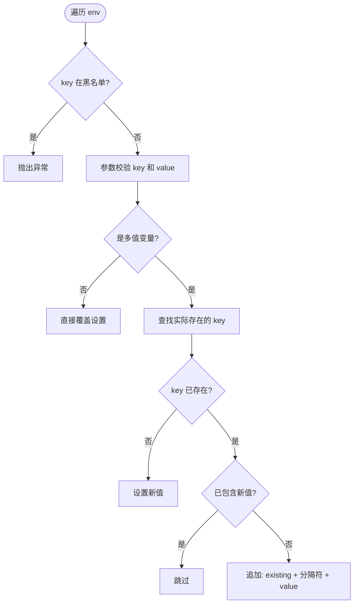

# Spec: command-injection-component

> Capability ID: `command-injection-component`
> Version: 1.1.0
> Status: Active

## Overview

提供安全的命令执行组件，防止命令注入攻击，支持跨平台（Windows/Linux）命令执行。

---

## Architecture

### 核心组件

```
SecureCmdExecutor (单例)
├── CmdValidator (参数校验)
├── ProcessInfo (进程管理)
├── ProcessResult (结果封装，线程安全)
└── StreamGobbler (流消费)
```

### 防御层级

1. **L1 命令白名单** - 只允许预定义的命令模板
2. **L2 参数黑名单** - 拦截危险字符和模式
3. **L3 执行沙箱** - 超时控制、输出限制、环境变量管控、工作目录校验

---

## Security Specifications

### 命令白名单机制

```java
// 注册白名单
executor.register(List.of("git log --oneline -n %s", "echo %s"));

// 执行命令（模板必须在白名单中）
executor.execute(30, TimeUnit.SECONDS, "git log --oneline -n %s", "10");

// 监控白名单容量
int size = SecureCmdExecutor.getWhiteListSize();
```

**约束**：

- 命令模板必须精确匹配白名单
- 参数通过 `%s` 占位符注入
- 未注册的命令模板会被拒绝
- 白名单最大容量 100 条，可通过 `getWhiteListSize()` 监控

### 参数黑名单校验

**拦截的危险字符**：

| 类别             | 字符             | 风险                            |
| ---------------- | ---------------- | ------------------------------- |
| Shell 元字符     | `;`, `           | `, `&`, `$`, `` ` ``            | 命令注入 |
| 重定向           | `<`, `>`         | 文件读写                        |
| 路径遍历         | `..`, `/`, `\`   | 目录穿越                        |
| 特殊字符         | `\n`, `\r`, `\t` | 命令截断                        |
| 通配符           | `[`, `]`         | 字符类展开                      |
| Shell 注释       | `#`              | 命令截断                        |
| Home 展开        | `~`              | 路径泄露                        |
| 引号             | `'`, `"`         | 绕过校验                        |
| Windows 变量展开 | `%`              | 环境变量展开攻击（如 `%PATH%`） |
| Flag 注入        | 以 `-` 开头      | 参数注入                        |

**校验流程**：

1. Unicode NFKC 归一化
2. 正则匹配危险字符
3. 支持自定义扩展黑名单

### 环境变量管控

**黑名单环境变量**（禁止修改）：

- `LD_PRELOAD` - 动态链接库预加载
- `BASH_ENV` - Bash 环境脚本
- `ENV` - 环境脚本
- `IFS` - 内部字段分隔符
- `PS1` - Shell 提示符
- `PROMPT_COMMAND` - 提示符命令
- `SHELLOPTS` - Shell 选项

**多值环境变量处理**：

- `PATH`, `CLASSPATH`, `LD_LIBRARY_PATH` 等多值变量采用**追加**策略
- 使用 `File.pathSeparator` 分隔（Windows: `;`, Linux: `:`）
- 按 pathSeparator 拆分后精确匹配，避免子串误判
- Windows 环境变量 key 大小写不敏感处理（通过 `findEnvKey()` 辅助方法）

**环境变量处理流程**：



### 工作目录验证

**验证规则**：

1. 目录必须存在
2. 禁止根目录（`/`, `C:\`）
3. 禁止敏感系统目录：
   - Linux: `/etc`, `/proc`, `/sys`, `/dev`, `/boot`, `/root`
   - Windows: `C:\Windows\System32`, `C:\Windows`, `C:\Program Files`

**实现细节**：

- 使用 `getCanonicalPath()` 解析符号链接
- Windows 路径大小写不敏感比较
- 验证子进程实际工作目录（通过 `pwd`/`cd` 命令）

### 输出限制

**ProcessResult 输出限制**：

- 最大收集行数：100,000 行（`MAX_LINES`）
- 超过限制后标记 `truncated = true`，停止收集
- 防止大输出导致 OOM（DoS 防护）

### 线程安全

**ProcessResult 线程安全**：

- 使用 `ReentrantReadWriteLock` 实现读写分离
- 写操作（`accept`）使用写锁独占访问
- 读操作（`toString`）使用读锁支持并发读取
- 支持异步场景下边运行边读取输出

**StreamGobbler 线程模型**：

- 非守护线程（non-daemon），确保消费完成后 JVM 才退出
- 调用方必须通过 `waitFor()` 或 `ensureDestroyed()` 管理生命周期

### 进程销毁

**优雅销毁流程**：

1. 发送 SIGTERM（`process.destroy()`）
2. 等待宽限期（默认 1 秒，可通过 `setGracePeriodSeconds()` 配置）
3. 超时未退出则发送 SIGKILL（`process.destroyForcibly()`）
4. 等待 StreamGobbler 消费线程完成（最多 10 秒）
5. 超时后中断线程并记录警告日志

---

## API Specifications

### SecureCmdExecutor

#### 单例和配置

```java
// 获取单例
SecureCmdExecutor executor = SecureCmdExecutor.getInstance();

// 注册白名单
executor.register(List<String> whiteVector);

// 获取白名单大小（监控容量）
int size = SecureCmdExecutor.getWhiteListSize();

// 配置优雅销毁宽限期（秒）
SecureCmdExecutor.setGracePeriodSeconds(long seconds);
```

#### 同步执行

```java
// 固定命令
ProcessInfo execute(long timeout, TimeUnit unit, String command)

// 带参数命令
ProcessInfo execute(long timeout, TimeUnit unit, String command, Object... params)

// 带环境变量
ProcessInfo execute(Map<String, String> env, long timeout, TimeUnit unit, String command)

// 带工作目录
ProcessInfo execute(File dir, long timeout, TimeUnit unit, String command, Object... params)

// 扩展黑名单
ProcessInfo execute(List<String> extendBlock, long timeout, TimeUnit unit, String command, Object... params)
```

#### stdin 输入执行

```java
// 基础 stdin 输入（isVerified 控制是否校验输入）
ProcessInfo execute(List<String> inputs, String command, boolean isVerified)

// 带环境变量
ProcessInfo execute(Map<String, String> env, List<String> inputs, String command, boolean isVerified)

// 带工作目录
ProcessInfo execute(File dir, List<String> inputs, String command, boolean isVerified)

// 带环境变量和工作目录
ProcessInfo execute(Map<String, String> env, File dir, List<String> inputs, String command, boolean isVerified)

// 带超时
ProcessInfo execute(List<String> inputs, long timeout, TimeUnit unit, String command, boolean isVerified)
```

**安全警告**：`isVerified` 设为 `false` 将跳过所有参数的黑名单校验，仅当 inputs 完全由内部可信数据构成时才可使用。

#### 数组形式执行

```java
// 带超时
ProcessInfo execute(long timeout, TimeUnit unit, String[] commands)
```

#### 异步执行

```java
// 基础异步
ProcessInfo asyncExec(String command)
ProcessInfo asyncExec(String command, Object... params)

// 带环境变量和工作目录
ProcessInfo asyncExec(Map<String, String> env, File dir, String command)
ProcessInfo asyncExec(Map<String, String> env, File dir, String command, Object... params)

// 数组形式
ProcessInfo asyncExec(String[] commands)
ProcessInfo asyncExec(Map<String, String> env, File dir, String[] commands)
```

**注意**：异步执行无超时控制，调用方有责任通过 `ensureDestroyed()` 管理进程生命周期。

#### 管道执行

```java
// 基础管道
ProcessInfo pipesExec(long timeout, TimeUnit unit, String command, Object... params)

// 带环境变量和工作目录
ProcessInfo pipesExec(Map<String, String> env, File dir, long timeout, TimeUnit unit, String command, Object... params)
```

**安全提示**：管道执行经过 shell 解释，风险高于直接执行，请确保参数来源可信。

### ProcessInfo

```java
// 等待进程完成
boolean waitFor(long timeout, TimeUnit unit)
ProcessInfo waitFor()

// 获取结果
int exitValue()
int exitValue(int defaultExitValue)
ProcessResult getStdout()
ProcessResult getStderr()

// 进程状态
boolean isAlive()
boolean isTimeout()
Process getProcess()
String getCommandLine()

// 强制销毁
void ensureDestroyed(long gracePeriod, TimeUnit unit)
```

### ProcessResult

```java
// 接收输出（Consumer<String> 接口）
void accept(String line)

// 获取完整输出
String toString()

// 输出是否被截断
boolean isTruncated()
```

---

## Cross-Platform Support

### Windows 特殊处理

1. **环境变量大小写**：
   - Windows 环境变量 key 大小写不敏感（`PATH` = `Path` = `path`）
   - 使用 `findEnvKey()` 辅助方法进行大小写不敏感查找
   - 追加多值变量时使用实际存储的 key 名称

2. **工作目录验证**：
   - 使用 `getCanonicalPath()` 统一路径格式
   - 大小写不敏感比较（`equalsIgnoreCase`）
   - 验证命令：`cmd /c cd`

3. **管道执行**：
   - 使用 `cmd /c` 替代 `/bin/sh -c`
   - 命令格式：`cmd /c "command1 | command2"`

### Linux 特殊处理

1. **管道执行**：
   - 使用 `/bin/sh -c` 执行管道命令
   - 支持标准 Shell 语法

2. **工作目录验证**：
   - 验证命令：`pwd`
   - 标准路径比较

---

## Test Specifications

### 测试覆盖

| 测试类                | 测试数 | 覆盖场景                                                       |
| --------------------- | ------ | -------------------------------------------------------------- |
| SecureCmdExecutorTest | 50     | 白名单、黑名单、环境变量、工作目录、超时、管道、异步、脚本执行 |
| CmdValidatorTest      | 29     | 参数校验、Unicode 归一化、扩展黑名单                           |
| ProcessInfoTest       | 18     | 进程生命周期、超时、销毁、流消费                               |

**总计**：97 个测试，100% 通过率

### 跨平台测试

所有测试用例支持 Windows 和 Linux：

- 使用 `IS_WINDOWS` 常量判断平台
- 命令模板：`cmd /c echo` (Windows) / `echo` (Linux)
- 工作目录验证：`cmd /c cd` (Windows) / `pwd` (Linux)

### 关键测试场景

1. **命令注入防护**：
   - Shell 元字符拦截
   - 路径遍历防护
   - 命令链接防护
   - Windows 环境变量展开防护

2. **环境变量安全**：
   - 黑名单环境变量拦截
   - 多值变量追加（非覆盖）
   - Windows 大小写不敏感处理
   - 精确匹配避免子串误判

3. **工作目录验证**：
   - 目录存在性检查
   - 敏感目录拦截
   - 子进程实际工作目录验证

4. **进程生命周期**：
   - 超时控制
   - 优雅销毁（SIGTERM → SIGKILL）
   - 流消费线程管理
   - 线程超时中断

5. **脚本执行**：
   - 脚本文件执行
   - 多行脚本 stdin 执行
   - 脚本路径安全检查

---

## Known Issues

### 已修复问题

| 级别     | 问题                                             | 影响                       | 状态                        |
| -------- | ------------------------------------------------ | -------------------------- | --------------------------- |
| ~~严重~~ | ~~C1: L3 最终命令二次校验~~                      | ~~误拦截所有带参数命令~~   | ✓ 已移除（设计决策）        |
| ~~严重~~ | ~~C2: `%` 字符未在黑名单~~                       | ~~Windows 变量展开风险~~   | ✓ 已修复 (61cf953)          |
| ~~严重~~ | ~~C3: `writeParams` 静默吞 IOException~~         | ~~stdin 写入失败无感知~~   | ✓ 已修复 (61cf953)          |
| ~~严重~~ | ~~C4: `ProcessResult` 线程安全性~~               | ~~asyncExec 并发读写风险~~ | ✓ 已修复 (61cf953)          |
| ~~重要~~ | ~~I1: `isVerified=false` 绕过校验无警告~~        | ~~安全风险~~               | ✓ 已修复 (9fe5a7e)          |
| ~~重要~~ | ~~I2: 无输出大小限制~~                           | ~~DoS 风险~~               | ✓ 已修复 (9fe5a7e)          |
| ~~重要~~ | ~~I3: StreamGobbler Javadoc 不符~~               | ~~文档误导~~               | ✓ 已修复 (9fe5a7e)          |
| ~~重要~~ | ~~I6: 宽限期硬编码~~                             | ~~不够灵活~~               | ✓ 已修复 (9fe5a7e)          |
| ~~重要~~ | ~~I7: `waitForThreads` 超时后静默放弃线程~~      | ~~线程泄漏~~               | ✓ 已修复 (9fe5a7e)          |
| ~~重要~~ | ~~I8: 环境变量 key 大小写问题~~                  | ~~Windows 覆盖而非追加~~   | ✓ 已修复 (4b08767)          |
| ~~重要~~ | ~~I9: 多值环境变量 `contains()` 子串匹配不精确~~ | ~~可能误判~~               | ✓ 已修复 (9fe5a7e)          |
| ~~次要~~ | ~~M1: ProcessResult 丢弃空行~~                   | ~~输出还原有损~~           | ✓ 已修复 (9fe5a7e)          |
| ~~次要~~ | ~~M2: `toString()` 用 `char` 拼接~~              | ~~部分版本行为不一致~~     | ✓ 已修复 (9fe5a7e)          |
| ~~次要~~ | ~~M3: 测试用反射清理白名单~~                     | ~~脆弱~~                   | ✓ 已修复 (9fe5a7e)          |
| ~~次要~~ | ~~M5: 公共 API 缺少 null 检查~~                  | ~~NPE 风险~~               | ✓ 已修复 (9fe5a7e)          |
| ~~次要~~ | ~~M8: `getMessage()` 重复前缀~~                  | ~~嵌套异常重复拼接~~       | ✓ 已修复 (9fe5a7e)          |
| ~~次要~~ | ~~M9: `GRACE_PERIOD_SECONDS` 命名不一致~~        | ~~命名不规范~~             | ✓ 已修复 (9fe5a7e)          |
| ~~重要~~ | ~~I4: `validateDir` 不阻止子目录~~               | ~~/etc/ssh 可通过~~        | ✓ 已修复 (57d56ea, c4b8468) |
| ~~重要~~ | ~~I5: `extendBlock` ReDoS 风险~~                 | ~~恶意正则攻击~~           | ✓ 已修复 (efa4e09)          |

### 待处理问题

无待处理问题。

### 不修复问题

| 级别 | 问题                                               | 原因                         |
| ---- | -------------------------------------------------- | ---------------------------- |
| 次要 | M4: `register()` synchronized 在实例上             | 单例模式下无问题，不值得修改 |
| 次要 | M6: `CommandLine.parse()` 依赖 Apache Commons Exec | 第三方依赖，边界情况可接受   |

---

## Implementation Summary

### 已完成功能

| 功能                              | 状态 | 提交             |
| --------------------------------- | ---- | ---------------- |
| 基础命令执行组件                  | ✓    | c03b791          |
| 命令白名单机制                    | ✓    | c03b791          |
| 参数黑名单校验                    | ✓    | c03b791          |
| 进程生命周期管理                  | ✓    | c03b791          |
| 环境变量管控                      | ✓    | c03b791          |
| 工作目录验证                      | ✓    | c03b791          |
| 跨平台支持                        | ✓    | 5473ebb          |
| 管道命令支持                      | ✓    | 5473ebb          |
| 敏感目录拦截                      | ✓    | 5473ebb          |
| 环境变量追加逻辑                  | ✓    | 45885b6          |
| Windows 大小写处理                | ✓    | 4b08767          |
| 工作目录验证改进                  | ✓    | 105b79e          |
| 废弃 API 清理                     | ✓    | beb3026          |
| asyncExec(String[])               | ✓    | 3c753e6          |
| 脚本执行测试                      | ✓    | 794e182          |
| 导入顺序优化                      | ✓    | 7c5296e          |
| **严重安全问题修复 (C2, C3, C4)** | ✓    | **61cf953**      |
| **重要和次要问题批量修复**        | ✓    | **9fe5a7e**      |
| API 清理（移除测试专用方法）      | ✓    | d423f8b          |
| 环境变量逻辑简化                  | ✓    | f022083          |
| 敏感目录子目录拦截 (I4)           | ✓    | 57d56ea, c4b8468 |
| 扩展黑名单 ReDoS 防护 (I5)        | ✓    | efa4e09          |

### 测试覆盖

- **总测试数**: 99
- **通过率**: 100%
- **跨平台**: Windows + Linux

### 代码质量

- **Checkstyle**: 通过
- **SpotBugs**: 通过
- **PMD**: 通过
- **Spotless**: 通过

---

## Security Fixes

### C2: Windows 环境变量展开防护 (61cf953)

**问题**：黑名单正则未包含 `%` 字符，Windows `cmd /c` 会展开 `%VAR%` 为环境变量值，存在安全风险。

**修复**：

- 在 `CmdValidatorConstants.REGEX` 中添加 `%` 字符
- 正则表达式：`(^-.*)|[\\\\<>|`&$;!(){}\\[\\]#~'\"\\s%]`
- 更新 Javadoc 文档说明

**影响**：

- 防止攻击者通过 `%PATH%`、`%USERPROFILE%` 等方式泄露敏感环境变量
- 防止通过展开长路径导致命令截断或溢出
- 误杀场景（如 URL 编码 `%20`）可通过 `extendBlock` 灵活处理

### C3: stdin 写入失败显式通知 (61cf953)

**问题**：`writeParams()` 方法静默吞掉 `IOException`，仅记录日志，调用方无法感知写入失败，可能导致子进程挂起。

**修复**：

- 移除 try-catch 块，让 `IOException` 向上传播
- 方法签名添加 `throws IOException`
- 更新 Javadoc 文档说明异常契约

**影响**：

- 调用方能及时感知写入失败并采取行动（终止进程、重试等）
- 避免子进程因等待 stdin 输入而永久挂起
- 符合 Java 异常处理最佳实践

### C4: ProcessResult 线程安全 (61cf953)

**问题**：`ProcessResult` 使用普通 `ArrayList`，异步场景下 `StreamGobbler` 线程写入和主线程读取存在并发风险。

**修复**：

- 使用 `ReentrantReadWriteLock + ArrayList` 替代普通 ArrayList
- 写操作（`accept`）使用写锁独占访问
- 读操作（`toString`）使用读锁支持并发读取
- 更新 Javadoc 文档说明线程安全性

**影响**：

- 支持异步场景下边运行边读取输出（实时日志查看）
- 读写分离，性能优于 `synchronizedList` 和 `CopyOnWriteArrayList`
- 符合现代 Java 并发编程最佳实践

### I2: 输出大小限制 (9fe5a7e)

**问题**：`ProcessResult` 无界收集输出，大输出命令可能导致 OOM。

**修复**：

- 添加 `MAX_LINES = 100,000` 常量
- 超过限制后标记 `truncated = true`，停止收集
- 提供 `isTruncated()` 方法查询截断状态

**影响**：

- 防止 DoS 攻击（恶意命令输出 GB 级数据）
- 调用方可检测输出是否被截断

### I7: 线程超时中断 (9fe5a7e)

**问题**：`waitForThreads()` 超时后静默放弃线程，导致线程泄漏。

**修复**：

- 超时后记录 `warn` 级别日志
- 调用 `interrupt()` 中断线程
- 释放线程引用帮助 GC 回收

**影响**：

- 避免线程泄漏
- 提供可观测性（日志记录）
- 符合 Java 并发编程最佳实践

---

## Usage Examples

### 基础用法

```java
SecureCmdExecutor executor = SecureCmdExecutor.getInstance();

// 注册白名单
executor.register(List.of("git log --oneline -n %s", "echo %s"));

// 执行命令
ProcessInfo result = executor.execute(30, TimeUnit.SECONDS, "git log --oneline -n %s", "10");
System.out.println(result.getStdout().toString());

// 检查输出是否被截断
if (result.getStdout().isTruncated()) {
    System.err.println("输出被截断，可能不完整");
}
```

### 带环境变量

```java
Map<String, String> env = new HashMap<>();
env.put("GIT_AUTHOR_NAME", "OpenCode");
env.put("PATH", "/custom/path");  // 会追加到现有 PATH

ProcessInfo result = executor.execute(env, 30, TimeUnit.SECONDS, "git log --oneline -n %s", "10");
```

### 带工作目录

```java
File workDir = new File("/path/to/repo");
ProcessInfo result = executor.execute(workDir, 30, TimeUnit.SECONDS, "git log --oneline -n %s", "10");
```

### 管道执行

```java
ProcessInfo result = executor.pipesExec(30, TimeUnit.SECONDS,
    "cat %s | grep %s | wc -l", "file.txt", "error");
```

### 异步执行

```java
ProcessInfo result = executor.asyncExec("long-running-command");
// 做其他事情
result.waitFor(60, TimeUnit.SECONDS);

// 或者手动销毁
result.ensureDestroyed(5, TimeUnit.SECONDS);
```

### 监控白名单容量

```java
int size = SecureCmdExecutor.getWhiteListSize();
int capacity = 100;  // MAX_WHITELIST
double usage = (double) size / capacity * 100;

if (usage > 80) {
    System.err.println("白名单容量使用率超过 80%");
}
```

### 配置优雅销毁宽限期

```java
// 设置宽限期为 5 秒（默认 1 秒）
SecureCmdExecutor.setGracePeriodSeconds(5);
```

---

## Constraints

1. **命令模板必须预注册**：未注册的命令模板会被拒绝
2. **参数必须通过占位符注入**：直接拼接参数会被拦截
3. **敏感环境变量禁止修改**：黑名单环境变量会被拒绝
4. **工作目录必须安全**：敏感目录会被拒绝
5. **超时控制必须设置**：同步执行必须指定超时时间
6. **异步执行需管理生命周期**：调用方有责任销毁进程
7. **stdin 输入需谨慎**：`isVerified=false` 仅限可信数据

---

## Validation Criteria

### 安全验证

```bash
# 命令注入测试
mvn test -Dtest=SecureCmdExecutorTest#testExecute_*Blacklist*

# 环境变量安全测试
mvn test -Dtest=SecureCmdExecutorTest#testExecute_BlockedEnvKey

# 工作目录安全测试
mvn test -Dtest=SecureCmdExecutorTest#testExecute_WorkingDir*

# Windows 环境变量展开测试
mvn test -Dtest=SecureCmdExecutorTest#testExecute_WindowsEnvExpansion
```

### 功能验证

```bash
# 全量测试
mvn test -Dtest=SecureCmdExecutorTest,CmdValidatorTest,ProcessInfoTest

# 代码质量检查
mvn verify
```

### 跨平台验证

```bash
# Windows
mvn test -Dtest=SecureCmdExecutorTest

# Linux
mvn test -Dtest=SecureCmdExecutorTest
```

---

## References

- Issue: https://gitcode.com/openlibing/openlibing-framework/issues/84
- Branch: `LYP_2608_iter1_command_injection_cbb`
- Commits: 22 commits (c03b791 ~ f022083)

### 关键提交

- `c03b791` - 基础组件实现
- `5473ebb` - 跨平台支持
- `45885b6` - 环境变量追加逻辑
- `4b08767` - Windows 大小写处理
- `105b79e` - 工作目录验证改进
- `beb3026` - 废弃 API 清理
- `3c753e6` - asyncExec(String[]) 支持
- `794e182` - 脚本执行测试
- `7c5296e` - 导入顺序优化
- `61cf953` - **严重安全问题修复 (C2, C3, C4)**
- `9fe5a7e` - **重要和次要问题批量修复 (I1-I9, M1-M9)**
- `d423f8b` - API 清理（移除测试专用方法）
- `f022083` - 环境变量逻辑简化
