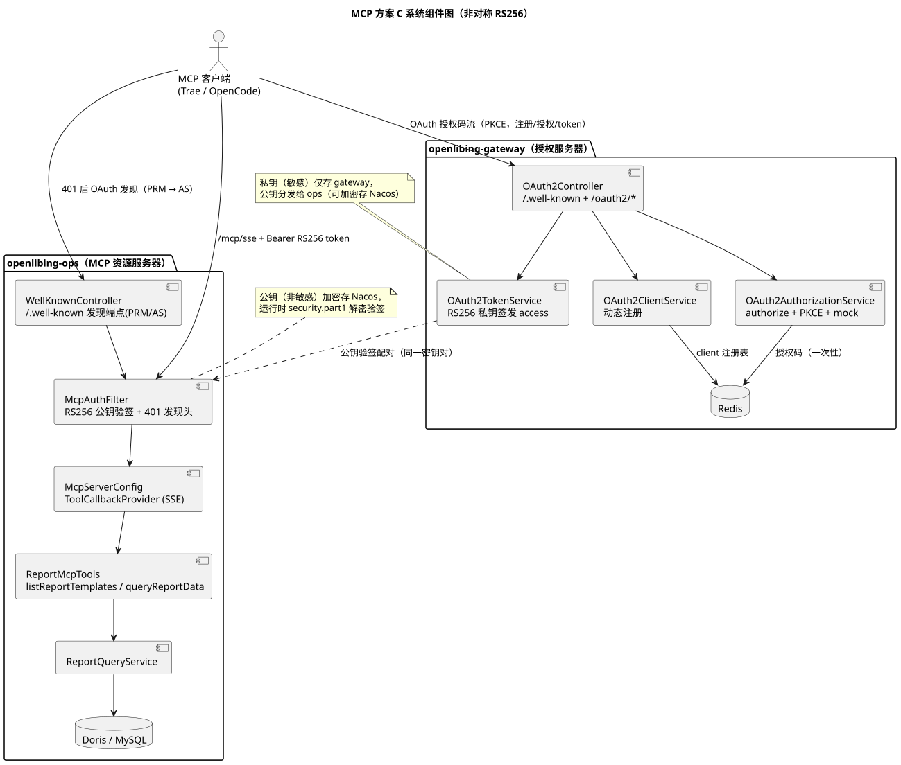
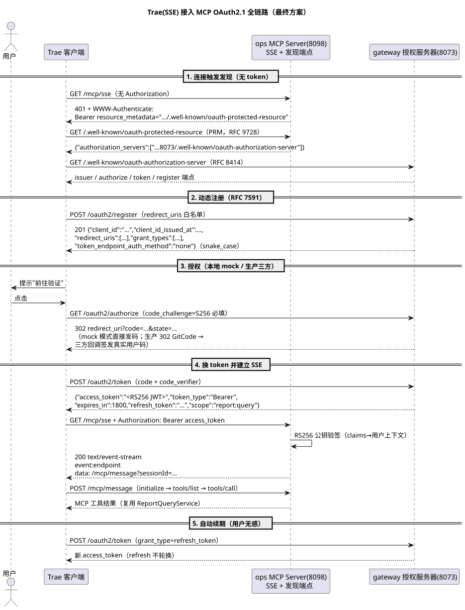
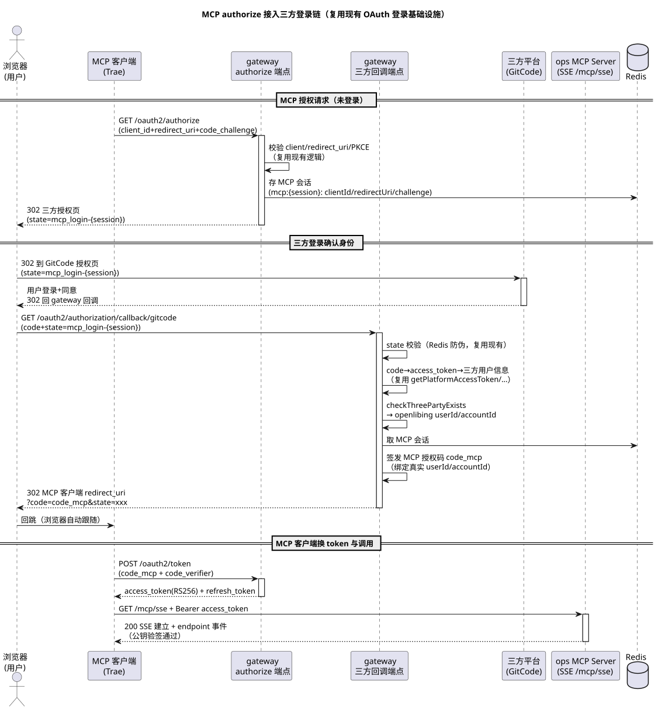

# MCP 鉴权方案 C 实现现状与分工总结（供网关团队决策）

- 版本：v1.2（2026-09-16）
- 阅读对象：**网关团队（最终决策方）** + ops 团队 + 联调用户
- 关联：`test-report-store-consume/design.md` 8.2.3、`MCP鉴权方案-gateway责任对齐.md`、`MCP方案C开发上下文-beta.md`
- 目的：汇总**当前已落地实现**的方案 C（gateway 提供 OAuth 协议层 + ops 做 MCP 资源服务器），明确**网关团队需完成/确认部分**、**ops 已完成部分**、**用户使用配置（Trae 示例）**，供网关团队最终拍板是否按此实现。

---

## 1. 方案总览（当前实现 = 方案 C）

| 侧 | 职责 | 状态 |
| --- | --- | --- |
| **gateway** | OAuth 2.1 协议层：动态注册 / 授权 / 发 token；RS256 私钥签发 access token | 已实现（ops 团队代实现，待网关团队确认/接管） |
| **ops** | MCP 资源服务器：`/mcp` 端点 + RS256 公钥验签 + 用户上下文 | 已实现并本地闭环验证通过 |
| **MCP 客户端（Trae 等）** | 标准 OAuth 授权码流（PKCE）接入，首次授权后自动续期 | 已用 Trae 端侧联调打通 |

### 1.1 为什么选非对称（RS256）

- **对称 HMAC**：签发与验签共用同一份密钥，ops 必须持有与 gateway 相同的明文密钥（或各自加密体系各存一份），泄露面大、分发难。
- **非对称 RSA**：gateway 持私钥签发（敏感，只存签发端），ops 持公钥验签（**非敏感，可加密分发**）——符合最小权限，ops 无需共享任何机密。

### 1.2 系统组件架构（方案 C）



- **gateway（授权服务器）**：OAuth2Controller 4 端点 + 动态注册 + PKCE authorize + RS256 签发（私钥仅存 gateway）
- **ops（MCP 资源服务器）**：McpAuthFilter 公钥验签 + 401 发现头 + ReportMcpTools（复用 ReportQueryService 查 Doris/MySQL）
- 公私钥同属一个密钥对，ops 公钥加密存 Nacos，运行时解密验签

### 1.3 鉴权流程（一次授权，长期无感）——最终版（SSE + OAuth 发现链路，Trae 实测打通）



```
① Trae 连 GET /mcp/sse（无 token）→ 401 + WWW-Authenticate: Bearer resource_metadata="…/.well-known/oauth-protected-resource"
② 发现链路：PRM（RFC 9728，含 authorization_servers）→ AS 元数据（RFC 8414，authorize/token/register 端点）
③ 动态注册（RFC 7591）→ 响应 {client_id, …}（snake_case，Trae 按规范解析）
④ authorize（PKCE S256 强制）→ 302 code（本地 mock 直接发码；生产走三方登录回调）
⑤ token 端点 → {access_token(RS256 私钥签名), refresh_token, …}（snake_case）
⑥ /mcp/sse + Bearer access_token → ops 公钥验签 → SSE 长连接建立 → initialize/tools/list/call
⑦ access 过期 → 客户端自动用 refresh 续期（用户无感，refresh 不轮换）
```

---

## 2. gateway 侧：已实现内容 + 需网关团队完成/确认项

### 2.1 已实现的协议层端点（ops 团队代写，位于 openlibing-gateway）

| 端点 | 功能 | 关键实现 |
| --- | --- | --- |
| `GET /.well-known/oauth-authorization-server` | 授权服务器元数据（RFC 8414，路径固定） | issuer/authorize/token/register 端点声明 |
| `POST /oauth2/register` | 动态客户端注册（RFC 7591） | redirect_uri 白名单校验（回环允许 http，其余必须 https）、client_id 随机、Redis 存储（TTL 180 天） |
| `GET /oauth2/authorize` | 授权端点（PKCE 强制） | S256 校验、授权码一次性（取后即删防重放）；**本地验证阶段为 mock 用户模式** |
| `POST /oauth2/token` | 授权码换 token / refresh 续期 | access = **RS256 私钥签名**（`mcp.oauth.signing.private-key`）；refresh 复用现有 refreshJwtSecret，**不轮换**（沿用现状，风险已告知） |

关键代码：
- `common/config/oauth2/OAuth2Config.java`：配置项（issuer / TTL / mock 用户 / 签名私钥）
- `business/controller/OAuth2Controller.java`：4 个端点
- `business/service/impl/OAuth2ClientServiceImpl.java`：动态注册
- `business/service/impl/OAuth2AuthorizationServiceImpl.java`：authorize + PKCE + mock
- `business/service/impl/OAuth2TokenServiceImpl.java`：RS256 签发 / refresh

#### 2.1.1 代码量统计（gateway 侧 MCP 协议层，2026-09-15）

| 类别 | 文件数 | 行数 | 说明 |
| --- | ---: | ---: | --- |
| 主代码 | 16 | **1414** | Controller 227 + 3 个 Service 接口 89 + 3 个 Service 实现 431 + Config 98 + Constants 47 + Exception 46 + DTO 427 + SecureRandomUtil 49 |
| 测试代码 | 4 | **588** | OAuth2ControllerTest 155 + ClientServiceImplTest 119 + AuthorizationServiceImplTest 130 + TokenServiceImplTest 184 |
| **合计** | 20 | **2002** | 全部为新增文件（ops 团队代实现，待网关团队确认/接管） |

> 注：不含对既有 JwtConfig / RedisConfig 的零修改或本地调试改动（如 `.useSsl()` 注释仅本地生效未入库）；不含 ops 侧代码（见第 3 节）。

### 2.2 需网关团队完成/确认（决策点）

| # | 事项 | 说明 |
| --- | --- | --- |
| 1 | **是否按方案 C 实现** | 授权服务器（OAuth 协议层）放在 gateway，由网关团队最终确认；不采纳则评估 ops 内嵌授权服务器（方案 2）等替代 |
| 2 | **接管协议层代码/调整命名** | `/oauth2/*` 路径与元数据声明可随网关规范调整（`/.well-known` 必须保留标准位置） |
| 3 | **生产真实三方登录** | 当前 authorize 为 **mock 用户模式**（仅本地验证）；生产/beta 必须接真实三方登录链（GitCode/Gitee 等现有登录源），关闭 mock |
| 4 | **RSA 私钥管理** | `mcp.oauth.signing.private-key` 当前为配置明文注入；生产应由网关团队生成密钥对，私钥加密存 Nacos（用 gateway 自身加密体系），公钥分发给 ops |
| 5 | **路由与豁免** | gateway 需放行 `/oauth2/*`、`/.well-known/*`（本地已验证需加入 `exempt.paths` 与 `csrf.trust.list`） |
| 6 | **refresh 不轮换确认** | 沿用现有 refresh 机制（30 天、不轮换），风险已告知，需网关团队最终接受 |

---

## 2.3 生产真实三方登录链接入方案（✅ 已实现，2026-09-15）

> 现状：ops 团队已在 `openlibing-gateway` 的 `feat-mcp-oauth` 分支落地非 mock 真实三方登录链（commit `e674c92`），
> 复用网关现有三方 OAuth 基础设施，**零新建三方配置**。本地启动关闭 mock（默认即关闭）即可走真实 GitCode 登录演示。
> 背景：beta 环境当前无法用 MCP（authorize 仍为 mock 模式，真实三方登录链未接）。**复杂度不高**——gateway 现有三方登录基础设施完整可复用，且与现有 **IDE 插件登录（plugin login）** 流程同构，可作为直接参照实现。

### 2.3.1 可复用的现有设施（gateway 已具备，零新开发）

| 能力 | 现成位置（`openlibing-gateway`） |
| --- | --- |
| 5 平台 OAuth 配置 + 发起端点 | `LoginController` `/oauth2/authorization/{gitcode,gitee,github,uniportal,openubmc}`，`LoginServiceImpl.generateXxxAuthUrl(state)` |
| code → access_token → 三方用户信息 | `LoginServiceImpl.getPlatformAccessToken(code, platform)`、`getThreePartUserInfoByAccessToken(accessToken, platform)` |
| state 防伪（Redis 30s） | 回调首行 `redisHelper.hasKey(state)` 校验（现有逻辑） |
| 三方用户 → openlibing 用户 | `LoginServiceImpl.checkThreePartyExists(map)`（public） |
| **插件登录模式（参照样板）** | `state=gitcode_plugin-{client}-{state}-{pluginId}`：回调识别前缀 → `platformLoginCallback` → `responseLoginInfo` 生成一次性 code → 客户端用 code 换 token |

### 2.3.2 与插件登录的差异（仅一点）

- **插件登录**：三方回调后把一次性 code 重定向回**前端页面**，插件再携 code 调 `/plugin/get/access/token`。
- **MCP**：三方回调后把 **MCP 授权码 code_mcp** 重定向回 **MCP 客户端的 redirect_uri**（跨域回跳），客户端再用 code_mcp 调 `/oauth2/token`。其余流程同构。

### 2.3.3 实现步骤（✅ 已完成，commit `e674c92`，gateway 侧约 +283 行含单测）



**Step 1：`OAuth2AuthorizationServiceImpl.authorize` 非 mock 分支 ✅**
- 复用现有 client/redirect_uri/PKCE 校验（不变）
- 非 mock（`oauth2.mock-user.enabled=false`，默认即关闭）生成 MCP 会话存 Redis：
  `oauth2:auth:{sessionId} = OAuth2AuthContext{clientId, redirectUri, codeChallenge, codeChallengeMethod, state}`，TTL 10min（`OAuth2Constants.AUTH_TTL_SECONDS`）
- 三方 state 采用 `mcp_login-{sessionId}`（TTL 与会话一致，回调 `hasKey` 防伪复用现有逻辑）
- 302 到三方授权页：`oauth2.mcp-login.platform` 配置（默认 `gitcode`，可切 gitee/github/uniportal/openubmc），
  通过 `AuthorizationResponse.thirdPartyAuthUrl` 返回，Controller 检测非空即 302

**Step 2：三方回调新增 MCP 分支 ✅（抽公共方法 `handleMcpLoginCallback` 覆盖 5 平台）**
- 在 `gitcodeCallback` / `giteeCallback` / `githubCallback` / `uniportalCallback` / `openumbcCallback`
  中，`state` 以 `mcp_login-` 开头时走公共分支：
  1. 复用现有 state 防伪校验（回调首行 `hasKey`）
  2. `getPlatformAccessToken` → `getThreePartUserInfoByAccessToken` → 组装 `threePartUserInfoMap`（不变）
  3. `checkThreePartyExists` 取 openlibing `userId/accountId/accountName`（不存在自动建档）
  4. 从 Redis 取 MCP 会话，签发一次性 **MCP 授权码**（绑定真实用户 claims 写入 `OAuth2AuthContext`，TTL 10min）
  5. 302 回跳 MCP 客户端 `redirectUri?code=code_mcp&state=原state`；三方 state 与会话即删防重放

**Step 3：配置与收尾 ✅**
- `oauth2.mock-user.enabled=false`：Nacos 未配置该项时默认即 false（beta 现状无需改）
- 三方 OAuth 配置已存在（Nacos `gateway` dataId 中 `gitcode.oauth.*` 等），无需新增
- 单测：`OAuth2AuthorizationServiceImplTest`（非 mock 默认平台/gitee 平台）+ `OAuth2ControllerTest`
  （三方 302）通过；gateway 全量测试零失败

**新增/修改文件（gateway，commit `e674c92`）**

| 文件 | 改动 |
| --- | --- |
| `OAuth2AuthorizationServiceImpl.java` | 注入 `LoginService`；非 mock 分支 `authorizeViaThirdParty` + `generateThirdPartyAuthUrl` |
| `LoginController.java` | 5 平台回调 MCP 分支 + 公共方法 `handleMcpLoginCallback` |
| `OAuth2Controller.java` | `thirdPartyAuthUrl` 非空 → 302 三方授权页 |
| `OAuth2Config.java` | 新增 `oauth2.mcp-login.platform`（默认 gitcode） |
| `OAuth2AuthContext.java` | 新增客户端 `state` 字段（回调原样回传） |
| `OAuth2Constants.java` | 新增 `MCP_LOGIN_PREFIX = "mcp_login-"` |
| 测试 ×2 | 非 mock 分支 + 三方 302 用例 |

### 2.3.4 工作量与风险

| 项 | 说明 |
| --- | --- |
| 代码量 | gateway 约 **+100 行**（authorize 分支 + 回调公共方法）；ops **零改动** |
| 复用度 | 三方 OAuth 配置 / 工具类 / state 防伪 / 用户映射全部现成 |
| 主要风险 | 回调 5 平台各加分支，需统一抽公共方法避免重复；回跳 redirect_uri 跨域是标准 OAuth 行为，无安全新增面（redirect_uri 白名单已校验） |
| 排期建议 | 可并入网关团队对方案 C 的确认迭代，或 ops 团队代实现后交网关 review（同当前协议层做法） |

### 2.3.5 本地演示手册（给 PM / 网关团队，2026-09-16 实测打通）

**⚠️ 本地只能演示「mock 模式」（Trae 完整 OAuth2.1 + PKCE + SSE 流程）**：
三方回调地址为公网域名（Nacos 配置 `gitcode.oauth.redirect.uri=https://beta.openlibing.com/...`），GitCode 服务器**无法回调本地 localhost** —— 本地跑真实三方闭环在架构上不可行。本地验证 mock 模式（authorize 直接发 code），真实三方需部署 beta 验证。

**本地环境要求（两个硬条件）**

| 项 | 说明 |
| --- | --- |
| ① 本地必须 **http 模式** | Nacos 共享 `application-local` 开启自签 HTTPS（`server.ssl.enabled=true`，证书无 SAN），Trae 浏览器 TLS 校验失败 → authorize 请求到不了网关。**启动参数加 `-Dserver.ssl.enabled=false`，全部 URL 用 `http://localhost`** |
| ② mock 用户模式 | gateway 本地配置 `oauth2.mock-user.enabled=true`（`application-local.yaml`，gitignore 不入库）；生产/beta 必须 false 走真实三方 |

**启动前复制 keys（每次必做，启动后 common 自动删除）**

```powershell
# gateway（4 个文件，配套 rootSalt=cyA+nzXoFHnwarHrbIY3Ng==）
Copy-Item "C:\w30060144\develop\配置文件\gateway-keys\*" "c:\w30060144\develop\repositories\openlibing\openlibing-gateway\keys\" -Force
# ops（5 个文件，配套 rootSalt=aoSA4jMrvrJQRvFGSLFXPA==）
Copy-Item "c:\w30060144\develop\repositories\openlibing\_tools\keys\*" "c:\w30060144\develop\repositories\openlibing\openlibing-ops\keys\" -Force
```

**本地启动配置（`application-local.yaml`，gitignore）**

| 服务 | 关键配置 |
| --- | --- |
| gateway | `oauth2.mock-user.enabled: true`；启动参数 `-Dserver.ssl.enabled=false`、`-Doauth2.issuer=http://localhost:8073`、`-Dmcp.oauth.signing.private-key=<RSA 私钥>`、`-Dexempt.paths=…,/.well-known/,/oauth2/`、`-DrootSalt=cyA+...` |
| ops | `mcp.auth.enabled: true`、`metadata-url: http://localhost:8098/.well-known/oauth-protected-resource`、`authorization-server-url: http://localhost:8073/.well-known/oauth-authorization-server`、`public-key: plain:<明文公钥>`（与 gateway 私钥同密钥对）；启动参数 `-Dserver.ssl.enabled=false`、环境变量 `rootSalt=aoSA4jMrvrJQRvFGSLFXPA==` |

> 公钥明文用 `plain:` 前缀（McpAuthFilter 跳过 ops 加密体系解密，本地配对用）；生产/测试仍用加密串走 decrypt。
> 完整启动方法与踩坑见项目级 skill：`.agents/skills/openlibing-local-test/SKILL.md`。

**演示步骤（Trae，最终打通版）**

1. 本地启动 gateway（`http://localhost:8073`）+ ops（`http://localhost:8098`）。
2. Trae MCP 配置：`{"mcpServers":{"openlibing-report":{"url":"http://localhost:8098/mcp/sse"}}}`（SSE 类型，http）。
3. 启用 MCP → Trae 连 `/mcp/sse` 收到 401 + `WWW-Authenticate` → **自动完成 OAuth 发现**（PRM → AS 元数据）→ 动态注册 → 提示"前往验证"。
4. 点击"前往验证" → mock 模式 authorize 直接 302 回 Trae 带 `code` → Trae 自动换 token（RS256）→ 重连 `/mcp/sse`（Bearer）→ **SSE 建立 + initialize/tools 成功**。
5. 在 Trae 对话框让 AI 调用工具（如"查询测试报告模板列表"）验证 `listReportTemplates` / `queryReportData`。

**curl 快速验证（服务端全链路）**

```bash
# ① 发现链路
curl http://localhost:8098/.well-known/oauth-protected-resource          # PRM：authorization_servers
curl http://localhost:8098/.well-known/oauth-authorization-server        # AS 元数据（ops 转发 gateway）
curl -i http://localhost:8098/mcp/sse                                    # 401 + WWW-Authenticate（resource_metadata 指向 PRM）
# ② OAuth 闭环（register → authorize(mock) → token → SSE 带 Bearer 应 200 + event:endpoint）
#    完整脚本见 skill `.agents/skills/openlibing-local-test/SKILL.md` 3.2 节
```

---

## 3. ops 侧：已完成部分

### 3.1 MCP 资源服务器

| 文件 | 职责 |
| --- | --- |
| `api/mcp/McpServerConfig.java` | 注册 `ReportMcpTools` 为 ToolCallbackProvider；**SSE 传输**：`GET /mcp/sse` + `POST /mcp/message`（spring-ai `protocol: SSE`，`base-url` 保证 endpoint 返回绝对 URL） |
| `api/mcp/WellKnownController.java` | **OAuth 发现端点**：`/.well-known/oauth-protected-resource`（PRM，RFC 9728，含 `authorization_servers`）+ `/.well-known/oauth-authorization-server`（RFC 8414，透传 gateway 元数据） |
| `api/mcp/ReportMcpTools.java` | 2 个工具：`listReportTemplates`、`queryReportData`（复用 `ReportQueryService`，不侵入 REST） |
| `api/mcp/McpAuthFilter.java` | `/mcp`、`/mcp/sse`、`/mcp/message` 拦截：**RS256 公钥验签** + 401 时带 `WWW-Authenticate: Bearer resource_metadata="…"`（指向本服务 PRM）；支持 `plain:` 前缀明文公钥（本地配对，生产用加密串）；通过后解析 claims 放入 `McpUserContextHolder` |
| `api/mcp/McpUserContext.java` / `McpUserContextHolder.java` | 用户上下文（userId/accountId/accountName/clientId），供后续行级数据权限/工具级 RBAC 使用 |

### 3.2 ops 配置项（Nacos，敏感项加密）

| 配置项 | 说明 |
| --- | --- |
| `mcp.auth.enabled` | 鉴权开关（默认 false，保持零影响） |
| `mcp.auth.public-key` | **RSA 公钥**：加密串（ops 加密体系 `security.part1` + keys 加密的公钥 base64）或 `plain:` 前缀明文公钥（本地配对），运行时解析验签 |
| `mcp.auth.metadata-url` | 受保护资源元数据地址（PRM，指向本服务 `/.well-known/oauth-protected-resource`），401 时经 `WWW-Authenticate` 头告知客户端 |
| `mcp.auth.authorization-server-url` | 授权服务器元数据地址（RFC 8414，指向 gateway `/.well-known/oauth-authorization-server`），PRM 的 `authorization_servers` 与 AS 端点透传用 |

### 3.3 验证情况（2026-09-16 全链路打通）

- 单元测试：`McpAuthFilterTest`（401 负向 / 200 正向 / `plain:` 明文公钥 / 上下文 / 开关关闭，10 个）+ `WellKnownControllerTest`（PRM/AS 端点与降级，4 个）通过
- 服务端全链路（curl 实测）：发现链路（PRM/AS/401 头）→ register（snake_case `client_id`）→ authorize（mock 直接发码）→ token（`access_token` RS256）→ **`/mcp/sse` 带 Bearer → HTTP 200 + `event:endpoint`**，全部通过
- **Trae 端侧联调：连接成功**（`type: sse` + `http://localhost:8098/mcp/sse`，浏览器 OAuth 授权码流全自动完成，工具可调用）

### 3.4 后续迭代（暂缓项，非本期）

工具级 RBAC、行级数据权限（user_id → 可见仓过滤）、限流、审计日志 `t_mcp_tool_call_log`、超时/结果上限。

---

## 4. 用户使用配置（Trae 示例）

### 4.1 配置文件位置（用户级）

```
Windows: %APPDATA%\Trae CN\User\mcp.json
```

### 4.2 配置内容（SSE 类型，生产/本地两个形态）

```json
{
  "mcpServers": {
    "openlibing-report": {
      "url": "https://<gateway-域名>/openlibing-ops/mcp/sse"
    }
  }
}
```

> **传输类型必须是 SSE**（Trae 仅对 SSE 传输支持浏览器 OAuth 授权码流，Streamable HTTP 只支持静态 token）。
> 生产环境 MCP 端点经 gateway 域名暴露（`/openlibing-ops/mcp/sse`），与 OAuth 元数据同源；**本地验证**为直连 ops：
> `http://localhost:8098/mcp/sse`（本地 http 模式，见 2.3.5）。`type` 字段 Trae 可省略（按 URL 推断）或显式 `"type": "sse"`。

### 4.3 首次使用（一次性授权）

1. 在 Trae 的 MCP 设置中添加/启用 `openlibing-report`（URL 填 `/mcp/sse`）。
2. Trae 连 `/mcp/sse` 收到 401 + `WWW-Authenticate` → **自动完成发现链路**（PRM → AS 元数据）→ 动态注册 → 提示"前往验证"。
3. 点击"前往验证"（本地 mock 自动通过；生产弹三方登录页）→ 自动回跳。
4. Trae 自动换取 access_token + refresh_token（本机安全存储），**之后无需再操作**，过期自动续期。

### 4.4 验证是否可用

在 Trae 对话框里让 AI 调用（如"查询测试报告模板列表"），或查看 MCP 面板工具列表是否出现 `listReportTemplates` / `queryReportData`。

### 4.5 常见问题

| 现象 | 原因 | 处理 |
| --- | --- | --- |
| Trae 报 `WRONG_VERSION_NUMBER`（fetch failed） | 配置仍是 https 而服务是 http（或反之） | 本地配置必须 `http://localhost:8098/mcp/sse`（服务 http 模式） |
| 点击"前往验证"后不弹浏览器、直接"验证失败" | register/token 响应字段非 snake_case（旧版本），或密钥不配套 | 升级 gateway（`client_id`/`access_token` snake_case）；确认 ops `public-key` 与 gateway 私钥同密钥对 |
| 不弹授权窗口 | 401 未带 `WWW-Authenticate` 头 / 发现端点缺失 | 检查 ops `mcp.auth.metadata-url`、`authorization-server-url` 是否配置，`/.well-known/*` 端点是否可访问 |
| 授权后仍 401 | 验签失败 | 确认 ops `mcp.auth.public-key` 与 gateway 私钥是同一密钥对 |

---

## 5. 待网关团队拍板的决策清单（汇总）

1. **是否按方案 C 实现**：授权服务器放 gateway（当前代码已具备），或改为 ops 内嵌（方案 2）。
2. **生产授权链**：✅ 已实现真实三方登录（`feat-mcp-oauth` commit `e674c92`，默认关闭 mock）；待网关团队确认后合入并部署。
3. **密钥管理**：RSA 密钥对生成/加密存储/公钥分发规范。
4. **refresh 不轮换** 与 `/oauth2/*` 命名/豁免路由的最终确认。
5. **MCP/OAuth 端点 TLS 证书规范**：beta/正式对外暴露的 TLS 终结位置（APIG/ingress 或服务自带证书）与证书要求——证书 SAN 必须含对外域名且由受信任 CA 签发。**本地已用 http 模式绕过**（Nacos 共享 `application-local` 开启自签 HTTPS，客户端 TLS 全拒 → 本地启动加 `-Dserver.ssl.enabled=false` + 全部 URL 用 `http://localhost`，回环地址允许 http）。

---

## 6. 客户端传输类型限制与最终解决（SSE 已实现，Trae 打通 2026-09-16）

### 6.1 结论：Trae 需 SSE 传输 + 完整 OAuth 发现链路

**已解决（2026-09-16）**：服务端新增 **SSE 传输**（`/mcp/sse` + `/mcp/message`）与 **OAuth 发现端点**（PRM/AS well-known），Trae 用 `type: sse` 连接即走完整浏览器 OAuth 授权码流，**全链路实测打通**（见 3.3）。

| 传输类型 | Trae 支持的鉴权方式 |
| --- | --- |
| stdio | 命令行参数 / 环境变量传 token |
| **SSE（当前实现）** | ✅ 浏览器 OAuth（RFC 9728 PRM 发现 + RFC 8414 AS 元数据 + RFC 7591 动态注册 + PKCE），`/mcp/sse` 连接触发 |
| Streamable HTTP（`type: http`） | ❌ 无浏览器 OAuth，仅支持 URL 内嵌 token / headers 传 Bearer token |

### 6.2 实现要点（SSE + 发现链路，均已完成）

| 要点 | 说明 |
| --- | --- |
| SSE 端点 | spring-ai `protocol: SSE`，`sse-endpoint=/mcp/sse`、`sse-message-endpoint=/mcp/message`；`base-url` 强制 endpoint 事件返回绝对 URL |
| PRM 发现端点 | ops `/.well-known/oauth-protected-resource`（RFC 9728，`authorization_servers` 指向 gateway） |
| AS 元数据端点 | ops `/.well-known/oauth-authorization-server`（RFC 8414，透传 gateway；本地 trust-all 规避自签证书） |
| 401 发现头 | `WWW-Authenticate: Bearer resource_metadata="<本服务 PRM>"`（同源 PRM，符合 MCP 规范） |
| 响应字段 | register/token 响应 **snake_case**（`client_id`/`access_token`，RFC 7591/6749）——Trae 按规范解析，缺此项不弹浏览器直接失败 |

### 6.3 服务端待办状态

- [x] 服务端暴露 SSE 传输（spring-ai MCP Server 配置，供 Trae `type: sse` 连接）
- [x] SSE 端点鉴权与 Streamable HTTP 一致（无 token 401 + `WWW-Authenticate` 发现头）
- [x] 用 Trae `type: sse` 连接走完整 OAuth 发现 → 浏览器授权 → token → SSE 全链路验证

### 6.4 客户端 TLS 证书校验坑（OpenCode 实测，2026-09-15）

> 承接 6.1：服务端 401 + `WWW-Authenticate` 行为正确，但换用 OpenCode 联调时又发现新的客户端侧坑——TLS 证书校验。

**现象**：OpenCode 配置 `{"mcp":{"openlibing-report":{"type":"remote","url":"https://localhost:8098/mcp"}}}` 后连接失败，`opencode mcp list` 报元数据 schema 校验错误（`issuer` / `authorization_endpoint` / `token_endpoint` / `response_types_supported` 全部 `undefined`）。

**根因**：不是元数据缺失（curl / node 都能拿到 8073 完整元数据），而是 **OpenCode 的 Bun 运行时带 `--use-system-ca`（用系统 CA 库严格校验 TLS）**，本地 HTTPS 证书两个硬伤：

| 证书项 | 实测值 | 影响 |
| --- | --- | --- |
| 签发者（Issuer） | `HWBPIT Enterprise Test CA 1`（企业测试 CA） | 不在系统信任库 → 链校验失败 |
| SAN（Subject Alternative Name） | **空** | 即使导入信任库，主机名 `localhost` 仍不匹配（现代 TLS 强制 SAN，Chrome/Bun/Node 均不回落 CN） |

→ OpenCode 请求 `https://localhost:8073/.well-known/oauth-authorization-server` 时 TLS 握手失败 → 响应为空 → 元数据字段全部 undefined → schema 校验报错。

**绕过（本地联调）**：

```powershell
$env:NODE_TLS_REJECT_UNAUTHORIZED="0"   # Bun 兼容 Node 该变量，关闭 TLS 校验
opencode mcp debug openlibing-report     # 验证：应能通过元数据解析
opencode mcp auth openlibing-report      # 触发浏览器授权
```

> 浏览器授权页同样会遇到证书警告（访问 `https://localhost:8073/oauth2/authorize`），需手动「高级 → 继续访问」。

### 6.5 证书问题跨环境影响（本地 / beta / 正式）

**证书问题的本质**：与"本地还是 beta/正式"无直接关系，取决于**客户端访问的 host 与 TLS 证书**是否满足两点：

1. **链信任**：证书签发链的根在客户端信任库（正式公共 CA / 系统根证书库）。
2. **主机名匹配（SAN）**：证书 SAN 必须包含客户端访问用的域名 / IP（`localhost` 也算）。

任一不满足即失败——浏览器（Chromium）、OpenCode（Bun `--use-system-ca`）、Trae（Chromium）均严格校验这两点。

| 环境 | 客户端访问地址 | TLS 终结位置 | 影响 | 是否需要处理 |
| --- | --- | --- | --- | --- |
| 本地 | `https://localhost:8073`（gateway）/ `:8098`（ops） | 服务自带证书 `openlibing.pfx` | 无 SAN + 测试 CA → 浏览器/Trae/OpenCode 全拒 | 绕过（`NODE_TLS_REJECT_UNAUTHORIZED=0` / 浏览器手动放行），或换带 `SAN=localhost` 的证书 |
| beta | `https://<gateway-beta域名>/openlibing-ops/mcp` | **待网关团队确认**（APIG/ingress 终结 或 直连 pod） | 走 APIG：APIG 正式 CA 证书 + SAN 含域名 → 无问题；直连 pod 复用 `openlibing.pfx` → 同本地失败 | 需确认 TLS 终结位置与证书 |
| 正式 | `https://apig.openlibing.com/openlibing-ops/mcp` | 华为云 APIG（正式 CA 证书，SAN 含域名） | 无问题（前提 MCP 与 OAuth 端点均走 APIG 域名） | 无 |

> 注意：gateway 镜像里的 `cacerts` 是服务端出站调用的信任库（gateway 调三方/GitCode 用），与客户端校验 gateway 证书无关。

**结论**：本地联调阶段证书问题可绕过；**beta/正式是否受影响取决于 TLS 终结位置**——走华为云 APIG（正式证书）则无问题，直连服务 pod 则必须换带 SAN 的受信任证书。此项列入网关团队确认清单（第 5 节 #5）。

---

## 附：相关文档索引

| 主题 | 位置 |
| --- | --- |
| 方案 C 开发上下文（beta） | `openlibing-db-study/docs/MCP/MCP方案C开发上下文-beta.md` |
| 网关责任对齐（完整方案） | `openlibing-db-study/docs/MCP/MCP鉴权方案-gateway责任对齐.md` |
| PM 决策讲解 | `openlibing-docs/spec/openlibing-ops/task_design/test-report-store-consume/MCP鉴权方案对齐讲解.md` |
| MCP 生产级架构设计 | `openlibing-docs/spec/openlibing-ops/task_design/test-report-store-consume/design.md` 8.2.3 |
| 图源文件（.puml，可改可重渲） | 本目录 `diagrams/`（mcp-plan-c-oauth-flow / mcp-plan-c-components / mcp-real-oauth-login-flow） |
