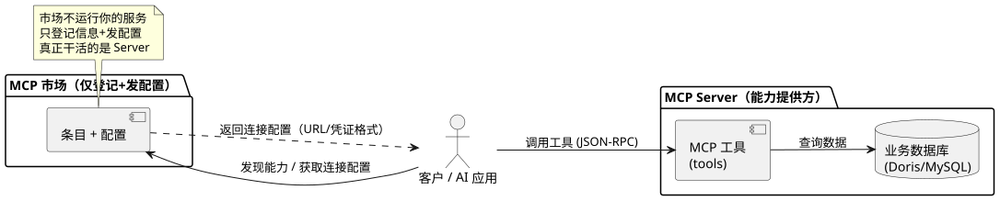
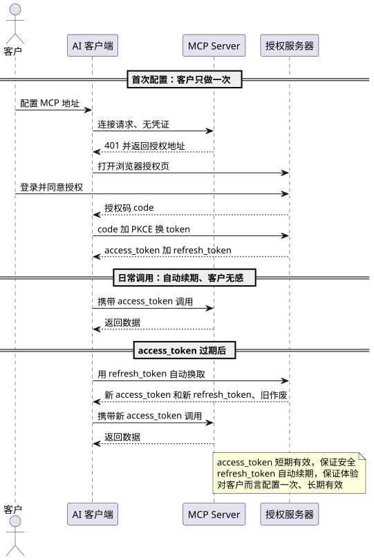
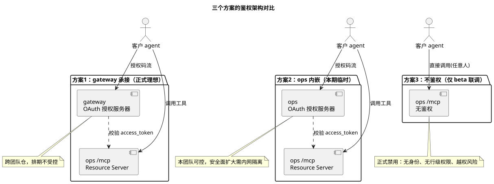
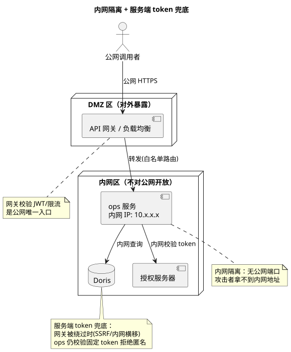

# MCP 鉴权方案：面向 PM 的决策讲解（附开发系统学习）

- 版本：v1.0（2026-08-24）
- 阅读对象：**PM（不了解 MCP）** + **需要系统学习 MCP 鉴权的开发**
- 关联：`test-report-store-consume/design.md` 第 8.2.3 节（MCP 生产级架构）
- 目的：本期 MCP 是否需要鉴权、选哪个方案，做决策前把概念讲清楚

---

## 第 1 部分：MCP 是什么（先补课）

### 1.1 一句话

MCP（Model Context Protocol）是"AI 模型调用外部工具/数据的**标准化协议**"，类比"AI 界的 USB-C"：AI 客户端（Trae、OpenCode 等）用统一方式连接各种能力，不用为每个系统单独写对接。

### 1.2 三个角色（必懂）



| 角色 | 是什么 | 类比 |
| --- | --- | --- |
| **MCP Client** | 消费方：真正调用能力的一方 | 你的 AI 助手（Trae/OpenCode） |
| **MCP Server** | 提供方：真正跑着、对外提供工具的服务 | 我们改的 ops 服务（`/mcp` 端点） |
| **MCP 市场** | 中介：只登记信息 + 发配置，不提供能力 | 应用商店（只上架，不跑 App） |

**关键**：本需求是给 ops 服务加一个 `/mcp` 端点，把"查测试报告数据"暴露成 MCP 工具，让 AI 客户端能调用。

### 1.3 和现有 REST 接口什么关系

**并列关系，不取代**：REST 是 HTTP 入口，MCP 是同一批数据能力的另一种协议入口，底层共用同一套服务逻辑（`ReportQueryService`）。MCP 只是"多一种调用方式"。

---

## 第 2 部分：为什么 MCP 要鉴权

### 2.1 三个被混淆的概念

| 概念 | 通俗解释 | 回答的问题 |
| --- | --- | --- |
| **鉴权（Authentication）** | 确认"你是谁" | 你是不是合法用户/应用 |
| **授权（Authorization）** | 确认"你能做什么" | 你能查哪些数据、能用哪些工具 |
| **审计（Audit）** | 记录"你做了什么" | 谁在什么时候查了什么 |

MCP 要上生产，三个都要。**没有鉴权，后面授权和审计都无从谈起**（连是谁都不知道）。

### 2.2 为什么不能"不鉴权"就上线

- ops 看板是**正式面向客户**的服务，数据是客户数据。
- 不鉴权 = **任何人**拿到 `/mcp` 地址就能查数据，且**无法区分是谁**——行级数据权限（客户只能查自己 repo 的数据）做不了，等于数据越权后门。
- 历史教训：看板 API 曾出现"登录用户越权获取数据"的**严重缺陷（发布阻塞项）**，不鉴权的 MCP 会把同类问题放大到无登录用户也触达。
- 结论：**面向客户正式环境，鉴权是硬门禁**，不是可选项。

### 2.3 现有 Web 系统不是已经有鉴权了吗？

有，但那是**网关层**的：openlibing-gateway 的 AuthFilter（JWT + CSRF）是唯一认证点，**ops 服务端本身是"零认证"**——所有请求都依赖网关挡在前面（安全报告已把这一点列为单点失效风险）。MCP 要走生产，鉴权不能只依赖网关，服务端也要有能力兜底。

---

## 第 3 部分：OAuth 2.1 通俗讲解（核心概念）

### 3.1 授权服务器是什么

**类比**：一个写字楼有两道门——

- **授权服务器** = 大厅前台，负责"发门禁卡"：你出示证件（登录账号），前台确认身份后发给你一张**短期有效的临时卡**（access_token）和一张**长期有效的续卡凭证**（refresh_token）。
- **资源服务器（MCP Server）** = 每个房间门口的刷卡机：只认"卡是否有效"，不负责发卡，卡片过期就让去前台换。

专业分工：**发卡（授权服务器）和验卡（资源服务器）分离**，是 OAuth 的标准设计。

### 3.2 为什么客户能"配置一次、一劳永逸"



- **首次**：客户在 AI 客户端里配置一次 MCP 地址 → 浏览器弹授权页 → 登录 + 同意 → 客户端拿到 access_token + refresh_token（存在本机安全存储）。
- **日常**：access_token 短效（比如几十分钟，保证安全——丢了也很快失效）；过期后客户端**自动**用 refresh_token 换新（每次换发新 refresh，旧的作废）。
- **对客户**：整个过程只手动操作一次，之后永远自动续期，**无感**。

> 为什么不直接发一个"永久 token"？永久凭证一旦泄露，攻击者能一直用，且无法自然收回。短效 token + 自动续期 = **安全（泄露面小）+ 体验（不用管）** 兼得。

### 3.3 为什么不能用更简单的"固定密码/API Key"？

可以用，但要清楚代价：

| 方式 | 优点 | 缺点 |
| --- | --- | --- |
| 固定 API Key | 实现最简单 | 泄露即长期可用、无法区分用户（做不了行级权限）、不符合 MCP 标准鉴权 |
| **OAuth 2.1** | 标准、可撤销、作用域、能区分用户、客户端原生支持 | 实现成本高一些 |

**结论**：beta 联调可用 API Key 过渡；**正式面向客户必须 OAuth 2.1**（这是 MCP 规范 2025-06-18 的标准要求，Trae/OpenCode 等客户端原生支持）。

### 3.4 开发和维护、运行成本

> 以下为估算量级，供排期参考（不含联调与安全评审）。

| 项 | 说明 | 成本量级 |
| --- | --- | --- |
| 依赖引入 | `spring-boot-starter-oauth2-authorization-server` + `oauth2-resource-server`（Spring Boot 3.4.x 原生支持） | 低（加依赖即可） |
| 授权服务器配置 | 客户端注册、token 策略、登录源对接 | 中（约 0.5~1 周） |
| 资源服务器配置 | `/mcp` 校验 JWT + 用户上下文透传 | 低~中（约 0.5 周） |
| 服务端 token 兜底 | 固定 token 校验 Filter | 低（约 0.2 周，可复用既有思路） |
| 运行成本 | 授权服务器随服务部署，无独立基础设施 | 低（一个进程内） |
| **长期维护** | token 策略、登录源、密钥轮换、审计 | **中**——这是 PM 最需要让维护方接受的长期投入 |

---

## 第 4 部分：三个方案对比（决策核心）



| 维度 | 方案 1：gateway 承接 | 方案 2：ops 内嵌 | 方案 3：不鉴权 |
| --- | --- | --- | --- |
| 授权服务器放哪 | openlibing-gateway（跨团队仓） | ops 服务内 | 无 |
| 客户体验 | 最优（配置一次自动续期） | 同左 | 最简（无需凭证） |
| 安全性 | 标准 OAuth 2.1 | 标准 OAuth 2.1（需内网隔离 + token 兜底） | **不可接受** |
| 跨团队依赖 | ⚠️ gateway 非本团队维护，排期不受控 | ✅ 本团队可控 | ✅ 无 |
| 开发/维护成本 | gateway 团队承担 + ops 配套 | ops 承担（约 1~1.5 周） | 最低 |
| 适用阶段 | 正式长期（理想态） | 本期临时正式方案 | 仅 beta 联调 |

**PM 最需要决策的两个问题**：
1. **gateway 团队是否接受承接授权服务器**？（直接影响维护 gateway 的团队的工作量与长期责任）
2. **如果不能等 gateway，能否接受授权服务器放 ops 内**？（代价 = 内网隔离 + 服务端 token 兜底，见第 5 部分）

---

## 第 5 部分：关键安全概念补课（开发系统学习）

### 5.1 内网隔离是什么、为什么需要、怎么实现



- **是什么**：把服务部署在**不对公网直接开放**的内网网段（如 10.x.x.x），公网请求只能通过网关/负载均衡这一条路进来，攻击者**拿不到服务的内网地址**。
- **为什么需要**：授权服务器放在 ops 服务内 = ops 同时承担"发卡"职能。若 ops 直接暴露公网，授权服务器被攻击面就大。内网隔离把"对外暴露面"收窄到网关一层。
- **怎么实现**：
  1. 部署时不映射公网端口（只分配内网 IP，如 Kubernetes Service 仅 ClusterIP）。
  2. 网关/DMZ 区统一收口 HTTPS（白名单路由转发到内网服务）。
  3. 数据库同理，仅内网可达。
- **类比**：写字楼的房间门不朝大街开，必须从大堂（网关）进入。

### 5.2 服务端 token 兜底是什么

- **是什么**：ops 服务端自己再校验一个固定 token（如 `X-API-Key`），请求没有它直接拒绝。
- **为什么需要**：安全报告指出当前"网关是唯一认证屏障"（FIND-01）——一旦网关被绕过（内网横向移动、SSRF、路由豁免遗漏），ops 所有接口就匿名可达。服务端 token 兜底 = **即使网关失守，服务端仍拒绝匿名调用**。
- **和 OAuth 的关系**：不是替代，是**双保险**——OAuth 管"合法用户是谁"，token 兜底管"至少是内部授权调用"。
- **实现**：一个简单的 Filter/Interceptor，校验请求头固定 token（可复用 openlibing-common 里 `FeignAccessTokenInterceptor` 的凭证校验思路）。

### 5.3 "服务端零认证"为什么是风险

ops/metric/sync 三仓**没有任何服务端鉴权**（无拦截器/注解），全靠网关。这不是"设计缺陷"而是一个**已知风险点**（安全报告 FIND-01 已记录）：网关单点失效 = 全链路裸奔。MCP 内嵌授权服务器 + token 兜底，客观上**部分缓解了这个风险**（ops 第一次有了自身认证能力）。

### 5.4 没有鉴权，审计表还能用吗？

**能建，但降级**：日志表（`t_mcp_tool_call_log`）不依赖鉴权即可记录"工具名、参数、耗时、成败"（**运营观测**可用）；但"**安全审计**"（谁在调、越权追责）必须靠鉴权提供的身份——没鉴权时 `caller` 只能记 IP/User-Agent，追不到人。且匿名可灌脏数据污染日志。详见 design.md 8.2.2。

---

## 第 6 部分：PM 决策 Q&A（假设懂的少，直接可问）

**Q1：MCP 是什么？为什么不直接用现有接口？**
> MCP 是 AI 客户端调外部能力的标准协议。现有 REST 接口是给人/程序调用的，AI 客户端（Trae/OpenCode）更适合走 MCP 标准入口。两者共用底层逻辑，MCP 是"多一种入口"，不取代 REST。

**Q2：现有系统不是有登录鉴权吗？为什么 MCP 要单独搞一套？**
> 现有登录在网关层，ops 服务端本身是"零认证"。MCP 要正式面向客户，服务端必须有自身鉴权能力（不能只靠网关），且要支持 AI 客户端按 MCP 标准接入——OAuth 2.1 是 MCP 规范要求的。

**Q3：不鉴权能不能先上，之后再补？**
> 面向客户正式环境不能。不鉴权 = 任意人可查客户数据、无法区分用户、行级权限做不了，等于越权后门。beta 内部联调可以，正式上线是**硬门禁**。

**Q4：OAuth 2.1 授权服务器是什么？复杂吗？**
> 类比写字楼发门禁卡的前台。开发上有现成框架（Spring Authorization Server），不是从零写。客户只操作一次，之后自动续期。

**Q5：客户用起来麻烦吗？**
> 不麻烦：首次配置时浏览器授权一次，之后自动续期，无感。这是给客户最好的体验（对比"每几个月换一次密码"）。

**Q6：三个方案分别什么工作量？为什么 gateway 排期不可控？**
> gateway 是**跨团队仓**，改动要对方排期配合，不在我们控制内；ops 内嵌约 1~1.5 周，本团队可控；不鉴权几乎零成本但正式不可用。

**Q7：放到 ops 里有什么代价？**
> 授权服务器放业务服务内 = 安全面扩大，需要**内网隔离**（服务不直接暴露公网）+ **服务端 token 兜底**（网关失守也能挡）。都是成熟做法，成本可控。后续 gateway 承接后可迁移，ops 降级为纯资源服务器。

**Q8：服务端 token 兜底有必要吗？**
> 有必要。安全报告已把"网关单点失效"列为风险，兜底是响应它的治理动作，也让 ops 第一次具备自身认证能力。

**Q9：没有鉴权审计还能做吗？**
> 日志表能建，但只能做"运营观测"（调用量、性能），做不了"安全审计"（谁在调、追责）——身份来自鉴权。

**Q10：你建议哪个？**
> 建议**本期按方案 2（ops 内嵌）**：本团队可控、客户体验和安全标准与 gateway 方案一致；同时把"gateway 承接授权服务器"列为后续跨团队迭代，提前知会对方。beta 联调阶段可先用服务端静态 token 过渡。

---

## 第 7 部分：建议与决策口径（给 PM 的一句话）

> 本期 MCP 若要正式面向客户上线，鉴权是硬门禁。推荐 **ops 内嵌 Spring Authorization Server**（本团队可控，约 1~1.5 周，客户配置一次长期有效，安全标准达标）；gateway 承接作为后续迁移路线，需提前与 gateway 团队对齐。

---

## 第 8 部分：AI 客户端的"连接方式"差异（✅ 已解决，Trae 打通 2026-09-16）

> 面向 PM/演示场景：之前 Trae 不弹授权页，根因是"连接方式"限制 + 服务端缺发现链路；现已全部解决，可直接演示。

### 8.1 一句话

- 我们的 MCP 服务端**鉴权完全正确**：客户端没带凭证时，服务端返回"请去授权"提示（HTTP 401 + 授权地址）。
- 之前 Trae 不弹页：① Trae 只对 **SSE 连接方式**支持自动弹授权页（Streamable HTTP 只支持手动配 token）；② 服务端缺少 SSE 端点与 OAuth 发现端点。
- **现已解决**：服务端新增 **SSE 传输**（`/mcp/sse`）+ **OAuth 发现端点**（`/.well-known/*`），Trae 用 `type: sse` 连接即可全自动完成"配置一次 → 浏览器授权 → 自动续期"，**已实测打通**。

### 8.2 连接方式 vs 客户端支持（当前状态）

| 连接方式（传输类型） | Trae 是否自动弹授权页 | OpenCode |
| --- | --- | --- |
| stdio（本地命令） | 用命令行/环境变量传凭证 | 同 |
| **SSE（当前实现）** | ✅ 支持浏览器 OAuth 授权（已打通） | ✅ |
| Streamable HTTP（`type: http`） | ❌ 仅支持手动配 token，不弹页 | ✅（自动弹页） |

### 8.3 演示配置（Trae）

```json
{
  "mcpServers": {
    "openlibing-report": {
      "url": "http://localhost:8098/mcp/sse"
    }
  }
}
```

- **本地**：`http://localhost:8098/mcp/sse`（本地 http 模式，mock 授权；完整演示手册见《方案 C 实现现状与分工总结》2.3.5）。
- **生产**：`https://<gateway-域名>/openlibing-ops/mcp/sse`（真实三方登录）。

---

## 附：相关设计章节索引

| 主题 | 位置 |
| --- | --- |
| MCP 生产级架构（鉴权/授权/可观测/可靠/工具/测试） | design.md 8.2.3 |
| 调用日志表与审计依赖 | design.md 8.2.2 |
| MCP 设计审查与工具接口 | design.md 8.2.1 |
| MCP 概念与搭建教材 | openlibing-metric `docs/mcp-poc/MCP搭建指导文档.md`（第 2 章） |
| 图源文件（.puml，可改可重渲） | 本目录 `diagrams/` |
