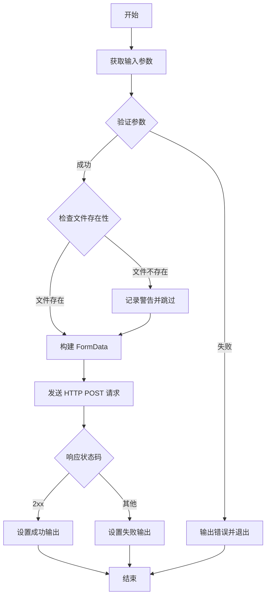

# upload-metadata-plugin — 技术设计

## 方案概述

开发一个 GitCode Actions 插件，基于 Node.js 16 运行时，使用 axios 和 form-data 实现文件上传功能。插件采用双层安全验证架构：输入验证层（参数白名单、路径验证）+ 网络传输层（HTTPS、认证头部），确保上传过程的安全性和可靠性。

## 架构决策

### 1. 使用 Node.js Actions 而非 Docker Actions

**决策**：选择 Node.js 16 Actions
**原因**：
- Node.js Actions 启动速度快（秒级），适合轻量级上传任务
- 依赖管理简单，无需构建 Docker 镜像
- GitCode Actions 原生支持 Node.js runtime

### 2. 双模式架构设计

**决策**：支持 Pipeline 和 Label 两种定位模式
**原因**：
- Pipeline 模式：适合标准 CI/CD 场景，基于流水线 ID 自动定位
- Label 模式：适合特殊场景（如性能测试、精度测试），提供灵活的自定义路径

**参数约束**：
- Label 模式优先级高于 Pipeline 模式
- archive-path 必须与 label 一起使用
- Pipeline 模式必须提供完整的 pipeline-id、pipeline-run-id、job-id

### 3. 多层安全验证策略

**决策**：实施严格的安全验证机制
**原因**：GitCode Actions 在容器内运行，可能访问敏感文件

**验证措施**：

| 验证项 | 策略 | 风险场景 |
|--------|------|----------|
| 文件路径 | 禁止 `..`，限制绝对路径只能访问 `/home`、`/tmp` | 路径遍历攻击（如 `../../root/.ssh/id_rsa`） |
| JSON 参数 | 字段白名单：`apig_code`、`apig_key`、`apig_secret` | 注入额外字段导致意外行为 |
| Label | 只允许字母、数字、下划线、短横线、点，最大 256 字符 | 路径注入（如 `../../../etc/passwd`） |
| Archive-path | 禁止 `..`，只允许安全字符，最大 256 字符 | 同上 |

### 4. 错误处理与用户反馈

**决策**：采用 "fail-fast" 策略，提供详细的错误输出
**原因**：CI/CD 环境下需要快速定位问题

**实现**：
- 使用 GitCode Actions 的 `core.setFailed()` 标记失败
- 使用 `core.error()` 输出详细错误栈
- 设置 `success`、`status-code`、`response-text` 三个输出变量

### 5. 依赖选择

| 依赖 | 版本 | 选择原因 |
|------|------|----------|
| axios | ^1.6.0 | 成熟的 HTTP 客户端，支持 Promise、拦截器、大文件上传 |
| form-data | ^4.0.0 | Node.js 标准库不原生支持 multipart/form-data，需要第三方库 |
| mime-types | ^2.1.35 | 根据 MIME 类型设置 Content-Type，确保服务端正确识别文件类型 |
| @actions/core | ^1.10.0 | GitCode Actions 官方 SDK，提供输入输出、日志、错误处理 |

## 涉及文件

| 文件 | 操作 | 说明 |
|------|------|------|
| `.gitcode/actions/openlibing-upload-reports/action.yml` | 新增 | GitCode Actions 元数据定义，定义输入输出参数 |
| `.gitcode/actions/openlibing-upload-reports/index.js` | 新增 | 插件主逻辑，包含验证、上传、错误处理 |
| `.gitcode/actions/openlibing-upload-reports/package.json` | 新增 | Node.js 依赖管理 |
| `.gitcode/actions/openlibing-upload-reports/package-lock.json` | 新增 | 锁定依赖版本，确保可重复构建 |
| `.github/workflows/Nightly-CI-example.yml` | 修改 | 更新为使用新的 upload-metadata 插件 |

## 核心流程



## 数据流

### Pipeline 模式

```
输入：
  files: "metadata.xml results.xml"
  pipeline-id: "12345"
  pipeline-run-id: "67890"
  job-id: "job-001"

请求体（FormData）：
  pipelineId: "12345"
  pipelineRunId: "67890"
  jobId: "job-001"
  files: [metadata.xml, results.xml]

服务端存储路径：
  /{pipeline-id}/{pipeline-run-id}/{job-id}/{filename}
```

### Label 模式

```
输入：
  files: "performance.json"
  label: "performance"
  archive-path: "2026-07-29"

请求体（FormData）：
  archiveConfig: {"label":"performance","archivePath":"2026-07-29"}
  files: [performance.json]

服务端存储路径：
  /{label}/{archive-path}/{filename}
  -> /performance/2026-07-29/performance.json
```

## 风险 & 缓解

| 风险 | 影响 | 缓解措施 |
|------|------|----------|
| 敏感文件泄露（如 `/root/.ssh/id_rsa`） | 高 | 文件路径白名单验证，只允许访问 `/home`、`/tmp` 目录 |
| 路径遍历攻击（如 `../../etc/passwd`） | 高 | 禁止路径中包含 `..`，使用 `path.resolve()` 规范化路径 |
| Label 注入攻击（如 `../../../root`） | 中 | Label 正则验证，只允许安全字符 |
| 大文件上传超时 | 中 | axios 配置 `maxContentLength: Infinity`，依赖服务端超时控制 |
| 凭证泄露（apig_code） | 高 | 使用 GitCode Secrets 存储，不在日志中输出明文 |
| 网络请求失败 | 低 | 捕获 axios 异常，输出详细错误信息，设置 `success=false` |

## 性能考虑

- **并发上传**：当前实现为串行上传，如需并发可使用 `Promise.all()`（需评估服务端负载）
- **文件大小**：依赖 axios 的 stream 上传，无需完全读入内存
- **网络优化**：支持 HTTP Keep-Alive（axios 默认启用）

## 测试策略

1. **单元测试**：
   - `validateFilePath()` 的路径验证逻辑
   - `processJsonParam()` 的 JSON 解析和字段白名单
   - `validateLabel()` 和 `validateArchivePath()` 的正则验证

2. **集成测试**：
   - Pipeline 模式完整上传流程
   - Label 模式完整上传流程
   - 错误场景（文件不存在、网络失败、认证失败）

3. **安全测试**：
   - 路径遍历攻击尝试
   - Label 注入攻击尝试
   - JSON 参数注入尝试

## 扩展性

### 未来可能的增强功能

1. **支持更多认证方式**：当前只支持 apig_code，未来可扩展 OAuth、JWT 等
2. **上传进度反馈**：通过 `core.info()` 输出上传进度
3. **文件压缩**：上传前自动压缩大文件
4. **断点续传**：支持大文件的断点续传
5. **并发上传**：支持多文件并发上传以提高效率

### 插件化设计

当前设计已具备良好的扩展性：
- 验证逻辑独立为函数（`validateFilePath`、`processJsonParam` 等）
- 上传逻辑独立为函数（`uploadFiles`）
- 易于添加新的验证规则或上传配置