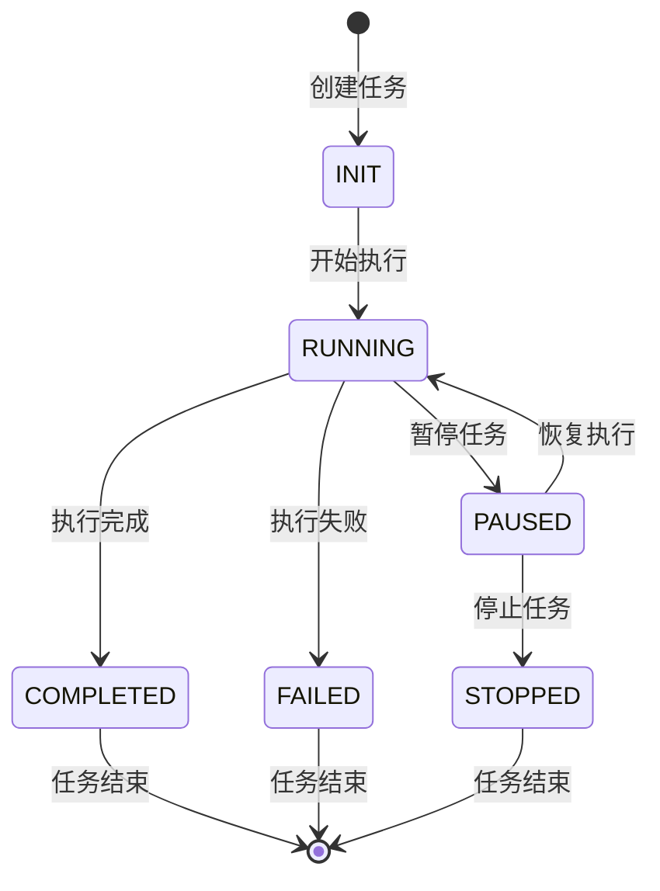
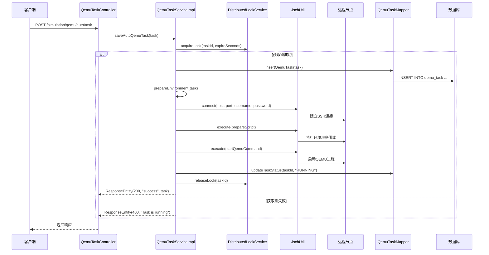
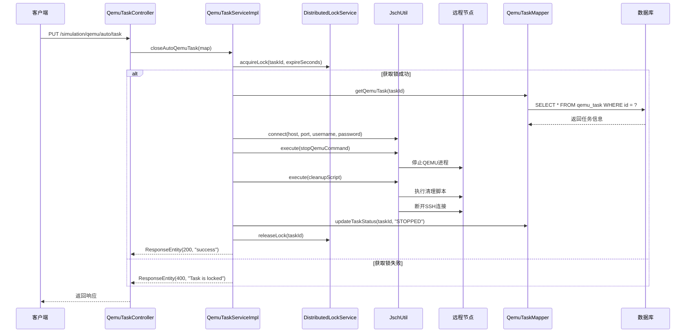
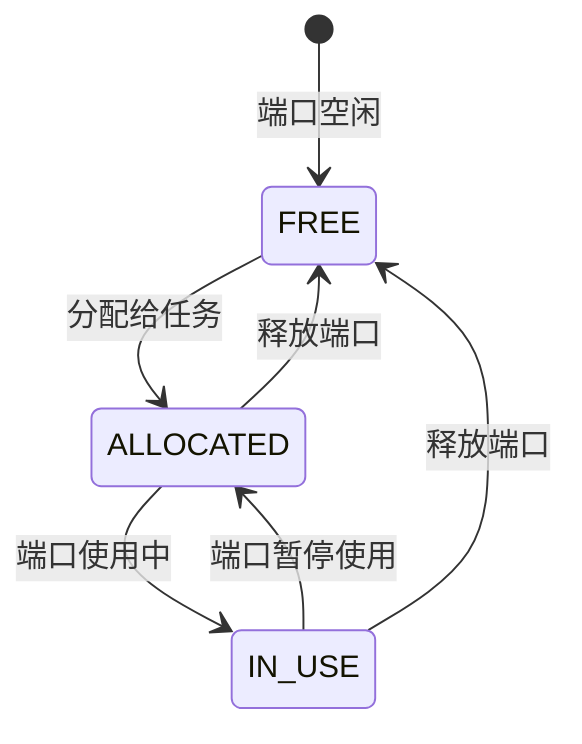

# QEMU任务调度系统设计

## 1. 系统定位

QEMU任务调度系统是 `openlibing-simulation` 的核心任务执行模块，负责管理QEMU虚拟机的生命周期，包括任务创建、执行、监控和关闭。该系统支撑仿真验证场景中的自动化QEMU环境部署和运行。

## 2. 业务边界

| 边界类型 | 说明 |
| --- | --- |
| 上游依赖 | 节点管理模块、YAML配置管理模块 |
| 下游依赖 | SSH执行器、分布式锁服务、数据库 |
| 外部接口 | 远程服务器SSH连接 |
| 内部接口 | 提供QEMU任务的CRUD和脚本管理API |

## 3. 领域模型

### 3.1 核心实体

| 实体 | 说明 | 关键字段 |
| --- | --- | --- |
| `QemuTaskEntity` | QEMU任务实体 | id, taskName, status, createTime, updateTime |
| `QemuTaskConfigEntity` | QEMU任务配置 | taskId, configJson, scriptPath, parameters |
| `QemuRunScriptEntity` | 运行脚本实体 | id, taskId, scriptContent, scriptType, createTime |
| `QemuContext` | QEMU上下文 | taskId, nodeInfo, portInfo, processId |
| `QemuPort` | 端口信息 | port, protocol, status, description |
| `QemuRemoteConnect` | 远程连接信息 | host, port, username, password, privateKey |
| `LockEntity` | 分布式锁实体 | lockName, createdAt, expiredAt |

### 3.2 任务状态机



## 4. 核心流程

### 4.1 自动化任务创建与执行流程



### 4.2 任务关闭流程



## 5. 分布式锁机制

QEMU任务调度系统使用分布式锁确保同一任务在集群环境中不会被重复执行：

### 5.1 锁获取流程

```java
@Transactional
public String acquireLock(String lockName, int expireSeconds) {
    // 清理过期锁
    qemuTaskMapper.deleteExpiredLocks(LocalDateTime.now());
    
    // 尝试获取锁
    Optional<LockEntity> existingLock = qemuTaskMapper.findByLockName(lockName);
    LocalDateTime now = LocalDateTime.now();
    LocalDateTime expiredAt = now.plusSeconds(expireSeconds);
    
    if (existingLock.isEmpty()) {
        // 锁不存在，创建新锁
        LockEntity newLock = new LockEntity();
        newLock.setLockName(lockName);
        newLock.setCreatedAt(now);
        newLock.setExpiredAt(expiredAt);
        qemuTaskMapper.insertLock(newLock);
        return newLock.getLockName();
    } else {
        // 锁存在，检查是否过期
        LockEntity lock = existingLock.get();
        if (lock.getExpiredAt().isBefore(now)) {
            // 锁已过期，更新锁
            lock.setCreatedAt(now);
            lock.setExpiredAt(expiredAt);
            qemuTaskMapper.updateLock(lock);
            return lock.getLockName();
        } else {
            // 锁未过期，获取失败
            return "";
        }
    }
}
```

### 5.2 锁续期机制

长时间运行的任务需要定期续期锁，防止锁过期导致任务被重复执行：

```java
@Transactional
public boolean renewLock(String lockName, int expireSeconds) {
    LocalDateTime expiredAt = LocalDateTime.now().plusSeconds(expireSeconds);
    int result = qemuTaskMapper.updateExpiredAt(lockName, expiredAt);
    return result > 0;
}
```

## 6. 脚本管理

### 6.1 脚本类型

| 脚本类型 | 用途 | 示例 |
| --- | --- | --- |
| PREPARE | 环境准备脚本 | 安装依赖、创建目录 |
| START | QEMU启动脚本 | 执行qemu-system命令 |
| STOP | QEMU停止脚本 | 发送kill信号 |
| CLEANUP | 清理脚本 | 删除临时文件 |

### 6.2 脚本存储结构

```
/home/simulation/qemu/{taskId}/
    ├── run.sh              # 启动脚本
    ├── stop.sh             # 停止脚本
    ├── cleanup.sh          # 清理脚本
    ├── config/             # 配置文件目录
    │   └── qemu.cfg
    └── logs/               # 日志目录
        └── qemu.log
```

## 7. 端口管理

### 7.1 端口分配策略

| 端口范围 | 用途 |
| --- | --- |
| 22000-22999 | QEMU SSH端口 |
| 5900-5999 | VNC端口 |
| 8000-8999 | 应用服务端口 |
| 9000-9999 | 自定义服务端口 |

### 7.2 端口状态管理



## 8. 接口列表

| API 路径 | HTTP方法 | 功能描述 |
| --- | --- | --- |
| `/simulation/qemu/auto/task` | POST | 创建自动化QEMU任务 |
| `/simulation/qemu/auto/task` | GET | 查询自动化任务详情 |
| `/simulation/qemu/auto/task` | PUT | 关闭自动化任务 |
| `/simulation/qemu/auto/task/env` | GET | 查询仿真环境信息 |
| `/simulation/qemu/runScript` | POST | 保存运行脚本 |
| `/simulation/qemu/runScript` | DELETE | 删除运行脚本 |
| `/simulation/qemu/uploadLock` | PUT | 更新锁时间 |

## 9. 数据库表设计

### 9.1 qemu_task（QEMU任务表）

| 字段名 | 类型 | 说明 |
| --- | --- | --- |
| id | VARCHAR(64) | 主键ID |
| task_name | VARCHAR(255) | 任务名称 |
| status | VARCHAR(32) | 任务状态 |
| node_id | VARCHAR(64) | 关联节点ID |
| config_json | TEXT | 配置JSON |
| create_time | DATETIME | 创建时间 |
| update_time | DATETIME | 更新时间 |

### 9.2 qemu_run_script（运行脚本表）

| 字段名 | 类型 | 说明 |
| --- | --- | --- |
| id | VARCHAR(64) | 主键ID |
| task_id | VARCHAR(64) | 关联任务ID |
| script_content | TEXT | 脚本内容 |
| script_type | VARCHAR(32) | 脚本类型 |
| create_time | DATETIME | 创建时间 |

### 9.3 lock_entity（分布式锁表）

| 字段名 | 类型 | 说明 |
| --- | --- | --- |
| id | VARCHAR(64) | 主键ID |
| lock_name | VARCHAR(255) | 锁名称 |
| created_at | DATETIME | 创建时间 |
| expired_at | DATETIME | 过期时间 |

## 10. 错误处理与日志

### 10.1 错误分类

| 错误类型 | 处理策略 |
| --- | --- |
| 连接错误 | 重试连接，记录错误日志 |
| 执行超时 | 强制终止进程，标记任务失败 |
| 脚本错误 | 记录错误输出，标记任务失败 |
| 资源不足 | 释放已分配资源，返回错误信息 |

### 10.2 日志记录

```
日志级别: INFO/ERROR/WARN
日志格式: [时间] [线程名] [类名] - [消息]
日志存储: /var/log/simulation/qemu/{taskId}.log
```

## 11. 性能考虑

### 11.1 异步执行

使用线程池处理长时间运行的任务，避免阻塞主线程。

### 11.2 连接池管理

维护SSH连接池，复用连接减少握手开销。

### 11.3 资源限制

- 单节点最大并发任务数：10
- 单个任务最大执行时间：72小时
- 脚本执行超时时间：30分钟