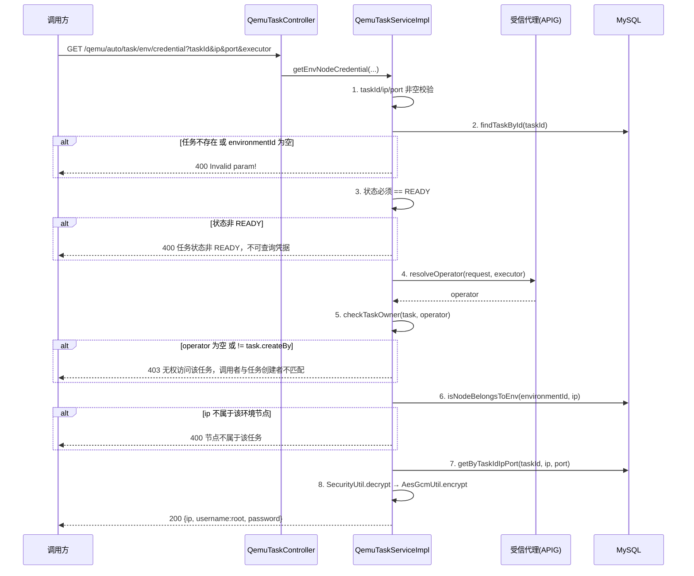

# Qemu 节点信息与 SSH 凭据下发系统设计

> 本文与代码基线 `master@4f22896` 对齐。所有结论均标注来源文件与行号。

## 1. 系统定位

本模块解决两个问题：

1. **节点密码的持久化与按节点下发**——Qemu 任务部署时为每个仿真节点生成独立随机密码，一份加密写入目标机 `env.ini`（供容器内启动脚本使用），
   另一份加密落库到 `t_qemu_node_info`（供平台按节点查询 SSH 凭据）。
2. **指定机器的同步预检**——任务创建时若用户指定了机器 IP，先做一次轻量、纯读的存在性预检，快速拒绝无效 IP，避免无效任务进入异步部署阶段。

链路概览：

```text
任务创建(同步) → 指定机器预检(countServerByIp)
        ↓
异步部署(allocateNode → deployTask) → 生成节点密码 → 加密写 env.ini + 加密落库 t_qemu_node_info
        ↓
任务状态 READY
        ↓
客户端查环境视图(GET /qemu/auto/task/env)            → 节点列表，password 恒为 null
客户端按节点取凭据(GET /qemu/auto/task/env/credential) → 单节点 username/password(二次加密)
```

> **设计要点**：环境视图接口**永不返回密码**，凭据必须通过独立的 `/env/credential` 接口按「任务 + IP + 端口」单点获取。
> 这是 `VULN-SEC-JAVA-SECRET-CONTROLLER-001` 的修复结果，目的是避免一次调用批量拖走整个环境的所有凭据
> （`QemuTaskServiceImpl.java:4007-4010`、`:4020-4023`）。

## 2. 业务边界

| 边界类型 | 说明                                                                                                                   |
| -------- | ---------------------------------------------------------------------------------------------------------------------- |
| 上游触发 | `POST /simulation/qemu/auto/task`（创建任务，同步预检）、异步部署线程（写节点密码）                                    |
| 下游依赖 | MySQL（`t_qemu_node_info`、`t_server_basic_info`、`t_server_using`）、目标机 SSH/SFTP（经双层隧道）                    |
| 对外接口 | `GET /simulation/qemu/auto/task/env`、`GET /simulation/qemu/auto/task/env/credential`                                  |
| 数据方向 | 凭据单向出（平台 → 调用方）；密码单向入（生成 → 目标机 / 数据库）                                                      |
| 失败影响 | 密码落库失败会**中断本次 config 文件创建**（返回 `false`），进而使部署失败；凭据查询失败不影响已运行环境               |
| 依赖文档 | SSH 隧道建立、主机密钥校验、SFTP 直写详见 [SSH端口转发与主机密钥管理系统设计.md](SSH端口转发与主机密钥管理系统设计.md) |

本模块**不负责**：

- 机器选型的资源余量判定（CPU / 内存）——由 `NodeManageMapper` 的 SQL `Having` 在异步选机阶段判定；
- 节点分配的并发控制——由 `node_allocation_lock` 分布式锁保护，见 [分布式锁系统设计.md](分布式锁系统设计.md)；
- 环境关闭与节点释放。

## 3. 领域模型与表结构

### 3.1 QemuNodeInfoEntity

`entity/qemu/QemuNodeInfoEntity.java:16-28`，Lombok `@Data`。

| 字段       | 类型      | 说明                                                                                       |
| ---------- | --------- | ------------------------------------------------------------------------------------------ |
| `id`       | `String`  | 主键，Java 侧 `CommmonUtils.getUuid()` 生成（`:1029`）                                     |
| `taskId`   | `String`  | Qemu 任务 ID                                                                               |
| `ip`       | `String`  | 仿真节点 IP（写入时为**部署主节点 IP** `remoteConnect.getIp()`，见 §6.4）                  |
| `password` | `String`  | 节点密码，**`SecurityUtil.encrypt(明文, part1)` 密文**（`:1032`）                          |
| `type`     | `String`  | 节点类型，取值 `computer` / `controller`（`:1005`、`:1011`）                               |
| `port`     | `Integer` | 节点 SSH 映射端口；`computer` 为 `qemuStartPort + i - 1`，`controller` 为 `controllerPort` |

> **该实体没有状态列、没有 `is_deleted`、没有审计时间字段**。节点密码只随任务部署整体写入、整体删除，
> 不做单行状态流转。因此 `QemuNodeInfoMapper` 中**没有 update 语句**（`mapper/QemuNodeInfoMapper.xml`）。

### 3.2 t_qemu_node_info 表结构

`resources/db/changelog/v1.0.0/t_qemu_node_info.xml`，单一 changeSet `20260806_create_t_qemu_node_info`（author `ligao`），
已在 `db.changelog.xml:12` 注册。

| 列         | 类型           | 约束         | 备注                                             |
| ---------- | -------------- | ------------ | ------------------------------------------------ |
| `id`       | `VARCHAR(50)`  | PK, NOT NULL |                                                  |
| `task_id`  | `VARCHAR(64)`  | —            | 任务 ID                                          |
| `ip`       | `VARCHAR(255)` | —            | 仿真节点 IP                                      |
| `password` | `VARCHAR(512)` | —            | 密文；长度需容纳 `SecurityUtil` 加密膨胀后的结果 |
| `type`     | `VARCHAR(255)` | —            | computer / controller                            |
| `port`     | `INT`          | —            | SSH 映射端口                                     |

索引：`idx_task_id`（非唯一，`:31-33`）。**没有唯一约束**——同一任务同一 IP 可存在多行（不同 port / type），
靠「先删后插」保证幂等（§5.3）。

### 3.3 环境视图返回模型

环境视图接口返回的是 `entity/qemu/SimulationVerificationEnvNodeInfoEntity.java:18-72`，与落库实体**不是同一模型**：

| 字段                                                                         | 来源                                                                  |
| ---------------------------------------------------------------------------- | --------------------------------------------------------------------- |
| `ip` / `id`                                                                  | `QemuTaskViewInfoEntity`（`:4216`）                                   |
| `tcpPort` / `qemuStartPort` / `qemuEndPort` / `thirdPort` / `controllerPort` | `QemuTaskViewInfoEntity`（`:4217-4221`）                              |
| `containerId` / `containerType` / `extendInfoList`                           | `QemuTaskViewInfoEntity`（`:4212-4215`）                              |
| `gateway`                                                                    | 任务配置 `config.getGateway()`（`:4214`）                             |
| `port`（`List<String>`）                                                     | 按 `nodeNumber` 由 `qemuStartPort` 递增生成的端口列表（`:4222-4229`） |
| `username`                                                                   | 接口内硬编码 `"root"`（`:4020`）                                      |
| `password`                                                                   | **恒为 `null`**（`:4022`）                                            |

注意 `port` 在此模型中语义是「端口列表（字符串）」，与凭据接口的 `port`（单个 `Integer`）含义不同，见 §4.3。

## 4. 接口清单

两个接口都在 `QemuTaskController`（`controller/QemuTaskController.java`），类级 `@RequestMapping("/simulation")`。

### 4.1 GET /simulation/qemu/auto/task/env

环境视图，节点列表。

| 参数       | 位置  | 必填 | 说明                               |
| ---------- | ----- | ---- | ---------------------------------- |
| `taskId`   | query | 是   | 任务 ID                            |
| `executor` | query | 否   | 调用者身份（无 APIG 直连环境兜底） |

`QemuTaskController.java:88-93` → `QemuTaskServiceImpl.getEnvironmentViewAuto`（`:3965-4025`）。

校验与分支顺序：

| 序  | 判定                                          | 返回                                                                                                     |
| --- | --------------------------------------------- | -------------------------------------------------------------------------------------------------------- |
| 1   | `taskId` 为空                                 | `400 "Invalid param!"`（`:3968`）                                                                        |
| 2   | 任务不存在，或 `environmentType` 为空         | `400 "Invalid param!"`（`:3972`）                                                                        |
| 3   | `checkTaskOwner` 失败                         | `403 "无权访问该任务，调用者与任务创建者不匹配"`（`:4179`）                                              |
| 4   | `environmentType = OFFCLOUD` 且状态 ≠ `READY` | **空响应体** `new ResponseEntity()`（`:3981`）                                                           |
| 5   | `environmentId` 为空                          | `200 "success"`（无 data）                                                                               |
| 6   | 无 `t_server_using` 记录                      | `200 "success"`，data 为 `null`                                                                          |
| 7   | 无节点记录                                    | `200 "success"`（无 data）                                                                               |
| 8   | 正常                                          | `200 "success"`，data 为节点列表，`total` 为 serverUsing 数，**每节点 `username=root`、`password=null`** |

> 分支 4 只对 `OFFCLOUD` 生效——非 `OFFCLOUD`（如 `OTHERCLOUD`）环境在非 READY 状态下**仍会返回节点列表**，
> 只是不带密码（无密码时本就不泄露凭据）。这一差异在实现注释中未说明。

### 4.2 GET /simulation/qemu/auto/task/env/credential

按节点获取 SSH 凭据。

| 参数       | 位置  | 必填 | 说明                                            |
| ---------- | ----- | ---- | ----------------------------------------------- |
| `taskId`   | query | 是   | 任务 ID                                         |
| `ip`       | query | 是   | 节点 IP                                         |
| `port`     | query | 是   | 节点 SSH 映射端口（`Integer`，`null` 会被拒绝） |
| `executor` | query | 否   | 调用者身份（无 APIG 直连环境兜底）              |

`QemuTaskController.java:105-111` → `QemuTaskServiceImpl.getEnvNodeCredential`（`:4027-4054`）→ `buildCredential`（`:4075-4090`）。

响应 data：

| 键         | 值                                                            |
| ---------- | ------------------------------------------------------------- |
| `ip`       | 入参 `ip`                                                     |
| `username` | 硬编码 `"root"`                                               |
| `password` | **AES-CBC 二次加密后的密文**；无匹配记录或密码为空时返回 `""` |

### 4.3 两个接口的差异

| 维度         | `/env`                                   | `/env/credential`                                   |
| ------------ | ---------------------------------------- | --------------------------------------------------- |
| 返回粒度     | 全环境节点列表                           | 单节点                                              |
| 是否返回密码 | **永不返回**（恒 `null`）                | 返回（二次加密）                                    |
| 端口字段语义 | `port`：端口列表（`List<String>`）       | `port`：单个 SSH 端口（`Integer`）                  |
| 状态要求     | 仅 `OFFCLOUD` 强制 `READY`，其它返回空体 | **所有类型都强制 `READY`**（`:4038-4041`）          |
| IP 归属校验  | 无（返回的是自己的节点）                 | 有，`isNodeBelongsToEnv`（`:4048`）                 |
| 未命中记录时 | 节点仍在列表中                           | `password` 为 `""`，**HTTP 语义仍是 code=200 成功** |

> `/env/credential` 的「查不到记录也返回 200 + 空密码」是有意为之（`Issue #17` 注释，`:4052`），
> 调用方必须自行判断 `password` 是否为空，不能仅凭 code=200 认为凭据可用。

## 5. 节点密码生成与落库

### 5.1 唯一写入路径

全仓仅 1 处写入 `t_qemu_node_info`：`QemuTaskServiceImpl` 的 `createConfigFile` 流程（`:957-961`）。
调用链为 **异步部署线程 → `deployTask` → `createConfigFile`**，与 HTTP 请求线程解耦。

```java
if (!CollectionUtils.isEmpty(nodeInfoList)) {
    // 幂等落库：重复部署时先清理该任务旧密码记录，防止残留过期密码 (Issue #17)
    qemuNodeInfoMapper.deleteByTaskId(task.getId());
    qemuNodeInfoMapper.batchInsert(nodeInfoList);
}
```

`QemuTaskServiceImpl.java:957-961`。

### 5.2 密码生成规则

`generateRandomPassword()`（`:1067-1080+`）：

- 长度固定 **6 位**；
- 字符集仅 `[a-zA-Z0-9]`，**保证至少 1 位数字**（避免全字母弱密码）；
- 使用 `SecureRandom`；
- 刻意**不含 shell 特殊字符**，因为密码会经 `sshpass -p '...'` / `chpasswd` 拼入命令行（`:1062-1063`）。

随机空间约 `62^6 ≈ 5.7×10^10`。

### 5.3 幂等落库

`deleteByTaskId` + `batchInsert` 是**非事务**的两次调用（`createConfigFile` 所在方法无 `@Transactional`）。
若 `batchInsert` 失败，该任务的密码记录即被清空，凭据接口会返回空密码。由于部署随后也会因 `false` 返回而失败，
不会出现「环境正常但凭据丢失」的静默态。

### 5.4 env.ini 与数据库的双写

同一次生成产生两份产物，见 `appendNodePasswords`（`:991-1014`）：

| 产物                              | 位置                               | 加密方式                                           | 用途                                     |
| --------------------------------- | ---------------------------------- | -------------------------------------------------- | ---------------------------------------- |
| `node_pwd_{i}` / `controller_pwd` | 目标机 `/opt/install/conf/env.ini` | `AesGcmUtil(deployKey).encrypt()`，**AES-256-CBC** | 容器内 `start_qemu.sh` 用 `openssl` 解密 |
| `t_qemu_node_info.password`       | MySQL                              | `SecurityUtil.encrypt(pwd, part1)`                 | 平台凭据接口查询                         |

字节流转：

```text
SecureRandom 生成明文
   ├─→ AesGcmUtil(deployKey) 加密 → 追加到 env.ini 内容 → SFTP 直写 0600
   └─→ SecurityUtil.encrypt(part1) → t_qemu_node_info
```

- 部署密钥 `deployKey = SecurityUtil.decrypt(aesgcmKey, part1)`（`:949`），其中 `aesgcmKey` 来自配置项 `security.aesgcm.key`；
- 密钥本身通过 `writeAesKeyToNode` **经 SFTP 直写** `/opt/install/conf/aes.key`（`:1050-1057`），
  不拼入 shell 命令行，避免密钥出现在目标机 `ps` 输出中被同机低权限用户读取（CWE-214）；
- 使用 CBC 而非 GCM 的原因：容器内 `openssl enc` 不支持 GCM（`:999`）；
- env.ini 同样经 SFTP 直写（`:966-971`），权限 `0600`。

> **重复部署时密码会被整体刷新**，旧密码失效。客户端缓存的凭据需在重新部署后重新获取。

### 5.5 端口映射规则

`computer` 节点：`port = viewInfo.getQemuStartPort() + i - 1`，`i` 从 1 到 `nodeNumber`（`:1003-1005`）；
`controller` 节点（仅 `scene = "virtualization"` 时生成）：`port = viewInfo.getControllerPort()`（`:1007-1012`）。

若 `qemuStartPort` 为 `null`，`computer` 节点的 `port` 写入 `null`——此时凭据接口以 `port` 为等值条件查询将永远失配。

## 6. SSH 凭据下发流程

### 6.1 完整校验链

`getEnvNodeCredential`（`:4027-4054`）的校验顺序：



### 6.2 身份解析与 IDOR 防护

`resolveOperator`（`:4106-4120`）优先级：

1. **受信代理注入头**——仅当 TCP 对端 `remoteAddr` 命中 `trusted.proxy.ips` 白名单时，才信任请求头 `X-Openlibing-User`；
2. **内部认证已启用时**同样信任该头（`internalAuthEnabled`，由 `InternalSimulationAuthFilter` 前置验证）；
3. **`executor` 参数兜底**——无 APIG 直连环境（beta）使用。

`checkTaskOwner`（`:4175-4182`）：`operator` 为空或与 `task.getCreateBy()` 不等即返回 403。
这是 PASTA R-04 IDOR 的修复点——**任何持有 taskId 的调用方都不能读取他人任务的凭据**。

`isNodeBelongsToEnv`（`:4059-4069`）：由 `environmentId` 查 `t_server_using` 得 `serverId` 列表，
再查该环境的节点列表，要求 `ip` 在其中。作用是阻止「用合法 taskId + 任意 IP」的无效调用与凭据枚举。

> `isNodeBelongsToEnv` 校验的是**任务所属仿真环境的节点集合**，而落库时 `ip` 写的是**部署主节点 IP**
> （`appendNodePasswords` 传入 `remoteConnect.getIp()`，`:951`）。两者在「多机部署」场景下口径可能不完全一致，
> 需以实际数据为准（见 §10 局限 3）。

### 6.3 凭证的二次加密

`buildCredential`（`:4075-4090`）：

```java
String plaintext = SecurityUtil.decrypt(nodeInfo.getPassword(), part1);
credential.put("password", getAesGcmUtil().encrypt(plaintext));
```

即：**库内密文（`SecurityUtil`）解密后，再用 `AesGcmUtil` 重新加密返回**。
调用方持有 `security.aesgcm.key` 对应的密钥才能解出明文。这样做的目的：

- 数据库泄露时，库内密文不能被直接用于 SSH 登录（`SecurityUtil` 与 `AesGcmUtil` 是两套密钥体系）；
- 传输链路上即使被截获，也多一层密钥保护。

> 该接口**不返回 `port`**（只有 `ip` / `username` / `password`），调用方需自行保留查询时的 `port`。

### 6.4 节点 IP 的写入口径

落库的 `ip` 是 `appendNodePasswords(..., remoteConnect.getIp(), ...)` 传入的部署主节点 IP（`:951`），
即**同一个物理机上部署的所有仿真节点，其 `t_qemu_node_info.ip` 相同，靠 `port` 区分**（`type` 区分计算机/控制节点）。

## 7. 指定机器预检

### 7.1 同步预检（轻量、纯读、不加锁）

触发点：任务创建时若 DTO 中带 `config.serverIp`。

`QemuTaskServiceImpl.saveAutoQemuTask`（`:264-271`）：

```java
// 指定机器同步预检（方案 A：轻量预检、纯读、不加锁；只校验机器存在）
String serverIp = task.getConfig().getServerIp();
if (StringUtils.isNotBlank(serverIp)) {
    ResponseEntity preCheck = nodeManageService.checkSpecifiedServer(serverIp);
    if (preCheck.getCode() != 200) {
        return preCheck;
    }
}
```

`NodeManageServiceImpl.checkSpecifiedServer`（`:599-606`）：**只做一项校验**——
`nodeManageMapper.countServerByIp(serverIp) != 1` 即失败。

SQL（`mapper/NodeManageMapper.xml:309-314`）：

```sql
SELECT COUNT(1)
FROM t_server_basic_info
WHERE is_deleted = "0"
  AND ip = #{serverIp}
```

| 项     | 值                                                                    |
| ------ | --------------------------------------------------------------------- |
| 通过   | `code=200`，`message="success"`                                       |
| 不通过 | `code=2003`，`message="specified server ip not found or more than 1"` |
| 落库   | 无（纯读）                                                            |
| 加锁   | 无                                                                    |
| 事务   | 无                                                                    |

> **注意**：`2003` **不在** `enums/ResponseCodeEnum` 中（该枚举仅定义 200/400/40001/40002/401/403/500/50001），
> 属于枚举之外的自定义业务码。调用方需按约定识别。

### 7.2 异步选机（资源余量判定）

预检通过后进入异步选机 `NodeManageServiceImpl.getServerNodes`（`:320-359`）：

```java
if (StringUtils.isNotBlank(serverIp)) {
    // 指定机器：按 IP 单点取机；资源余量是否足够由 SQL 的 Having 判定（与自动选机完全同口径）
    ServerBasicInfoEntity server = nodeManageMapper.getServerFreeResourceByIp(serverIp,
        simulationDeploy.getUseCpu(), simulationDeploy.getUseMemory());
    if (server == null) {
        // 覆盖三种情况：机器已被删除 / 剩余 CPU 或内存不足（含同步预检通过后被抢占）
        serverList = new ArrayList<>();
    } else {
        serverList = Collections.singletonList(server);
    }
} else {
    serverList = nodeManageMapper.getDynamicComputeFreeServerIp(simulationDeploy, nodeIds);
}
```

`getServerFreeResourceByIp`（`mapper/NodeManageMapper.xml:319+`）通过 SQL `Having` 判定剩余 CPU / 内存，
其 `Having` 子句与自动选机的 `getDynamicComputeFreeServerIp` **逐字对齐**（XML 注释已注明「口径演进时须同步修改两处」）。
指定机器路径**刻意不带** `nodeIds` / `subScene` / `architecture` 过滤。

选机失败（`serverList.size() != machineCount`）时走既有「环境不足 → 任务置 FAILED」路径。

### 7.3 两阶段口径差异

| 维度     | 同步预检                             | 异步选机                           |
| -------- | ------------------------------------ | ---------------------------------- |
| 触发时机 | 任务创建请求线程内                   | 异步部署线程内                     |
| 校验内容 | 机器存在且唯一（`is_deleted = "0"`） | 剩余 CPU / 内存是否满足            |
| 并发保护 | 无                                   | `node_allocation_lock` 分布式锁    |
| 失败返回 | `2003`（同步返回给调用方）           | 任务状态置 `3`（FAILED）+ 错误信息 |

> **已知的竞态窗口**：预检通过到异步选机之间存在时间差，期间机器可能被其它任务占用。
> 该竞态由异步选机的 SQL `Having` 兜住（代码注释明确列出「同步预检通过后被抢占」这一情况），
> 表现为任务失败而非部署到超载机器上。

## 8. 安全设计

| 项               | 措施                                                            | 位置                        |
| ---------------- | --------------------------------------------------------------- | --------------------------- |
| 凭据不批量下发   | 环境视图列表 `password` 强制置 `null`                           | `:4008-4010`、`:4019-4023`  |
| 凭据按节点单取   | 独立接口 + `taskId`/`ip`/`port` 三重定位                        | `:4075-4090`                |
| 越权（IDOR）防护 | `checkTaskOwner` 比对 `operator` 与 `task.createBy`             | `:4175-4182`                |
| 状态门禁         | 凭据接口强制任务状态为 `READY`                                  | `:4038-4041`                |
| IP 归属校验      | `isNodeBelongsToEnv` 要求 IP 属于该环境节点                     | `:4059-4069`                |
| 落库加密         | `SecurityUtil.encrypt(pwd, part1)`，不存明文                    | `:1032`                     |
| 下发加密         | `AesGcmUtil`（CBC）二次加密，密钥与库内不同源                   | `:4085-4086`                |
| 密钥不入命令行   | `aes.key` / `env.ini` 经 SFTP 直写 `0600`，不拼 shell           | `:1050-1057`、`:966-971`    |
| 密码字符集受限   | 仅字母数字，规避 `sshpass` / `chpasswd` 转义风险                | `:1062-1063`、`:1067-1080+` |
| 密码随机性       | `SecureRandom` + 至少 1 位数字                                  | `:1071-1074`                |
| 身份防伪造       | `resolveOperator` 仅在受信代理白名单 / 内部认证启用时信任请求头 | `:4106-4120`                |
| 命令注入防护     | 涉及 SSH/SCP 的命令拼接点统一 `ShellEscapeUtils.quote()`        | 见 §8.1                     |

### 8.1 命令构造的安全约束

密码会经 `sshpass` 模板拼入命令（`constans/CmdConstants.java:23`、`:131`）：

```text
sshpass -p '%s' ssh -p %s -o StrictHostKeyChecking=yes %s@%s %s
sshpass -p '%s' scp -P %s -o StrictHostKeyChecking=yes %s %s@%s:%s
```

因此：

- **密码生成阶段**就限制字符集（不含 `'` `"` `$` 等），从源头规避转义破坏；
- IP / 主机名 / 用户名在 `JschUtil` 建立隧道前经 `ShellEscapeUtils.isSafeIpOrHostname` / `isSafeFileName` 校验
  （`utils/JschUtil.java:414-423`、`:599-600`）；
- SFTP 路径经 `ShellEscapeUtils.isSafeFilePath` 校验（`:512-518`，SFTP 不识别引号，故不 `quote`）；
- `StrictHostKeyChecking=yes` 强制主机密钥校验，不用 `no`。

完整的 SSH 隧道与主机密钥策略见 [SSH端口转发与主机密钥管理系统设计.md](SSH端口转发与主机密钥管理系统设计.md) §6。

## 9. 配置项与依赖

| 配置项                           | 用途                                                  | 位置                             |
| -------------------------------- | ----------------------------------------------------- | -------------------------------- |
| `security.part1`                 | `SecurityUtil` 加解密所需的密钥分量；无默认值         | `QemuTaskServiceImpl`            |
| `security.aesgcm.key`            | 部署密钥密文，解密后作为 `AesGcmUtil` 的 CBC 密钥下发 | `:949`                           |
| `trusted.proxy.ips`              | 受信代理 IP 白名单，逗号分隔                          | `isTrustedProxy`（`:4160-4165`） |
| `security.internal-auth.enabled` | 内部认证开关，影响 `resolveOperator` 是否信任请求头   | `:4115`                          |

- **数据源**：本模块的 Mapper（`QemuNodeInfoMapper`、`NodeManageMapper`）**未标注 `@DataSource`**，
  使用默认数据源。全仓 `@DataSource` 注解零使用（详见 [资源管理CRUD系统设计.md](资源管理CRUD系统设计.md) §7）。
- **分布式锁**：节点分配由 `node_allocation_lock` 保护，本模块自身不持有锁
  （详见 [分布式锁系统设计.md](分布式锁系统设计.md) §7.2）。
- **事务**：写入 `t_qemu_node_info` 的 `deleteByTaskId` + `batchInsert` 无 `@Transactional`。

## 10. 已识别的局限

| #   | 局限                                                                                            | 位置                                                                | 影响                                     |
| --- | ----------------------------------------------------------------------------------------------- | ------------------------------------------------------------------- | ---------------------------------------- |
| 1   | `getByTaskId` 在 Mapper 接口与 XML 中均已定义，但全仓**无任何调用方**                           | `QemuNodeInfoMapper.java:36`、`mapper/QemuNodeInfoMapper.xml:13-23` | 死代码                                   |
| 2   | 无匹配记录或密码为空时，凭据接口仍返回 code=200 + `password=""`                                 | `:4080-4087`                                                        | 调用方若只判 code 会误认为拿到凭据       |
| 3   | 落库 `ip` 为部署主节点 IP，与 `isNodeBelongsToEnv` 校验的环境节点集合口径可能不一致（多机部署） | `:951` vs `:4059-4069`                                              | 检索/校验需以实际数据验证                |
| 4   | `qemuStartPort` 为 `null` 时 `port` 落库为 `null`，凭据接口按 `port` 等值查询将永远失配         | `:1003-1005`                                                        | 该场景下凭据不可获取                     |
| 5   | `deleteByTaskId` + `batchInsert` 无事务，`batchInsert` 失败会清空既有密码记录                   | `:957-961`                                                          | 需重新部署恢复                           |
| 6   | 预检返回码 `2003` 未纳入 `ResponseCodeEnum`                                                     | `NodeManageServiceImpl.java:603`                                    | 响应码散落，难以统一治理                 |
| 7   | 同步预检到异步选机之间存在竞态窗口                                                              | `:264-271` vs `:320-359`                                            | 由异步 SQL `Having` 兜住，表现为任务失败 |
| 8   | `t_qemu_node_info` 无唯一约束、无 `is_deleted`、无审计时间字段                                  | `t_qemu_node_info.xml`                                              | 无法追溯密码变更历史                     |
| 9   | 凭据接口响应不包含 `port`                                                                       | `:4077-4087`                                                        | 调用方需自行保存查询参数                 |

## 11. 单元测试

| 测试类                               | 覆盖内容                                                                                                                                     | 用例数      |
| ------------------------------------ | -------------------------------------------------------------------------------------------------------------------------------------------- | ----------- |
| `NodeManageServiceImplSpecifyIpTest` | 指定机器预检 `checkSpecifiedServer`（存在 / 不存在 / IP 重复 / **资源不足仍返回 200**）+ `getServerNodes` 指定 IP 与自动选机分支             | 7           |
| `QemuTaskControllerTest`             | Controller 层 `getEnvNodeCredential` 入参透传（service 被 mock）                                                                             | 1（该方法） |
| `QemuTaskServiceImplTest`            | `saveAutoQemuTask` / `getAutoQemuTask` / `closeAutoQemuTask` / `getEnvironmentViewAuto` 等，**未包含 `getEnvNodeCredential` 与密码落库路径** | —           |

> **覆盖缺口**：`getEnvNodeCredential` 的业务实现（状态门禁、IDOR、IP 归属、二次加密、空密码兜底）与
> `appendNodePasswords` / `buildNodeInfo` / `generateRandomPassword` 的落库链路**均无 Service 层单测**，
> 仅在 `QemuTaskControllerTest` 中以 mock 方式验证了参数透传。
> `testCheckSpecifiedServer_InsufficientResourceStillReturns200` 这条用例固化了「预检不判资源」的设计意图，
> 与 §7.1 一致。
