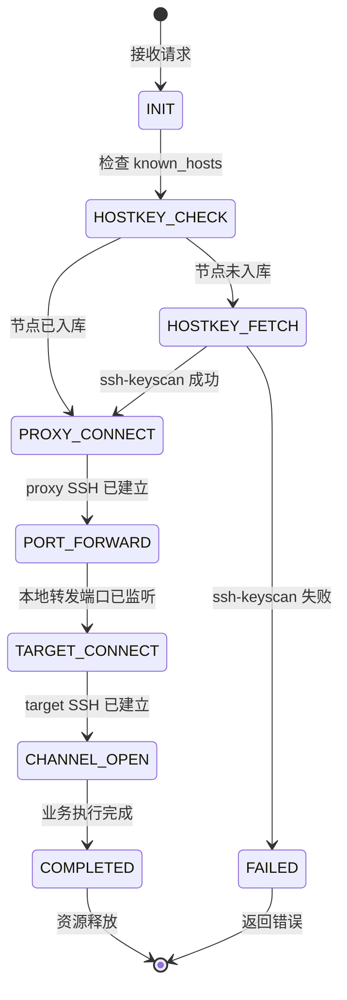
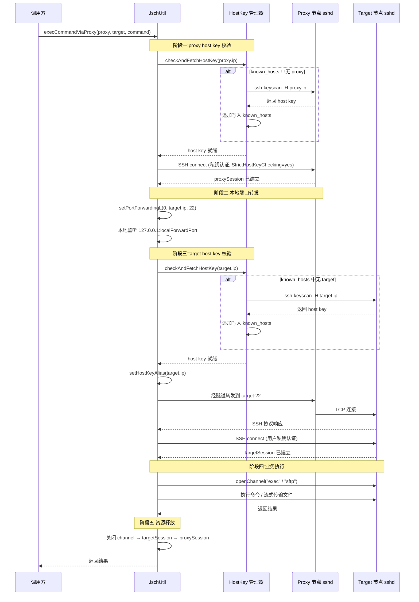
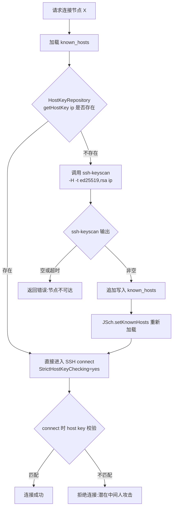
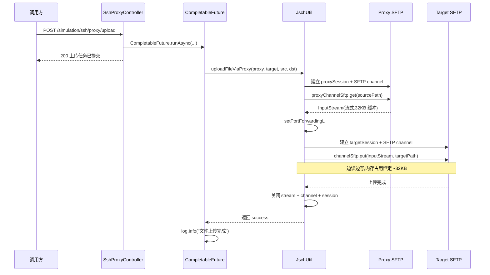

# SSH端口转发与主机密钥管理系统设计

## 1. 系统定位

SSH 端口转发与主机密钥管理系统是 `openlibing-simulation` 的底层通信基础设施，负责 Java 服务与远程节点（QEMU 宿主机、用户节点）之间的安全 Shell 通信。该系统主要支撑以下业务场景：

- 通过中间代理节点（proxy）连接到不可直达的目标节点（target）执行远程命令
- 通过代理节点向目标节点流式传输大文件（最大十几个 GB 量级）
- 在动态新增节点的场景下，保证 SSH 主机密钥（host key）校验的严格性与可用性
- 防止中间人攻击（MITM）和未授权节点接入

该系统基于 JSch 实现，所有 SSH 连接均采用私钥认证，禁用密码登录。

### 1.1 实际部署链路（CCE → 中间节点 ECS → 实验室物理机）

`openlibing-simulation` 服务部署于华为云 **CCE 容器**，业务目标节点为**内蒙古和林机房实验室物理机**（QEMU 仿真环境宿主机）。由于容器与实验室物理机跨网络隔离，通过华为云 **ECS 中间节点**（`10.0.19.248`）建立双层 SSH 隧道实现安全通信：

| 链路角色               | 部署位置                    | 说明                                                                                  |
| ---------------------- | --------------------------- | ------------------------------------------------------------------------------------- |
| Java 服务（本系统）    | 华为云 CCE 容器             | `openlibing-simulation` 实例，经 VPN 隧道访问实验室                                   |
| proxy 节点（中间节点） | 华为云 ECS（`10.0.19.248`） | SSH 隧道中转节点，已部署 sshd 并配置 `AllowTcpForwarding yes`；VPN 隧道到实验室已打通 |
| target 节点            | 内蒙古和林机房实验室物理机  | QEMU 仿真环境宿主机，远程命令执行与镜像/部署文件下发目标                              |

链路数据流：

```
CCE 容器 ──①SSH(私钥认证)──▶ ECS 中间节点(10.0.19.248) ──②端口转发──▶ 实验室物理机(QEMU 仿真环境)
   ▲                                                                          │
   └────────────────────③内层 SSH(SFTP/exec, 端到端加密)──────────────────────┘
```

- **控制面**：部署/关闭 QEMU 任务时，经隧道执行远程命令（建目录、load 镜像、跑脚本、校验端口等）
- **数据面**：qcow 仿真镜像、引擎部署包经双层 SSH/SFTP **流式传输**下发到物理机，避免大文件占用容器内存
- 安全设计细节见 [6.6 节](#66-部署链路安全设计cce--ecs--实验室物理机)

## 2. 业务边界

| 边界类型   | 说明                                                                                                                                      |
| ---------- | ----------------------------------------------------------------------------------------------------------------------------------------- |
| 上游依赖   | QEMU 任务调度模块、节点管理模块、SshProxyController                                                                                       |
| 下游依赖   | 远程节点 sshd 服务、容器内 `openssh-client`（提供 `ssh-keyscan`）                                                                         |
| 外部接口   | 无（仅作为内部工具被其他模块调用）                                                                                                        |
| 内部接口   | `/simulation/ssh/proxy/exec`（远程命令执行）、`/simulation/ssh/proxy/upload`（异步文件上传）                                              |
| 网络依赖   | Java 容器需能直连 proxy 节点 22 端口；proxy 节点需能直连 target 节点 22 端口；Java 容器需能直连 target 节点 22 端口（用于 `ssh-keyscan`） |
| 数据持久化 | `/etc/openlibing/known_hosts` 文件（容器内，持久化 host key）                                                                             |

## 3. 领域模型

### 3.1 核心实体

| 实体                | 说明             | 关键字段                              |
| ------------------- | ---------------- | ------------------------------------- |
| `RemoteConnect`     | 代理节点连接信息 | userName, ip, port                    |
| `QemuRemoteConnect` | 目标节点连接信息 | userName, ip, port                    |
| `JSch`              | SSH 客户端实例   | 身份（私钥）、known_hosts 仓库        |
| `Session`           | SSH 会话         | host, port, identity, config, timeout |
| `ChannelSftp`       | SFTP 通道        | sourceStream, targetStream            |
| `ChannelExec`       | 命令执行通道     | command, inputStream, errStream       |
| `HostKey`           | 主机密钥         | host, type, key                       |
| `HostKeyRepository` | 主机密钥仓库     | known_hosts 文件路径                  |

### 3.2 私钥与配置实体

| 实体                    | 说明                         | 来源                                         |
| ----------------------- | ---------------------------- | -------------------------------------------- |
| `proxyPrivateKey`       | 代理节点私钥（加密存储）     | 应用配置，运行时 `SecurityUtil.decrypt` 解密 |
| `userPrivateKey`        | 目标节点用户私钥（加密存储） | 应用配置，运行时 `SecurityUtil.decrypt` 解密 |
| `StrictHostKeyChecking` | 主机密钥校验策略             | 代码内固定为 `yes`                           |
| `known_hosts`           | 已知主机密钥文件             | `/etc/openlibing/known_hosts`                |
| `session.setTimeout`    | Socket I/O 超时              | 600000ms（10 分钟）                          |

### 3.3 连接拓扑状态机



## 4. 核心流程

### 4.1 SSH 端口转发总体流程



### 4.2 端口转发详细步骤

1. **建立 proxy SSH 连接**：使用 proxy 私钥认证，连接 `proxy.ip:22`，外层加密隧道建立。
2. **建立本地端口转发**：调用 `proxySession.setPortForwardingL(0, target.ip, 22)`，由系统分配随机本地端口 `localForwardPort`，避免并发任务端口冲突。
3. **建立 target SSH 连接**：`targetSession` 连接 `127.0.0.1:localForwardPort`，通过 `setHostKeyAlias(target.ip)` 让 host key 按 target 真实 IP 校验和记录；使用 target 用户私钥认证。
4. **开 Channel 执行业务**：在 `targetSession` 上开 `exec` channel 执行命令，或开 `sftp` channel 做文件流式传输。
5. **资源释放**：按 channel → targetSession → proxySession 顺序关闭，端口转发随 proxySession 关闭自动撤销。

### 4.3 Host Key 自动补抓流程



### 4.4 异步文件上传流程



## 5. 实现机制

### 5.1 双层 SSH 加密结构

```
[SSH 隧道层 (Java ↔ proxy)]    ← 外层加密,使用 proxy 私钥
  └─[SSH 负载层 (Java ↔ target)]  ← 内层加密,使用 target 用户私钥
      └─[Channel 数据 (exec/sftp)]
```

- 外层：Java 与 proxy 之间的 SSH 通道，承载端口转发的 TCP 流量
- 内层：Java 与 target 之间的 SSH 协议，嵌套在外层隧道内传输
- 双层加密带来更高安全性，CPU 开销略增（可接受）

### 5.2 本地端口转发参数说明

```java
int localForwardPort = proxySession.setPortForwardingL(
    0,                  // 本地监听端口,0 = 系统分配随机端口
    target.getIp(),     // 转发目标 IP
    targetPort          // 转发目标端口(22)
);
```

等价于 OpenSSH 命令：`ssh -L 0:target.ip:22 user@proxy.ip`

- 首参传 `0` 由系统分配随机端口，避免并发转发任务端口冲突
- 本地监听地址为 `127.0.0.1`，不对外暴露（`GatewayPorts no` 等效）
- 端口转发随 `proxySession` 关闭自动撤销

### 5.3 Host Key 仓库管理

```java
JSch jSch = new JSch();
jSch.setKnownHosts("/etc/openlibing/known_hosts");

// 检查节点是否已入库
HostKeyRepository repo = jSch.getHostKeyRepository();
HostKey[] existing = repo.getHostKey(nodeIp, null);

if (existing == null || existing.length == 0) {
    // [并发保护] 使用 per-host 锁防止多线程同时触发 ssh-keyscan
    // 方案: 使用 ConcurrentHashMap<String, Object> 以 nodeIp 为 key 做 putIfAbsent 去重
    // 确保同一时刻只有一个线程执行 ssh-keyscan，其他线程等待后重读 known_hosts
    Object lock = hostLockMap.putIfAbsent(nodeIp, new Object());
    if (lock != null) {
        synchronized (lock) {
            // 二次检查(Double-Check): 防止等待期间其他线程已完成写入
            existing = repo.getHostKey(nodeIp, null);
            if (existing != null && existing.length > 0) {
                hostLockMap.remove(nodeIp);
                // 已有其他线程完成入库，跳过抓取
            } else {
                try {
                    // 未入库,调用 ssh-keyscan 抓取
                    ProcessBuilder pb = new ProcessBuilder(
                        "ssh-keyscan", "-H", "-t", "ed25519,rsa", nodeIp
                    );
                    pb.redirectErrorStream(false);
                    Process process = pb.start();
                    String output = readProcessOutput(process);  // 读取 stdout

                    if (StringUtils.isBlank(output)) {
                        throw new ServiceException("Node " + nodeIp + " unreachable for ssh-keyscan");
                    }

                    // 追加写入 known_hosts 文件
                    Files.write(Paths.get("/etc/openlibing/known_hosts"),
                                output.getBytes(StandardCharsets.UTF_8),
                                StandardOpenOption.CREATE, StandardOpenOption.APPEND);

                    // 重新加载
                    jSch.setKnownHosts("/etc/openlibing/known_hosts");
                } finally {
                    hostLockMap.remove(nodeIp);
                }
            }
        }
    }
}

// 严格校验模式连接
Properties config = new Properties();
config.put("StrictHostKeyChecking", "yes");
session.setConfig(config);
session.connect();
```

### 5.4 流式文件传输

```java
// 通过 proxy SFTP 打开源文件输入流(不读入内存)
proxyChannelSftp = (ChannelSftp) proxySession.openChannel("sftp");
proxyChannelSftp.connect();
sourceStream = proxyChannelSftp.get(sourcePath);   // 返回 InputStream

// 通过 target SFTP 流式上传
targetChannelSftp = (ChannelSftp) targetSession.openChannel("sftp");
targetChannelSftp.connect();
targetChannelSftp.put(sourceStream, targetPath);   // 边读边写
```

| 文件大小 | 内存占用 | 传输耗时（100MB/s 链路） |
| -------- | -------- | ------------------------ |
| 1 GB     | ~32 KB   | ~10 秒                   |
| 10 GB    | ~32 KB   | ~100 秒                  |
| 100 GB   | ~32 KB   | ~17 分钟                 |

内存占用恒定，与文件大小无关，由 SFTP 内部 32KB 缓冲区决定。

### 5.5 超时配置

| 配置项                                  | 值       | 作用                                        |
| --------------------------------------- | -------- | ------------------------------------------- |
| `session.setTimeout(600000)`            | 600 秒   | Socket I/O 超时，防止网络中断时线程永久挂起 |
| `execCommandViaProxy(..., readTimeout)` | 600000ms | 单条命令总执行超时                          |
| `ssh-keyscan` 进程超时                  | 10 秒    | host key 抓取超时，防止不可达节点长时间阻塞 |

## 6. 安全设计

### 6.1 主机密钥校验策略

| 节点状态                 | 校验行为                                       | 安全性              |
| ------------------------ | ---------------------------------------------- | ------------------- |
| 已入库节点（首次连接后） | `StrictHostKeyChecking=yes`，严格校验          | ✅ 防中间人攻击     |
| 已入库节点 host key 变化 | 拒绝连接，抛 `JSchException: HostKey mismatch` | ✅ 防节点冒充       |
| 新节点首次连接           | `ssh-keyscan` 抓取 host key 入库后严格校验     | ⚠️ 首次信任抓取结果 |
| `ssh-keyscan` 不可达节点 | 拒绝连接，返回错误                             | ✅ 防无效节点       |

### 6.2 渐进式信任模型

- **首次连接**：通过 `ssh-keyscan` 抓取 host key 并写入 known_hosts（信任首次抓取结果）
- **二次及以后**：严格校验 known_hosts 中的 host key，任何变化都拒绝连接
- **节点重装后**：known_hosts 中的旧 key 与新 key 不匹配，需运维手动执行 `ssh-keygen -R <ip>` 删除旧 key 后重新抓取

### 6.3 私钥管理

| 项           | 策略                                                   |
| ------------ | ------------------------------------------------------ |
| 存储方式     | 应用配置中加密存储，运行时 `SecurityUtil.decrypt` 解密 |
| 内存生命周期 | 解密后以 `byte[]` 形式存在，使用完毕由 GC 回收         |
| 日志策略     | **禁止打印私钥内容**，仅记录节点 IP 和用户名           |
| 传输策略     | 私钥仅在 Java 进程内存中，不通过网络传输               |

### 6.4 网络层防护

| 威胁           | 防护措施                                                        |
| -------------- | --------------------------------------------------------------- |
| 中间人攻击     | 双层 SSH 加密 + 已知节点 host key 严格校验                      |
| 未授权节点接入 | 私钥认证 + `PasswordAuthentication no`（节点侧配置）            |
| 端口转发滥用   | proxy 节点 sshd 配置 `AllowTcpForwarding yes`（仅允许受控转发） |
| 本地端口暴露   | 本地转发端口监听 `127.0.0.1`，不对外暴露                        |
| 私钥泄露       | 应用配置加密 + 容器内文件权限控制                               |

### 6.5 host key 校验绕过场景与拒绝策略

| 尝试绕过场景          | 系统行为                                 |
| --------------------- | ---------------------------------------- |
| 删除 known_hosts 文件 | 下次连接重新抓取，不降级为 `no` 模式     |
| 篡改 known_hosts 文件 | 文件变更后 host key 不匹配，拒绝连接     |
| 伪造节点 IP           | host key 与 known_hosts 不匹配，拒绝连接 |
| 节点重装系统          | host key 变化，拒绝连接，需运维介入      |

### 6.6 部署链路安全设计（CCE → ECS → 实验室物理机）

针对 1.1 节实际部署链路，各安全机制在链路各环的落地方式如下：

| 链路环节                            | 安全机制                           | 落地设计                                                                                                                                                                                                                                            |
| ----------------------------------- | ---------------------------------- | --------------------------------------------------------------------------------------------------------------------------------------------------------------------------------------------------------------------------------------------------- |
| CCE 容器 ↔ ECS 中间节点（外层）     | SSH 私钥认证 + host key 严格校验   | 使用 proxy 私钥（`privateKey.to.proxy.node`），`StrictHostKeyChecking=yes`；首连 `ssh-keyscan` 抓取 ECS host key 入库                                                                                                                               |
| ECS 中间节点 → 实验室物理机（转发） | 本地端口转发（-L）                 | `setPortForwardingL(0, target.ip, 22)`，本地监听 `127.0.0.1` 随机端口（范围 10000-65535），不对外暴露                                                                                                                                               |
| CCE 容器 ↔ 实验室物理机（内层）     | 端到端 SSH + host key 严格校验     | 使用用户私钥（`privateKey.to.user.node`），host key 按物理机真实 IP 记录与校验（`setHostKeyAlias`）                                                                                                                                                 |
| 私钥全链路                          | 加密存储、运行期内存解密、禁止落盘 | 配置中心密文 → `SecurityUtil.decrypt` → `byte[]` 内存中 `addIdentity` → 关闭时 `Arrays.fill` 清零；**禁止打印私钥内容**                                                                                                                             |
| 节点密码下发                        | 对称加密 + 密钥安全通道分发        | 部署密钥 `security.aesgcm.key` 解密后以 base64 写入物理机 `/opt/install/conf/aes.key`（600 权限）；节点密码经 `AesGcmUtil`（AES-256-CBC）加密写入 `env.ini` 的 `node_pwd_N`/`controller_pwd`，容器内 `openssl` 解密使用；**部署结束删除 `aes.key`** |
| 接口返回凭据                        | 二次加密传输                       | 查询环境凭据时，明文密码 `SecurityUtil.decrypt` 后经 `AesGcmUtil` 二次加密返回，调用方持有密钥解密                                                                                                                                                  |
| 命令执行                            | 白名单 + 转义 + 审计               | 仅允许 `ssh`/`sshpass`/`ssh-keygen`/`bash <脚本>`/`docker` 等白名单模式，拒绝危险模式；参数经 `ShellEscapeUtils` 转义；远程命令操作记录审计日志                                                                                                     |
| 日志链路                            | 脱敏                               | `SensitiveDataConverter`（logback 转换器）自动脱敏私钥、密码、Token、IP 等敏感信息                                                                                                                                                                  |
| 镜像与节点侧                        | sshd 加固                          | 容器镜像 `openssh-clients` 提供 `ssh-keyscan`；容器 sshd 配置 `PasswordAuthentication no`、`PermitRootLogin no`、`AllowTcpForwarding no`；ECS 中间节点需 `AllowTcpForwarding yes`                                                                   |

#### 6.6.1 Issue #18 安全约束落实对照

| 约束                                                   | 落地实现                                                                                             |
| ------------------------------------------------------ | ---------------------------------------------------------------------------------------------------- |
| 私钥必须加密存储于 Apollo，运行期仅内存解密，禁止落盘  | 私钥在配置中心密文存储，运行时 `SecurityUtil.decrypt` 解密为内存 `byte[]`，使用后 `Arrays.fill` 清零 |
| SSH 连接必须开启 `StrictHostKeyChecking=yes`           | `setStrictHostKeyChecking` 固定为 `yes`，host key 变化即拒绝连接                                     |
| 密码加密传输使用双方约定对称加密算法，密钥安全通道分发 | AES-256-CBC（`AesGcmUtil`），部署密钥经 `aes.key` 文件随部署下发，部署结束回收                       |
| 自定义 qcow 文件大小不超过 10GB                        | 上传/部署时校验 qcow 附件文件大小（`file_size`/`decompressed_size`），超限拒绝                       |

#### 6.6.2 链路安全设计决策说明

1. **为何采用双层 SSH 隧道而非单层**：实验室物理机对 CCE 容器不可直达（跨 VPN/隔离网络），ECS 中间节点是唯一出口；双层 SSH 使 CCE 与物理机之间保持端到端加密，ECS 仅作 TCP 转发，无法窥探业务数据。
2. **为何 host key 采用渐进式信任**：物理机数量与 IP 动态变化，首次 `ssh-keyscan` 抓取 + 后续严格校验，在可用性与防 MITM 之间取得平衡；节点重装（host key 变化）必须运维人工介入。
3. **为何节点密码采用 CBC 而非 GCM**：容器内 `openssl enc` 不支持 GCM（AEAD ciphers not supported），Java 端加密须与容器内解密互通，统一采用 AES-256-CBC。
4. **为何接口返回凭据二次加密**：`SecurityUtil` 主密钥（`part1`）为系统级密钥，不宜直接暴露给调用方；经独立部署密钥二次加密后，凭据仅对持有部署密钥的合法流程可见。

## 7. 接口列表

| API 路径                       | HTTP方法 | 功能描述                           | 同步/异步 |
| ------------------------------ | -------- | ---------------------------------- | --------- |
| `/simulation/ssh/proxy/exec`   | POST     | 通过代理节点在目标节点执行远程命令 | 同步      |
| `/simulation/ssh/proxy/upload` | POST     | 通过代理节点向目标节点异步上传文件 | 异步      |

### 7.1 `/simulation/ssh/proxy/exec` 请求参数

```json
{
  "proxyIp": "10.0.19.248",
  "proxyPort": "22",
  "proxyUser": "root",
  "targetIp": "192.168.41.75",
  "targetPort": "22",
  "targetUser": "root",
  "command": "ls /root"
}
```

### 7.2 `/simulation/ssh/proxy/upload` 请求参数

```json
{
  "proxyIp": "10.0.19.248",
  "proxyPort": "22",
  "proxyUser": "root",
  "targetIp": "192.168.41.75",
  "targetPort": "22",
  "targetUser": "root",
  "sourcePath": "/data/qemu/image.qcow2",
  "targetPath": "/root/image.qcow2"
}
```

**响应**（立即返回，不等待上传完成）：

```json
{
  "code": 200,
  "message": "上传任务已提交",
  "data": null
}
```

上传结果仅记录到应用日志，调用方需通过日志确认成功/失败。

## 8. 异常处理

### 8.1 异常分类与处理策略

| 异常场景                                  | 处理策略                     | 返回值/行为                                 |
| ----------------------------------------- | ---------------------------- | ------------------------------------------- |
| `ssh-keyscan` 抓取失败（节点不可达）      | 记录错误日志，返回错误       | 同步接口返回 `failed`，异步任务记录失败日志 |
| `ssh-keyscan` 进程超时                    | 销毁进程，返回错误           | 同上                                        |
| proxy SSH 连接失败                        | 记录错误日志，释放资源       | 同步接口返回 `failed`                       |
| proxy 认证失败（私钥不匹配）              | 记录错误日志，释放资源       | 同步接口返回 `failed`                       |
| 端口转发被拒绝（`AllowTcpForwarding no`） | 记录错误日志，释放资源       | 同步接口返回 `failed`                       |
| target SSH 连接失败                       | 记录错误日志，释放资源       | 同步接口返回 `failed`                       |
| target 认证失败                           | 记录错误日志，释放资源       | 同步接口返回 `failed`                       |
| HostKey mismatch（已知节点 key 变化）     | 记录警告日志，拒绝连接       | 同步接口返回 `failed`                       |
| 命令执行超时                              | 强制断开 channel，释放资源   | 同步接口返回 `failed`                       |
| 文件上传网络中断                          | socket 超时触发，释放资源    | 异步任务记录失败日志                        |
| 文件上传磁盘空间不足                      | SftpException 抛出，释放资源 | 异步任务记录失败日志                        |
| known_hosts 文件不存在                    | 首次写入时自动创建           | 正常流程                                    |

### 8.2 资源释放保证

所有 SSH 资源在 `finally` 块中按反向顺序释放，确保异常路径下不泄漏：

```java
finally {
    // 1. 关闭业务 channel
    if (channel != null && channel.isConnected()) channel.disconnect();
    // 2. 关闭 targetSession(内层)
    if (targetSession != null && targetSession.isConnected()) targetSession.disconnect();
    // 3. 关闭 proxySession(外层,端口转发随其自动撤销)
    if (proxySession != null && proxySession.isConnected()) proxySession.disconnect();
    // 4. 关闭流
    if (in != null) try { in.close(); } catch (IOException e) { log.error(...); }
}
```

## 9. 性能优化

### 9.1 连接复用考量

当前实现每次调用均新建两条 SSH 连接，固定开销约 0.6-1.5 秒。未来如需优化可引入 SSH 连接池，但需权衡：

- 连接池需处理 host key 变化、私钥轮换等场景
- 长连接可能因网络中断失效，需心跳保活
- 当前调用频率不高（QEMU 任务调度级别），连接池收益有限

### 9.2 大文件传输优化

| 优化点     | 策略                                      | 效果                                         |
| ---------- | ----------------------------------------- | -------------------------------------------- |
| 流式传输   | SFTP `get` + `put` 直接对接 InputStream   | 内存占用恒定 32KB，支持任意大小文件          |
| 异步执行   | `CompletableFuture.runAsync` 提交上传任务 | 接口立即返回，不阻塞调用方                   |
| 二进制安全 | SFTP 协议天然支持二进制                   | 避免文本协议（如 `cat`）对二进制文件的损坏   |
| 超时容错   | socket 超时 600 秒                        | 网络抖动 10 分钟内可恢复，不会因瞬时中断报错 |

### 9.3 host key 查询性能

| 场景           | 耗时                                      |
| -------------- | ----------------------------------------- |
| 已入库节点连接 | host key 查询 < 1ms（内存读文件）         |
| 新节点首次连接 | ssh-keyscan 1-2 秒 + host key 入库 < 10ms |
| 新节点二次连接 | host key 查询 < 1ms                       |

## 10. 部署依赖

### 10.1 Dockerfile 要求

```dockerfile
FROM eclipse-temurin:8-jre

WORKDIR /app
COPY target/openlibing-simulation.jar app.jar

# 必需:提供 ssh-keyscan 命令
RUN apt-get update && apt-get install -y openssh-client && rm -rf /var/lib/apt/lists/*

# 创建 known_hosts 存放目录(文件由 Java 代码首次写入时自动创建)
RUN mkdir -p /etc/openlibing

EXPOSE 8108
ENTRYPOINT ["java", "-jar", "app.jar"]
```

### 10.2 节点侧 sshd 配置要求

**proxy 节点**（`/etc/ssh/sshd_config`）：

```sshd_config
AllowTcpForwarding yes          # 必须:允许端口转发
PasswordAuthentication no       # 必须:禁用密码登录
PubkeyAuthentication yes        # 必须:启用密钥认证
```

**target 节点**（`/etc/ssh/sshd_config`）：

```sshd_config
PasswordAuthentication no       # 必须:禁用密码登录
PubkeyAuthentication yes        # 必须:启用密钥认证
```

### 10.3 网络可达性要求

| 源         | 目标        | 端口 | 用途                      |
| ---------- | ----------- | ---- | ------------------------- |
| Java 容器  | proxy 节点  | 22   | SSH 连接 + host key 抓取  |
| Java 容器  | target 节点 | 22   | ssh-keyscan 抓取 host key |
| proxy 节点 | target 节点 | 22   | 端口转发目标 TCP 连接     |

**关键约束**：`ssh-keyscan` 是直接 TCP 连接目标节点 22 端口抓取 host key，**不支持经 SSH 代理抓取**。因此 Java 容器必须能直连 target 节点的 22 端口。

### 10.4 known_hosts 文件生命周期

| 阶段           | 文件状态                                                 |
| -------------- | -------------------------------------------------------- |
| 镜像构建时     | 不存在（无需 Dockerfile 预置）                           |
| 容器首次启动   | 不存在，由 Java 代码首次写入时自动创建                   |
| 运行中新增节点 | 自动追加新节点 host key                                  |
| 容器重启       | 文件保留（如挂载持久化卷）或重置（如使用容器内文件系统） |
| 镜像重建       | 文件不保留，首次连接重新抓取                             |

**建议**：生产环境挂载持久化卷到 `/etc/openlibing`，避免容器重启后所有节点需重新抓取 host key。

## 11. 监控与日志

### 11.1 日志记录策略

| 日志级别 | 记录内容                         | 示例                                                       |
| -------- | -------------------------------- | ---------------------------------------------------------- |
| INFO     | 连接建立、端口转发、业务执行成功 | `Connected to proxy node: root@10.0.19.248:22`             |
| INFO     | host key 抓取与入库              | `Host key scanned and added for: 192.168.41.75`            |
| WARN     | host key 变化拒绝连接            | `HostKey mismatch for 192.168.41.75, possible MITM attack` |
| ERROR    | 连接失败、认证失败、执行异常     | `execCommandViaProxy fail` + 异常堆栈                      |
| 禁止     | 私钥内容、密码、敏感数据         | 不记录                                                     |

### 11.2 关键监控指标

| 指标                           | 说明                     | 告警阈值建议            |
| ------------------------------ | ------------------------ | ----------------------- |
| `ssh_connect_success_count`    | SSH 连接成功次数         | -                       |
| `ssh_connect_fail_count`       | SSH 连接失败次数         | 5 分钟内 > 10 次        |
| `ssh_hostkey_mismatch_count`   | host key 不匹配次数      | > 0 即告警（潜在 MITM） |
| `ssh_hostkey_scan_count`       | 新节点 host key 抓取次数 | -                       |
| `ssh_upload_duration_seconds`  | 文件上传耗时             | > 1800 秒（30 分钟）    |
| `ssh_command_duration_seconds` | 命令执行耗时             | > 60 秒                 |
| `ssh_known_hosts_size`         | known_hosts 文件条目数   | 突然大幅变化告警        |

## 12. 安全评审要点

### 12.1 已 mitigated 的风险

| 风险                         | Mitigation                            |
| ---------------------------- | ------------------------------------- |
| 中间人攻击（Java ↔ proxy）   | SSH 加密 + host key 严格校验          |
| 中间人攻击（proxy ↔ target） | 内层 SSH 加密（Java ↔ target 端到端） |
| 未授权节点接入               | 私钥认证 + 节点侧禁用密码登录         |
| 本地转发端口暴露             | 监听 `127.0.0.1`，不对外暴露          |
| 私钥泄露                     | 加密存储 + 禁止日志打印               |
| 大文件 OOM                   | SFTP 流式传输，内存占用恒定           |
| 资源泄漏                     | finally 块严格按序释放                |
| 网络中断线程挂起             | Socket 超时 600 秒                    |
| 首次连接 host key 伪造       | 内网受控环境 + ssh-keyscan 直连目标   |

### 12.2 残留风险与接受理由

| 残留风险                                | 接受理由                                                                                                                                                                                                                    |
| --------------------------------------- | --------------------------------------------------------------------------------------------------------------------------------------------------------------------------------------------------------------------------- |
| 新节点首次连接信任 ssh-keyscan 抓取结果 | 内网受控环境，Java 容器与节点网络可达性受控；首次抓取后即严格校验，符合"渐进式信任"模型                                                                                                                                     |
| `ssh-keyscan` 不可达时无法连接 target   | 业务约束：target 必须对 Java 容器网络可达，否则端口转发也无法进行（proxy 到 target 仍需可达）                                                                                                                               |
| 节点重装后需运维手动清理 known_hosts    | 安全设计：host key 变化必须人工确认，防止节点冒充                                                                                                                                                                           |
| known_hosts 文件无签名保护              | 文件位于容器内受控路径，无外部写入路径；如需更强保护可挂载只读 ConfigMap                                                                                                                                                    |
| **known_hosts 并发写入竞态（TOCTOU）**  | 多线程并发连接新节点时，可能同时触发 ssh-keyscan 和文件 APPEND 写入，导致 known_hosts 出现重复条目或交叉写入。当前设计已补充 per-host ConcurrentHashMap 锁 + Double-Check 机制缓解，详见 5.3 节；若需进程级文件锁可后续升级 |

### 12.3 待安全团队确认事项

1. **渐进式信任模型**是否符合公司安全规范？（首次 `ssh-keyscan` 信任 + 后续严格校验）
2. **known_hosts 文件持久化**策略：容器内文件 vs 挂载持久化卷 vs ConfigMap，哪种符合安全规范？
3. **私钥加密存储**的密钥管理：当前 `SecurityUtil.decrypt` 使用的密钥（`part1`）是否需要纳入 KMS 管理？
4. **ssh-keyscan 命令**在容器内执行的权限边界是否需要进一步限制？
5. **600 秒 socket 超时**是否过长？是否需要缩短以更快感知网络中断？
6. **异步上传任务无状态查询接口**：当前上传结果仅记录日志，是否需要增加状态查询接口供调用方确认？
7. **known_hosts 并发写入保护**：当前采用进程内 `ConcurrentHashMap` per-host 锁方案，是否需要升级为进程级文件锁（如 `FileChannel.lock()`）以应对多实例部署场景？

## 13. 历史演进

| 版本         | 变更                                                 | 原因                                  |
| ------------ | ---------------------------------------------------- | ------------------------------------- |
| v1           | `StrictHostKeyChecking=no`，无 `setKnownHosts`       | 初版实现，优先可用性                  |
| v2           | 文件上传改 SFTP 流式传输                             | 原 `cat` 读入内存方式 10GB 文件必 OOM |
| v3           | `/proxy/upload` 改异步执行                           | 大文件上传阻塞接口，调用方超时        |
| v4           | socket 超时统一为 600 秒                             | 原 30/50 秒在慢网络下误杀正常操作     |
| v5（本设计） | 引入 host key 自动补抓 + `StrictHostKeyChecking=yes` | 提升安全性，支持动态新增节点          |

## 14. 附录

### 14.1 关键代码位置

- SSH 工具类：`openlibing-simulation/src/main/java/com/openlibing/simulation/utils/JschUtil.java`
- 代理接口控制器：`openlibing-simulation/src/main/java/com/openlibing/simulation/controller/SshProxyController.java`

### 14.2 术语表

| 术语                  | 说明                                       |
| --------------------- | ------------------------------------------ |
| host key              | SSH 服务器的主机公钥，用于标识服务器身份   |
| known_hosts           | 客户端存储的已知主机公钥列表               |
| StrictHostKeyChecking | SSH 客户端的主机密钥校验策略（yes/ask/no） |
| 端口转发              | 通过 SSH 隧道转发 TCP 流量                 |
| 本地端口转发（-L）    | 在客户端本地监听端口，转发到远程目标       |
| proxy 节点            | 中间转发节点，Java 服务先连到此节点        |
| target 节点           | 最终业务目标节点，经 proxy 隧道连接        |
| MITM                  | Man-In-The-Middle，中间人攻击              |
| ssh-keyscan           | OpenSSH 工具，抓取远程主机的 host key      |
