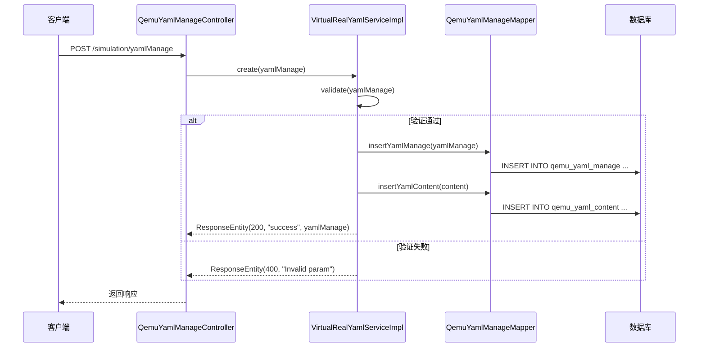
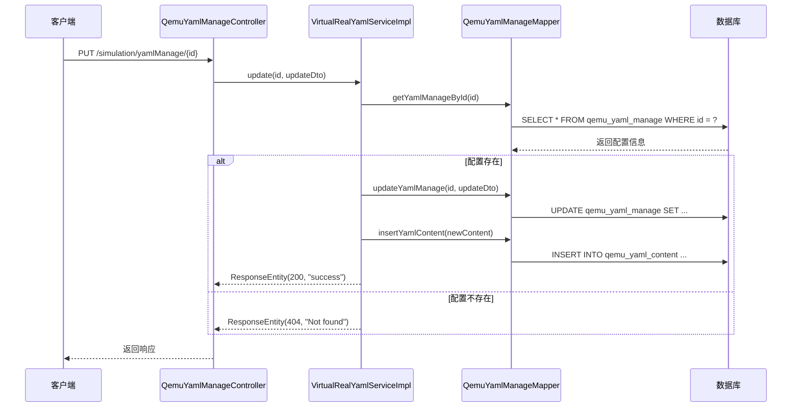
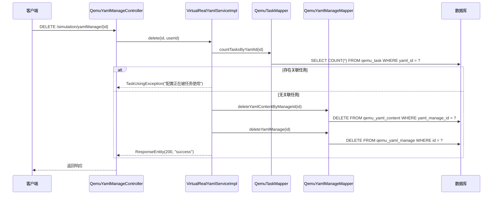
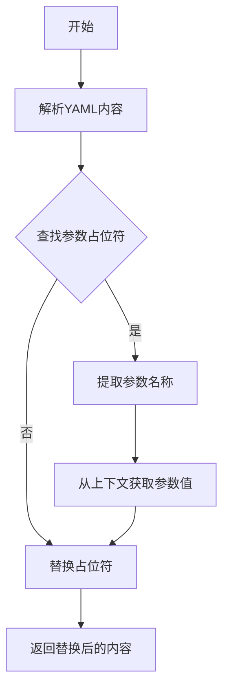
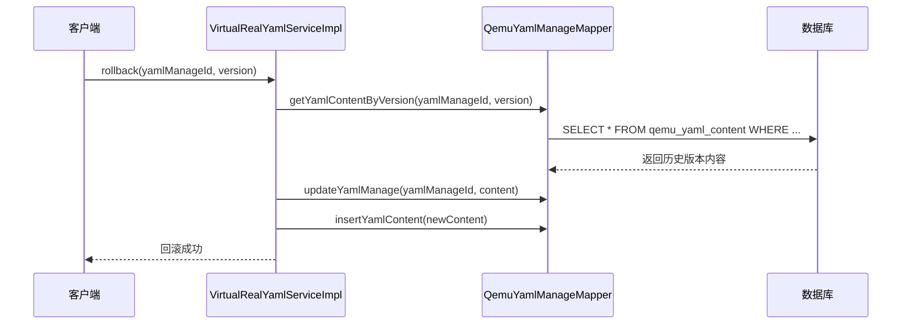

# YAML配置管理系统设计

## 1. 系统定位

YAML配置管理系统是 `openlibing-simulation` 的配置中心模块，负责管理QEMU仿真环境的YAML模板和配置。该系统支持配置的创建、编辑、查询、删除和版本管理，为节点管理和任务调度提供配置支撑。

## 2. 业务边界

| 边界类型 | 说明 |
| --- | --- |
| 上游依赖 | 前端配置管理界面 |
| 下游依赖 | 节点管理模块、QEMU任务调度模块、数据库 |
| 外部接口 | 无 |
| 内部接口 | 提供YAML配置的CRUD API |

## 3. 领域模型

### 3.1 核心实体

| 实体 | 说明 | 关键字段 |
| --- | --- | --- |
| `QemuYamlManageEntity` | YAML配置管理实体 | id, name, subScene, yamlContent, createBy, updateBy |
| `QemuYamlContentEntity` | YAML内容实体 | id, content, version, yamlManageId |
| `ParameterCustomization` | 参数定制实体 | parameterName, parameterValue, description |
| `UpdateYamlManageDto` | 更新YAML DTO | name, subScene, yamlContent |

### 3.2 配置结构

```yaml
# YAML配置模板结构
name: string                    # 配置名称
subScene: string                # 子场景（如：qemu_single_node, qemu_multiple_node）
yamlContent: string             # YAML内容（JSON格式存储）
createBy: string                # 创建人
createTime: datetime            # 创建时间
updateBy: string                # 更新人
updateTime: datetime            # 更新时间
```

### 3.3 YAML内容结构

```yaml
# YAML内容内部结构
engineType: string              # 引擎类型（lingQuQemu, npuQemu, matrixSvrQemu）
architecture: string            # 架构类型（ARM, x86）
cpu: int                        # CPU核数
memory: int                     # 内存大小（GB）
executeCommand: string          # 执行命令
parameters:                     # 自定义参数
  - name: string
    value: string
    description: string
```

## 4. 核心流程

### 4.1 创建YAML配置流程



### 4.2 更新YAML配置流程



### 4.3 删除YAML配置流程



## 5. 参数定制机制

### 5.1 参数类型

| 参数类型 | 说明 | 示例 |
| --- | --- | --- |
| 固定参数 | 直接配置的值 | cpu: 16 |
| 动态参数 | 根据规则计算的值 | useCpu: ${cpu} * 2 |
| 环境参数 | 从环境变量获取 | host: ${HOST_IP} |

### 5.2 参数替换流程



### 5.3 参数替换语法

```yaml
# 参数占位符格式
${parameterName}

# 示例
cpu: ${baseCpu}
memory: ${baseMemory}
host: ${NODE_IP}
```

## 6. 版本管理

### 6.1 版本记录

每次更新配置时，系统自动保存历史版本：

| 版本号 | 更新时间 | 更新人 | 变更内容 |
| --- | --- | --- | --- |
| v1.0 | 2026-03-20 10:00 | admin | 初始创建 |
| v1.1 | 2026-03-21 14:30 | user1 | 修改CPU配置 |
| v1.2 | 2026-03-22 09:15 | user2 | 添加新参数 |

### 6.2 版本回滚

支持从历史版本恢复配置：



## 7. 配置验证

### 7.1 语法验证

```java
public boolean validateYamlSyntax(String content) {
    try {
        Yaml yaml = new Yaml();
        yaml.load(content);
        return true;
    } catch (Exception e) {
        log.error("YAML syntax error: {}", e.getMessage());
        return false;
    }
}
```

### 7.2 业务规则验证

| 验证项 | 规则 | 错误信息 |
| --- | --- | --- |
| 名称唯一性 | 同子场景下名称不能重复 | "配置名称已存在" |
| 必填字段 | name、subScene、yamlContent不能为空 | "缺少必填字段" |
| CPU范围 | 1-128核 | "CPU核数超出范围" |
| 内存范围 | 1-1024GB | "内存大小超出范围" |
| 架构类型 | 只能是ARM或x86 | "不支持的架构类型" |

## 8. 接口列表

| API 路径 | HTTP方法 | 功能描述 |
| --- | --- | --- |
| `/simulation/yamlManage` | POST | 创建YAML配置 |
| `/simulation/yamlManage/{id}` | PUT | 更新YAML配置 |
| `/simulation/yamlManage/updateSubScene/{id}` | PUT | 更新子场景 |
| `/simulation/yamlManage/{id}` | GET | 查询配置详情 |
| `/simulation/yamlManage/{id}` | DELETE | 删除YAML配置 |
| `/simulation/yamlManage/list` | GET | 批量查询配置列表 |

## 9. 数据库表设计

### 9.1 qemu_yaml_manage（YAML配置管理表）

| 字段名 | 类型 | 说明 |
| --- | --- | --- |
| id | VARCHAR(64) | 主键ID |
| name | VARCHAR(255) | 配置名称 |
| sub_scene | VARCHAR(64) | 子场景 |
| yaml_content | TEXT | YAML内容 |
| create_by | VARCHAR(64) | 创建人 |
| create_time | DATETIME | 创建时间 |
| update_by | VARCHAR(64) | 更新人 |
| update_time | DATETIME | 更新时间 |

### 9.2 qemu_yaml_content（YAML内容历史表）

| 字段名 | 类型 | 说明 |
| --- | --- | --- |
| id | VARCHAR(64) | 主键ID |
| yaml_manage_id | VARCHAR(64) | 关联配置ID |
| content | TEXT | YAML内容 |
| version | VARCHAR(32) | 版本号 |
| create_time | DATETIME | 创建时间 |

## 10. 性能优化

### 10.1 缓存策略

- 常用配置缓存到内存，减少数据库查询
- 缓存过期时间：5分钟
- 配置更新时主动刷新缓存

### 10.2 分页查询

批量查询支持分页，默认每页10条记录：

```java
public ResponseEntity queryList(int pageNo, int pageSize, String name, String subScene) {
    PageHelper.startPage(pageNo, pageSize);
    List<QemuYamlManageEntity> list = qemuYamlManageMapper.queryList(name, subScene);
    PageInfo<QemuYamlManageEntity> pageInfo = new PageInfo<>(list);
    return new ResponseEntity(200, "success", pageInfo);
}
```

### 10.3 异步删除

删除配置时，如果关联数据较多，采用异步方式删除历史版本记录。