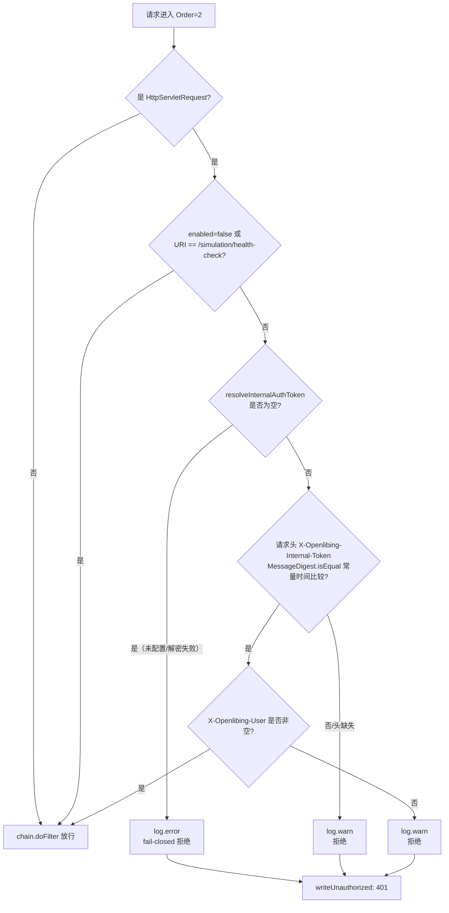

# 内部认证与操作日志系统设计

> 本文与代码基线 `master@4f22896` 对齐。所有结论均标注来源文件与行号。

## 1. 系统定位

本模块是 `openlibing-simulation` 的**接入层安全与审计基座**，由两个 Servlet Filter 组成：

| Filter                         | Order | 职责                                              |
| ------------------------------ | ----- | ------------------------------------------------- |
| `OperationLogFilter`           | 1     | 采集请求上下文，生成访问审计日志写入独立日志文件  |
| `InternalSimulationAuthFilter` | 2     | 校验内部共享密钥 + 机机身份头，实现服务级准入控制 |

两者均以 `@Component` 注册（`OperationLogFilter.java:41-44`、`InternalSimulationAuthFilter.java:53-56`），**未使用** `@WebFilter` / `FilterRegistrationBean` / `OncePerRequestFilter`，由 Spring Boot 自动注册为默认 `/*` 范围，覆盖全部路径。

`@Order` 值越小越先进入，因此执行顺序为 `OperationLogFilter` → `InternalSimulationAuthFilter` → Controller。

## 2. 业务边界

| 边界类型 | 说明                                                                                             |
| -------- | ------------------------------------------------------------------------------------------------ |
| 上游依赖 | APIG 网关（认证后注入 `X-Openlibing-User`）、Apollo（下发密钥密文）                              |
| 下游依赖 | 仅本地日志文件（`OperationLogFilter` **不访问数据库**）                                          |
| 对外接口 | 无（Filter 不是 REST 接口）                                                                      |
| 数据落地 | 普通日志 → `/var/logs/openlibing-simulation/openlibing-simulation.log`；审计日志 → `operate.log` |

## 3. InternalSimulationAuthFilter

### 3.1 常量与配置项

| 常量 / 配置                      | 值 / 默认值                      | 位置                                   |
| -------------------------------- | -------------------------------- | -------------------------------------- |
| `AUTH_HEADER`                    | `X-Openlibing-Internal-Token`    | `InternalSimulationAuthFilter.java:60` |
| `OPERATOR_HEADER`                | `X-Openlibing-User`              | `:65`                                  |
| `HEALTH_CHECK_PATH`              | `/simulation/health-check`       | `:70`                                  |
| `security.internal-auth.enabled` | **`@Value` 默认 `true`**         | `:75-76`                               |
| `security.internal-auth-token`   | 默认空串，Apollo 密文            | `:81-82`                               |
| `security.part1`                 | **无默认值**，缺失会导致注入失败 | `:84-85`                               |

三个请求头常量均为类内私有静态常量，**全仓没有统一的请求头常量类**：`X-Openlibing-User` 在 3 处各自重复定义（`InternalSimulationAuthFilter.java:65`、`OperationLogFilter.java:53`、`QemuTaskServiceImpl.java:185`）。

> **文档与代码的默认值矛盾**：类注释（`:43`）写「`security.internal-auth.enabled=false`（默认，beta 等无 APIG 环境）」，但 `@Value` 实际默认值是 `true`。即**未在 Nacos 显式配置时，行为是「开启校验」而非「放行」**——这是偏安全的 fail-closed 取向，但注释与代码不一致，容易误读。

### 3.2 密钥解密（懒加载 + 双重检查锁）

`resolveInternalAuthToken()`（`:97-115`）的实现要点：

1. 密文为空 → 直接返回 `null`，不尝试解密（`:98-100`）；
2. 用 `volatile boolean tokenDecryptAttempted` + `synchronized` 双重检查，**仅首次请求解密一次并缓存**（`:101-113`）；
3. 解密调用 `SecurityUtil.decrypt(internalAuthTokenEncrypted, part1)`（`openlibing-common`），失败时 `log.error` 并将结果置 `null`（`:106-109`）。

### 3.3 决策流程



### 3.4 fail-closed 语义

| 触发条件                              | 行为                                                             | 位置       |
| ------------------------------------- | ---------------------------------------------------------------- | ---------- |
| `enabled=true` 但密钥未配置或解密失败 | **拒绝**（记 `log.error`，明确提示 `not configured or invalid`） | `:134-140` |
| 密钥头缺失或与预期值不匹配            | 拒绝（记 `log.warn`）                                            | `:159-160` |
| 密钥匹配但 `X-Openlibing-User` 为空   | 拒绝（记 `log.warn`，提示 `missing operator context`）           | `:149-154` |

**不存在「配置缺失就放行」的分支。**

### 3.5 401 响应体

```java
private void writeUnauthorized(HttpServletResponse resp, HttpServletRequest req) throws IOException {
    resp.setStatus(HttpServletResponse.SC_UNAUTHORIZED);
    resp.setCharacterEncoding(StandardCharsets.UTF_8.name());
    resp.setContentType("application/json;charset=UTF-8");
    Map<String, Object> body = new HashMap<>();
    body.put("code", HttpServletResponse.SC_UNAUTHORIZED);
    body.put("message", "未认证");
    resp.getWriter().write(JSON.toJSONString(body));
}
```

实际输出 `{"code":401,"message":"未认证"}`。注意两点：

- 该响应体**未使用**项目自定义的 `com.openlibing.simulation.entity.ResponseEntity`，是手工拼的 Map；
- 401 分支**不调用** `chain.doFilter`，请求不会继续传递。

### 3.6 常量时间比较

密钥比较使用 `java.security.MessageDigest.isEqual()`，并前置 `providedToken != null` 判断（`:142-146`）：

```java
if (providedToken != null && MessageDigest.isEqual(internalAuthToken.getBytes(StandardCharsets.UTF_8),
        providedToken.getBytes(StandardCharsets.UTF_8))) {
```

代码注释标注对应 `VULN-SEC-JAVA-AUTHN-FILTER-001`，目的是避免 `String.equals()` 短路比较导致时序侧信道泄露密钥前缀信息。**该处不得改为 `String.equals()`。**

### 3.7 身份传递方式

Filter **不写任何 request attribute，也不新增/覆盖请求头**（类内无 `setAttribute` / `setHeader` / `RequestContextHolder` 调用）。校验通过后直接 `chain.doFilter`（`:155-156`）。

身份传递模型是「校验并放行，由下游自行读取原始头」：

- `QemuTaskServiceImpl.resolveOperator()` 自行调用 `request.getHeader("X-Openlibing-User")`（`QemuTaskServiceImpl.java:4106-4125`），且**只有 `internalAuthEnabled=true` 时才信任该头**（`:181-182, 4115-4120`）；
- `resolveCreator()`（`:4136-4148`）通过 `RequestContextHolder.getRequestAttributes()` 取请求，间接复用同一个头。

### 3.8 免认证白名单

仅一条，且是**精确字符串相等**（`HEALTH_CHECK_PATH.equals(req.getRequestURI())`，`:128`），无前缀匹配、无 Ant 风格通配。即：

- `/simulation/health-check` → 放行
- `/simulation/health-check/` 或 `/simulation/health-check/xxx` → **不放行**

## 4. OperationLogFilter

### 4.1 采集字段

审计模型为 `entity/OperationLog.java`（55 行），字段采集来源如下：

| 字段              | 取值来源                                                           | 位置                             |
| ----------------- | ------------------------------------------------------------------ | -------------------------------- |
| `host`            | `req.getServerName()`                                              | `OperationLogFilter.java:77, 80` |
| `operationType`   | `req.getRequestURI()`（完整 URI）                                  | `:76, 81`                        |
| `method`          | `req.getMethod()`                                                  | `:91`                            |
| `logId`           | `CommmonUtils.getUuid()`                                           | `:82`                            |
| `objectId`        | `CommmonUtils.getUuid()`（**随机 UUID**）                          | `:83`                            |
| `operatorIp`      | `normalizeRemoteAddr(req.getRemoteAddr())`                         | `:78, 84, 143-161`               |
| `operationTime`   | `yyyy-MM-dd HH:mm:ss` 格式化当前时间                               | `:85`                            |
| `objectType`      | 硬编码字符串 `"string"`                                            | `:86`                            |
| `operator`        | 头 `X-Openlibing-User`，缺失时回退 `"machine"`                     | `:53, 56, 87, 129-135`           |
| `logPrintTime`    | 同上格式化当前时间                                                 | `:88`                            |
| `operationResult` | 先置 `"成功"`，链返回后按状态码重写                                | `:89, 100-102`                   |
| `serverName`      | 硬编码 `"openlibing-simulation"`                                   | `:90`                            |
| `taskId`          | `getParameter("taskId")`，空则 `getParameter("id")`，仍空为 `null` | `:93, 115-121`                   |

**未采集**：请求体、`X-Openlibing-Internal-Token`、User-Agent、耗时、响应内容、查询串原文。

`operatorIp` 的取值有两处特殊处理：

- **不读 `X-Forwarded-For`**，直接用 `getRemoteAddr()`；
- IPv6 环回地址 `0:0:0:0:0:0:0:1` 归一为 `127.0.0.1`（`:157-159`）。

### 4.2 两个字段的语义局限

| 字段         | 现状                                                           | 影响                                           |
| ------------ | -------------------------------------------------------------- | ---------------------------------------------- |
| `objectType` | 恒为字面量 `"string"`，**不存在**对象类型的路径/参数匹配规则表 | 无法按对象类型归类审计记录                     |
| `objectId`   | 每行都是新生成的随机 UUID，**不是业务对象真实 ID**             | 无法通过该字段反查业务对象                     |
| `taskId`     | 仅 `taskId` → `id` 两级参数名回退                              | 非这两个参数名传 ID 的接口，`taskId` 为 `null` |

### 4.3 写入方式

| 项        | 实现                                                                                                                            |
| --------- | ------------------------------------------------------------------------------------------------------------------------------- |
| 是否落库  | **否**。类内无 `@Autowired`，不调用任何 Mapper / Service                                                                        |
| 写入时机  | **同步**：`finally` 中先 `chain.doFilter(...)`，返回后再写日志（`:96-106`），以便拿到最终 HTTP 状态码（注释标注 PASTA V2 R-07） |
| logger    | `LoggerFactory.getLogger("MANAGE_LOG")`，`info` 级别（`:47, 103`）                                                              |
| 输出格式  | `JSON.toJSONString(operationLog, NULL_TO_EMPTY_STRING_FILTER, JSONWriter.Feature.WriteNulls)`，单行 JSON                        |
| null 处理 | `NULL_TO_EMPTY_STRING_FILTER` 把所有 `null` 值替换为字符串 `"empty"`（`:49-50`）                                                |

**结果判定**：`status < 400 ? "成功" : "失败"`（`:100-102`）。因此被内层 Filter 直接拒绝的 401 请求也会被记为「失败」——这与内层 Filter 不继续调用链、但外层 `finally` 仍会执行有关。

**异常处理**：仅捕获构建对象阶段的 `com.alibaba.fastjson2.JSONException`（`:94-95`），记 `log.error` 后仍继续调用链。非 HTTP 请求/响应则直接报错放行（`:62-73`）。

> 待运行期确认：`OperationLog` 使用 `com.fasterxml.jackson.annotation.JsonProperty` 声明下划线键名（如 `operation_time`、`operator_ip`、`log_ID`），但序列化实际由 fastjson2 执行，仓内未找到 fastjson2 的 Jackson 注解兼容配置。日志中实际键名以运行日志为准。

### 4.4 与数据库审计的关系

`OperationLog` **没有对应的数据库表、Mapper 或 Liquibase 建表脚本**，全仓 `operation_log` 无匹配。

仓内另有一套**独立的**用户操作落库审计，与本 Filter 无关：

| 项        | 内容                                                                                                                    |
| --------- | ----------------------------------------------------------------------------------------------------------------------- |
| 实体      | `entity/UserOperationEntity.java:16-36`（`operate`、`operateName`、`operateObject`、`initialValue`、`operateValue` 等） |
| Mapper    | `SimulationVerificationTaskBaseMapper.saveUserOperation`（`:110`）                                                      |
| 表名      | `user_operation_history`（`SimulationVerificationTaskBaseMapper.xml:163-164`）                                          |
| changelog | **未找到**该表的建表脚本                                                                                                |

## 5. 日志脱敏

### 5.1 注册方式

`logback-spring.xml:8-9` 通过 `conversionRule` **覆盖内置 `msg` 转换符**：

```xml
<conversionRule conversionWord="msg"
                class="com.openlibing.simulation.utils.SensitiveDataConverter"/>
```

因此所有使用 `%msg` 的 appender 输出都会自动脱敏，无需在各业务日志点单独处理。

### 5.2 脱敏规则

`SensitiveDataConverter` 继承 `MessageConverter`，处理顺序固定为 `maskSensitiveFields` → `maskSshKeys` → `maskSshPublicKey` → `maskJwtTokens` → `maskIpAddresses`（`:83-99`）。

| #   | 规则           | 正则 / 常量                                                                                                                                      | 替换结果                                                                         |
| --- | -------------- | ------------------------------------------------------------------------------------------------------------------------------------------------ | -------------------------------------------------------------------------------- |
| 1   | 敏感字段       | `(?i)(password\|pwd\|secret\|privateKey\|publicKey\|accessKey\|token\|auth\|credential)\s*[=:]\s*['"]?([^'"\s,;}\]]+)['"]?`（`:44-46`）          | `字段名=******`（原分隔符与引号被丢弃）                                          |
| 2   | SSH 私钥       | `-----BEGIN (RSA \|DSA \|ED25519 \|ECDSA \|EC \|OPENSSH \|PGP )?PRIVATE KEY-----.*?-----END (...)PRIVATE KEY-----`，`Pattern.DOTALL`（`:51-62`） | 保留 BEGIN 标记 + ` [REDACTED] -----END PRIVATE KEY-----`                        |
| 3   | SSH 公钥       | `(ssh-rsa\|ssh-dss\|ssh-ed25519\|ecdsa-sha2-nistp(256\|384\|521))\s+[A-Za-z0-9+/=]+\s+[\w.@-]+`（`:68-69`）                                      | 统一替换为 `ssh-rsa [REDACTED]`（不保留原算法）                                  |
| 4   | JWT            | `eyJ[A-Za-z0-9_-]+\.eyJ[A-Za-z0-9_-]+\.[A-Za-z0-9_-]+`（`:80-81`）                                                                               | `[JWT_TOKEN_REDACTED]`                                                           |
| 5   | IPv4（含端口） | `\b(\d{1,3})\.(\d{1,3})\.(\d{1,3})\.(\d{1,3})(:\d+)?\b`，替换前经 `Matcher.quoteReplacement`（`:74-75`）                                         | `第一段.***.***.第四段` + 原端口，如 `192.168.1.10:8080` → `192.***.***.10:8080` |

### 5.3 IP 脱敏的 logger 白名单

IP 脱敏**仅对非白名单 logger 生效**：

```java
private static final Set<String> EXCLUDED_IP_LOGGERS;   // 仅含 "MANAGE_LOG"
```

- `EXCLUDED_IP_LOGGERS = {"MANAGE_LOG"}`，为不可变 Set（`:34-39`）；
- 判断在 `:94-97`：logger 名在白名单内时**跳过 IP 脱敏**，保留真实 IP 以支持安全事件追溯。

`MANAGE_LOG` 这一 logger 有**两个写入点**：`OperationLogFilter.java:47/103`（HTTP 访问审计 JSON）与 `JschUtil.java:82/93-102`（远端命令审计 `auditRemoteCommand`，格式 `[remote-cmd] type={} target={} taskId={} result=success|failed costMs={}`）。**不要把其它 logger 加入该白名单**，否则会泄露 IP。

### 5.4 未覆盖的敏感类型

未找到针对手机号、身份证、邮箱、银行卡、无 `key=` 前缀的裸 AK/SK 字符串的脱敏规则。

## 6. 日志文件与 logger 配置

| appender          | 文件路径                                                    | pattern                                         | 滚动策略                                                              |
| ----------------- | ----------------------------------------------------------- | ----------------------------------------------- | --------------------------------------------------------------------- |
| `CONSOLE`         | 控制台                                                      | `LOG_PATTERN`（`logback-spring.xml:11`）        | —                                                                     |
| `FILE`            | `/var/logs/openlibing-simulation/openlibing-simulation.log` | `LOG_PATTERN`                                   | `%d{yyyy-MM-dd}-%i`，`maxHistory=7`，`maxFileSize=200MB`              |
| `MANAGE_LOG_FILE` | `/var/logs/openlibing-simulation/operate.log`               | **仅 `%msg%n`**（纯 JSON 一行，无时间戳与级别） | `operate-%d{yyyy-MM-dd}-%i.log`，`maxHistory=10`，`maxFileSize=200MB` |

`LOG_PATTERN` 先由 `%msg` 触发脱敏，再把 `\r\n\t\f\u007f\u0008\u000b` 替换为 `|`，最后追加异常栈（`%wex`）。

logger 声明（`:60-62`）：

```xml
<logger name="MANAGE_LOG" level="INFO" additivity="false">
    <appender-ref ref="MANAGE_LOG_FILE"/>
</logger>
```

`additivity="false"` 使审计日志**不会**重复写入 CONSOLE 与 FILE。root 为 `info` 级别，挂 CONSOLE + FILE。

> 已知笔误：`LOG_PATTERN` 中的 `%line` 不是 logback 标准转换符（标准为 `%L`），仓内也未注册名为 `line` 的 `conversionRule`，实际会输出为字面量或告警。

## 7. 配置项与环境差异

### 7.1 配置项来源

| 配置 key                         | 代码引用位置                                                                                                                                    | 仓内 yaml  |
| -------------------------------- | ----------------------------------------------------------------------------------------------------------------------------------------------- | ---------- |
| `security.internal-auth.enabled` | `InternalSimulationAuthFilter.java:75`、`QemuTaskServiceImpl.java:181`                                                                          | **未定义** |
| `security.internal-auth-token`   | `InternalSimulationAuthFilter.java:81`                                                                                                          | **未定义** |
| `security.part1`                 | `InternalSimulationAuthFilter.java:84`、`DataSourceConfig.java:71`、`ObsUtilClient.java:31`、`QemuTaskServiceImpl.java:165`、`JschUtil.java:60` | **未定义** |
| `trusted.proxy.ips`              | `QemuTaskServiceImpl.java:172`                                                                                                                  | **未定义** |

这几个配置项在 `application.yaml` 与三个环境 yaml 中**全部没有定义**，均由 Nacos/Apollo 下发（`spring.config.import: optional:nacos:application / framework / simulation`）。

### 7.2 三环境差异

| 配置项                           | beta                          | gama               | prod              |
| -------------------------------- | ----------------------------- | ------------------ | ----------------- |
| nacos namespace                  | `openlibing-beta`             | `openlibing-gamma` | `openlibing-prod` |
| nacos group                      | `OPENLIBING`                  | `OPENLIBING`       | `OPENLIBING`      |
| nacos server-addr                | 与 gama 相同的实例            | 同 beta            | **不同实例**      |
| `mybatis.configuration.log-impl` | `StdOutImpl`（**beta 独有**） | 无                 | 无                |
| `security.*`                     | 无                            | 无                 | 无                |

按 `AGENTS.md` 的口径，`security.internal-auth.enabled=false` 用于 beta 等无 APIG 环境，`true` 用于 gama/prod；该值由 Nacos 侧维护，**不要把 `enabled=false` 当作默认值**（代码默认 `true`）。

## 8. 安全约束清单

以下为必须保持的约束，修改相关代码时不得破坏：

| #   | 约束                                                                                      | 依据                                        |
| --- | ----------------------------------------------------------------------------------------- | ------------------------------------------- |
| 1   | 密钥比较必须使用 `MessageDigest.isEqual()`，不得改为 `String.equals()`                    | `InternalSimulationAuthFilter.java:143-146` |
| 2   | `enabled=true` 且密钥缺失/解密失败时必须拒绝，不得改为放行                                | `:134-140`                                  |
| 3   | 401 响应不得透出内部异常信息或密钥相关细节                                                | `:163-171`                                  |
| 4   | 不得把 IP 脱敏白名单扩大到 `MANAGE_LOG` 以外的 logger                                     | `SensitiveDataConverter.java:34-39`         |
| 5   | 密钥在 Apollo 侧必须以 `SecurityUtil.encrypt(明文, part1)` 密文存储，禁止硬编码明文       | `:79-82`                                    |
| 6   | `security.part1` 无默认值，属启动强依赖                                                   | `:84-85`                                    |
| 7   | 运维身份头名必须常量化，不得散落硬编码字面量（当前 3 处重复定义已是现状，新增代码应复用） | `:65`、`OperationLogFilter.java:53`         |

## 9. 已知局限

| #   | 局限                                                                             | 位置                                            |
| --- | -------------------------------------------------------------------------------- | ----------------------------------------------- |
| 1   | 类注释称开关默认 `false`，代码实际默认 `true`，文档与实现矛盾                    | `InternalSimulationAuthFilter.java:43` vs `:75` |
| 2   | 免认证白名单为精确匹配，`/simulation/health-check/` 带尾斜杠将被拒绝             | `:128`                                          |
| 3   | 审计日志不落库，仅本地文件；容器重建后历史丢失，且无法用 SQL 检索                | `OperationLogFilter.java:47, 103`               |
| 4   | `objectType` 恒为 `"string"`、`objectId` 为随机 UUID，审计记录难以与业务对象关联 | `:83, 86`                                       |
| 5   | `operatorIp` 不读 `X-Forwarded-For`，在多层代理下记录的是最近一跳的地址          | `:143-145`                                      |
| 6   | 请求头常量在 4 处重复定义，无统一常量类                                          | `:53, 65`、`QemuTaskServiceImpl.java:185`       |
| 7   | `OperationLogFilter` 未过滤健康检查路径，健康检查也会产生审计记录                | 无排除逻辑                                      |
| 8   | 两个 Filter 均无单元测试                                                         | `src/test` 中未找到对应测试类                   |
