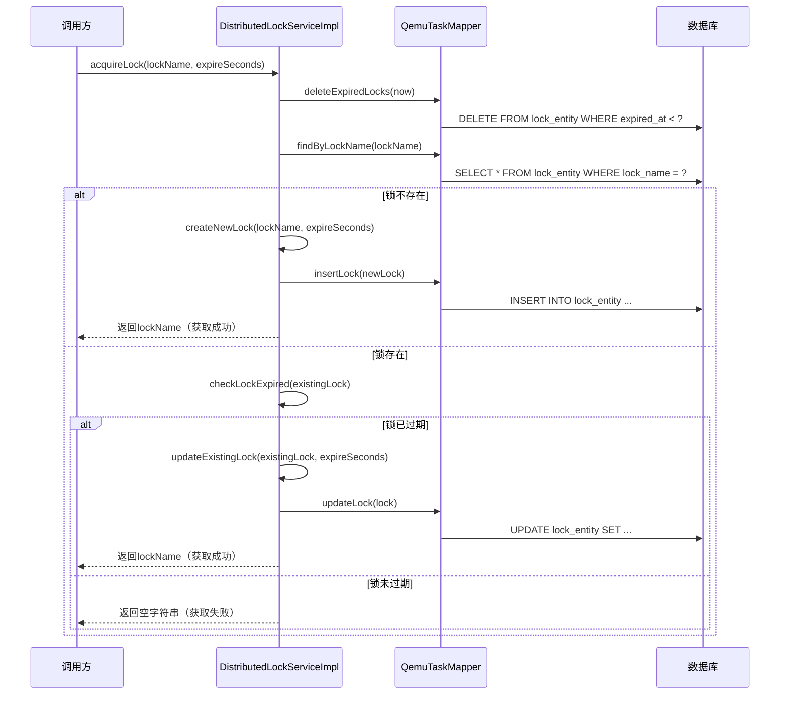
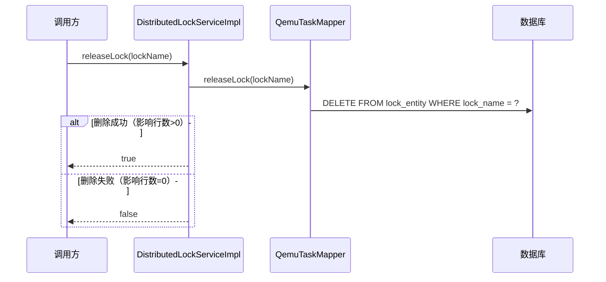
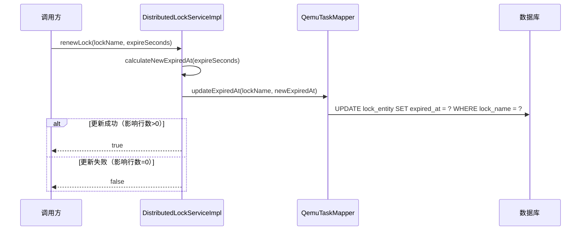

# 分布式锁系统设计

## 1. 系统定位

分布式锁系统是 `openlibing-simulation` 的基础设施模块，用于在集群环境中保证任务执行的唯一性和数据一致性。该系统基于数据库实现分布式锁，支持锁的获取、释放、续期和状态检查。

## 2. 业务边界

| 边界类型 | 说明 |
| --- | --- |
| 上游依赖 | QEMU任务调度模块、节点管理模块 |
| 下游依赖 | MySQL数据库 |
| 外部接口 | 无 |
| 内部接口 | 提供分布式锁的获取、释放、续期、检查接口 |

## 3. 领域模型

### 3.1 核心实体

| 实体 | 说明 | 关键字段 |
| --- | --- | --- |
| `LockEntity` | 分布式锁实体 | id, lockName, createdAt, expiredAt |
| `LockEntityDto` | 锁实体DTO | lockName, createdAt, expiredAt |

### 3.2 锁状态

| 状态 | 说明 |
| --- | --- |
| ACTIVE | 锁存在且未过期 |
| EXPIRED | 锁已过期 |
| RELEASED | 锁已释放 |
| NOT_EXIST | 锁不存在 |

## 4. 核心流程

### 4.1 获取锁流程



### 4.2 释放锁流程



### 4.3 锁续期流程



## 5. 锁实现机制

### 5.1 获取锁核心代码

```java
@Transactional
@Override
public String acquireLock(String lockName, int expireSeconds) {
    // 清理过期锁（可选：定期清理，可通过定时任务单独执行）
    // qemuTaskMapper.deleteExpiredLocks(LocalDateTime.now());
    
    LocalDateTime now = LocalDateTime.now();
    LocalDateTime expiredAt = now.plusSeconds(expireSeconds);
    
    // 使用单一原子操作获取锁：INSERT ... ON DUPLICATE KEY UPDATE
    // 锁不存在则插入，锁存在且已过期则更新，锁存在且未过期则不操作
    LockEntity lock = new LockEntity();
    lock.setLockName(lockName);
    lock.setCreatedAt(now);
    lock.setExpiredAt(expiredAt);
    lock.setId(CommonUtils.getUuid());
    
    int result = qemuTaskMapper.acquireLockAtomic(lock);
    
    // result > 0 表示成功获取锁（插入新锁或更新过期锁）
    // result == 0 表示锁已被其他线程持有（未过期）
    return result > 0 ? lockName : "";
}
```

### 5.2 释放锁核心代码

```java
@Transactional
@Override
public boolean releaseLock(String lockName) {
    int result = qemuTaskMapper.releaseLock(lockName);
    return result > 0;
}
```

### 5.3 锁续期核心代码

```java
@Transactional
@Override
public boolean renewLock(String lockName, int expireSeconds) {
    LocalDateTime expiredAt = LocalDateTime.now().plusSeconds(expireSeconds);
    int result = qemuTaskMapper.updateExpiredAt(lockName, expiredAt);
    return result > 0;
}
```

### 5.4 锁状态检查

```java
@Override
public boolean isLockActive(String lockName) {
    Optional<LockEntity> lock = qemuTaskMapper.findByLockName(lockName);
    return lock.isPresent() && lock.get().getExpiredAt().isAfter(LocalDateTime.now());
}
```

## 6. 锁设计考量

### 6.1 锁过期策略

| 策略 | 说明 | 适用场景 |
| --- | --- | --- |
| 自动过期 | 锁在指定时间后自动失效 | 防止死锁 |
| 手动续期 | 任务执行过程中定期续期 | 长时间运行任务 |
| 强制释放 | 手动释放锁 | 任务正常结束 |

### 6.2 锁命名规范

```
{业务模块}:{资源类型}:{资源ID}

示例:
- qemu:task:task-001
- node:server:server-001
- yaml:config:config-001
```

### 6.3 超时时间建议

| 场景 | 建议超时时间 |
| --- | --- |
| 短任务（< 1分钟） | 30秒 |
| 中等任务（1-10分钟） | 5分钟 |
| 长任务（> 10分钟） | 30分钟（需续期） |

## 7. 数据库表设计

### 7.1 lock_entity（分布式锁表）

| 字段名 | 类型 | 说明 |
| --- | --- | --- |
| id | VARCHAR(64) | 主键ID |
| lock_name | VARCHAR(255) | 锁名称（唯一） |
| created_at | DATETIME | 创建时间 |
| expired_at | DATETIME | 过期时间 |

### 7.2 索引设计

| 索引名 | 字段 | 类型 |
| --- | --- | --- |
| idx_lock_name | lock_name | UNIQUE |
| idx_expired_at | expired_at | NORMAL |

### 7.3 DDL示例

```sql
CREATE TABLE lock_entity (
    id VARCHAR(64) PRIMARY KEY,
    lock_name VARCHAR(255) NOT NULL UNIQUE,
    created_at DATETIME NOT NULL,
    expired_at DATETIME NOT NULL,
    INDEX idx_expired_at (expired_at)
) ENGINE=InnoDB DEFAULT CHARSET=utf8mb4;
```

### 7.4 Mapper方法定义

```java
/**
 * 原子获取锁：INSERT ... ON DUPLICATE KEY UPDATE
 * 锁不存在则插入，锁存在且已过期则更新，锁存在且未过期则不操作
 * 
 * @param lock 锁实体
 * @return 影响的行数（0表示锁未获取到，>0表示获取成功）
 */
int acquireLockAtomic(LockEntity lock);

/**
 * 释放锁
 * 
 * @param lockName 锁名称
 * @return 是否释放成功
 */
int releaseLock(String lockName);

/**
 * 续期锁
 * 
 * @param lockName 锁名称
 * @param expiredAt 新的过期时间
 * @return 是否续期成功
 */
int updateExpiredAt(@Param("lockName") String lockName, @Param("expiredAt") LocalDateTime expiredAt);
```

### 7.5 MyBatis XML配置

```xml
<insert id="acquireLockAtomic" useGeneratedKeys="false">
    INSERT INTO lock_entity (id, lock_name, created_at, expired_at)
    VALUES (#{id}, #{lockName}, #{createdAt}, #{expiredAt})
    ON DUPLICATE KEY UPDATE 
        id = VALUES(id),
        created_at = IF(expired_at < VALUES(created_at), VALUES(created_at), created_at),
        expired_at = IF(expired_at < VALUES(created_at), VALUES(expired_at), expired_at)
</insert>

<delete id="releaseLock">
    DELETE FROM lock_entity WHERE lock_name = #{lockName}
</delete>

<update id="updateExpiredAt">
    UPDATE lock_entity SET expired_at = #{expiredAt} WHERE lock_name = #{lockName}
</update>
```

## 8. 使用场景

### 8.1 QEMU任务执行锁

```java
public ResponseEntity saveAutoQemuTask(QemuTaskEntity task) {
    String lockName = "qemu:task:" + task.getId();
    
    // 获取锁
    String lock = distributedLockService.acquireLock(lockName, 300);
    if (StringUtils.isBlank(lock)) {
        return new ResponseEntity(400, "Task is running");
    }
    
    try {
        // 执行任务逻辑
        executeTask(task);
    } finally {
        // 释放锁
        distributedLockService.releaseLock(lockName);
    }
    
    return new ResponseEntity(200, "success");
}
```

### 8.2 节点分配锁

```java
public ResponseEntity saveNodeManageTask(NodeManageParamEntity param) {
    String lockName = "node:task:" + param.getSimulationTaskId();
    
    String lock = distributedLockService.acquireLock(lockName, 120);
    if (StringUtils.isBlank(lock)) {
        return new ResponseEntity(400, "Task is processing");
    }
    
    try {
        // 执行节点分配逻辑
        allocateNodes(param);
    } finally {
        distributedLockService.releaseLock(lockName);
    }
    
    return new ResponseEntity(200, "success");
}
```

## 9. 异常处理

| 异常场景 | 处理策略 |
| --- | --- |
| 获取锁失败 | 返回业务错误，提示资源正在使用 |
| 释放不存在的锁 | 返回false，不影响业务流程 |
| 续期失败 | 记录警告日志，任务可能被重复执行 |
| 数据库连接异常 | 抛出ServiceException，上层统一处理 |

## 10. 性能优化

### 10.1 定期清理过期锁

```java
// 在获取锁前自动清理过期锁
qemuTaskMapper.deleteExpiredLocks(LocalDateTime.now());
```

### 10.2 索引优化

通过 `lock_name` 唯一索引加速锁查询，通过 `expired_at` 索引加速过期锁清理。

### 10.3 事务优化

使用 `@Transactional` 注解确保锁操作的原子性，事务隔离级别使用默认的 `READ_COMMITTED`。

## 11. 监控与日志

### 11.1 日志记录

```java
log.info("Acquired lock: {}, expireSeconds: {}", lockName, expireSeconds);
log.info("Released lock: {}", lockName);
log.info("Renewed lock: {}, new expireSeconds: {}", lockName, expireSeconds);
log.warn("Failed to acquire lock: {}", lockName);
```

### 11.2 监控指标

| 指标 | 说明 |
| --- | --- |
| lock_acquire_success | 获取锁成功次数 |
| lock_acquire_fail | 获取锁失败次数 |
| lock_release_success | 释放锁成功次数 |
| lock_renew_success | 续期成功次数 |
| lock_expired_count | 过期锁清理次数 |