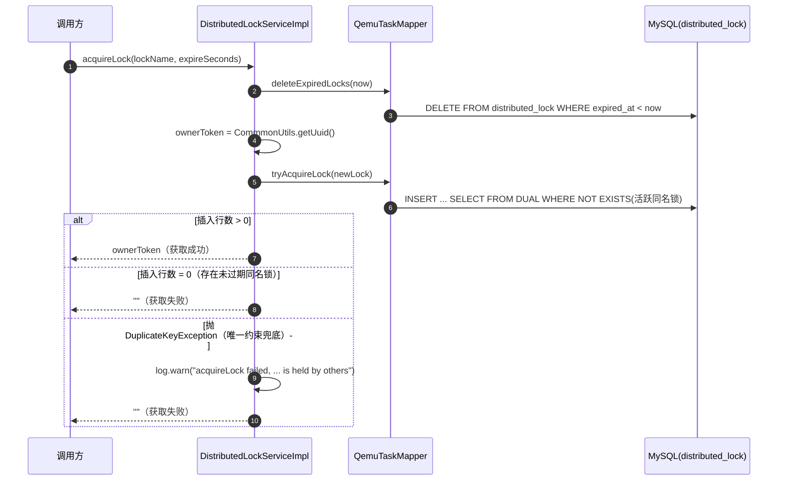
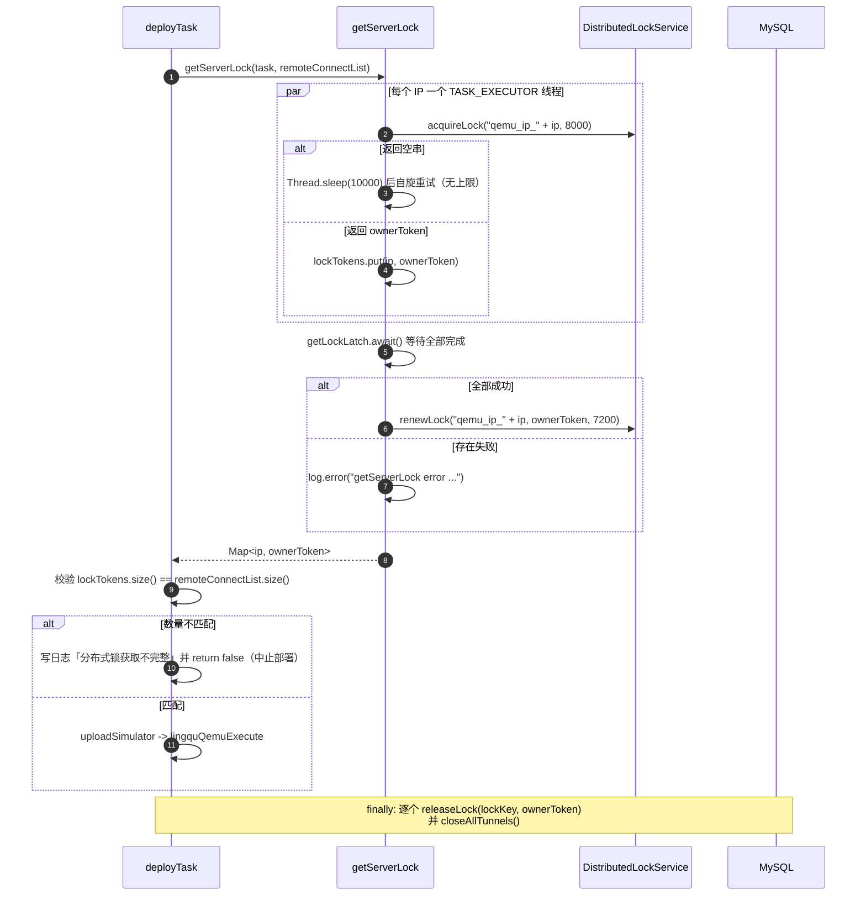

# 分布式锁系统设计

> 本文与代码基线 `master@4f22896` 对齐。所有结论均标注来源文件与行号。

## 1. 系统定位

分布式锁是 `openlibing-simulation` 的基础设施模块，用于在集群多实例部署下保证「同一资源不被并发操作」。实现方式是**数据库单表 + 唯一约束**，不依赖 Redis/ZooKeeper 等外部组件。

锁表为 `distributed_lock`，由 `DistributedLockService` 对外提供获取、续期、释放、状态检查四类操作。

## 2. 业务边界

| 边界类型   | 说明                                                                          |
| ---------- | ----------------------------------------------------------------------------- |
| 上游调用方 | Qemu 任务部署（按服务器 IP 加锁）、节点分配（全局加锁）、OBS 数据采集定时任务 |
| 下游依赖   | MySQL 单表 `distributed_lock`（无外部中间件）                                 |
| 对外接口   | 无（纯内部服务，未暴露 REST 接口）                                            |
| 关键约束   | `lock_name` 上有 UNIQUE 约束，同名校验由数据库兜底                            |

## 3. 领域模型

### 3.1 实体

| 类                                                        | 字段                                                     | 说明                                         |
| --------------------------------------------------------- | -------------------------------------------------------- | -------------------------------------------- |
| `LockEntity`（`entity/qemu/LockEntity.java:18-32`）       | `id`、`lockName`、`ownerToken`、`createdAt`、`expiredAt` | 锁的读取模型，`expiredAt` 为 `LocalDateTime` |
| `LockEntityDto`（`entity/qemu/LockEntityDto.java:16-22`） | `lockName`、`createdAt`、`expiredAt`（均为 `String`）    | 全仓无任何引用，**当前为未使用的预留 DTO**   |

### 3.2 ownerToken（持有者令牌）

`ownerToken` 是每次 `acquireLock` 成功时用 `CommmonUtils.getUuid()` 生成的 32 位 UUID（`DistributedLockServiceImpl.java:59`）。它用于解决**误释放/误续期**问题：只有携带正确的 ownerToken 才能释放或续期，避免实例 A 删掉实例 B 持有的锁（代码注释标注 `VULN-SEC-JAVA-AUTHZ-AOP-002`）。

### 3.3 锁状态

代码中**没有锁状态枚举**。对外只暴露两种可观察结果：

| 状态           | 判定方式                                                                               | 代码位置                                  |
| -------------- | -------------------------------------------------------------------------------------- | ----------------------------------------- |
| 有效（未过期） | `findByLockName` 有值 且 `expiredAt` 晚于当前时间                                      | `DistributedLockServiceImpl.java:116-119` |
| 已过期         | 行存在但 `expiredAt` 早于当前时间；会被下次 `acquireLock` 或 `deleteExpiredLocks` 清理 | `QemuTaskMapper.xml:469-471`              |
| 不存在         | `findByLockName` 返回空                                                                | 同上                                      |

## 4. 表结构

表 `distributed_lock`（`db/changelog/v1.0.0/distributed_lock.xml`）：

| 字段          | 类型         | 约束                                | 说明          |
| ------------- | ------------ | ----------------------------------- | ------------- |
| `id`          | VARCHAR(256) | 主键，NOT NULL                      | 锁行 ID，UUID |
| `lock_name`   | VARCHAR(256) | 唯一约束 `uk_distributed_lock_name` | 锁名称        |
| `created_at`  | DATETIME(6)  |                                     | 创建时间      |
| `expired_at`  | DATETIME(6)  |                                     | 过期时间      |
| `owner_token` | VARCHAR(256) | NOT NULL，默认 `''`                 | 锁持有者令牌  |

演进过程由 4 个 changeSet 完成：

| changeSet id                                        | author    | 内容                                                         |
| --------------------------------------------------- | --------- | ------------------------------------------------------------ |
| `20260422_create_distributed_lock`                  | wangxiang | 建表（初始**无** `owner_token`、**无**唯一约束）             |
| `20260803_add_owner_token_to_distributed_lock`      | ligao     | 新增 `owner_token` 列                                        |
| `20260803_add_unique_lock_name_to_distributed_lock` | ligao     | 先删除历史重复锁行（同名只保留 `MIN(id)`），再加唯一约束     |
| `20260807_clear_distributed_lock`                   | ligao     | `DELETE FROM distributed_lock`，清理任务异常中断留下的残留锁 |

> 注意最后一条：这是一次性的数据清理脚本，**不是**周期性任务；残留锁不会自动清理。

## 5. 接口定义

`service/DistributedLockService.java:16-53`：

| 方法           | 签名                                                                       | 返回值语义                                     |
| -------------- | -------------------------------------------------------------------------- | ---------------------------------------------- |
| `acquireLock`  | `String acquireLock(String lockName, int expireSeconds)`                   | 成功返回 ownerToken；**失败返回空字符串 `""`** |
| `releaseLock`  | `boolean releaseLock(String lockName, String ownerToken)`                  | 是否删除成功（需 ownerToken 匹配）             |
| `renewLock`    | `boolean renewLock(String lockName, String ownerToken, int expireSeconds)` | 是否续期成功（需 ownerToken 匹配）             |
| `isLockActive` | `boolean isLockActive(String lockName)`                                    | 锁是否存在且未过期（**不校验持有者**）         |

实现类 `service/impl/DistributedLockServiceImpl.java`，`acquireLock`/`releaseLock`/`renewLock` 均标注 `@Transactional`，`isLockActive` 未标注。

底层 SQL 定义在 `resources/mapper/QemuTaskMapper.xml`（注意：分布式锁的 SQL **不在** 独立的锁 Mapper 中，而是挂在 `QemuTaskMapper` 上）：

| Mapper 方法            | SQL                                                                                                                                                   | 行号    |
| ---------------------- | ----------------------------------------------------------------------------------------------------------------------------------------------------- | ------- |
| `findByLockName`       | `select id, lock_name lockName, owner_token ownerToken, created_at createdAt, expired_at expiredAt from distributed_lock where lock_name=#{lockName}` | 463-467 |
| `deleteExpiredLocks`   | `DELETE FROM distributed_lock WHERE expired_at < #{now}`                                                                                              | 469-471 |
| `updateExpiredAt`      | `UPDATE distributed_lock SET expired_at = #{expiredAt} WHERE lock_name = #{lockName} AND owner_token = #{ownerToken}`                                 | 473-476 |
| `releaseLockWithOwner` | `DELETE FROM distributed_lock WHERE lock_name = #{lockName} AND owner_token = #{ownerToken}`                                                          | 478-480 |
| `tryAcquireLock`       | `INSERT ... SELECT ... FROM DUAL WHERE NOT EXISTS (...)`                                                                                              | 487-495 |

## 6. 核心流程

### 6.1 获取锁

关键点是**单条原子条件插入**，而不是「先 SELECT 判断、再 INSERT/UPDATE」的两段式（后者存在 TOCTOU 竞态，代码注释标注 `VULN-SEC-JAVA-RACE-AOP-001`）：

```sql
INSERT INTO distributed_lock (id, lock_name, owner_token, created_at, expired_at)
SELECT #{id}, #{lockName}, #{ownerToken}, #{createdAt}, #{expiredAt}
FROM DUAL
WHERE NOT EXISTS (
    SELECT 1 FROM distributed_lock
    WHERE lock_name = #{lockName} AND expired_at > #{createdAt}
)
```



三重保障：

1. `WHERE NOT EXISTS` 在 `INSERT...SELECT` 中为加锁读，并发事务需等待先提交者后再评估，天然互斥；
2. `lock_name` 的 UNIQUE 约束作为最终兜底，极端并发下第二个 INSERT 触发 `DuplicateKeyException`，被捕获后视为获取失败（`DistributedLockServiceImpl.java:72-75`）；
3. 锁已过期时 `NOT EXISTS` 为真，直接插入新行覆盖旧锁，等价于原 UPDATE 分支。

### 6.2 释放锁

`DELETE ... WHERE lock_name = ? AND owner_token = ?`，携带令牌校验持有者身份。行数 > 0 即成功（`DistributedLockServiceImpl.java:86-91`）。

### 6.3 续期锁

`UPDATE ... SET expired_at = ? WHERE lock_name = ? AND owner_token = ?`，同样校验持有者（`DistributedLockServiceImpl.java:101-107`）。

### 6.4 状态检查

```java
public boolean isLockActive(String lockName) {
    Optional<LockEntity> lock = qemuTaskMapper.findByLockName(lockName);
    return lock.isPresent() && lock.get().getExpiredAt().isAfter(LocalDateTime.now());
}
```

## 7. 实际使用场景

全仓共 3 处调用方（不含测试）：

| #   | 调用方                                              | 锁名                                   | 过期时间                                      | 行为                                       | 代码位置                                         |
| --- | --------------------------------------------------- | -------------------------------------- | --------------------------------------------- | ------------------------------------------ | ------------------------------------------------ |
| 1   | `QemuTaskServiceImpl#deployTask` / `#getServerLock` | `qemu_ip_<服务器IP>`                   | 获取时 8000 秒，成功后 `renewLock` 至 7200 秒 | **按 IP 维度**加锁，同一 IP 不允许并发部署 | `QemuTaskServiceImpl.java:491, 512-518, 554-604` |
| 2   | `NodeManageServiceImpl#allocateNodeWithLock`        | `node_allocation_lock`（**固定常量**） | 10 秒                                         | 全局串行化节点分配                         | `NodeManageServiceImpl.java:165-224`             |
| 3   | `ScheduleTask#collectObsData`                       | `obs_data_collection_lock`             | 3600 秒                                       | 防止多实例重复采集 OBS                     | `ScheduleTask.java:28-59`                        |

### 7.1 Qemu 部署：按 IP 并发加锁



两个设计要点：

- **完整性校验**：`lockTokens.size() != remoteConnectList.size()` 时直接中止部署（`QemuTaskServiceImpl.java:494-500`），避免未获锁的服务器在无保护下被并发部署；
- **释放必须带 token**：`finally` 中通过 `lockTokens.get(ip)` 取值，为空则跳过（`:512-518`），保证只释放本任务真正持有的锁。

### 7.2 节点分配：固定锁名全局串行

`NodeManageServiceImpl#allocateNodeWithLock` 采用「轮询 + 本地等待」策略（`:202-224`）：

| 参数     | 值                                         |
| -------- | ------------------------------------------ |
| 锁名     | `node_allocation_lock`（固定，不区分任务） |
| 最长等待 | `maxWaitTime = 180000L`（180 秒）          |
| 重试间隔 | `retryInterval = 100L`（100 毫秒）         |
| 锁过期   | `lockExpireSeconds = 10`（10 秒）          |

等待超时或线程被中断时，会把环境任务状态置为 `"3"` 并写入错误信息（`:220-223`、`:213-218`）。`finally` 中以 `isLockAcquired && ownerToken != null` 为条件释放（`:192-198`）。

### 7.3 OBS 采集：定时任务互斥

`ScheduleTask` 以 `LOCK_NAME = "obs_data_collection_lock"`、`LOCK_EXPIRE_SECONDS = 3600` 获取锁，失败即跳过本轮；`finally` 中释放并记录结果（`ScheduleTask.java:28-59`）。

> 该任务的 `@Scheduled` 注解已从源码移除，当前不会被调度器触发，详见《运营数据上报系统设计.md》。

## 8. 锁命名与超时

### 8.1 实际命名

代码中不存在统一的锁名生成工具，三个锁名均为字面量：

```
qemu_ip_<ip>              # Qemu 部署，粒度为服务器 IP
node_allocation_lock      # 节点分配，全局单锁
obs_data_collection_lock  # OBS 采集，全局单锁
```

原文档建议的 `{业务模块}:{资源类型}:{资源ID}` 命名规范**在代码中未落地**。

### 8.2 超时取值

| 场景      | 过期时间                       | 依据                                |
| --------- | ------------------------------ | ----------------------------------- |
| Qemu 部署 | 获取时 8000 秒，续期后 7200 秒 | `QemuTaskServiceImpl.java:567, 596` |
| 节点分配  | 10 秒                          | `NodeManageServiceImpl.java:171`    |
| OBS 采集  | 3600 秒                        | `ScheduleTask.java:29`              |

## 9. 已识别的局限

以下是代码现状，不是待办清单，仅供评估风险时参考：

| #   | 局限                                                                                                | 位置                                                               |
| --- | --------------------------------------------------------------------------------------------------- | ------------------------------------------------------------------ |
| 1   | `isLockActive` 只判断存在且未过期，**无法校验持有者**，因此不能用于「是不是我的锁」判断             | `DistributedLockServiceImpl.java:116-119`                          |
| 2   | `getServerLock` 中 `renewLock` 的返回值**未被校验**，续期失败不会中止部署                           | `QemuTaskServiceImpl.java:596`                                     |
| 3   | 每次 `acquireLock` 都先执行 `deleteExpiredLocks`，是一条无索引条件（`expired_at` 无索引）的全表删除 | `DistributedLockServiceImpl.java:55`、`QemuTaskMapper.xml:469-471` |
| 4   | `getServerLock` 的自旋重试**无次数上限**，仅靠 `Thread.sleep(10000)` 等待                           | `QemuTaskServiceImpl.java:566-577`                                 |
| 5   | 节点分配锁过期仅 10 秒，而最长等待 180 秒，锁可能在等待期间被其他实例抢占                           | `NodeManageServiceImpl.java:169-171`                               |
| 6   | `LockEntityDto` 无任何引用                                                                          | `entity/qemu/LockEntityDto.java`                                   |
| 7   | 锁表无 `created_at`/`expired_at` 索引                                                               | `distributed_lock.xml:17-29`                                       |
| 8   | 无锁相关的单元测试：`src/test` 中未找到 `DistributedLockServiceImplTest` 或等价测试类               | —                                                                  |

## 10. 异常处理

| 异常场景                      | 处理方式                                                                                                 | 位置                                    |
| ----------------------------- | -------------------------------------------------------------------------------------------------------- | --------------------------------------- |
| 并发抢锁失败（唯一约束冲突）  | 捕获 `DuplicateKeyException`，记 `log.warn`，返回 `""`                                                   | `DistributedLockServiceImpl.java:72-75` |
| 条件插入未命中（锁未过期）    | 返回 `""`，不抛异常                                                                                      | `:69-71`                                |
| 释放/续期时 ownerToken 不匹配 | 影响行数为 0，返回 `false`，不抛异常                                                                     | `:88-91, 103-107`                       |
| 数据库访问异常                | 向上抛出，由调用方各自处理（如 `NodeManageServiceImpl` 捕获 `DataAccessException` 并更新任务状态为失败） | `NodeManageServiceImpl.java:184-191`    |

`acquireLock` **从不返回 `null`**，失败一律返回空字符串；调用方应使用 `StringUtils.isEmpty` / `isNotBlank` 判断。`ScheduleTask.java:41` 同时判了 `null || isEmpty`，属冗余但无害。
