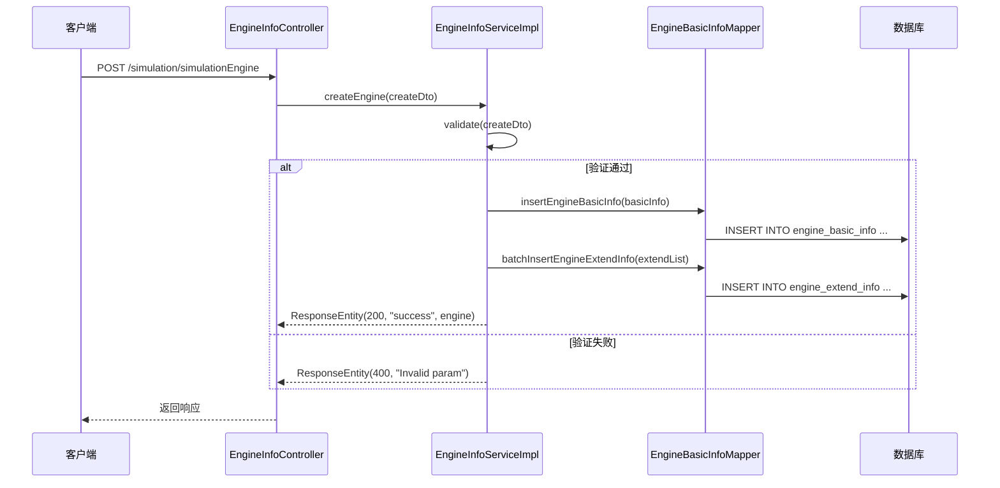
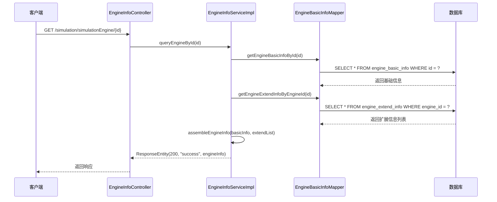
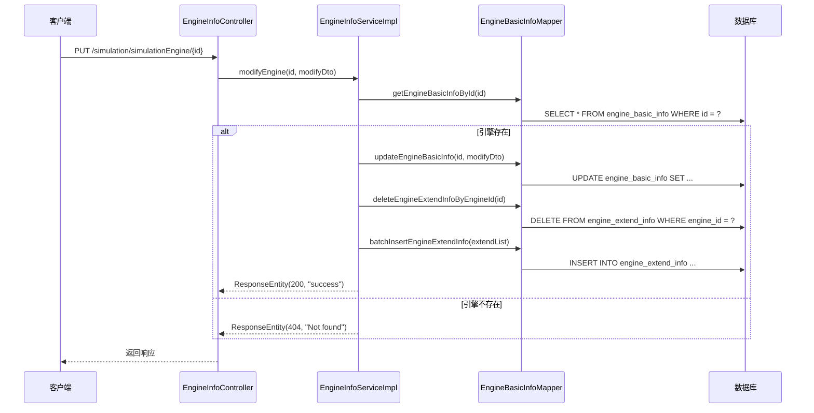

# 引擎信息管理系统设计

## 1. 系统定位

引擎信息管理系统是 `openlibing-simulation` 的核心配置模块，负责管理仿真引擎的基础信息和扩展配置。该系统支持引擎的创建、修改、查询和删除，同时提供多数据源支持和动态数据源切换能力。

## 2. 业务边界

| 边界类型 | 说明 |
| --- | --- |
| 上游依赖 | 前端引擎管理界面 |
| 下游依赖 | 多数据源配置、MyBatis Plus、数据库 |
| 外部接口 | SSH连接测试 |
| 内部接口 | 提供引擎信息的CRUD API |

## 3. 领域模型

### 3.1 核心实体

| 实体 | 说明 | 关键字段 |
| --- | --- | --- |
| `EngineBasicInfoEntity` | 引擎基础信息 | id, name, type, architecture, createBy |
| `EngineExtendInfoEntity` | 引擎扩展信息 | id, engineId, extendKey, extendValue |
| `EngineParamEntity` | 引擎查询参数 | name, type, architecture |
| `CreateEngineInfoDto` | 创建引擎DTO | name, type, architecture, extendInfoList |
| `ModifyEngineInfoDto` | 修改引擎DTO | name, architecture, extendInfoList |

### 3.2 数据源实体

| 实体 | 说明 | 关键字段 |
| --- | --- | --- |
| `DynamicDataSource` | 动态数据源 | dataSource, dataSourceKey |
| `DynamicDataSourceContextHolder` | 数据源上下文 | currentDataSource |

## 4. 核心流程

### 4.1 创建引擎流程



### 4.2 查询引擎详情流程



### 4.3 修改引擎流程



## 5. 多数据源支持

### 5.1 数据源枚举

```java
public enum DataSourceEnum {
    MASTER("master", "主数据源"),
    SLAVE("slave", "从数据源"),
    BETA("beta", "测试数据源"),
    GAMA("gama", "灰度数据源"),
    PROD("prod", "生产数据源");
    
    private final String key;
    private final String description;
    
    // constructor and getters
}
```

### 5.2 动态数据源切换机制

```mermaid
flowchart TD
    A[开始] --> B[设置数据源上下文]
    B --> C[执行数据库操作]
    C --> D[清除数据源上下文]
    D --> E[结束]
    
    subgraph AOP切面
        B -->|@DataSource注解| C
        C -->|方法执行完毕| D
    end
```

### 5.3 数据源切换注解

```java
@Target(ElementType.METHOD)
@Retention(RetentionPolicy.RUNTIME)
public @interface DataSource {
    DataSourceEnum value() default DataSourceEnum.MASTER;
}
```

### 5.4 AOP切面实现

```java
@Aspect
@Component
public class DataSourceAspect {
    
    @Before("@annotation(dataSource)")
    public void before(JoinPoint joinPoint, DataSource dataSource) {
        DataSourceEnum dataSourceEnum = dataSource.value();
        DynamicDataSourceContextHolder.setDataSource(dataSourceEnum.getKey());
    }
    
    @After("@annotation(dataSource)")
    public void after(JoinPoint joinPoint, DataSource dataSource) {
        DynamicDataSourceContextHolder.clearDataSource();
    }
}
```

## 6. 引擎类型与架构

### 6.1 引擎类型

| 类型 | 说明 | 支持架构 |
| --- | --- | --- |
| lingQuQemu | 灵渠QEMU引擎 | ARM/x86 |
| npuQemu | NPU QEMU引擎 | ARM |
| matrixSvrQemu | 矩阵服务器引擎 | ARM/x86 |

### 6.2 架构类型

| 架构 | 说明 | 适用场景 |
| --- | --- | --- |
| ARM | 鲲鹏架构 | 国产化部署 |
| x86 | 英特尔架构 | 通用部署 |

## 7. 接口列表

| API 路径 | HTTP方法 | 功能描述 |
| --- | --- | --- |
| `/simulation/simulationEngine` | POST | 创建仿真引擎 |
| `/simulation/simulationEngine/{id}` | PUT | 修改仿真引擎 |
| `/simulation/simulationEngine/{id}` | GET | 查询引擎详情 |
| `/simulation/simulationEngine/architecture/{id}` | PUT | 修改架构 |
| `/simulation/simulationEngine/updateEngineType/{id}` | PUT | 修改引擎类型 |
| `/simulation/simulationEngine` | DELETE | 删除仿真引擎 |
| `/simulation/simulationEngine` | GET | 批量查询引擎列表 |
| `/simulation/saveResourceAttachments` | POST | 保存附属文件包信息 |
| `/simulation/simulationEngine/testSsh` | GET | 测试SSH连接 |

## 8. 数据库表设计

### 8.1 engine_basic_info（引擎基础信息表）

| 字段名 | 类型 | 说明 |
| --- | --- | --- |
| id | VARCHAR(64) | 主键ID |
| name | VARCHAR(255) | 引擎名称 |
| type | VARCHAR(64) | 引擎类型 |
| architecture | VARCHAR(32) | 架构类型 |
| create_by | VARCHAR(64) | 创建人 |
| create_time | DATETIME | 创建时间 |
| update_by | VARCHAR(64) | 更新人 |
| update_time | DATETIME | 更新时间 |

### 8.2 engine_extend_info（引擎扩展信息表）

| 字段名 | 类型 | 说明 |
| --- | --- | --- |
| id | VARCHAR(64) | 主键ID |
| engine_id | VARCHAR(64) | 关联引擎ID |
| extend_key | VARCHAR(128) | 扩展字段键 |
| extend_value | TEXT | 扩展字段值 |
| create_time | DATETIME | 创建时间 |

### 8.3 resource_attachment（资源附件表）

| 字段名 | 类型 | 说明 |
| --- | --- | --- |
| id | VARCHAR(64) | 主键ID |
| engine_id | VARCHAR(64) | 关联引擎ID |
| file_name | VARCHAR(255) | 文件名 |
| file_path | VARCHAR(512) | 文件路径 |
| file_size | BIGINT | 文件大小 |
| file_type | VARCHAR(64) | 文件类型 |
| create_time | DATETIME | 创建时间 |

## 9. 配置管理

### 9.1 多数据源配置示例

```yaml
spring:
  datasource:
    dynamic:
      master:
        url: jdbc:mysql://localhost:3306/simulation_master
        username: admin
        password: password
      slave:
        url: jdbc:mysql://localhost:3306/simulation_slave
        username: admin
        password: password
      beta:
        url: jdbc:mysql://localhost:3306/simulation_beta
        username: admin
        password: password
```

### 9.2 MyBatis Plus配置

```java
@Configuration
@MapperScan("com.openlibing.simulation.mapper")
public class MyBatisPlusConfig {
    
    @Bean
    public MybatisPlusInterceptor mybatisPlusInterceptor() {
        MybatisPlusInterceptor interceptor = new MybatisPlusInterceptor();
        interceptor.addInnerInterceptor(new PaginationInnerInterceptor(DbType.MYSQL));
        return interceptor;
    }
}
```

## 10. 错误处理

| 错误场景 | 处理策略 | 返回码 |
| --- | --- | --- |
| 参数校验失败 | 使用@Valid注解进行校验 | 400 |
| 引擎不存在 | 返回资源未找到 | 404 |
| 数据库操作异常 | 记录错误日志，返回通用错误 | 500 |
| SSH连接失败 | 返回连接测试失败信息 | 200（业务失败） |

## 11. 性能优化

### 11.1 分页查询

```java
public ResponseEntity queryEngineList(int pageNo, int pageSize, String name, 
    String type, EngineParamEntity engineParam) {
    PageHelper.startPage(pageNo, pageSize);
    List<EngineBasicInfoEntity> list = engineBasicInfoMapper.queryList(name, type, engineParam);
    PageInfo<EngineBasicInfoEntity> pageInfo = new PageInfo<>(list);
    return new ResponseEntity(200, "success", pageInfo);
}
```

### 11.2 批量操作

支持批量插入扩展信息，减少数据库交互次数。

### 11.3 缓存策略

对常用的引擎配置信息进行内存缓存，缓存过期时间为5分钟。