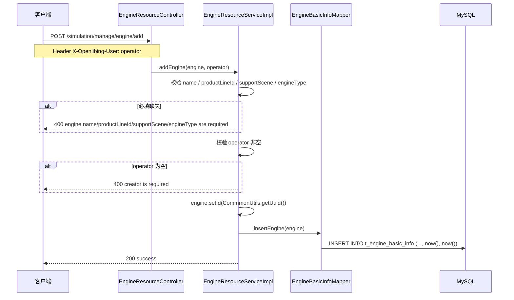
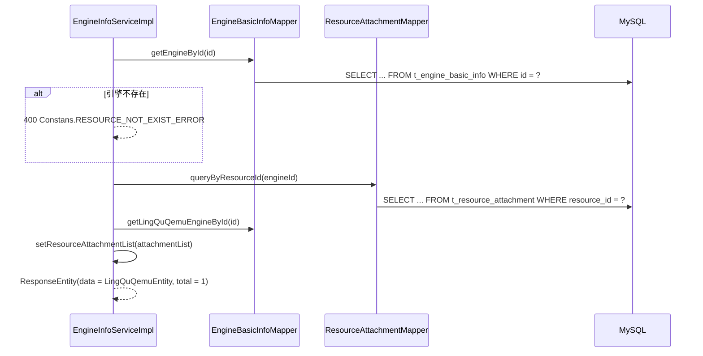
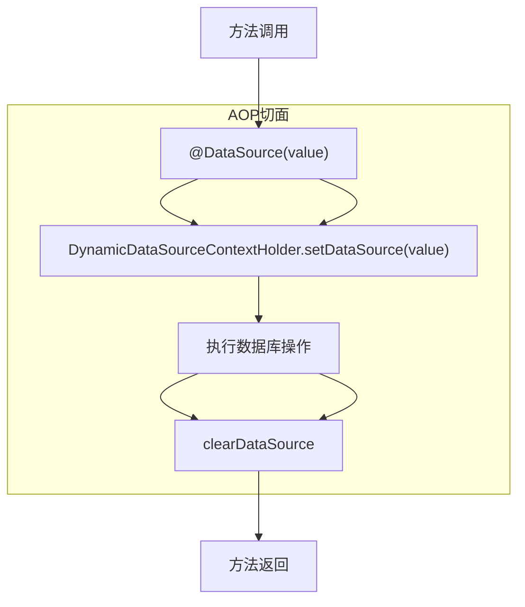

# 引擎信息管理系统设计

> 本文与代码基线 `master@4f22896` 对齐。所有结论均标注来源文件与行号。

## 1. 系统定位

引擎信息管理负责仿真引擎的登记与查询：引擎基础信息（名称、产线、版本、引擎类型、架构、配置模板）与扩展信息（key-value）的维护。

服务对象是 Qemu 任务创建链路——创建任务时按 `engineId` 或 `engineName` 反查引擎，取到 `engineType` 与版本后驱动部署
（`QemuTaskServiceImpl.java:3701-3724`）。

> **能力现状**：当前**只保留写能力**的新增 / 更新 / 物理删除 REST 接口；
> 查询能力（`EngineInfoService#queryEngineById` / `queryEngineList`）在 Service 层仍存在，
> 但**已无 Controller 暴露**（见 §12 局限 1）。

## 2. 业务边界

| 边界类型   | 说明                                                                            |
| ---------- | ------------------------------------------------------------------------------- |
| 上游触发   | 引擎管理页面（写接口）；Qemu 任务创建链路（读，服务内直接调用 Service）         |
| 下游依赖   | MySQL（`t_engine_basic_info`、`t_engine_extend_info`、`t_resource_attachment`） |
| 对外接口   | `POST /simulation/manage/engine/{add\|update\|delete}`                          |
| 数据方向   | 双向：写接口接收前端提交，读被 Qemu 任务链路消费                                |
| 失败影响   | 写失败只影响引擎台账本身；**读失败会导致 Qemu 任务创建失败**（引擎校验不通过）  |
| 已下线能力 | SSH 连接测试接口（`testSsh`）——全仓零命中（见 §12 局限 2）                      |

## 3. 领域模型

### 3.1 EngineBasicInfoEntity

`entity/EngineBasicInfoEntity.java:23-44`，Lombok `@Data`。

| 字段               | 类型      | 表列             | 说明                                               |
| ------------------ | --------- | ---------------- | -------------------------------------------------- |
| `id`               | String    | id               | 主键，Java 侧 UUID                                 |
| `name`             | String    | name             | 引擎名称，非空                                     |
| `description`      | String    | description      | 描述                                               |
| `creator`          | String    | creator          | 创建人，非空（写接口由 `X-Openlibing-User` 注入）  |
| `productLineId`    | String    | product_line_id  | 产线 ID，非空                                      |
| `supportScene`     | String    | support_scene    | 支持场景，非空                                     |
| `version`          | String    | version          | 版本                                               |
| `engineType`       | String    | engine_type      | 引擎类型，非空                                     |
| `architecture`     | String    | architecture     | `X86` / `ARM`                                      |
| `uploadStatus`     | String    | upload_status    | `upload` / `success` / `failed`                    |
| `configTemplate`   | String    | config_template  | 配置模板                                           |
| `createTime`       | Timestamp | create_time      | `@JsonFormat("yyyy-MM-dd HH:mm:ss")`               |
| `lastModifyTime`   | Timestamp | last_modify_time | 同上                                               |
| `isDefault`        | boolean   | is_default       | **primitive**，未传时默认 `false`（见 §12 局限 5） |
| `uploadFileName`   | String    | 无对应表列       | 恒为 `null`                                        |
| `fileSize`         | String    | 无对应表列       | 恒为 `null`                                        |
| `decompressedSize` | String    | 无对应表列       | 恒为 `null`                                        |

### 3.2 LingQuQemuEntity

`entity/LingQuQemuEntity.java:20-26`，`@EqualsAndHashCode(callSuper = true)` 继承 `EngineBasicInfoEntity`：

| 字段                     | 说明                              |
| ------------------------ | --------------------------------- |
| `resourceAttachmentList` | 附件列表，由 Service 二次查询填充 |
| `imageAddress`           | 镜像地址                          |
| `imageTag`               | 镜像 tag                          |

### 3.3 其他实体

| 实体                                          | 位置                                  | 说明                                                                                |
| --------------------------------------------- | ------------------------------------- | ----------------------------------------------------------------------------------- |
| `EngineExtendInfoEntity`                      | `entity/EngineExtendInfoEntity.java`  | 扩展信息：`engineId` + `extendKey` + `extendValue` + `extendName`                   |
| `EngineParamEntity`                           | `entity/EngineParamEntity.java:16-26` | 查询参数：`scene` / `isDefault` / `extendParam` / `releaseStatus` / `uploadStatus`  |
| `CreateEngineInfoDto` / `ModifyEngineInfoDto` | `entity/dto/`                         | 早期 DTO，**当前写接口直接接收 `EngineBasicInfoEntity`**，不再使用（见 §12 局限 3） |
| `ResourceAttachment`                          | `entity/ResourceAttachment.java`      | 资源附件，与引擎通过 `resourceId` 关联                                              |

> 动态数据源相关实体（`DynamicDataSource` / `DynamicDataSourceContextHolder`）属于数据源基建，见 §5。

## 4. 核心流程

### 4.1 新增引擎



`EngineResourceController.java:45-50`、`EngineResourceServiceImpl.java:35-50`。

> **注意**：第二步校验的是入参 `operator`（实现内变量名 `creator`）。
> Controller 上该请求头声明为 `required = false`，但**未携带 `X-Openlibing-User` 的请求会被 Service 拒绝**，
> 返回 `400 "creator is required"`（`EngineResourceServiceImpl.java:43-45`）。

### 4.2 更新引擎

`EngineResourceController.java:58-62` → `EngineResourceServiceImpl.updateEngine`（`:52-62`）：

1. `engine == null` 或 `id` 为空 → `400 "engine id is required"`；
2. 调用动态更新的 `updateEngine`（SQL 见 §8.4）；
3. 影响行数为 0 → `400 "engine not exist"`。

### 4.3 删除引擎

`EngineResourceController.java:70-74` → `EngineResourceServiceImpl.deleteEngine`（`:64-74`）：

1. `id` 为空 → `400 "engine id is required"`；
2. 执行 `DELETE FROM t_engine_basic_info WHERE id = #{id}`（**物理删除**）；
3. 影响行数为 0 → `400 "engine not exist"`。

> 删除不级联清理 `t_engine_extend_info` 与 `t_resource_attachment` 中的关联记录（见 §12 局限 4）。

### 4.4 查询引擎（无 Controller 暴露）



`EngineInfoServiceImpl.java:52-69`。

列表查询 `queryEngineList`（`:71-98`）按 `engineType` 分派，**当前只实现了 `case "npuQemu"`**，
其余取值走 `default` 分支返回空响应体（见 §12 局限 7、8）。

## 5. 动态数据源基建

> **现状（与代码基线 `master@4f22896` 对齐）**：本节描述的是**已实现但未被启用**的预留基建。
> 全仓 `@DataSource` 注解**零使用**，`DataSourceConfig` 只注册唯一的 `@Primary` 数据源 Bean `mysqlDataSource`
> （`config/DataSourceConfig.java:79-97`），**没有 Doris 数据源 Bean**。因此所有 Mapper 实际都走同一个主数据源，
> 动态切换能力当前不会生效。

### 5.1 数据源枚举

`enums/DataSourceEnum.java:20-24`：

```java
@AllArgsConstructor
@Getter
public enum DataSourceEnum {
    MYSQL("mysql"),
    DORIS("doris"),
    ;
    private final String dataSourceName;
}
```

### 5.2 数据源切换注解

`aop/DataSource.java:24-30`：

```java
@Target({ElementType.METHOD, ElementType.TYPE})
@Retention(RetentionPolicy.RUNTIME)
@Documented
@Inherited
public @interface DataSource {
    DataSourceEnum value() default DataSourceEnum.DORIS;
}
```

注意注解可标注在**类或方法**上，且**默认值是 `DORIS`** 而非主数据源。

### 5.3 切换机制

`aop/DataSourceAspect.java:57-62`：切面在方法执行前把枚举写入 `DynamicDataSourceContextHolder`，
执行完成后清除上下文。上下文由 `entity/DynamicDataSourceContextHolder`（ThreadLocal）维护。



> **异步 / 新线程注意**：`DynamicDataSourceContextHolder` 基于 ThreadLocal，
> 异步或新建线程中必须显式传递上下文，否则会退回到默认数据源。

## 6. 引擎类型与架构

### 6.1 引擎类型

代码中实际参与分支判定的引擎类型取值（`NodeManageServiceImpl.java:410-421`，`equalsIgnoreCase` 比较）：

| 类型            | 资源规格分支                                                             | 来源   |
| --------------- | ------------------------------------------------------------------------ | ------ |
| `lingQuQemu`    | 与 `npuQemu` 共用同一分支                                                | `:410` |
| `npuQemu`       | 与 `lingQuQemu` 共用同一分支                                             | `:410` |
| `matrixSvrQemu` | 独立分支（有专属基准 CPU / 内存常量）                                    | `:413` |
| 其它            | `log.info("Unknown engineType, skip build deploy result")` 后返回 `null` | `:421` |

查询侧 `EngineInfoServiceImpl.java:86-96` 的 `switch` **只识别 `npuQemu`**。

> 「类型 → 支持架构」的映射在代码中**不存在**：`architecture` 只是 `t_engine_basic_info` 的自由文本列。
> 原文档列出的「lingQuQemu→ARM/x86、npuQemu→ARM」无代码依据，已移除。

### 6.2 架构取值

| 取值          | 约束                                                 | 来源                         |
| ------------- | ---------------------------------------------------- | ---------------------------- |
| `X86` / `ARM` | `VARCHAR(255)`，**无枚举校验**，DDL 注释为 `X86/ARM` | `t_engine_basic_info.xml:52` |

## 7. 接口清单

### 7.1 写接口（已暴露）

`EngineResourceController.java:31`，类级 `@RequestMapping("/simulation/manage/engine")`。

| 方法 | 路径                               | 入参                                            | 操作者                                           |
| ---- | ---------------------------------- | ----------------------------------------------- | ------------------------------------------------ |
| POST | `/simulation/manage/engine/add`    | `@Validated @RequestBody EngineBasicInfoEntity` | 请求头 `X-Openlibing-User`（`required = false`） |
| POST | `/simulation/manage/engine/update` | `@Validated @RequestBody EngineBasicInfoEntity` | **不采集**                                       |
| POST | `/simulation/manage/engine/delete` | `@RequestParam("id")`                           | **不采集**                                       |

响应体为项目自定义 `com.openlibing.simulation.entity.ResponseEntity`，**不是** Spring 原生 `ResponseEntity`。

> 更新接口不采集操作者，因此 `creator` 保持原值；`last_modify_time` 由 SQL 无条件刷新。
> 三组接口均无 `@Transactional`、无分布式锁、无唯一性校验（与其余三组资源管理接口一致）。

### 7.2 读能力（无 Controller 暴露）

| Service 方法                                                                     | 说明                          |
| -------------------------------------------------------------------------------- | ----------------------------- |
| `EngineInfoService#queryEngineById(String id)`                                   | 引擎详情 + 附件列表           |
| `EngineInfoService#queryEngineList(int, int, String, String, EngineParamEntity)` | 引擎列表（仅 `npuQemu` 生效） |

## 8. 数据库表设计

### 8.1 t_engine_basic_info

`db/changelog/v1.0.0/t_engine_basic_info.xml`，共 2 个 changeSet。

| 列                 | 类型          | 约束         | 说明                  |
| ------------------ | ------------- | ------------ | --------------------- |
| `id`               | VARCHAR(32)   | PK, NOT NULL |                       |
| `name`             | VARCHAR(128)  | NOT NULL     |                       |
| `description`      | LONGTEXT      |              |                       |
| `creator`          | VARCHAR(256)  | NOT NULL     |                       |
| `product_line_id`  | VARCHAR(32)   | NOT NULL     |                       |
| `version`          | VARCHAR(255)  |              |                       |
| `support_scene`    | VARCHAR(256)  | NOT NULL     |                       |
| `engine_type`      | VARCHAR(64)   | NOT NULL     |                       |
| `create_time`      | TIMESTAMP(6)  | NOT NULL     |                       |
| `last_modify_time` | TIMESTAMP(6)  | NOT NULL     |                       |
| `is_default`       | TINYINT       | 默认 0       |                       |
| `architecture`     | VARCHAR(255)  |              | X86/ARM               |
| `config_template`  | VARCHAR(4096) |              |                       |
| `upload_status`    | VARCHAR(255)  |              | upload/success/failed |

changeSet 清单：

| id                                          | author    | 说明                                                                               |
| ------------------------------------------- | --------- | ---------------------------------------------------------------------------------- |
| `20260422_create_t_engine_basic_info`       | wangxiang | 建表                                                                               |
| `20260819_delete_t_engine_basic_info_batch` | ligao     | 按固定 id 列表清理 6 条脏数据；`preConditions` 用 `sqlCheck` 判存在，rollback 为空 |

### 8.2 t_engine_extend_info

`db/changelog/v1.0.0/t_engine_extend_info.xml`，1 个 changeSet `20260422_create_t_engine_extend_info`（wangxiang）。

| 列                 | 类型         | 约束                |
| ------------------ | ------------ | ------------------- |
| `id`               | VARCHAR(32)  | PK, NOT NULL        |
| `engine_id`        | VARCHAR(32)  | NOT NULL            |
| `extend_key`       | VARCHAR(128) | NOT NULL            |
| `extend_value`     | VARCHAR(256) |                     |
| `extend_name`      | VARCHAR(256) | NOT NULL，默认 `''` |
| `create_time`      | TIMESTAMP(6) | NOT NULL            |
| `last_modify_time` | TIMESTAMP(6) | NOT NULL            |

唯一索引 `engine_id_extend_key`（`engine_id`, `extend_key`）。

### 8.3 t_resource_attachment

`db/changelog/v1.0.0/t_resource_attachment.xml`，1 个 changeSet `20260422_create_t_resource_attachment`（wangxiang）。

| 列                  | 类型          | 说明                                   |
| ------------------- | ------------- | -------------------------------------- |
| `id`                | VARCHAR(255)  | PK, NOT NULL                           |
| `resource_id`       | VARCHAR(255)  | 关联资源 ID（引擎 id / qcow id）       |
| `upload_file_path`  | VARCHAR(1000) | 上传文件路径                           |
| `upload_file_name`  | VARCHAR(255)  | 上传文件名                             |
| `create_time`       | VARCHAR(255)  | 上传时间，**字符串类型**而非 TIMESTAMP |
| `create_by`         | VARCHAR(255)  | 上传人                                 |
| `product_id`        | VARCHAR(255)  |                                        |
| `file_all_path`     | VARCHAR(255)  |                                        |
| `type`              | VARCHAR(255)  | 文件类型                               |
| `file_size`         | VARCHAR(255)  | **字符串**，非 BIGINT                  |
| `decompressed_size` | VARCHAR(255)  | **字符串**，非 BIGINT                  |

> 表名是 `t_resource_attachment`（非 `resource_attachment`）。该表的完整说明见
> [资源管理CRUD系统设计.md](资源管理CRUD系统设计.md)。

### 8.4 数据库操作细节

`insertEngine`（`mapper/EngineBasicInfoMapper.xml:207-217`）：`create_time` / `last_modify_time` 直接写 SQL `now()`，
**不依赖 MyBatis-Plus 的 `MetaObjectHandler`**。

`updateEngine`（`:219-235`）：`<set>` + `<if>` 动态更新，其中 `is_default = #{isDefault}` 与
`last_modify_time = now()` **无条件赋值**（充当兜底列），因此不会踩到「`<set>` 全空 → 非法 SQL → BlockAttack 拦截」的问题。

> 但由此引入另一个风险：`EngineBasicInfoEntity#isDefault` 是 primitive `boolean`。
> 调用方只传 `id`（不传 `isDefault`）时该字段取默认值 `false`，SQL 会把 `is_default` **覆盖为 0**，
> 可能误清原有默认引擎标记（见 §12 局限 5）。

`deleteEngineById`（`:237-239`）：`DELETE FROM t_engine_basic_info WHERE id = #{id}`，物理删除。

## 9. 配置管理

### 9.1 数据源

数据源以 Java Config 方式声明（`config/DataSourceConfig.java`），**不是** `spring.datasource.dynamic` 配置块：

| 配置项                                           | 用途                                                                     |
| ------------------------------------------------ | ------------------------------------------------------------------------ |
| `spring.datasource.simulation.url`               | JDBC URL                                                                 |
| `spring.datasource.simulation.username`          | 用户名                                                                   |
| `spring.datasource.simulation.password`          | 密码（**密文**，经 `SecurityUtil.decrypt(password, part1)` 解密，`:86`） |
| `spring.datasource.driver-class-name`            | 驱动类                                                                   |
| `spring.datasource.hikari.minimum-idle`          | 最小空闲连接                                                             |
| `spring.datasource.hikari.idle-timeout`          | 空闲超时                                                                 |
| `spring.datasource.hikari.maximum-pool-size`     | 最大连接数                                                               |
| `spring.datasource.hikari.auto-commit`           | 自动提交                                                                 |
| `spring.datasource.hikari.pool-name`             | 连接池名                                                                 |
| `spring.datasource.hikari.max-lifetime`          | 连接最大存活                                                             |
| `spring.datasource.hikari.connection-timeout`    | 连接超时                                                                 |
| `spring.datasource.hikari.connection-test-query` | 连接测试语句                                                             |
| `security.part1`                                 | 密码解密所需的密钥分量                                                   |

声明的 Bean：`mysqlDataSource`（`@Primary`）、`mysqlJdbcTemplate`（`@Primary`）、
`mysqlDataSourceTransactionManager`（`@Primary`），见 `config/DataSourceConfig.java:79-122`。

`application.yaml` 中**不含任何数据源条目**（`:8-34`），实际取值由 Apollo 按环境下发。

### 9.2 MyBatis-Plus 配置

`config/MyBatisPlusConfig.java:33-39`：

```java
@Bean
public MybatisPlusInterceptor mybatisPlusInterceptor() {
    MybatisPlusInterceptor interceptor = new MybatisPlusInterceptor();
    interceptor.addInnerInterceptor(new PaginationInnerInterceptor());
    interceptor.addInnerInterceptor(new BlockAttackInnerInterceptor());
    return interceptor;
}
```

- `PaginationInnerInterceptor` **未指定 `DbType`**；
- `BlockAttackInnerInterceptor` 拦截无 where 条件的全表 update / delete。

`createMetaObjectHandler`（`:46-59`）自动填充 `createTime` / `updateTime`。
但本模块的 Mapper 是**手写 XML（非 `BaseMapper`）**，该填充对 `insertEngine` / `updateEngine` **不生效**，
时间由 SQL 的 `now()` 写入。

### 9.3 MyBatis 基本配置

`application.yaml:32-34`：

| 配置项                         | 值                                 |
| ------------------------------ | ---------------------------------- |
| `mybatis.mapper-locations`     | `classpath:mapper/*.xml`           |
| `mybatis.type-aliases-package` | `com.openlibing.simulation.entity` |

## 10. 异常处理

| 场景                     | 处理位置                                    | 返回                                         |
| ------------------------ | ------------------------------------------- | -------------------------------------------- |
| 入参为 `null`            | `EngineResourceServiceImpl.java:36-38`      | `400 "engine is required"`                   |
| 必填字段缺失             | `:39-42`                                    | `400` + 缺失字段名                           |
| 操作者为空               | `:43-45`                                    | `400 "creator is required"`                  |
| 更新 / 删除目标不存在    | 影响行数为 0                                | `400 "engine not exist"`（**不是 404**）     |
| 查询目标不存在           | `EngineInfoServiceImpl.java:59-61`          | `400 Constans.RESOURCE_NOT_EXIST_ERROR`      |
| 数据库异常               | `exception/GlobalExceptionHandler` 统一拦截 | `500` + 固定 message `Internal Server Error` |
| 引擎类型未知（部署链路） | `NodeManageServiceImpl.java:421`            | 返回 `null`，由调用方判定                    |

> 本模块**未使用** `ResponseCodeEnum`，响应码全部为字面量 `200` / `400`
> （与资源管理 CRUD 的其余三组一致，见 §12 局限 10）。

## 11. 性能说明

- **分页**：`queryEngineList` 使用 PageHelper（`EngineInfoServiceImpl.java:85`）。
  **未对 `pageSize` 设置上限**（见 §12 局限 6）。
- **索引**：`t_engine_extend_info` 的唯一索引 `engine_id_extend_key` 支撑按 `engineId` 查询；
  未发现批量插入扩展信息的实现。
- **缓存**：**本模块没有任何缓存实现**——全仓检索 `@Cacheable` / `CacheManager` / Caffeine **零命中**。
  原文档所述「内存缓存 5 分钟过期」无代码依据，已移除。

## 12. 已知局限

| #   | 局限                                                           | 位置                                | 影响                                    |
| --- | -------------------------------------------------------------- | ----------------------------------- | --------------------------------------- |
| 1   | 查询能力无 Controller 暴露                                     | `EngineInfoService`                 | 前端无法调用；能力待下线或补 Controller |
| 2   | SSH 连接测试接口已下线                                         | 全仓 `testSsh` 零命中               | 原文档 §7 中的该端点不存在              |
| 3   | `CreateEngineInfoDto` / `ModifyEngineInfoDto` 已不被写接口使用 | `entity/dto/`                       | 存量 DTO，需确认是否可删                |
| 4   | 删除引擎为物理删除且不级联                                     | `EngineBasicInfoMapper.xml:237-239` | 遗留孤儿扩展信息与附件记录              |
| 5   | `isDefault` 为 primitive，未传即覆盖为 `false`                 | `EngineBasicInfoMapper.xml:231`     | 只传 id 的更新会误清默认标记            |
| 6   | `queryEngineList` 未限制 `pageSize` 上限                       | `EngineInfoServiceImpl.java:85`     | 大分页可能拖垮数据库                    |
| 7   | `switch (engineType)` 无 `null` 分支                           | `EngineInfoServiceImpl.java:86`     | `engineType` 为 `null` 时抛 NPE         |
| 8   | `queryEngineList` 仅实现 `npuQemu`，其余返回空                 | `EngineInfoServiceImpl.java:86-96`  | 其它引擎类型查不出数据                  |
| 9   | `uploadFileName` / `fileSize` / `decompressedSize` 无对应表列  | `EngineBasicInfoEntity.java:41-43`  | 字段恒为 `null`                         |
| 10  | 写接口使用字面量响应码，未引用 `ResponseCodeEnum`              | `EngineResourceServiceImpl`         | 响应码分散，难以统一治理                |

## 13. 单元测试

| 测试类                          | 说明                                                                          |
| ------------------------------- | ----------------------------------------------------------------------------- |
| `EngineResourceServiceImplTest` | 覆盖 `addEngine` / `updateEngine` / `deleteEngine` 的必填校验与目标不存在分支 |
| `EngineInfoServiceImplTest`     | 覆盖查询能力                                                                  |

测试执行后须核对 `target/surefire-reports/`：`maven-surefire-plugin` 配置了 `testFailureIgnore=true`，
构建成功**不代表**测试通过。
