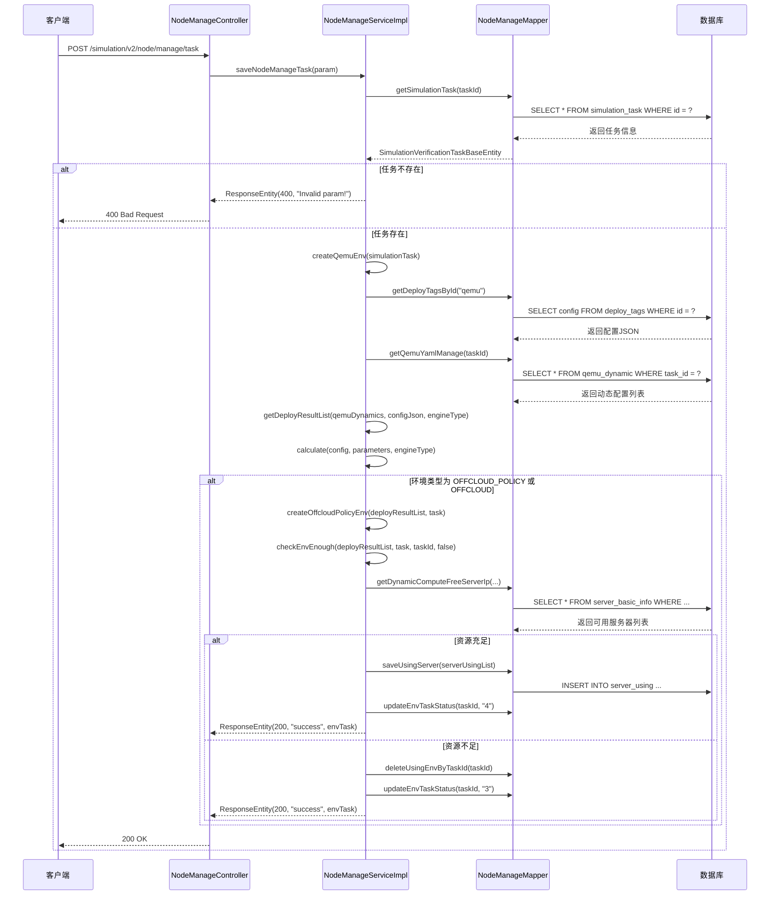
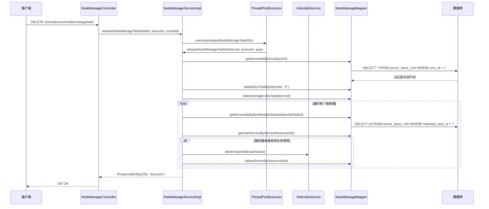
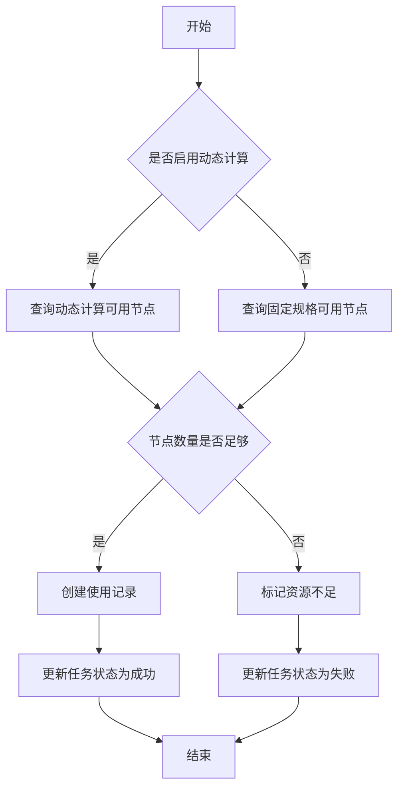

# 节点管理系统设计

## 1. 系统定位

节点管理系统是 `openlibing-simulation` 的核心模块之一，负责仿真环境的资源调度和节点分配。该系统主要支撑以下业务场景：

- 仿真任务的节点资源分配
- 节点状态管理和生命周期维护
- 多架构（ARM/x86）节点的识别与适配
- 节点复用策略的动态计算
- 与外部资源管理系统（Hidevlab）的对接

## 2. 业务边界

| 边界类型 | 说明 |
| --- | --- |
| 上游依赖 | 仿真任务管理模块、YAML配置管理模块 |
| 下游依赖 | Hidevlab资源管理系统、数据库 |
| 外部接口 | Hidevlab API（机器申请/释放） |
| 内部接口 | 提供节点分配、查询、释放等REST API |

## 3. 领域模型

### 3.1 核心实体

| 实体 | 说明 | 关键字段 |
| --- | --- | --- |
| `NodeManageParamEntity` | 节点管理参数 | simulationTaskId, simulationSceneId, createBy |
| `ServerBasicInfoEntity` | 服务器基础信息 | id, ip, cpu, memory, architecture, status |
| `ServerUsingEntity` | 服务器使用记录 | serverId, taskId, useCpu, useMemory, status |
| `EnvironmentTaskEntity` | 环境任务 | id, name, status, environmentType, createBy |
| `SimulationDeployResultEntity` | 部署结果 | deploymentName, machineCount, useCpu, useMemory, architecture, reuseRule |
| `ReuseRuleEntity` | 复用规则 | dynamicCompute, resourceType |
| `MachineSpecEntity` | 机器规格 | useCpu, useMemory, architecture, resourceType |
| `DynamicRuleEntity` | 动态规则 | name, algorithm |

### 3.2 实体关系

```
NodeManageParamEntity
    └── SimulationVerificationTaskBaseEntity
            └── EnvironmentTaskEntity
                    └── List<ServerUsingEntity>
                            └── ServerBasicInfoEntity
            └── List<QemuDynamicEntity>
                    └── SimulationDeployResultEntity
                            ├── MachineSpecEntity
                            └── ReuseRuleEntity
```

## 4. 核心流程

### 4.1 创建资源调度任务流程



### 4.2 释放资源调度任务流程



## 5. 动态规则计算

系统支持通过 JavaScript 脚本动态计算资源需求，核心流程如下：

1. **参数收集**：从 QEMU 动态配置中提取 CPU、内存、架构等参数
2. **规则执行**：使用 Nashorn 脚本引擎执行动态规则
3. **结果计算**：根据规则算法计算机器数量、CPU、内存需求

### 5.1 支持的引擎类型

| 引擎类型 | CPU计算方式 | 内存计算方式 |
| --- | --- | --- |
| lingQuQemu | 直接使用配置值 | 直接使用配置值 |
| npuQemu | 直接使用配置值 | 直接使用配置值 |
| matrixSvrQemu | 根据命令行参数动态计算（kvm模式减半） | 根据命令行参数动态计算 |

### 5.2 动态规则示例

```javascript
// 机器数量计算
var machine_count = function() {
    return Math.ceil(useCpu / 16);
};

// CPU计算
var use_cpu = function() {
    return baseCpu * nodeCount;
};
```

## 6. 节点分配策略

### 6.1 本地节点分配



### 6.2 外部节点分配（Hidevlab）

当本地资源不足时，系统会调用 Hidevlab 服务申请外部资源：

1. 构造机器参数（数量、架构、CPU、内存）
2. 调用 Hidevlab API 申请任务
3. 轮询任务状态
4. 获取分配的机器信息
5. 同步到本地数据库

## 7. 接口列表

| API 路径 | HTTP方法 | 功能描述 |
| --- | --- | --- |
| `/simulation/v2/node/manage/task` | POST | 创建资源调度任务 |
| `/simulation/v2/node/manage/task` | GET | 查询调度任务详情 |
| `/simulation/v2/node/manage/task/node` | GET | 查询任务节点信息 |
| `/simulation/v2/node/manage/task` | DELETE | 释放调度任务 |
| `/simulation/v2/node/manage/node` | POST | 添加机器节点 |

## 8. 数据库表设计

### 8.1 server_basic_info（服务器基础信息表）

| 字段名 | 类型 | 说明 |
| --- | --- | --- |
| id | VARCHAR(64) | 主键ID |
| ip | VARCHAR(64) | 服务器IP地址 |
| cpu | INT | CPU核数 |
| memory | INT | 内存大小（GB） |
| architecture | VARCHAR(32) | 架构类型（ARM/x86） |
| status | VARCHAR(32) | 状态（可用/使用中/不可用） |
| hidevlab_task_id | VARCHAR(64) | Hidevlab任务ID |
| create_time | DATETIME | 创建时间 |
| update_time | DATETIME | 更新时间 |

### 8.2 server_using（服务器使用记录表）

| 字段名 | 类型 | 说明 |
| --- | --- | --- |
| id | VARCHAR(64) | 主键ID |
| server_id | VARCHAR(64) | 关联服务器ID |
| task_id | VARCHAR(64) | 关联任务ID |
| use_cpu | INT | 使用的CPU核数 |
| use_memory | INT | 使用的内存大小（GB） |
| status | VARCHAR(32) | 使用状态 |
| deploy_type | VARCHAR(64) | 部署类型（单节点/多节点） |
| create_time | DATETIME | 创建时间 |

## 9. 异常处理

| 异常场景 | 处理策略 | 返回码 |
| --- | --- | --- |
| 参数为空或无效 | 直接返回错误信息 | 400 |
| 任务不存在 | 返回参数无效 | 400 |
| 资源不足 | 回滚已分配资源，标记任务失败 | 200（业务失败） |
| Hidevlab调用失败 | 重试机制，记录错误日志 | 200（业务失败） |
| 脚本执行异常 | 记录错误日志，使用默认值 | 200（业务失败） |

## 10. 性能优化

### 10.1 异步释放

释放任务时采用线程池异步执行，避免阻塞主线程：

```java
private final ThreadPoolExecutor taskExecutor = new ThreadPoolExecutor(40, 50, 60L, TimeUnit.SECONDS,
    new LinkedBlockingDeque<>(5000));
```

### 10.2 批量操作

对于大量节点的分配和释放，使用批量SQL操作减少数据库交互次数。

### 10.3 缓存策略

对常用的配置信息（如部署标签配置）进行内存缓存，减少数据库查询。