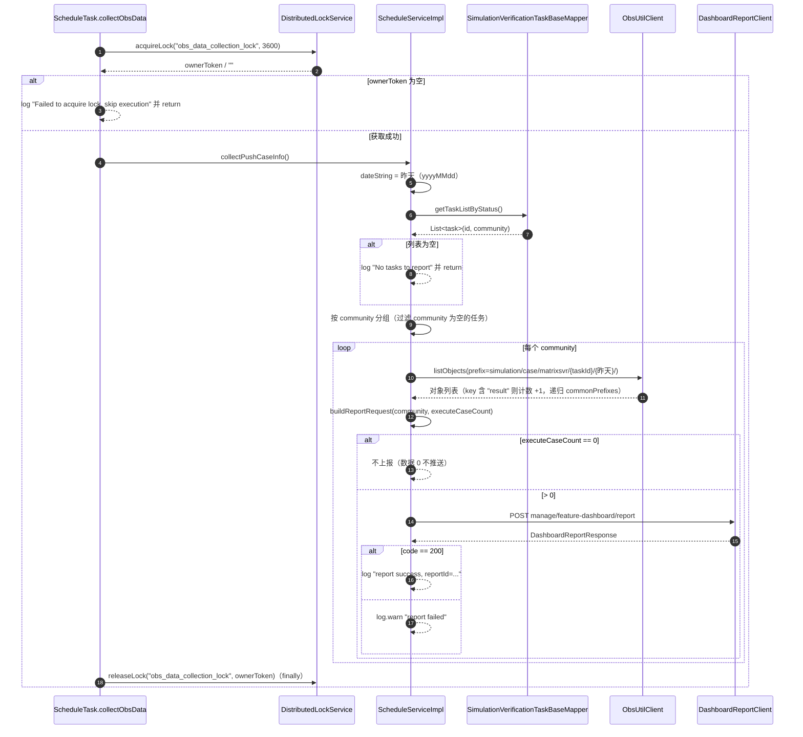

# 运营数据上报系统设计

> 本文与代码基线 `master@4f22896` 对齐。所有结论均标注来源文件与行号。

## 1. 系统定位

运营数据上报用于把仿真验证任务的**执行用例数**按开源社区维度聚合后，推送到 OpenLibing 运营看板（`openlibing-framework` 的 `manage/feature-dashboard/report`）。

链路为：**定时任务 → 抢分布式锁 → OBS 对象列举计数 → 按 community 聚合 → Feign 上报**。

> **重要现状**：该链路的定时入口 `@Scheduled` 注解**已从源码移除**，全仓无其它调用方，因此**当前不会产生运行时流量**（详见 §7）。

## 2. 业务边界

| 边界类型 | 说明                                                                                                                   |
| -------- | ---------------------------------------------------------------------------------------------------------------------- |
| 上游触发 | `ScheduleTask.collectObsData()`（当前无调度入口）                                                                      |
| 下游依赖 | MySQL（`t_simulation_verification_task_base`）、华为云 OBS（`op-case-result` bucket）、`openlibing-framework`（Feign） |
| 对外接口 | 无（不暴露 REST 接口）                                                                                                 |
| 数据方向 | 单向出：本服务 → 运营看板，不接收回调                                                                                  |
| 失败影响 | **不影响主业务流程**。由于入口已摘除，即便恢复调度，异常也被局部 try/catch 吞掉                                        |

## 3. Feign 客户端定义

```java
@FeignClient(name = "openlibing-framework")
public interface DashboardReportClient {
    @PostMapping(value = "manage/feature-dashboard/report")
    DashboardReportResponse report(@RequestBody DashboardReportRequest request);
}
```

`client/DashboardReportClient.java:21-31`。注解属性说明：

| 属性                                                                            | 值                     |
| ------------------------------------------------------------------------------- | ---------------------- |
| `name`                                                                          | `openlibing-framework` |
| `path` / `url` / `configuration` / `fallback` / `fallbackFactory` / `contextId` | **均未设置**           |

全仓仅此一个 `@FeignClient`。`@EnableFeignClients` 在 `Application.java:31`，**未指定** `basePackages` / `defaultConfiguration`，使用默认扫描。

OpenFeign 的能力由 `com.openlibing:openlibing-common`（`pom.xml:268-269`）传递引入，`pom.xml` 中**未直接声明** `spring-cloud-starter-openfeign`。

## 4. 请求 / 响应模型

### 4.1 DashboardReportRequest

`entity/dto/DashboardReportRequest.java:21-48`，Lombok `@Data @Builder @NoArgsConstructor @AllArgsConstructor`。

| 字段              | 类型                  | 必填 | 含义         | 组装情况                                                           |
| ----------------- | --------------------- | ---- | ------------ | ------------------------------------------------------------------ |
| `community`       | `String`              | 否   | 开源社区名称 | 由分组键赋值（`ScheduleServiceImpl.java:167`）                     |
| `repo`            | `String`              | 否   | 代码仓链接   | **从未被赋值**，恒为 `null`                                        |
| `feature`         | `String`              | 是   | 特性名称     | **硬编码** `"测试管理"`（`:170`）                                  |
| `businessMetrics` | `Map<String, Object>` | 是   | 业务指标     | 仅含一个键 `zhanlu_execute_case_count`（`:176-178`）               |
| `timestamp`       | `String`              | 否   | 采集时间戳   | `DateTimeUtils.getCurrent()`，格式 `yyyy-MM-dd HH:mm:ss`（`:180`） |
| `userMetrics`     | `Map<String, Object>` | 否   | 用户指标     | **空 Map**（`:173`）                                               |

### 4.2 DashboardReportResponse

`entity/dto/DashboardReportResponse.java:22-105`，`@Data` + `@JsonInclude(NON_NULL)`。

| 字段        | 类型                | 说明         |
| ----------- | ------------------- | ------------ |
| `code`      | `Integer`           | 200 表示成功 |
| `message`   | `String`            | 响应消息     |
| `data`      | `ReportData`        | 响应数据     |
| `timestamp` | `LocalDateTime`     | 响应生成时间 |
| `errors`    | `List<ErrorDetail>` | 错误列表     |

嵌套结构：

- `ReportData`：`reportId`（`@JsonProperty("report_id")`）、`community`、`feature`、`status`、`receivedAt`（`@JsonProperty("received_at")`）、`updatedFields`（`@JsonProperty("updated_fields")`，`List<String>`）；
- `ErrorDetail`：`field`、`reason`。

### 4.3 成功判定

唯一判定条件：`response != null && response.getCode() == 200`（`ScheduleServiceImpl.java:108`）。否则记 `log.warn("report failed, ...")`，**无重试、无熔断、无降级**。

## 5. 上报链路



关键分支：

| 分支                    | 行为                                                              | 位置                             |
| ----------------------- | ----------------------------------------------------------------- | -------------------------------- |
| 抢锁失败                | 跳过本轮                                                          | `ScheduleTask.java:40-44`        |
| 任务列表为空            | 直接返回                                                          | `ScheduleServiceImpl.java:62-65` |
| `community` 为空的任务  | 分组前被过滤掉，不参与上报                                        | `:69`                            |
| `executeCaseCount == 0` | 不上报                                                            | `:98-100`                        |
| 单个 community 上报异常 | 捕获 `FeignException`，`log.error` 后**继续处理下一个 community** | `:76-80`                         |

## 6. 数据来源与统计口径

### 6.1 数据库侧（唯一的 DB 查询）

| 项       | 内容                                                                                                                                                                |
| -------- | ------------------------------------------------------------------------------------------------------------------------------------------------------------------- |
| Mapper   | `SimulationVerificationTaskBaseMapper.getTaskListByStatus()`（`:62`）                                                                                               |
| SQL      | `select id, community from t_simulation_verification_task_base where status != "FAILED" and is_deleted = "0"`（`SimulationVerificationTaskBaseMapper.xml:102-107`） |
| 数据源   | 该 Mapper 仅标 `@Mapper`，**无 `@DataSource` 注解**，走 `@Primary` 主数据源                                                                                         |
| 统计函数 | 无 `COUNT` / `GROUP BY`，只取 `id` 与 `community` 两列                                                                                                              |

### 6.2 对象存储侧（真正的计数口径）

`executeCaseCount` **不是数据库统计值**，而是列举 OBS 对象得出的：

| 项       | 值                                                              | 位置                           |
| -------- | --------------------------------------------------------------- | ------------------------------ |
| Bucket   | `Constans.BUCKET_NAME = "op-case-result"`                       | `Constans.java:279`            |
| 前缀模板 | `Constans.OBS_PATH_PREFIX = "simulation/case/matrixsvr/%s/%s/"` | `Constans.java:274`            |
| 实际前缀 | `simulation/case/matrixsvr/{taskId}/{昨天yyyyMMdd}/`            | `ScheduleServiceImpl.java:145` |
| 计数规则 | 对象 key **包含子串 `"result"`** 则计数 +1                      | `:192-194`                     |
| 递归     | 对 `commonPrefixes` 递归列举（`delimiter="/"`）                 | `:203-215`                     |
| 聚合     | 同一 community 下**所有任务**的计数累加                         | `:139-152`                     |
| 上报字段 | 映射为 `businessMetrics["zhanlu_execute_case_count"]`           | `:177`                         |

```java
// Plan 1: 计数逻辑
for (ObsObject obsObject : result.getObjects()) {
    if (obsObject.getObjectKey().contains("result")) {
        counts[0]++;
    }
}
```

> 该口径依赖 OBS 对象命名约定（key 含 `result`）与目录结构（按 `taskId/日期` 分层）。若上游产物命名变化，计数会静默失真（计数为 0 时不会上报，也不报错）。

## 7. 定时任务与分布式锁

### 7.1 当前状态

| 项                  | 现状                                            | 依据                   |
| ------------------- | ----------------------------------------------- | ---------------------- |
| `@Component`        | 有                                              | `ScheduleTask.java:24` |
| `@Scheduled`        | **无**（全仓 grep 零命中）                      | `:37`                  |
| 类 Javadoc          | 仍写「定时任务：每天凌晨1点采集OBS数据」        | `:19-20`               |
| `@EnableScheduling` | `Application.java:34` 仍保留                    | —                      |
| 其它调用方          | 无                                              | —                      |
| 历史 cron           | `0 0 1 * * ?`（源码中已不存在，仅见于文档记载） | —                      |

结论：**该方法当前不会被调度器自动触发**。如需恢复「每天 01:00 执行」，必须重新加回 `@Scheduled(cron = "0 0 1 * * ?")`。

### 7.2 分布式锁

| 项       | 值                                                              | 位置                   |
| -------- | --------------------------------------------------------------- | ---------------------- |
| 锁名     | `obs_data_collection_lock`                                      | `ScheduleTask.java:28` |
| 过期时间 | 3600 秒                                                         | `:29`                  |
| 释放     | `finally` 中 `releaseLock(LOCK_NAME, ownerToken)`，带持有者校验 | `:51-58`               |

`renewLock` 未被调用，即执行超过 1 小时会被其他实例抢占。锁机制细节见《分布式锁系统设计.md》。

### 7.3 未被使用的注入

`QemuTaskServiceImpl` 注入了 `ScheduleService scheduleService`（`QemuTaskServiceImpl.java:235`），但全类仅此一处出现，**从未被调用**，属死字段。

## 8. 配置项

### 8.1 Feign 超时 / 重试 / 日志

**仓内无任何 Feign 配置**：`application.yaml` 与三个环境 yaml 中 grep `feign|ribbon|hystrix|circuitbreaker|connectTimeout|readTimeout|retryer|loggerLevel` **零命中**。

实际生效值只能来自 Nacos 远端的 `application` / `framework` 配置（`spring.config.import: optional:nacos:...`），**本仓无法确认**。若不显式配置，则使用 OpenFeign 默认值（默认无重试）。

### 8.2 相关配置项

| 配置项            | 位置                                                                            |
| ----------------- | ------------------------------------------------------------------------------- |
| OBS AK/SK         | `ObsUtilClient.java:22-46`，经 `SecurityUtil.decrypt(..., security.part1)` 解密 |
| `security.part1`  | `ObsUtilClient.java:31`                                                         |
| Bucket 与前缀常量 | `Constans.java:274, 279`（编译期常量，非配置项）                                |

## 9. 异常与降级

| 层次                                      | 异常处理                                                                                        | 位置                      |
| ----------------------------------------- | ----------------------------------------------------------------------------------------------- | ------------------------- |
| `ScheduleTask`                            | `catch (FeignException)` → `log.error("OBS data collection task failed")`；`finally` 保证释放锁 | `ScheduleTask.java:49-59` |
| `ScheduleServiceImpl.collectPushCaseInfo` | 对**每个 community** 单独 `try/catch (FeignException)`，失败不中断其余 community                | `:76-80`                  |
| `getCaseInfoByCommunity`                  | 对**每个任务** `catch (ObsException)`，OBS 列举失败不影响其他任务                               | `:148-150`                |
| 上报失败                                  | 仅 `log.warn`，**无重试**                                                                       | `:113-118`                |

### 9.1 已知风险点

| #   | 风险                                                                                                                                                                                 | 位置               |
| --- | ------------------------------------------------------------------------------------------------------------------------------------------------------------------------------------ | ------------------ |
| 1   | 成功分支直接访问 `response.getData().getReportId()`，若 `code==200` 但 `data==null` 会抛 NPE；该 NPE 是 `RuntimeException`，**不在** `catch (FeignException)` 覆盖范围内，会向上冒泡 | `:109-112`         |
| 2   | 递归列举时 `request.setMaxKeys(100000)` 超出 OBS `ListObjectsRequest` 文档标注的 1~1000 取值范围（超出按 1000 处理）                                                                 | `:208`             |
| 3   | 被递归调用的 `listObjects` 会再次 `listObjectsByPrefix`，嵌套层级取决于 OBS 目录深度，无深度上限                                                                                     | `:185-215`         |
| 4   | OBS 列举失败仅记日志，计数按 0 处理；若整个 community 计数为 0 则静默不上报，**无法区分「真的没有用例」与「采集失败」**                                                              | `:98-100, 148-150` |
| 5   | `repo` 字段恒为 `null`，若看板侧依赖该字段做仓关联会不完整                                                                                                                           | `:163-182`         |

## 10. 单元测试

`src/test` 中 grep `Schedule|DashboardReport|collectPushCaseInfo|zhanlu_execute_case_count` **无任何命中**。

即 `ScheduleServiceImpl`、`ScheduleTask`、`DashboardReportClient` **均无单元测试**。该链路只跑在定时任务里，无 REST 接口可直接触发，属测试盲区。
