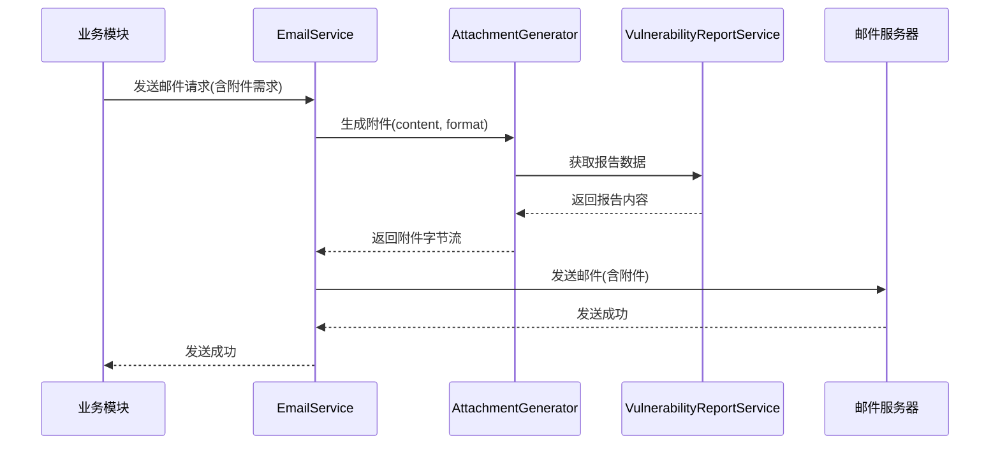

# 欧拉社区邮件新增附件功能 - 技术设计

## 1. 功能概述

本功能为欧拉社区邮件通知系统新增附件支持，允许在发送邮件时附带漏洞报告、统计数据等附件文件。

## 2. 架构设计

### 2.1 模块划分

| 模块 | 职责 | 状态 |
| :--- | :--- | :--- |
| EmailService | 邮件发送核心服务 | 修改 |
| AttachmentGenerator | 附件生成器 | 新增 |
| VulnerabilityReportService | 漏洞报告服务 | 修改 |

### 2.2 核心流程图



## 3. 接口设计

### 3.1 新增接口

| 接口名 | 方法 | 功能描述 |
| :--- | :--- | :--- |
| /api/email/attachment/generate | POST | 生成邮件附件 |

### 3.2 请求参数

| 参数名 | 类型 | 必填 | 说明 |
| :--- | :--- | :--- | :--- |
| content | String | 是 | 附件内容 |
| format | String | 是 | 附件格式(pdf/csv/json) |
| fileName | String | 否 | 自定义文件名 |

### 3.3 返回参数

| 参数名 | 类型 | 说明 |
| :--- | :--- | :--- |
| success | Boolean | 是否成功 |
| data | Object | 附件数据 |
| data.fileName | String | 文件名 |
| data.content | Base64 | 文件内容(Base64编码) |
| data.size | Long | 文件大小(字节) |

## 4. 数据模型

### 4.1 附件信息

```json
{
  "fileName": "漏洞报告_20260615.pdf",
  "contentType": "application/pdf",
  "content": "base64-encoded-content",
  "size": 102400,
  "generatedAt": "2026-06-15T10:00:00Z"
}
```

### 4.2 邮件发送请求

```json
{
  "to": ["user@example.com"],
  "subject": "漏洞告警通知",
  "body": "详见附件",
  "attachments": [
    {
      "fileName": "漏洞报告.pdf",
      "contentType": "application/pdf",
      "content": "base64-content"
    }
  ]
}
```

## 5. 数据库设计

本功能无需新增数据库表，仅涉及邮件发送和附件生成逻辑。

## 6. 安全性考虑

### 6.1 注意事项

| 风险点 | 风险等级 | 关联模块 |
| :--- | :--- | :--- |
| 附件大小限制 | 中 | AttachmentGenerator |
| 恶意文件上传 | 高 | AttachmentGenerator |
| 敏感信息泄露 | 高 | EmailService |

### 6.2 解决方案

| 风险点 | 解决方案 |
| :--- | :--- |
| 附件大小限制 | 设置最大附件大小限制(如10MB) |
| 恶意文件上传 | 限制附件格式，仅允许白名单格式 |
| 敏感信息泄露 | 确保附件内容经过脱敏处理 |

## 7. 部署与集成

### 7.1 依赖要求

| 依赖 | 版本 | 用途 |
| :--- | :--- | :--- |
| JavaMail | 1.6.x | 邮件发送 |
| iTextPDF | 7.x | PDF生成 |

### 7.2 配置说明

```yaml
email:
  attachment:
    enabled: true
    max-size: 10MB
    allowed-formats:
      - pdf
      - csv
      - json
```

## 8. 关联 Issue 和 PR

- **Issue**: [openlibing/openlibing-vulnerability#21](https://gitcode.com/openlibing/openlibing-vulnerability/issues/21)
- **PR**: [openlibing/openlibing-vulnerability!94](https://gitcode.com/openlibing/openlibing-vulnerability/merge_requests/94)