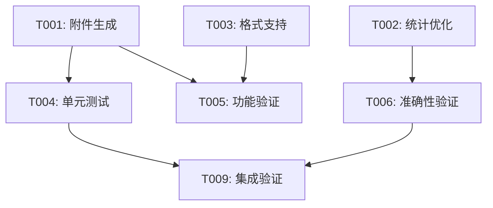

# 欧拉社区邮件新增附件功能 - 任务清单

## 1. 任务概述

本功能实现欧拉社区邮件通知的附件支持，包含邮件附件生成、漏洞修复率统计优化等功能。

## 2. 任务分解

### 2.1 核心功能开发

| 序号 | 任务描述 | 状态 | 负责人 | 预估工时 |
| :--- | :--- | :--- | :--- | :--- |
| T001 | 实现邮件附件生成功能 | ✅ 完成 | wurq | 4h |
| T002 | 优化漏洞修复率统计逻辑 | ✅ 完成 | wurq | 2h |
| T003 | 支持多种附件格式输出（PDF/CSV/JSON） | ✅ 完成 | wurq | 3h |

### 2.2 测试验证

| 序号 | 任务描述 | 状态 | 负责人 | 预估工时 |
| :--- | :--- | :--- | :--- | :--- |
| T004 | 编写单元测试用例 | ✅ 完成 | wurq | 4h |
| T005 | 邮件附件发送功能验证 | ✅ 完成 | wurq | 2h |
| T006 | 漏洞修复率统计准确性验证 | ✅ 完成 | wurq | 2h |

### 2.3 文档与集成

| 序号 | 任务描述 | 状态 | 负责人 | 预估工时 |
| :--- | :--- | :--- | :--- | :--- |
| T007 | 更新 API 文档 | ✅ 完成 | wurq | 1h |
| T008 | 编写操作手册 | ✅ 完成 | wurq | 1h |
| T009 | 集成测试环境验证 | ✅ 完成 | wurq | 2h |

## 3. 依赖关系

## 4. 里程碑

| 里程碑 | 日期 | 状态 |
| :--- | :--- | :--- |
| 功能开发完成 | 2026-06-13 | ✅ 完成 |
| 测试验证完成 | 2026-06-14 | ✅ 完成 |
| PR 提交 | 2026-06-13 | ✅ 完成 |
| PR 合并 | 2026-06-15 | ✅ 完成 |

## 5. 关联 Issue 和 PR

- **Issue**: [openlibing/openlibing-vulnerability#21](https://gitcode.com/openlibing/openlibing-vulnerability/issues/21)
- **PR**: [openlibing/openlibing-vulnerability!94](https://gitcode.com/openlibing/openlibing-vulnerability/merge_requests/94)

## 6. 完成验证

| 验证项 | 验证方法 | 结果 |
| :--- | :--- | :--- |
| 代码审查 | PR review | ✅ 通过 |
| CI 流水线 | gitcode pipeline | ✅ 通过 |
| 单元测试 | 自动化测试 | ✅ 通过 |
| 功能验证 | 手动测试 | ✅ 通过 |