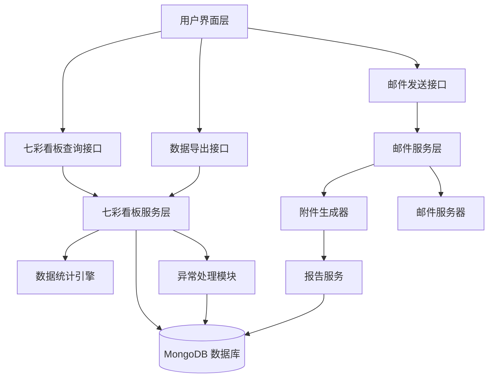
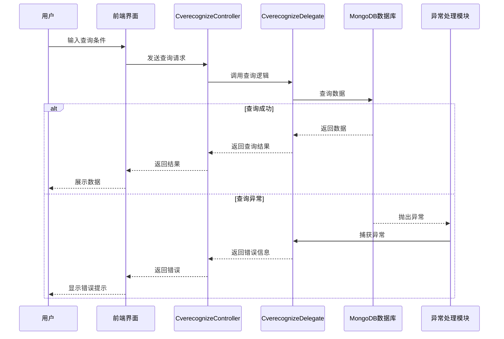
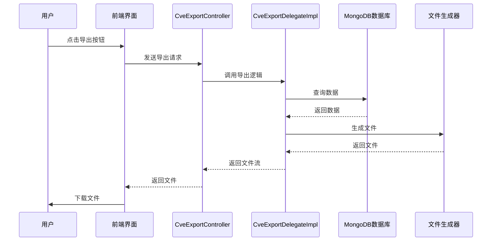
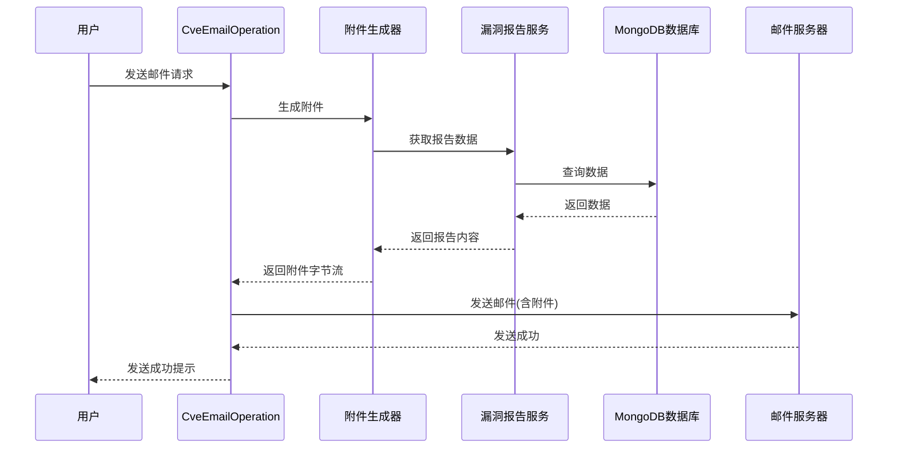
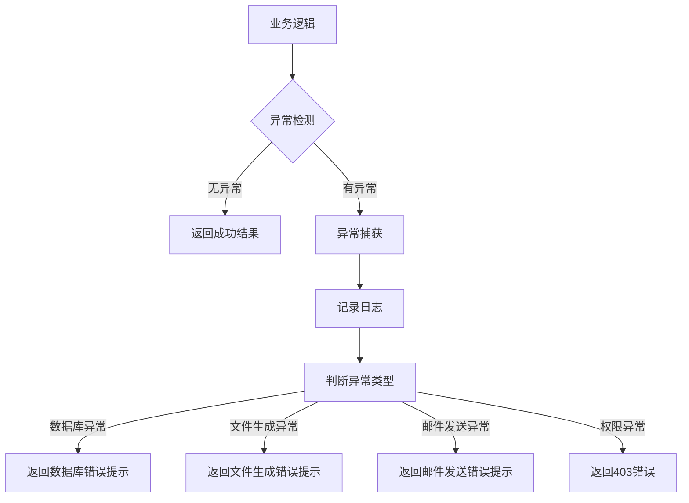

# 欧拉社区七彩看板与邮件附件功能 - 技术设计

## 1. 系统架构

### 1.1 整体架构

本次开发包含两个主要功能模块：

1. **七彩看板模块** - 负责漏洞数据的可视化展示、查询和导出
2. **邮件附件模块** - 负责邮件附件的生成和发送



### 1.2 模块划分

| 模块 | 职责 | 状态 |
| :--- | :--- | :--- |
| CverecognizeController | 七彩看板识别控制器 | 新增 |
| CverecognizeDelegate | 七彩看板识别代理 | 新增 |
| CverecognizeDelegateImpl | 七彩看板识别代理实现 | 新增 |
| CveExportController | 漏洞数据导出控制器 | 新增 |
| CveExportDelegateImpl | 漏洞数据导出代理实现 | 扩展 |
| CveRepairOperation | 漏洞修复率操作 | 修改 |
| CveEmailOperation | 漏洞邮件操作 | 修改 |
| VulnerabilityDto | 漏洞数据传输对象 | 扩展 |
| CveLogHandler | 漏洞日志处理器 | 修改 |
| DraftBoxMapper | 草稿箱数据访问层 | 修改 |

## 2. 核心流程设计

### 2.1 七彩看板查询流程



### 2.2 七彩看板数据导出流程



### 2.3 邮件附件发送流程



## 3. 接口设计

### 3.1 七彩看板查询接口

**接口**: `POST /api/rainboard/query`

**请求参数**:
```json
{
  "branch": "分支名称",
  "startDate": "开始日期",
  "endDate": "结束日期",
  "vulnerabilityType": "漏洞类型",
  "page": 1,
  "pageSize": 20
}
```

**响应结果**:
```json
{
  "code": 200,
  "message": "查询成功",
  "data": {
    "total": 100,
    "items": [
      {
        "id": "CVE-2024-1234",
        "branch": "master",
        "severity": "Critical",
        "status": "Fixed",
        "repairRate": 95.5,
        "reportDate": "2024-06-15"
      }
    ]
  }
}
```

### 3.2 数据导出接口

**接口**: `POST /api/export/rainboard`

**请求参数**:
```json
{
  "branch": "分支名称",
  "format": "csv",
  "fullExport": true,
  "queryConditions": {}
}
```

**响应结果**:
- Content-Type: `application/vnd.openxmlformats-officedocument.spreadsheetml.sheet`
- Content-Disposition: `attachment; filename="rainboard_report_20240615.csv"`

### 3.3 邮件发送接口（含附件）

**接口**: `POST /api/email/send`

**请求参数**:
```json
{
  "recipients": ["user@example.com"],
  "subject": "漏洞修复报告",
  "body": "请查看附件中的详细报告",
  "attachments": [
    {
      "name": "漏洞报告_20240615.pdf",
      "type": "pdf",
      "data": "base64编码的附件内容"
    }
  ]
}
```

**响应结果**:
```json
{
  "code": 200,
  "message": "邮件发送成功",
  "data": {
    "messageId": "msg_123456",
    "sendTime": "2024-06-15T10:30:00Z"
  }
}
```

## 4. 数据模型设计

### 4.1 漏洞数据模型（VulnerabilityDto）

```java
public class VulnerabilityDto {
    private String id;              // 漏洞ID
    private String branch;          // 分支名称
    private String severity;        // 严重程度
    private String status;          // 状态
    private Double repairRate;      // 修复率
    private Date reportDate;        // 报告日期
    private Integer totalVulnerabilities;  // 总漏洞数
    private Integer fixedVulnerabilities;   // 已修复数
    private Integer pendingVulnerabilities; // 待修复数
    // getter and setter
}
```

### 4.2 导出请求模型

```java
public class ExportRequest {
    private String branch;          // 分支名称
    private String format;          // 导出格式(csv/excel/pdf)
    private Boolean fullExport;     // 是否全量导出
    private Map<String, Object> queryConditions;  // 查询条件
    // getter and setter
}
```

### 4.3 邮件附件模型

```java
public class EmailAttachment {
    private String name;            // 附件名称
    private String type;            // 附件类型
    private String data;            // base64编码的数据
    // getter and setter
}
```

## 5. 安全性设计

### 5.1 数据安全

- **数据加密**：敏感数据在传输过程中使用 HTTPS 加密
- **数据脱敏**：导出数据时对敏感信息进行脱敏处理
- **权限控制**：数据导出功能需要管理员权限

### 5.2 邮件安全

- **附件大小限制**：单个附件不超过 10MB
- **附件类型限制**：仅允许指定格式（PDF、CSV、JSON）
- **邮件发送限流**：防止邮件轰炸，限制单用户每日发送次数

## 6. 性能优化

### 6.1 数据库优化

- **索引优化**：为常用查询字段添加索引
- **分页查询**：大数据量查询采用分页方式
- **缓存机制**：热点数据缓存到 Redis

### 6.2 导出优化

- **分批导出**：大数据量导出采用分批处理
- **异步导出**：大文件导出采用异步方式，避免阻塞
- **内存优化**：流式写入文件，避免内存溢出

### 6.3 邮件优化

- **异步发送**：邮件发送采用异步方式，不影响主流程
- **批量发送**：支持批量邮件发送，减少服务器压力

## 7. 异常处理

### 7.1 异常分类

| 异常类型 | 处理方式 |
| :--- | :--- |
| 数据库异常 | 捕获并记录日志，返回用户友好提示 |
| 文件生成异常 | 捕获异常，提示用户重试 |
| 邮件发送异常 | 捕获异常，记录日志，支持重试 |
| 权限异常 | 返回 403 错误，提示用户无权限 |

### 7.2 异常处理流程



## 8. 部署配置

### 8.1 配置项

| 配置项 | 说明 | 默认值 |
| :--- | :--- | :--- |
| rainboard.query.timeout | 查询超时时间 | 5000ms |
| rainboard.export.max-size | 导出文件最大大小 | 10MB |
| email.attachment.max-size | 邮件附件最大大小 | 10MB |
| email.send.limit | 每日发送限制 | 100次 |

### 8.2 环境变量

```bash
# MongoDB 配置
MONGODB_URI=mongodb://localhost:27017/openlibing

# 邮件服务配置
SMTP_HOST=smtp.example.com
SMTP_PORT=587
SMTP_USERNAME=noreply@openlibing.com
SMTP_PASSWORD=******

# 导出配置
EXPORT_TEMP_DIR=/tmp/exports
EXPORT_MAX_ROWS=10000
```

## 9. 测试策略

### 9.1 单元测试

- 七彩看板查询逻辑测试
- 数据导出功能测试
- 邮件附件生成测试
- 异常处理逻辑测试

### 9.2 集成测试

- 前后端集成测试
- 数据库集成测试
- 邮件服务集成测试

### 9.3 性能测试

- 查询响应时间测试
- 大数据量导出测试
- 邮件发送性能测试

## 10. 回滚方案

- **数据库回滚**：保留数据备份，支持快速回滚
- **代码回滚**：使用 Git 版本控制，支持快速回滚到上一版本
- **配置回滚**：保留配置文件备份，支持快速恢复