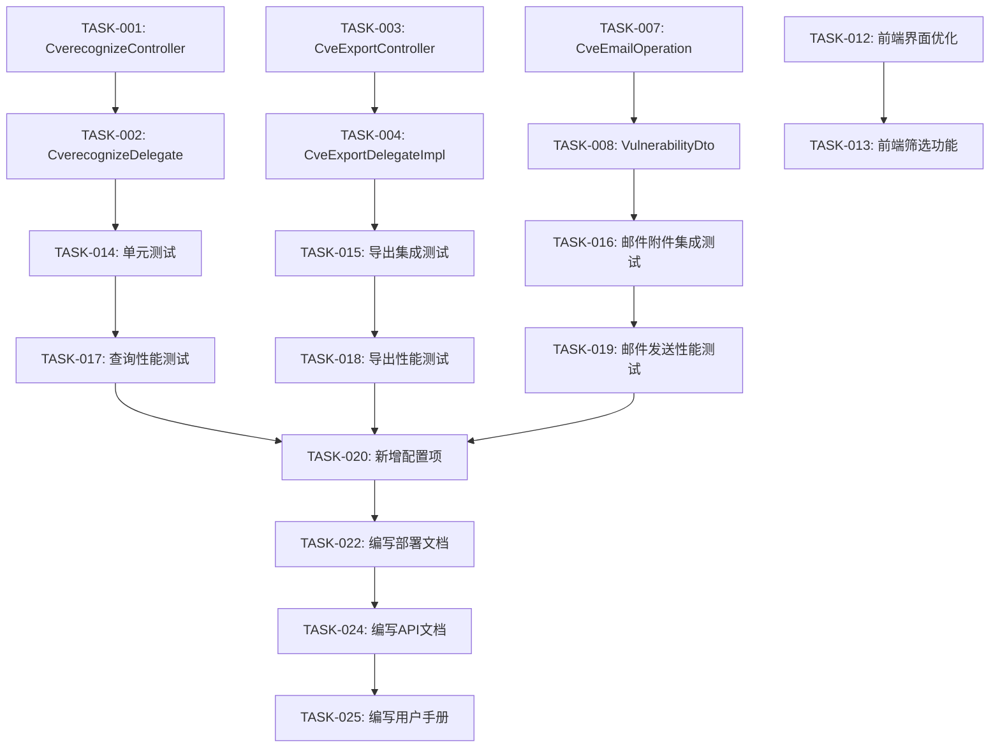

# 欧拉社区七彩看板与邮件附件功能 - 任务清单

## 1. 核心开发任务

### 1.1 七彩看板功能开发

- [ ] **TASK-001**: 新增 `CverecognizeController` 控制器
  - 创建七彩看板查询接口
  - 实现参数校验逻辑
  - 集成异常处理机制
  - **预计工时**: 2h
  - **验收标准**: 接口可正常调用，参数校验正确

- [ ] **TASK-002**: 新增 `CverecognizeDelegate` 及其实现类
  - 创建七彩看板查询业务逻辑
  - 实现数据聚合和统计
  - 新增分支数据统计异常捕获
  - **预计工时**: 3h
  - **验收标准**: 查询结果正确，异常可正常捕获

- [ ] **TASK-003**: 新增 `CveExportController` 控制器
  - 创建数据导出接口
  - 实现导出格式转换（CSV、Excel）
  - 实现全量导出和条件导出
  - **预计工时**: 3h
  - **验收标准**: 导出功能正常，格式正确

- [ ] **TASK-004**: 扩展 `CveExportDelegateImpl` 实现类
  - 修复 Data 导出全量 bug
  - 优化导出性能
  - 实现分批导出逻辑
  - **预计工时**: 4h
  - **验收标准**: 全量导出无 bug，性能满足要求

- [ ] **TASK-005**: 修改 `CveRepairOperation` 类
  - 优化漏洞修复率计算逻辑
  - 新增修复率统计的异常处理
  - **预计工时**: 2h
  - **验收标准**: 修复率计算正确，异常可正常处理

- [ ] **TASK-006**: 修改 `DraftBoxMapper` 及其 XML 配置
  - 优化 Data 查询配置
  - 新增查询索引
  - **预计工时**: 1h
  - **验收标准**: 查询性能提升

### 1.2 邮件附件功能开发

- [ ] **TASK-007**: 修改 `CveEmailOperation` 类
  - 新增邮件附件生成功能
  - 实现附件名称配置
  - 支持多种附件格式（PDF、CSV、JSON）
  - **预计工时**: 3h
  - **验收标准**: 附件可正常生成并发送

- [ ] **TASK-008**: 扩展 `VulnerabilityDto` 类
  - 新增附件相关字段
  - **预计工时**: 0.5h
  - **验收标准**: DTO 字段正确

### 1.3 数据访问层修改

- [ ] **TASK-009**: 修改 `CveLogHandler` 类
  - 新增日志记录逻辑
  - 优化日志格式
  - **预计工时**: 1h
  - **验收标准**: 日志记录正确

- [ ] **TASK-010**: 新增 `LogOperationAndModule` 类
  - 定义日志操作和模块枚举
  - **预计工时**: 0.5h
  - **验收标准**: 枚举定义正确

- [ ] **TASK-011**: 新增 `DateUtil` 工具类
  - 实现日期格式化和计算工具方法
  - **预计工时**: 1h
  - **验收标准**: 工具方法可用

## 2. 前端开发任务

- [ ] **TASK-012**: 前端界面优化
  - 优化七彩看板界面布局
  - 增强用户交互体验
  - **预计工时**: 4h
  - **验收标准**: 界面美观，交互流畅

- [ ] **TASK-013**: 新增前端筛选功能
  - 实现多条件筛选
  - 实现筛选条件持久化
  - **预计工时**: 3h
  - **验收标准**: 筛选功能正常

## 3. 测试任务

### 3.1 单元测试

- [ ] **TASK-014**: 新增 `CveDelegateImplTest` 测试类
  - 测试七彩看板查询逻辑
  - 测试数据统计逻辑
  - 测试异常处理逻辑
  - **预计工时**: 2h
  - **验收标准**: 测试覆盖率 ≥80%

### 3.2 集成测试

- [ ] **TASK-015**: 数据导出集成测试
  - 测试全量导出功能
  - 测试条件导出功能
  - **预计工时**: 2h
  - **验收标准**: 导出功能正常

- [ ] **TASK-016**: 邮件附件集成测试
  - 测试邮件发送功能
  - 测试附件生成功能
  - **预计工时**: 2h
  - **验收标准**: 邮件和附件功能正常

### 3.3 性能测试

- [ ] **TASK-017**: 查询性能测试
  - 测试七彩看板查询响应时间
  - **预计工时**: 1h
  - **验收标准**: 响应时间 ≤2s

- [ ] **TASK-018**: 导出性能测试
  - 测试大数据量导出性能
  - **预计工时**: 1h
  - **验收标准**: 1000 条数据导出 ≤30s

- [ ] **TASK-019**: 邮件发送性能测试
  - 测试邮件发送性能
  - **预计工时**: 1h
  - **验收标准**: 邮件发送 ≤10s

## 4. 配置和部署任务

- [ ] **TASK-020**: 新增配置项
  - 添加查询超时配置
  - 添加导出文件大小限制配置
  - 添加邮件附件配置
  - **预计工时**: 0.5h
  - **验收标准**: 配置项可用

- [ ] **TASK-021**: 修改 MongoDB 配置
  - 切换 MongoDB 数据地址
  - **预计工时**: 0.5h
  - **验收标准**: 数据库连接正常

- [ ] **TASK-022**: 编写部署文档
  - 编写部署步骤
  - 编写配置说明
  - **预计工时**: 1h
  - **验收标准**: 文档清晰完整

## 5. 代码质量任务

- [ ] **TASK-023**: Codecheck 修改
  - 修复代码规范问题
  - 优化代码结构
  - **预计工时**: 2h
  - **验收标准**: 通过代码规范检查

## 6. 文档任务

- [ ] **TASK-024**: 编写 API 文档
  - 编写接口说明
  - 编写参数说明
  - **预计工时**: 1h
  - **验收标准**: 文档完整清晰

- [ ] **TASK-025**: 编写用户手册
  - 编写七彩看板使用说明
  - 编写数据导出使用说明
  - 编写邮件附件使用说明
  - **预计工时**: 2h
  - **验收标准**: 手册易懂完整

## 任务依赖关系

## 里程碑

| 里程碑 | 任务 | 预计完成时间 |
| :--- | :--- | :--- |
| **M1: 核心功能开发完成** | TASK-001 ~ TASK-011 | T+2天 |
| **M2: 前端开发完成** | TASK-012 ~ TASK-013 | T+3天 |
| **M3: 测试完成** | TASK-014 ~ TASK-019 | T+4天 |
| **M4: 部署和文档完成** | TASK-020 ~ TASK-025 | T+5天 |

## 完成验证清单

- [ ] 所有核心开发任务完成
- [ ] 所有前端开发任务完成
- [ ] 所有测试任务完成，测试覆盖率 ≥80%
- [ ] 所有配置项配置正确
- [ ] 部署文档完整清晰
- [ ] API 文档完整清晰
- [ ] 用户手册完整清晰
- [ ] 代码通过 codecheck 检查
- [ ] 性能测试通过
- [ ] 集成测试通过
- [ ] 所有验收标准满足

## 风险提示

1. **数据导出性能风险**：大数据量导出可能影响系统性能，建议采用异步导出方式
2. **邮件发送风险**：邮件服务器不稳定可能导致发送失败，建议增加重试机制
3. **前端兼容性风险**：不同浏览器可能存在兼容性问题，建议充分测试

## 备注

- 本任务清单基于 PR #99 的变更记录生成
- 预计工时可能根据实际情况调整
- 任务优先级：核心开发 > 测试 > 前端 > 文档