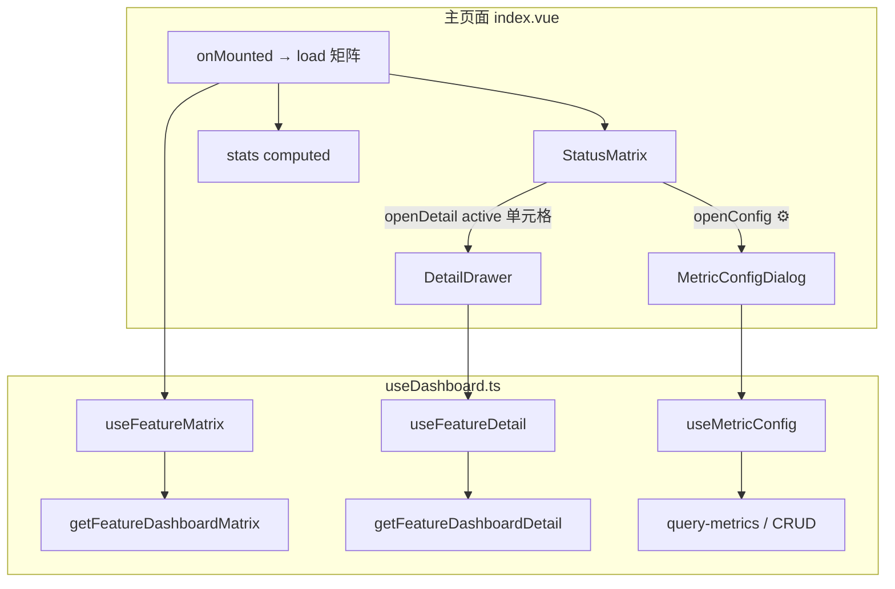
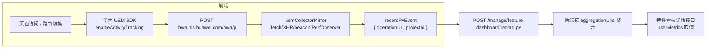

# 特性运营看板 页面整体设计

> 状态：**已实现**（对接真实后端接口，无 mock 层）
> 所属仓：`openlibing-web`（`apps/web-openlibing`）
> 集成位置：管理中心 →「运营运维」子菜单
> 文档位置：仓内临时位置，后续按工作区规范归档至 `openlibing-docs`
> 最后同步：2026-06-30（对照 `FeatureDashboard/` + UEM 采集链路源码）

## 1. 需求背景

在管理中心「运营运维」菜单下新增「特性运营看板」页面，用于展示各开源社区对 openLiBing 关键特性的接入情况：

- 以「特性 × 社区」矩阵展示每个社区是否接入了某关键特性（已接入 / 未接入 / 不涉及）。
- 页头展示汇总统计卡片（接入社区数、关键特性数、已接入特性数、整体接入率）。
- 每个特性拥有各自的**用户指标**与**业务指标**（指标名称、取值各不相同）。
- 指标定义支持自定义配置（增删改查）；用户指标支持预设模板与聚合 URL 配置。
- 点击已接入的特性可打开详情抽屉，支持社区切换（含「全部」）、日/周/月/年时间粒度筛选，展示该特性的用户指标与业务指标卡片。
- 用户指标（用户数 / 访问量）的数据来源：华为 **UEM SDK** 自动页面采集 + **Collector 镜像**写入自研 `/record-pv` 接口，后端按指标配置的 `aggregationUrls` 聚合。
- 数据通过 `@/api/api.ts` 统一封装的真实接口获取。

参考原型：`ops-dashboard-demo`（纯静态 HTML demo，部分交互与布局已在实现中调整）。

## 2. 关键决策（设计 vs 实现对照）

| 维度 | 原设计 | **当前实现** |
|------|--------|-------------|
| 集成位置 | `manageCenter` →「运营运维」 | ✅ 一致 |
| 主视图 | 社区 × 特性 状态矩阵 | **特性 × 社区**（行=特性，列=社区 + **末列「全部」**，首列固定） |
| 矩阵状态 | 已使用 / 未使用 两态 | **三态**：`active`（已接入）、`inactive`（未接入）、`not_involve`（不涉及） |
| 矩阵「全部」列 | 无 | **末列固定「全部」**；状态取自 `matrix['ALL'][featureName]`；`active` 可点击，打开详情时 `community=ALL` |
| 矩阵交互 | 仅「已使用」可点击 | ✅ 仅 `active` 可点击 → 打开详情抽屉 |
| 指标配置入口 | 表头特性名后 ⚙ 按钮 | ✅ 首列特性名旁 ⚙ 按钮，`emit('openConfig', feature)` |
| 详情面板 | 右侧抽屉，无趋势图 | ✅ **`size="50%"` 抽屉**（非固定 720px）；**指标卡片三列网格**，无趋势图 |
| 详情社区筛选 | 单社区下拉 | 下拉含 **「全部」**（`ALL_COMMUNITY = 'ALL'`），不传 `community` 参数 |
| 时间粒度 | 日/周/月/年 + 联动日期框 | ✅ 一致；**默认粒度为「月」** |
| 指标卡片 | metricName + ⓘ 描述 + 当前/目标 | **metricName + ⓘ tooltip 描述 + 聚合类型 Tag + 当前值/目标 + 目标达成率进度条**（描述不在卡片正文展示） |
| 聚合类型 | count / rate | **count / rate / last_value（时点）**；配置表头 tooltip 说明三种含义 |
| 指标分类 | 用户指标 + 业务指标 | ✅ 一致；用户指标 **下拉新增**（自定义 / 用户数 / 访问量）+ **aggregationUrls** |
| 指标配置编辑 | 内嵌表单 dialog | **表格行内编辑**（单行锁定；保存/取消在操作列；无嵌套 dialog） |
| 架构 | 多 composable + mock 层 | **单文件 `useDashboard.ts`**；API 在 `@/api/api.ts`，**无 mock / USE_MOCK** |
| 社区来源 | `get-project-select` | **矩阵接口 `GET /matrix` 返回的 `communities` 字段**（前端过滤掉 `ALL`） |
| 特性标识 | `featureKey`（如 `gate_check`） | **特性名称字符串**（`features` 与 `matrix` 内层 key 均为中文特性名） |
| 用户指标数据来源 | 路由守卫 debounce 上报 | **UEM SDK 自动采集 + Collector 镜像** → `/record-pv`（payload 含 `operationUrl` + `projectId`） |

## 3. 目录结构与组件职责

```
manageCenter/FeatureDashboard/
├── index.vue                    # 页面壳：页头 + 统计卡片 + 矩阵 + 抽屉/弹窗协调
├── useDashboard.ts              # 三个 composable：useFeatureMatrix / useFeatureDetail / useMetricConfig
├── types.ts                     # 类型定义
├── constants.ts                 # 常量、聚合类型文案、用户指标预设、聚合 URL 校验
├── utils.ts                     # formatDecimal、formatMetricValue、resolveMetricNumeric、日期规范化、矩阵行构建、详情查询参数
├── components/
│   ├── StatusMatrix.vue         # 特性×社区矩阵 + 首列 ⚙ 配置按钮
│   ├── DetailDrawer.vue         # 详情抽屉（粒度 + 日期 + 社区 + 指标卡片）
│   ├── MetricCard.vue           # 单个指标卡片（含达成率进度条）
│   └── MetricConfigDialog.vue   # 指标配置 CRUD 弹窗（即时保存，无总保存按钮）
└── __tests__/
    ├── utils.spec.ts            # 格式化、日期、矩阵行、达成率等单元测试
    └── constants.spec.ts        # 聚合 URL 校验等单元测试
```

UEM 与用户指标采集相关文件（全局层，非 FeatureDashboard 模块内）：

```
src/utils/
├── uemEnv.ts              # UEM 启用环境判断 + TRACKER_CONFIG
├── uem.js                 # 入口：安装镜像 → 加载 uem_f.js
├── uemCollectorMirror.ts  # 拦截 SDK collector 请求，镜像到 /record-pv
└── recordPvEvent.ts       # 统一 PV 上报封装（disabledLoading + 静默失败）

src/directive/
└── uemRecord.ts           # v-uem-record 指令（操作埋点，走独立接口）

src/bootstrap.ts           # 首行 import '@/utils/uem.js'，确保镜像先于 SDK
src/views/Container.vue    # 登录后 hwa('setUserId') + hwa('setEnable', true)
```

API 封装位于全局层（非模块内独立文件）：

- `@/api/url.ts` — 路径常量（`FEATURE_DASHBOARD_*`、`UEM_RECORD`）
- `@/api/api.ts` — 请求函数（`getFeatureDashboardMatrix`、`recordFeatureDashboardPv`、`sendUemRecord` 等）

### 组件职责

| 组件 / 模块 | 职责 |
|------------|------|
| `index.vue` | 页头（标题 + 副标题 + 刷新）、四张统计卡片、协调矩阵/抽屉/配置弹窗；`onMounted` 加载矩阵 |
| `StatusMatrix.vue` | `el-table` 渲染特性×社区矩阵 + **末列「全部」**；首列固定；`max-height: calc(100vh - 220px)`；列 hover 高亮（30ms 防抖清除）；`active` 单元格可点击；tooltip 显示「社区 · 特性 · 状态」 |
| `DetailDrawer.vue` | 粒度 radio + 联动日期框 + 社区下拉；按 `metricConfigs` + `reports` 组装用户/业务指标区；**三列**卡片网格；空态 `el-empty` |
| `MetricCard.vue` | 展示指标名、**ⓘ tooltip 描述**、聚合类型 Tag、当前值/目标值、目标达成率进度条（蓝/绿 variant） |
| `MetricConfigDialog.vue` | 按特性加载指标列表；用户/业务分组表格；**行内编辑**（单行锁定，保存/取消在操作列）；用户指标 **下拉新增** |
| `useDashboard.ts` | 矩阵/详情/指标 CRUD 数据加载；`communities` 过滤 `ALL`；请求均带 `silentRequest`（`disabledLoading: true`） |

### 工具模块（`constants.ts` / `utils.ts`）

| 符号 / 函数 | 用途 |
|------------|------|
| `ALL_COMMUNITY` | 矩阵末列与详情社区下拉的「全部」标识（`'ALL'`） |
| `silentRequest` | `{ disabledLoading: true }`，避免 ApiClient 全局 loading 与局部 `v-loading` 叠加 |
| `AGGREGATION_TYPE_LABEL` / `DESCRIPTION` / `TIPS` | 聚合类型展示文案与配置表头 tooltip 内容 |
| `getAggregationTypeTagType` | MetricCard / 配置表只读态 Tag 颜色（count→primary, rate→success, last_value→warning） |
| `USER_METRIC_PRESET_OPTIONS` | 用户数（`unique_visitor`）、访问量（`page_view`）预设模板 |
| `isValidAggregateUrl` | 聚合 URL 必须以 `/` 开头的应用路径，最长 256 字符 |
| `formatMetricValue` / `resolveMetricNumeric` | 指标值展示与达成率计算（含 rate 分子分母对象） |
| `buildFeatureDetailQueryParams` | 详情接口参数组装；`ALL` 时不传 `community` |
| `buildStatusMatrixRows` | 将 `features × communities` 拍平为 `el-table` 行数据 |

## 4. 页面布局

### 4.1 主页面

```
┌─────────────────────────────────────────────────────────────────────┐
│  [图标] 特性运营看板                                    [刷新]       │
│         各社区关键特性接入情况总览                                     │
├─────────────────────────────────────────────────────────────────────┤
│  ┌──────────┐ ┌──────────┐ ┌──────────┐ ┌──────────┐               │
│  │ 社区     │ │ 关键特性  │ │ 已接入特性│ │ 整体接入率│  ← 统计卡片   │
│  │    N     │ │    M     │ │    K     │ │   XX%    │               │
│  └──────────┘ └──────────┘ └──────────┘ └──────────┘               │
├─────────────────────────────────────────────────────────────────────┤
│  ┌────────┬──────────┬──────────┬────────┬─────────┬─────────┐     │
│  │ 特性   │ MindIE   │ openEuler│  ...   │         │  全部   │     │
│  ├────────┼──────────┼──────────┼────────┼─────────┼─────────┤     │
│  │门禁检查⚙│    ✓     │    —     │   ✓    │   ○     │    ✓    │     │
│  │ 流水线⚙│    ○     │    ✓     │   ✓    │   —     │    ✓    │     │
│  │  ...   │          │          │        │         │         │     │
│  └────────┴──────────┴──────────┴────────┴─────────┴─────────┘     │
└─────────────────────────────────────────────────────────────────────┘
```

**统计卡片计算规则**（`index.vue` `stats` computed）：

| 指标 | 计算方式 |
|------|---------|
| 接入社区 | `communities.length`（**不含** `ALL`；接口若返回 `ALL` 会被前端过滤） |
| 关键特性 | `features.length` |
| 已接入特性 | 矩阵中 `status === 'active'` 的单元格数（**仅统计社区列，不含「全部」列**） |
| 整体接入率 | `active / applicable × 100`（**排除 `not_involve` 单元格**） |

**矩阵状态样式**：

| 状态 | 文案 | 样式 | 可点击 |
|------|------|------|--------|
| `active` | 已接入 | 绿色渐变圆 + ✓ | ✅ |
| `inactive` | 未接入 | 灰色圆 + — | ❌ |
| `not_involve` | 不涉及 | 虚线边框圆 + — | ❌ |

**矩阵「全部」列**（`StatusMatrix.vue`）：

- 数据来源：`matrix[ALL_COMMUNITY][featureName]`，缺省为 `inactive`。
- 与社区列共用状态样式与点击规则；点击后详情抽屉初始社区为 `ALL`。
- 统计卡片中的「社区」计数**不包含**此列。

**矩阵列 hover**：鼠标进入社区列（含「全部」）时整列高亮 `#f6f9ff`；离开列时 30ms 防抖后清除，避免表头/单元格切换时闪烁。

### 4.2 详情抽屉（width = 50% 视口）

```
┌──────────────────────────────────────────────────┐
│ [图标] 特性详情                               [×] │
│ [日][周][月][年]  [2026-06 ▼]  社区 [全部 ▼]      │
│ 门禁检查                          [已使用]         │
│ ────────────────────────────────────────────────  │
│ ▌用户指标  2                                      │
│  ┌──────────────┐ ┌──────────────┐ ┌──────────────┐│
│  │ 用户数 [计数] │ │ 访问量 [计数] │ │  ...         ││  ← 三列
│  │ 150    目标 200  │  │  ...             │        │
│  │ 描述...          │  │                  │        │
│  │ 目标达成率 75%   │  │                  │        │
│  └─────────────────┘  └─────────────────┘        │
│ ▌业务指标  1                                      │
│  ┌─────────────────┐                             │
│  │ 成功率 [比率]    │                             │
│  │ 95%    目标 98%  │                             │
│  └─────────────────┘                             │
└──────────────────────────────────────────────────┘
```

- 打开抽屉时：社区重置为点击来源社区（含矩阵「全部」列 → `ALL`），粒度重置为「月」，日期重置为当前月。
- 切换粒度：日期框 `type` 跟随切换并重置为当前日期对应格式；触发重新拉取。
- 切换日期 / 社区：触发重新拉取。
- 选择「全部」社区时，请求**不传** `community` 参数；展示时取 `reports[0]`。

时间粒度与日期格式：

| 粒度 | 日期框 type | 存储格式 | 接口 date 参数 |
|------|------------|---------|---------------|
| 日 | `date` | `YYYY-MM-DD` | 当天 |
| 周 | `week` | `YYYY-MM-DD` | 该周某天 |
| 月 | `month` | `YYYY-MM` | 该月 1 日 `YYYY-MM-DD` |
| 年 | `year` | `YYYY` | 该年 1 月 1 日 `YYYY-MM-DD` |

### 4.3 指标卡片（MetricCard）

```
┌─────────────────────────────┐
│ ▌活跃用户数  ⓘ  [计数]       │  ← 名称 + tooltip 描述 + 聚合类型 Tag
│   150          目标 200      │  ← 当前值（accent 色）/ 目标
│ 目标达成率            75%    │
│ ████████████░░░░░░░░░░░░    │  ← 进度条（current/target×100，上限 100%）
└─────────────────────────────┘
```

- 描述字段通过 **ⓘ 图标 tooltip** 展示（`show-after: 200ms`），不在卡片正文重复渲染。
- 聚合类型 Tag 颜色：`count` → primary、`rate` → success、`last_value` → warning。

**值格式化**（`utils.ts`）：

- `count` / `last_value`：数值最多 2 位小数，去尾零；空值 `--`。
- `rate`：
  - 数值或字符串：直接追加 `%`（最多 2 位小数，去尾零）。
  - 对象 `{ numerator, denominator }`：计算 `(numerator/denominator)×100` 后格式化为百分比；分母为 0 时 `--`。
- 目标达成率：当前值 ÷ 目标值 × 100，**保留小数不四舍五入为整数**，上限 999%，进度条宽度上限 100%。

**聚合类型含义**（`constants.ts`，配置表头 tooltip 与 Tag 共用）：

| 类型 | 展示文案 | 含义 |
|------|---------|------|
| `count` | 计数 | 统计周期内各次上报数值的累加，如 UV、PV |
| `rate` | 比率 | 分子与分母分别累加后再计算百分比，如成功率 |
| `last_value` | 时点 | 取统计周期内最后一次上报的数值，适用于瞬时状态类指标 |

### 4.4 指标配置弹窗（MetricConfigDialog，width = 1200px）

```
┌─ [图标] 指标配置  [门禁检查] ─────────────────────────────┐
│  ▌用户指标  2                    [新增 ▼]         │  ← 下拉：自定义 / 用户数 / 访问量
│  ┌────────────────────────────────────────────────────┐  │
│  │ 名称│键名│聚合类型│目标值│聚合URL│描述│编辑/删除      │  │
│  └────────────────────────────────────────────────────┘  │
│  ▌业务指标  1                              [+ 新增]       │
│  ┌────────────────────────────────────────────────────┐  │
│  │ 名称│键名│聚合类型│目标值│描述│编辑/删除              │  │
│  └────────────────────────────────────────────────────┘  │
└──────────────────────────────────────────────────────────┘
```

**与初版设计差异**：

- **无弹窗级「保存」按钮**；增删改均在表格行内完成，保存/取消在操作列。
- **单行编辑锁定**：存在未保存编辑时，禁止编辑其他行、新增或删除（提示「请先保存或取消当前编辑」）。
- 新增用户指标通过 **下拉菜单** 选择预设：自定义 / 用户数（`unique_visitor`）/ 访问量（`page_view`）；选预设后名称、键名、聚合类型锁定。
- 新增行以 **draft 行** 插入表格底部，保存成功后移除 draft、刷新列表。
- 用户指标（预设或已有 `aggregationUrls`）需配置 **聚合 URL** 列表：Popover 内逐条编辑，以 `/` 开头的应用路径（如 `/apps/entryCheckNew`），最长 256 字符，不可重复、不可留空。后端将这些路径与 UEM 镜像上报的 `operationUrl` 匹配，聚合为看板指标值（见 §8）。
- 聚合类型列：编辑态为 `el-select`；只读态渲染为带色 Tag 的 select 外观（无下拉箭头）。
- 切换聚合类型时 **清空目标值**；键名创建后不可修改；目标值校验：count 仅整数，rate/last_value 最多两位小数。
- 编辑行背景 `#f4f7ff`；关闭弹窗时重置编辑态与 draft 行。
- ~~内嵌表单 dialog（540px）~~ 已移除，改为行内编辑。

## 5. 数据模型

源码：`types.ts`

```typescript
/** 矩阵单元格状态 */
type FeatureStatus = 'active' | 'inactive' | 'not_involve';

/** 聚合类型 */
type AggregationType = 'count' | 'rate' | 'last_value';

/** GET /matrix 响应 data */
interface MatrixData {
  communities?: string[];           // 社区列顺序；含可选 'ALL'（前端展示末列并过滤出 communities 列表）
  features: string[];               // 特性行顺序（特性名称）
  matrix: Record<string, Record<string, FeatureStatus>>;
  // matrix[community][featureName] = status
  // matrix['ALL'][featureName] = 该特性跨社区汇总状态（矩阵末列）
}

/** GET /query-features/detail 响应 data */
interface FeatureDetailData {
  feature: string;
  reports: FeatureReportItem[];
  metricConfigs: MetricConfigItem[];
}

interface FeatureReportItem {
  reportId: string;
  community: string;
  userMetrics: Record<string, MetricRawValue>;
  businessMetrics: Record<string, MetricRawValue>;
  reportedAt: string;
}

/** 指标配置（query-metrics / 详情 / CRUD 共用） */
interface MetricConfigItem {
  metricId?: string;
  metricType: 'user_metric' | 'business_metric';
  metricName: string;
  metricKey: string;
  aggregationType: 'count' | 'rate' | 'last_value';
  targetValue: string;
  description: string;
  aggregationUrls?: string[];       // 用户指标聚合路径
}

/** rate 原始值可为分子分母对象 */
type MetricRawValue = number | string | { numerator: number; denominator: number };

/** 详情卡片展示项（前端组装） */
interface MetricDisplay {
  metricName: string;
  metricKey: string;
  description?: string;
  aggregationType: 'count' | 'rate' | 'last_value';
  currentValue: MetricRawValue | '--';
  targetValue?: number | string;
}
```

要点：

- 特性以**名称字符串**标识，无独立 `featureKey` 字段。
- 详情卡片由 `metricConfigs`（定义）+ `reports[].userMetrics/businessMetrics`（取值）动态组装，前端不硬编码指标名。
- 社区列表来自矩阵接口 `communities` 字段，**前端过滤 `ALL`**；缺省时取 `Object.keys(matrix)` 再过滤。
- 矩阵「全部」列状态独立存储于 `matrix['ALL']`，与详情抽屉 `ALL_COMMUNITY` 常量一致。

## 6. 组件交互与数据流



**事件与状态协调**（`index.vue`）：

| 事件 | 行为 |
|------|------|
| 矩阵 `openDetail` | 设置 `activeCommunity` + `activeFeature`，打开抽屉 |
| 矩阵 `openConfig` | 设置 `activeFeature`，打开配置弹窗 |
| 刷新按钮 | 重新调用 `useFeatureMatrix.load()` |

**详情抽屉加载时机**（`DetailDrawer.vue` `watch`）：`visible` 变为 true 或 `feature`/`community` props 变化时，重置粒度为月、日期为当前月、社区为 props 传入值，并调用 `load`。

**指标配置保存流程**（`MetricConfigDialog.vue`）：

1. 校验名称、键名、目标值、描述、聚合 URL（如适用）。
2. 有 `metricId` → `update`；无 → `create`（body 经 `toCreatePayload` / `toUpdatePayload` 裁剪空白 URL）。
3. 成功后刷新列表、清除编辑态；`reload` 失败不阻断交互（`useMetricConfig.reload` 吞掉异常）。

## 7. 接口清单（已实现）

基础路径：`/openlibing-framework/manage/feature-dashboard`

封装于 `@/api/url.ts` + `@/api/api.ts`：

| 用途 | 方法 | 路径 | 前端函数 |
|------|------|------|---------|
| 矩阵总览 | GET | `/matrix` | `getFeatureDashboardMatrix`（响应含 `features` 字段，作为特性行数据源） |
| 特性详情 | GET | `/query-features/detail?feature&period&date[&community]` | `getFeatureDashboardDetail` |
| 指标列表 | GET | `/features/query-metrics/detail?feature=` | `getFeatureDashboardMetrics` |
| 指标创建 | POST | `/metrics`（body: `{ metrics: [...] }`） | `addFeatureDashboardMetric` |
| 指标更新 | POST | `/update-metrics?metricId=` | `updateFeatureDashboardMetric` |
| 指标删除 | POST | `/delete-metrics?metricId=` | `deleteFeatureDashboardMetric` |
| PV 上报（特性看板） | POST | `/record-pv` | `recordFeatureDashboardPv` |
| 操作埋点（UEM 通用） | POST | `/gateway/pv-record/record` | `sendUemRecord`（`v-uem-record` 指令） |

## 8. UEM 与用户指标数据采集

用户指标（`unique_visitor` 用户数、`page_view` 访问量）的原始数据来自前端页面访问行为。实现上复用华为 UEM SDK 的自动页面采集能力，并通过 **Collector 镜像**将 SDK 上报同步写入 openLiBing 自研接口，供特性看板后端按 `aggregationUrls` 聚合。

### 8.1 整体数据流



### 8.2 启用环境与 SDK 加载

**启用环境**（`uemEnv.ts` → `isUemEnv()`）：`development` / `beta` / `gamma` / `production`。

**启动顺序**（关键：镜像必须早于 SDK 脚本）：

| 步骤 | 位置 | 行为 |
|------|------|------|
| 1 | `bootstrap.ts` 首行 | `import '@/utils/uem.js'` |
| 2 | `uem.js` | `installUemCollectorMirror()` 安装拦截器 |
| 3 | `uem.js` | 动态插入 `<script id="uem_f">` 加载 `uem_f.js` |
| 4 | SDK `onload` | `hwa('setEnable', false)` — 初始禁用自动采集 |
| 5 | `Container.vue` | 获取用户信息后 `hwa('setEnable', true)` + `hwa('setUserId', userId)` |

**SDK 配置**（`getUemTrackerConfig()`）：

```typescript
{
  platform: 'web',
  edition: 'his',
  env: 'prod',
  appKey: '3148b199664bd7a8b4d7cb7d889073ff',
  src: 'https://hwa.his.huawei.com/dist/uem_f.js',
  isStorage: true,
  storageType: 'localStorage',
}
```

### 8.3 Collector 镜像（`uemCollectorMirror.ts`）

拦截华为 UEM SDK 发往 collector 的请求（含 `enableActivityTracking` 自动采集），镜像到自研 PV 接口，**不阻断**原始 SDK 上报。

| 维度 | 实现 |
|------|------|
| 拦截目标 | `hwa.his.huawei.com/hwa/p`；运行时动态扩展 `*.his.huawei.com/hwa/*` |
| 拦截手段 | patch `navigator.sendBeacon`、`window.fetch`、`XMLHttpRequest`；`PerformanceObserver(resource)` 兜底 |
| 去重 | 同一 URL 300ms 内不重复镜像（`MIRROR_DEDUPE_MS = 300`） |
| URL 提取 | 优先读 SDK query 的 `url` / `pageUrl` / `page` / `dp`；其次解析 body JSON 的 `url` / `page`；兜底取 `window.location` |
| 镜像 payload | `{ operationUrl: pathname+search+hash, projectId }` — 从 `useAppStore().projectInfo.projectId` 读取 |
| 上报函数 | `recordPvEvent()` → `recordFeatureDashboardPv`（静默、`disabledLoading`、失败不弹窗） |

### 8.4 与指标配置的关联

| 指标预设 | metricKey | 说明 | 前端配置要求 |
|---------|-----------|------|-------------|
| 用户数 | `unique_visitor` | 所选周期内访问用户数（UV） | 需配置 `aggregationUrls`（页面路径列表） |
| 访问量 | `page_view` | 所选周期内访问量（PV） | 需配置 `aggregationUrls`（页面路径列表） |
| 自定义 | 用户定义 | 自定义 count 指标 | 无 aggregationUrls 时不走 UEM 路径聚合 |

后端将镜像上报的 `operationUrl` 与指标配置中的 `aggregationUrls` 做路径匹配，按 `projectId` + 时间粒度聚合后，通过详情接口 `reports[].userMetrics` 返回给看板展示。

### 8.5 两条上报链路（勿混淆）

| 链路 | 触发方式 | 接口 | payload 要点 | 用途 |
|------|---------|------|-------------|------|
| **特性看板 PV（自动）** | UEM SDK 页面采集 → Collector 镜像 | `POST .../feature-dashboard/record-pv` | `operationUrl`, `projectId` | 特性看板用户指标数据源 |
| **操作埋点（手动）** | `v-uem-record` 指令绑定的 click 事件 | `POST /gateway/pv-record/record` | `operationUrl`, `operationModule`, ... | 全局操作行为记录（仓库/发布/PR 等页面按钮），**与看板用户指标无直接耦合** |

> 初版设计中的 `routePvGuard.ts`（路由 debounce 上报）**已移除**，用户指标采集统一走 UEM Collector 镜像链路。

### 8.6 PV 上报 payload

```typescript
// recordPvEvent.ts
interface FeatureDashboardPvPayload {
  operationUrl: string;       // 页面路径，如 /apps/entryCheckNew?tab=1
  projectId: string | number; // 当前社区 projectId（非 projectName）
}
```

## 9. 路由与菜单

已实现：

```typescript
// apps/web-openlibing/src/router/manageRouter.ts（operationManager.children）
{
  path: '/manageCenter/featureDashboard',
  name: 'featureDashboard',
  component: () => import('@/views/manageCenter/FeatureDashboard/index.vue'),
  meta: { title: '特性运营看板', auth: 'operations_maintenance' },
}
```

```html
<!-- apps/web-openlibing/src/views/manageCenter/index.vue 运营运维子菜单 -->
<el-menu-item index="featureDashboard">特性运营看板</el-menu-item>
```

权限与「运维看板」一致：`operations_maintenance`。

## 10. 样式规范

在 `manageCenter` 既有风格基础上做了适度增强：

- **页面容器**：白底 `#fff`、圆角 4px、`padding: 16px 0`、高度 100%。
- **页头**：flex 两端对齐；主标题 18px/600；副标题 12px `#909399`；标题图标 40×40 渐变蓝底。
- **统计卡片**：四列 grid；hover 微上浮 + 阴影；蓝/紫/绿/橙四色 accent。
- **矩阵**：`table-common` + 圆角 10px；表头 `#f4f7fc`；列 hover `#f6f9ff`；首列特性名左侧蓝色竖条。
- **状态灯**：已接入=绿渐变 `#52c41a`；未接入=灰 `#f0f2f5`；不涉及=虚线边框。
- **抽屉/弹窗**：Element Plus 组件；详情抽屉 **50% 视口宽**；配置弹窗 **1200px**。
- **指标卡片**：**三列** grid；蓝/绿 variant 对应用户/业务指标；accent 色进度条；hover 微上浮 + 边框 accent。
- **指标配置**：分组卡片 `#fafbfd` 边框；编辑行 `#f4f7ff`；聚合类型只读 Tag 分色（count 蓝 / rate 绿 / last_value 橙）。

## 11. 测试

| 文件 | 覆盖范围 |
|------|---------|
| `__tests__/utils.spec.ts` | `formatMetricValue`（含 `last_value`）、`formatDecimal`、`formatRatePercent`、`resolveMetricNumeric`、`calcAttainmentRate`、`normalizeDetailQueryDate`、`buildFeatureDetailQueryParams`、`buildStatusMatrixRows` |
| `__tests__/constants.spec.ts` | `isValidAggregateUrl` 路径格式校验 |

## 12. 待澄清 / 后续

- 权限：是否需要为特性看板单独申请权限点（当前复用 `operations_maintenance`）。
- ~~指标聚合类型当前仅 `count` / `rate`~~ **`last_value` 已在前端支持**；若新增 `duration` / `text` 等仍需扩展格式化与表单校验。
- 详情「全部」社区模式下多社区数据聚合规则以后端为准；前端当前取 `reports[0]` 展示。
- 矩阵「全部」列状态由后端 `matrix['ALL']` 提供；与各社区状态的推导关系待后端文档确认。
- UEM 镜像：`PerformanceObserver` 兜底路径无法读取 request body，依赖 query / 当前 location 提取 URL；iframe 内 SDK 上报的捕获范围待验证。
- UEM 镜像与 `v-uem-record` 操作埋点共用 UEM SDK 但写入不同后端接口，后续是否合并待后端评估。
- `uemCollectorMirror.ts` 尚无单元测试，建议补充 URL 提取与去重逻辑测试。
- `MetricConfigDialog` 行内编辑尚无组件级测试，建议补充校验与 draft 行流程测试。
- 设计文档归档：按工作区规范迁移至 `openlibing-docs/spec/openlibing-web/task_design/`。
